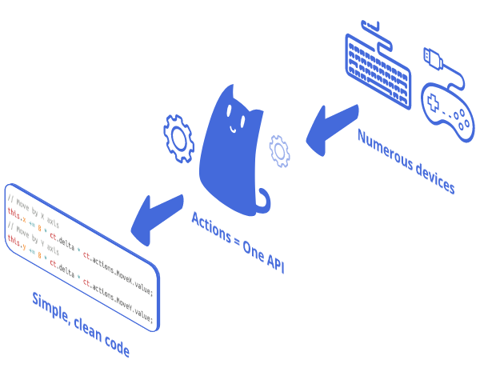
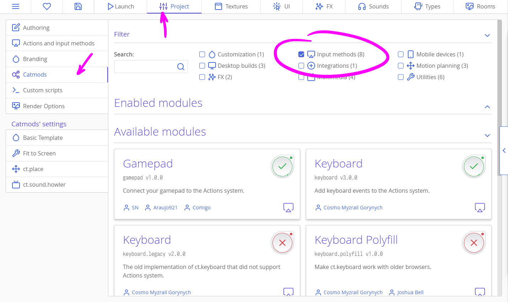
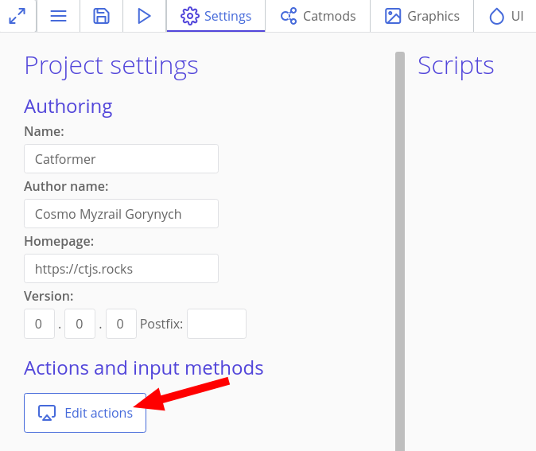
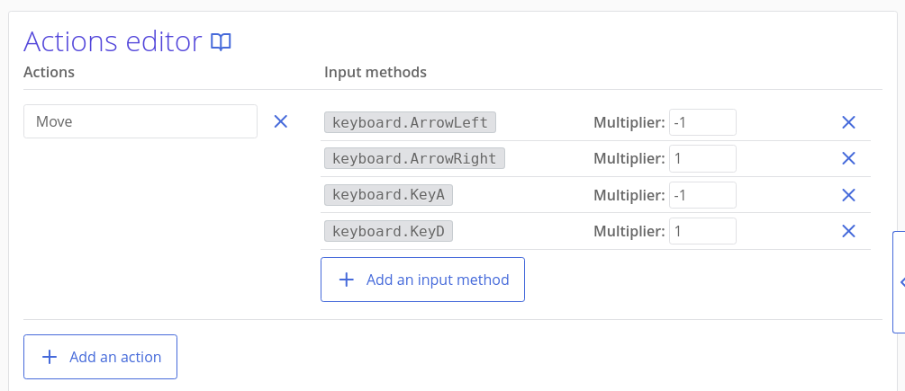
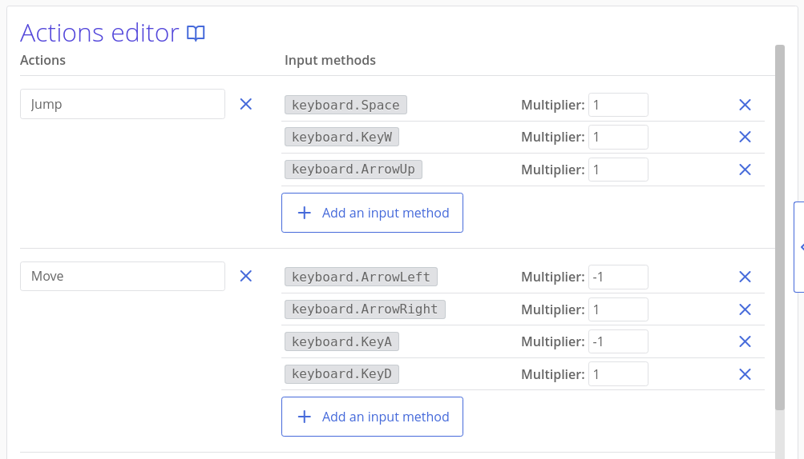
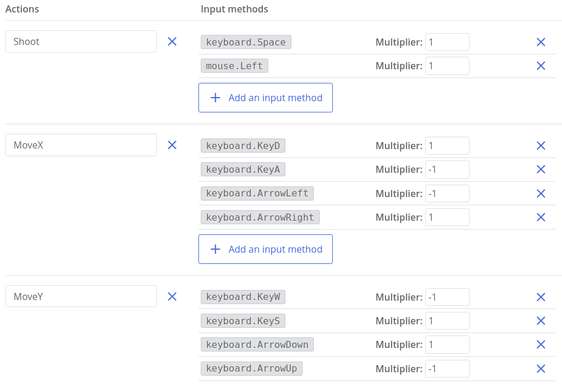

# Actions

Actions are an abstraction layer over various input methods that allow you to write a single code for various devices, be it a keyboard, mouse, gamepad, virtual keys or everything that can be connected to ct.js. The advantage is that one action listens not only to numerous devices at once but, for example, to several buttons of one device, too. For instance, you can simultaneously listen to WASD and keyboard arrows, and the code will be as if you were listening to one thing (and even less). If gamepad controls are added there, then the amount of your code will not change.

For the actions to work, you need to connect particular modules: providers of input methods. The actions themselves are described in the "Settings" tab, behind the button "Actions and input methods". Ct.js comes with a number of default input providers: `ct.mouse` to track mouse clicks `ct.keyboard` for keystrokes, `ct.touch` and `ct.vkeys` for mobile, `ct.gamepad`.

All these modules can be found and enabled in the catmods tab at a project's settings, in the category "Input methods":

## Creating new actions

To create a new action, go to the "Project" tab, and then click on the "Actions and input methods" tab on the left. A panel appears in which the actions themselves are specified in the left column, and input methods in the right column.

Click the "Add Action" button. For example, we will describe the standard and, perhaps, the most important feature in any game ­– "Movement". If you have a platformer, then you need only horizontal movement. If not, then you may need vertical movement, too. Define these actions `MoveX` and `MoveY` to move horizontally and vertically, respectively.

Add the first input method to the horizontal movement with the corresponding button. In the form that appears, locate the button `A` (you can enter it in the search bar), and then click "Select". Do the same for the `D`, `ArrowLeft` and `ArrowRight` buttons. It should look like this:

But wait, `A` and `D` point to different directions! How does the code understand where to move the game character? The fact is that in the code, actions take values ​​from -1 to 1, and by using negative numbers we can show that we need to go, say, to the left, and by using positive ones - to the right. This is done using the **multipliers** column. If you specify the multiplier -1 to the `A` button, then when you press it, the action will return the value -1, and if `D` is left at 1, then if you press `D`, it will be 1.

In ct.js, the `X` value grows from left to right, and the `Y` value changes from top to bottom. If you do not rotate the camera, and if you have a QWERTY keyboard, then `A` will lead to the left — against the movement of the `X` coordinate —, and `D` will point to the right along with the movement of the `X` coordinate. Therefore, we will assign `A` a -1 multiplier, as well to the left arrow.

Having added one more `MoveY` action, write -1 to `ArrowUp` and `W` buttons.

If we were defining an elementary action (for instance, a jump), then we would not need multipliers. If we would be using gamepad joysticks, then a multiplier could be needed in case the game character moved in the wrong direction.

## Examples

**A typical starting setup for a platformer**

**A typical setup for a top-down shooter**

