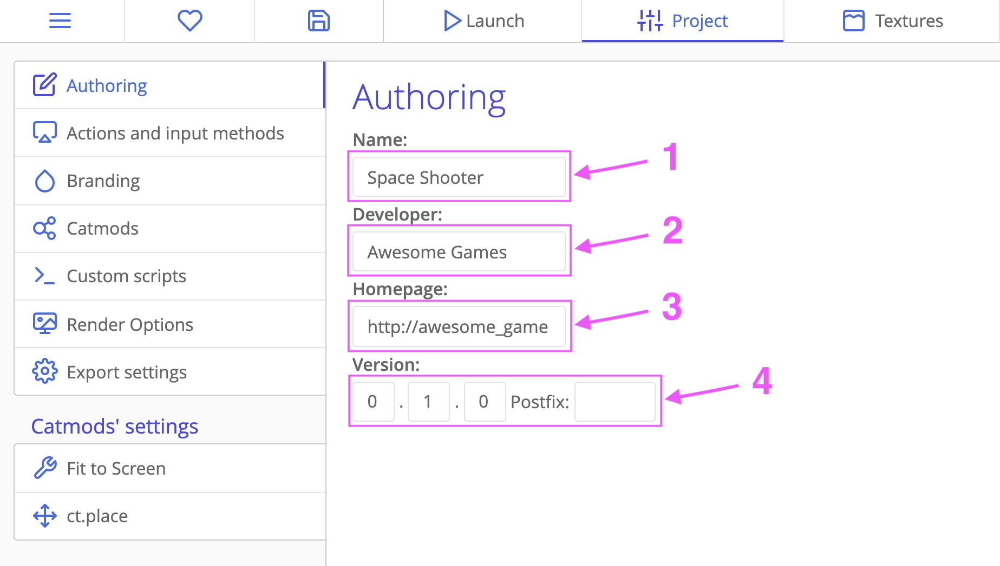
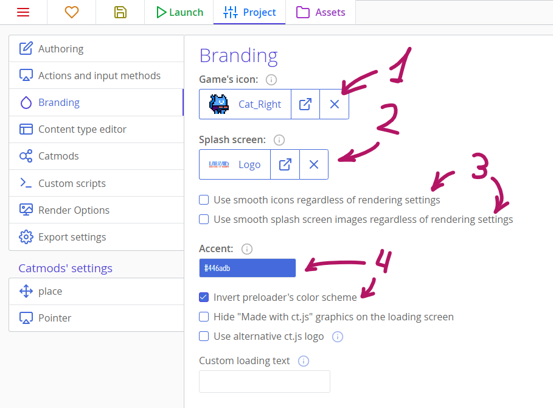
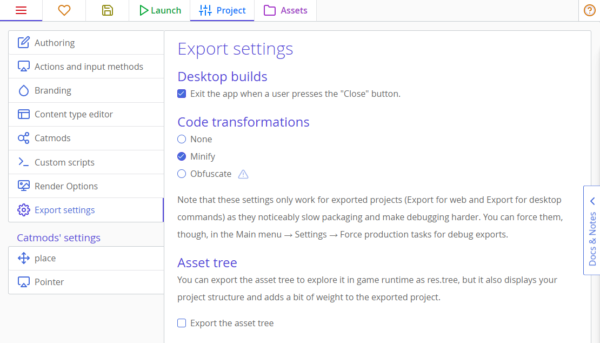
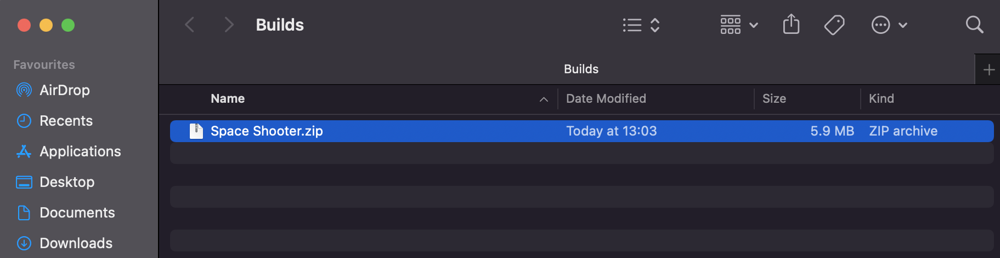
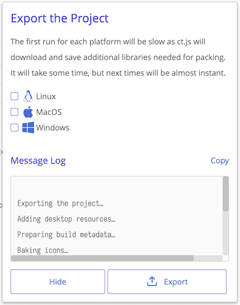
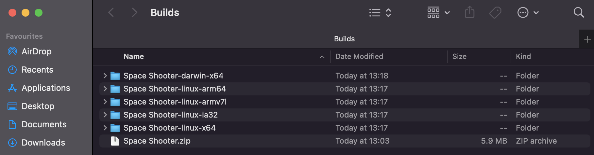

# Building Your Game

So, you have finished developing your game and you are ready to share your masterpiece with the world. This section will show you all that is needed to build and deploy your game.

Here's what we will do:

[[toc]]

## Authoring

Open the `Project` tab and select the `Authoring` side tab, here we can add the authoring details for your project.

1. **Name:** This will be the name of the executable or the .zip file when you export the game.
2. **Developer:** Add the name of the developer here.
3. **Homepage:** The URL to your website goes here.
4. **Version:** Add a version number here to keep track of your game updates and patches.
5. **App ID:** Distinguishes your app among others on mobile platforms and in other cases, affecting, besides other things, where savegame data is stored. App ID is a string that looks like a reversed domain name, in format `region.author.project`, without any digits or dashes.

## Branding

Open the `Project` tab, select the `Branding` side tab, here we have some branding options for the exported project.

1. **Game icon:** Add an icon to your game — you can choose one from any of your imported textures. Note that it should not have multiple frames in it, and that for the best results you should use a square texture with size at least 256x256 pixels.
2. **Splash screen:** The splash screen is shown only on mobile devices while the app is loading.
3. If your project is a pixelart game, but you want your icons or splash screen to remain smooth, you can enforce smooth icons and splash screen with these options.
4. **Accent:** This changes the accent color of the loading screen. You can change whether the accent color affects the background or fill by inverting it.

## Export Settings

In the `Project` tab, select the `Export Settings`side tab.

Here you can find some more advanced settings that will take effect when you export your game. For most projects the defaults will be fine.

## Exporting your game

In the `Main Menu` tab, you will see two export options under the `Deployment` heading.

### Export for web

Exporting for the web is as easy as pressing the button. Once the game is finished exporting, you will be presented with the exported zip file containing your game files.

You can upload this zip file to itch.io, GameJolt, or your own server as an HTML game.

:::tip
Want to upload your game to itch.io? [We have a guide for that.](./deployment-itch-io.md)
:::

### Export for desktop

When exporting for Desktop, lookout for warnings that an editor will show for your project. Right now ct.js requires Node.js to be installed to change icons for Windows apps, but ct.js will show where to download it from. If you don't have Node.js installed, desktop builds will work but your Windows executables won't have an icon, which doesn't look nice.

Once the game is finished exporting, you will be presented with the resulting folders containing the executable files.

Simply open the folder and run the executable. You can pack the folders by each platform and distribute them on your favorite game distribution service like itch.io or Steam.

#### Fixing white screen on Windows

If you or your players have issues with running your game — with the issue exactly being seeing just a white screen when the game is opened —, run the file `Run as admin to fix white screen.ps1` in the same directory where the Windows executable is, with administrative rights. You can also prompt players to download WebView2 for Windows to fix it, as older Windows installations doesn't have that and this framework is what ct.js exported games work best on.