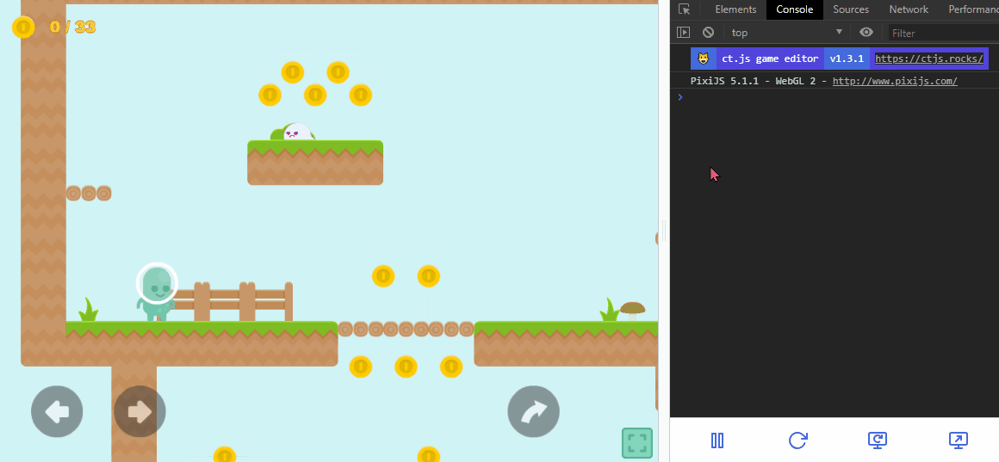
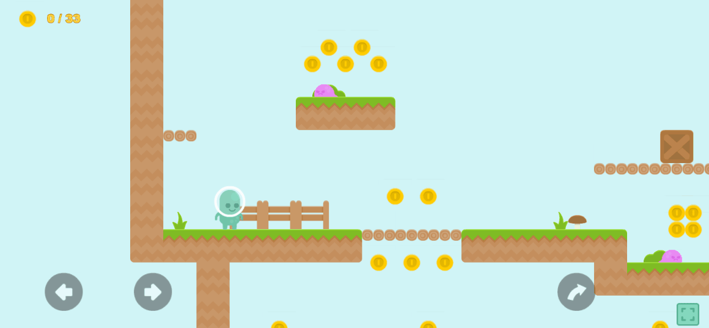

# camera

::: tip Hey,
This page describes the methods and parameters of `camera` object in a form of a reference. You can learn about techniques and usage in a more free form at the ["Working with Viewport" page](./tips-n-tricks/viewport-management.md).
:::

## Camera's Geometry

### `camera.x`, `camera.y`

The real x and y coordinates of the camera. It does not have a screen shake effect applied, as well as may differ from `targetX` and `targetY` if the camera is in transition.

### `camera.targetX` and `camera.targetY`

The x and y coordinates of the target location. Moving it instead of just using the `x`/`y` parameter will trigger the drift effect.

### `camera.computedX`, `camera.computedY`

The resulting position of the camera in game coordinates. These have screen shake and `camera.shiftX`, `camera.shiftY` applied.

### `camera.width`, `camera.height`

The width and height of the camera of the unscaled shown region. These are read-only.

### `camera.rotation`

A value in degrees that rotate the camera.

### `camera.scale.x`, `camera.scale.y`

A scalar value that scales the capturing rectangle. If compared to image viewing tools, `1` and `1` means no scaling, `0.5` will zoom in to a 200% view, `3` will zoom out and produce 33% scaling.

### `camera.left`, `camera.top`, `camera.right` and `camera.bottom`

These represent the resulting location of a particular side of the camera in game units. Those cannot be changed manually.

### `camera.moveTo(x, y)` and `camera.teleportTo(x, y)`

Both move the camera to a new position. `camera.moveTo` is useful for cutscenes and smooth transitions between objects, as it works with `camera.drift`. `camera.teleportTo` does not cause transitions and reset screen shake effects. It is useful for instant precise changes, e.g. when moving a camera to a distant location.

### `camera.uiToGameCoord(x, y)` and `camera.gameToUiCoord(x, y)`

Convert a point from one coordinate space to another. Returns an object (`PIXI.Point`) with two properties: `x` and `y` components.

There are also `u.uiToGameCoord` and `u.gameToUiCoord`, that call these methods of the current `camera` object.

### `camera.getTopLeftCorner()`, `camera.getTopRightCorner()`, `camera.getBottomLeftCorner()`, `camera.getBottomRightCorner()`

Returns an object (`PIXI.Point`) with two properties: `x` and `y` components. These are in game coordinates, and take rotation and scaling into account.

### `camera.getBoundingBox()`

Returns a bounding box of the camera, in game coordinates. See [PIXI.Rectangle](https://pixijs.download/release/docs/PIXI.Rectangle.html) for its properties.

## Following a Copy

### `camera.follow`

If set, the camera will follow the given copy.

### `camera.followX`, `camera.followY`

Works if `follow` is set to a copy. Setting one of these to `false` will disable automatic camera in a given direction.

### `camera.borderX`, `camera.borderY`

Works if `follow` is set to a copy. Sets the frame inside which the copy will be kept, in UI coordinate system. Can be set to `null` so the copy is set to the center of the screen.

## Screen Shake and Wobble

### `camera.shake`

The current power of a screen shake effect, relative to the screen's max side (100 is 100% of screen shake). If set to 0 or less, it, disables the effect.

### `camera.shakePhase`

The current phase of screen shake oscillation.

### `camera.shakeDecay`

The amount of `shake` units substracted in a second. Default is 5.

### `camera.shakeFrequency`

The base frequency of the screen shake effect. Default is 50.

### `camera.shakeX`, `camera.shakeY`

A multiplier applied to the screen shake effect. Default is 1.

### `camera.shakeMax`

The maximum possible value for the `shake` property to protect players from losing their monitor, in `shake` units. Default is 10.

### `camera.minX`, `camera.maxX`, `camera.minY`, and `camera.maxY`

These make camera move only inside a specific rectangle. By default, the camera can move boundlessly, unless set otherwise inside the room editor.

You can set all of these properties, or only some of them.

To unset one of these values, use, for example, `delete camera.minX;`, or write `camera.minX = undefined;`.

## Other

### `camera.drift`

If set to a value between 0 and 1, it will make camera movement smoother

### `camera.shiftX`, `camera.shiftY`

These displace the camera in UI units, but do not change `camera.x` or `camera.y`.

### `camera.realign(room)`

Realigns all the copies in a room based on new dimensions of a camera. This is useful for quick positioning of UI elements on different screens. New position is the result of interpolation based on copies' `xstart` and `ystart` parameters, so it won't work with moving elements. You can skip the realignment for some copies if you set their `skipRealign` parameter to `true`.

The method is usually applicable to fittoscreen's "Expand" and "Scaling without letterboxing" modes only.

No `camera.realign` | With `camera.realign`
-|-
 | 

:::tip
For ct.js v4 and onward, we recommend using room editor's UI tools with auto-realignment to adjust your copies to fit different screen dimensions.

This method is still useful for fully dynamically created UI elements.
:::

#### Example: Realign UI elements in a room

Frame End code of your UI room:

::: code-tabs#tutorial
@tab JavaScript
```js
camera.realign(this);
```
@tab CoffeeScript
```coffee
camera.realign this
```
:::

Yup, that's it!

### `camera.manageStage()`

This will align all non-UI layers in the game according to the camera's transforms. This is automatically called internally, and you will hardly ever use it.
