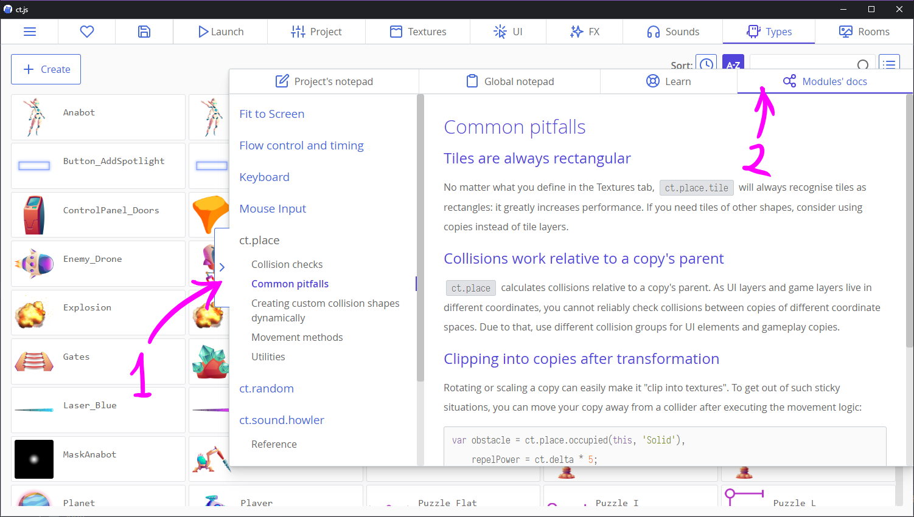

# Docs for other modules

If you are here wondering where you could find docs for `ct.place.stuff` methods or on how to use `ct.keyboard`, you are in a wrong place! :D

These all are catmods (external modules), and their docs are in a separate tab found in the expanding panel on the right edge of your screen:

Happy coding! ;)