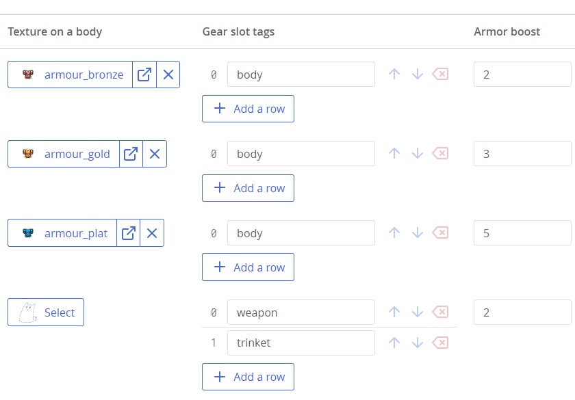
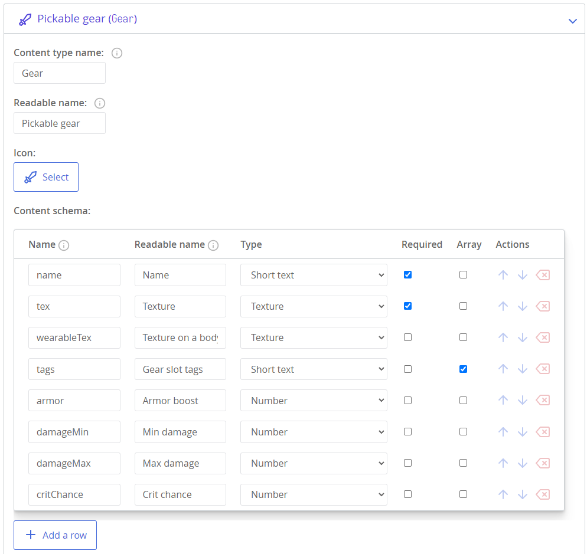
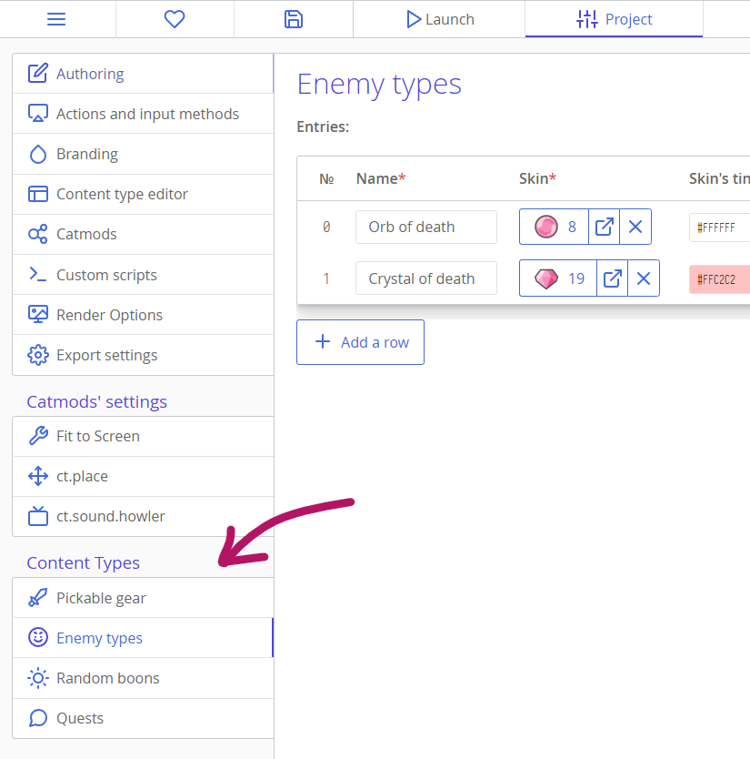
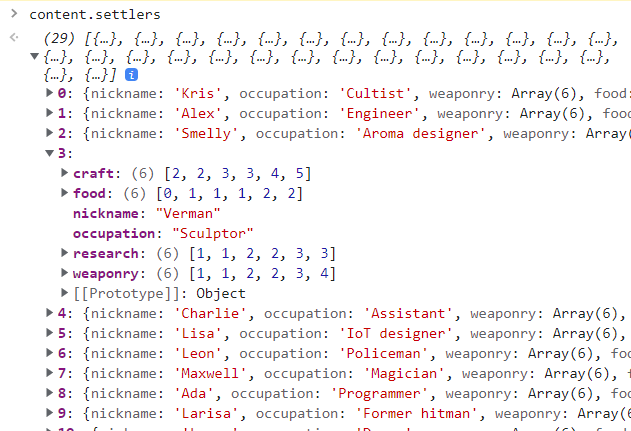

# Content subsystem (content editor and ct.content)

Content subsystem is a set of editors and exporter procedures to allow you to design, create, and use structured data for your game. It can be thought of as a local database for your project. For example, it can be used to design loot drops, levels, or waves in a tower defence game, or quests or dialogues in an RPG, or anything else similar in structure to a table.

Content subsystem can store simple values like numbers, strings, boolean values, and also references to your assets, like templates and rooms.

In essence, Content subsystem consists of:

* The content type editor that lets you design your data structures;
* The content type's entry editor that lets you create and change your content in a table-like interface;
* Exported data available under the `content` namespace.

## Designing data

You can create new content types in the Project tab -> Content type editor.

Every content type has these fields:

* **The name of the content type.** This is the name of the property you will use in your JS code, so think about it well and write a simple name without spaces. For example, if you name your content type as `Quests`, you will be able to access it in-game with `content.Quests`.
* **The readable name.** If your main name is not quite readable, like `BuffsNCurses`, you can write a different name that will be displayed in ct.IDE's GUI. It has no effect on the code you write.
* **An icon** that is displayed in ct.IDE's UI.
* **The content schema.** This is a list of all the fields each entry in your content type has.

The content schema is described with a table. Each row will be a field in an object. Similar to the content types themselves, fields have a regular and readable name as well. If you name your field as `title`, you will be able to access the title of the first entry in your content type with `content.Quests[0].title`.

Besides a name, each field has a type. Fields can have simple values like strings, numbers, and booleans, but they can also refer to assets in your project: such as textures, templates, sounds, particle emitters, and rooms. In code, such references will become strings — the names of your assets.

There are also two checkboxes for each field: "Required" and "Array".

* **Required** fields need to be filled, or they will show a warning in ct.IDE's UI.
* If **Array** is enabled, there will be a list editor in each entry, allowing you to add an arbitrary number of values.



Here is an example of a "Gear" content type:



## Editing the data

Editing is simple — once you've designed your data, you can start creating entries for your content types. For each content type you create, there will be a new section in the Project tab, right under modules' settings.



Create entries with the "Add a row" button, and fill in the table. Note that you can remove or add fields if you need your schema to change, but note that removing fields from the content schema is irreversible.

## Using the data

The simplest way to explore the resulting structure of your data is to write `content.TypeName` in the debugger's console and expand its fields:



You are free to use the data however you want — everything is presented as objects inside an array. If you don't know how to manipulate objects and arrays yet, read our [third chapter of the introduction to JS](jsintro_pt3.html). You will also probably need to [read about loops here](jsintro_pt2.html).

### Example: Searching a content record with a specific name

Assume you have a content type "loot" with a "name" field.

::: code-tabs#tutorial
@tab JavaScript
```js
var lootedItem = content.loot.find((loot) => {
  return loot.name === 'Divine shield';
});
console.log(lootedItem);
```
@tab CoffeeScript
```coffee
lootedItem = content.loot.find (loot) => loot.name is 'Divine shield'
console.log lootedItem
```
:::

### Example: Getting all the items with gear level 5-10 from a content type

Assume you have a content type "loot" with a "level" field.

::: code-tabs#tutorial
@tab JavaScript
```js
var possibleItems = content.loot.filter((loot) => {
  return loot.level >= 5 && loot.level <= 10;
});
console.log(possibleItems);
```
@tab CoffeeScript
```coffee
possibleItems = content.loot.filter (loot) => 5 <= loot.level <= 10
console.log possibleItems
```
:::
