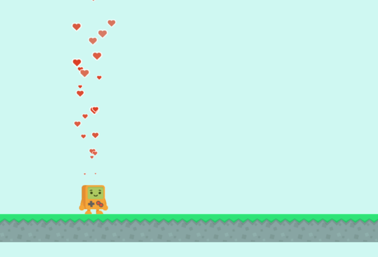
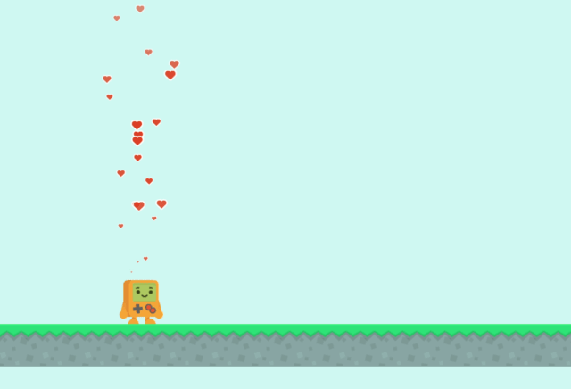
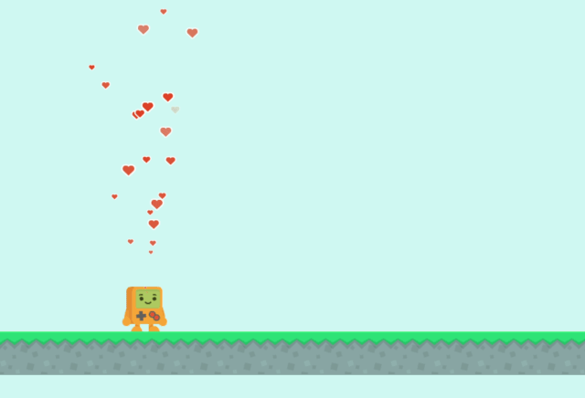

# ct.emitters

The module `ct.emitters` allows you to fire particle effects, attach them to copies, or make them follow one.

Internally, it is based on the [`pixi-particles` module by CloudKid](https://github.com/pixijs/pixi-particles).

::: warning Note:
If you don't have any emitter tandems in your project, then `ct.emitters` won't be available. It is bundled only if you have particle systems in your project to make the browser builds smaller.
:::

## Creating effects

There are three methods with different logic, each suitable for particular situations:

* `ct.emitters.fire('NameOfTheTandem', x, y)` spawns an effect in a specified location, and that's all. It is useful for creating effects that shouldn't follow anything or move, e.g. for explosions, sparkle bursts, or impact effects.
* `ct.emitters.follow(parentCopy, 'NameOfTheTandem')` are good for long effects that should be attached to a copy. They leave particles behind if moved. It is suitable for a smoke effect, a trail, bubbles, and so on.
* `ct.emitters.append(parentCopy, 'NameOfTheTandem')` is similar to `follow`, but old particles are moved with an emitter. It is useful while making magic shield bubbles, or for particles that should stay *inside* a copy (think of a movable flask with boiling liquid and bubbles in it).

Let's see them all in action (note how the trail reacts to the robot's movement):

`ct.emitters.fire` | `ct.emitters.follow` | `ct.emitters.append`
-|-|-
 |  | 

```js
// The code from the "fire" example
ct.emitters.fire('HeartTrail', this.x, this.y - 70);
```

```js
// The "follow" example
ct.emitters.follow(this, 'HeartTrail', {
    position: {
        x: 0,
        y: -70
    }
});
```

```js
// The "append" example
ct.emitters.append(this, 'HeartTrail', {
    position: {
        x: 0,
        y: -70
    }
});
```

## Additional options

You may have noticed that these three methods accept an additional argument (e.g. `ct.emitters.fire('NameOfAnEffect', x, y, options);`). It is an object, and has properties for tweaking an effect's look and behavior:

* `scale` — scaling object with `x` and `y` parameters.
* `position` — set this to additionally shift the emitter tandem relative to the copy it was attached to, or relative to the copy it follows. This does not work with `ct.emitter.fire`.
* `prewarmDelay` — if less than 0, it will prewarm the emitter tandem, meaning that it will simulate a given number of seconds before showing particles in the world. If greater than 0, it will postpone the effect for the specified number of seconds.
* `tint` — a color applied to the whole effect, e.g. 0xff0000 to make it red.
* `alpha` — opacity set to the whole effect, from 0 (invisible) to 1 (fully opaque, like in ct.IDE).
* `rotation` — rotation in degrees.
* `isUi` — if set to true, will use the time scale of UI layers. This affects how an effect is simulated during slow-mo effects and game pause.
* `depth` — the depth of the tandem. Defaults to `Infinity` (will overlay everything).
* `room` — the room to attach the effect to. Defaults to the current main room (ct.room). It has no effect with `ct.emitters.attach`, as you already specify an effect's parent in the first argument.

Each property is optional. An example: if we would like to create a smaller reddish effect above a copy that stays at the same depth as the copy, we would write:

```js
ct.emitters.follow(this, 'Debuff', {
    scale: {
        x: 0.75,
        y: 0.75
    },
    position: {
        x: 0,
        y: -80
    },
    tint: 0xff9999,
    depth: this.depth
});
```

## Manipulating emitters

By themselves, created effects will behave well: they will stop automatically when their time is up, or when their owner was destroyed, leaving a nice trail of particles. But sometimes we need to fully clean up the effect, or pause it and resume later, or stop it completely earlier than usual.

Each of the `ct.emitters.fire`, `ct.emitters.append` and `ct.emitters.follow` return a reference to the created effect which we can use:

```js
// Let's create a shield bubble!
this.shied = ct.emitters.append(this, 'BubbleEffect');

// Later, when we no longer need the shield:
this.shield.stop();
this.shield = null; // Forget about the effect to free memory
```

There is a number of properties we can use in such way:

* `emitter.stop();` prevents spawning new particles. When previous particles disappear, the emitter tandem will destroy itself.
* `emitter.clear();` instantly clears all the particles.
* `emitter.kill` is a property similar to copies' `kill` property: setting it to `true` will instantly destroy the effect with all its particles.
* `emitter.frozen` stops updating the effect if set to `true`.
* `emitter.paused` stops spawning new particles if set to `true`. The remaining particles are still animated. You can resume the spawning back with `emitter.paused = false;`.