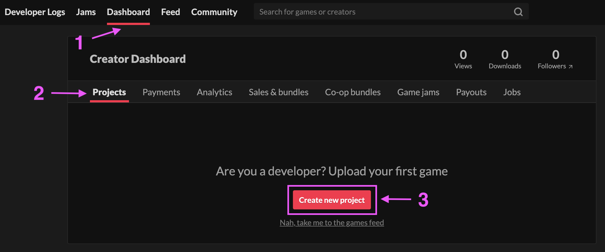
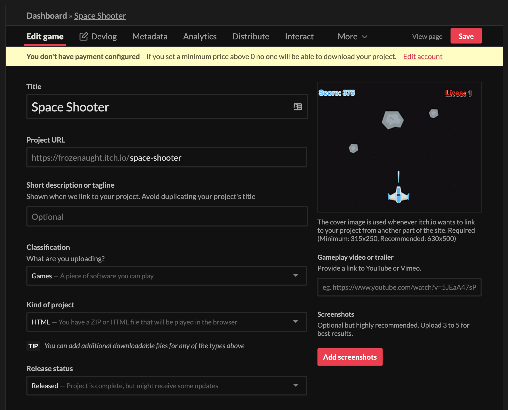
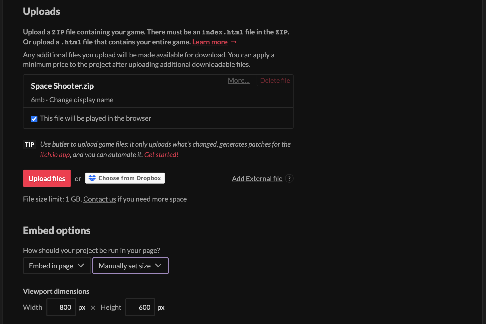
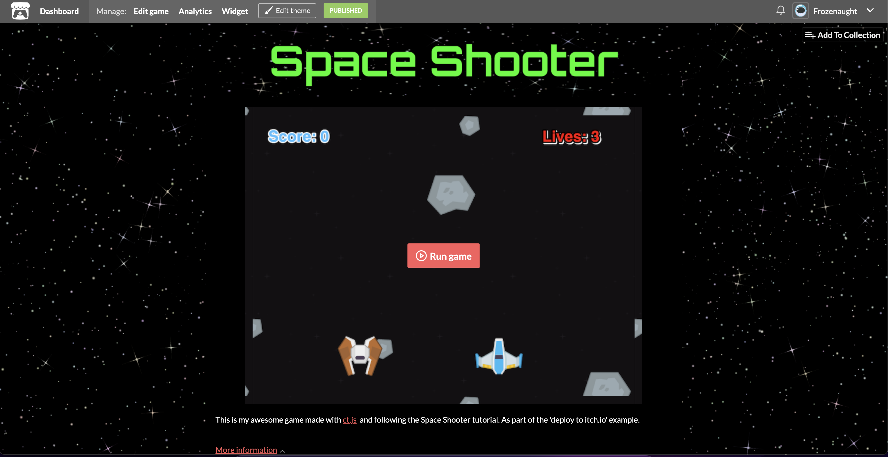

# Deploying to itch.io

Before deploying your game to [itch.io](https://itch.io/) you will need to have your exported game files. You will also need an account and some screenshots of your project. If you are unsure how to export your game, please see the [Building Your Game](building-your-game.md) section.

Here's what we will do:

[[toc]]

## Creating a project on itch.io

Once you have logged in to your account, select the [Dashboard](https://itch.io/dashboard) tab and check that you are in the `Projects` tab in the "Creator Dashboard".

Press the **`Create new project`** button.

::: tip
There are many options in when you deploy your game to [itch.io](https://itch.io/), we will only cover the basics needed to get your game deployed. Feel free to experiment in this section or consult the official [itch.io docs](https://itch.io/docs/itch/) for more detailed guides.
:::

Lets fill in the following fields:

- **Title** Enter your games title here.
- **Project URL** This should automatically be generated for you, it is the URL where your project will be hosted.
- **Kind of project** For this example we will choose HTML as we will be uploading a web version of our game.
- **Upload Cover Image** Lets add a cover image so that players can see our game.
- Additionally, you can add game tags, screenshots and other settings here.

The next most important thing would be to upload our game files. Navigate to the "Uploads" section of the form. Select the **`upload files`** button and upload the .zip file you exported from ct.js. Once uploaded, select the checkbox labeled: **[x] this file will be played in the browser**

::: tip
There are some addition options here if you are uploading the executable files. For detailed explanations on these options, please consult the [itch.io docs](https://itch.io/docs/itch/)
:::

## Preview the game page

Once you are happy with this section, press the **`Save`** button. then select the `view page` link to see what players will see when visiting your game page.

To customize the look of the game page, select the **`Edit Theme`** button. A basic example of changing some of these option is shown in the screenshot below.

