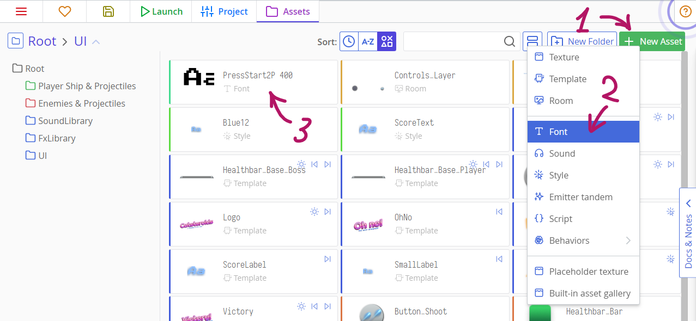
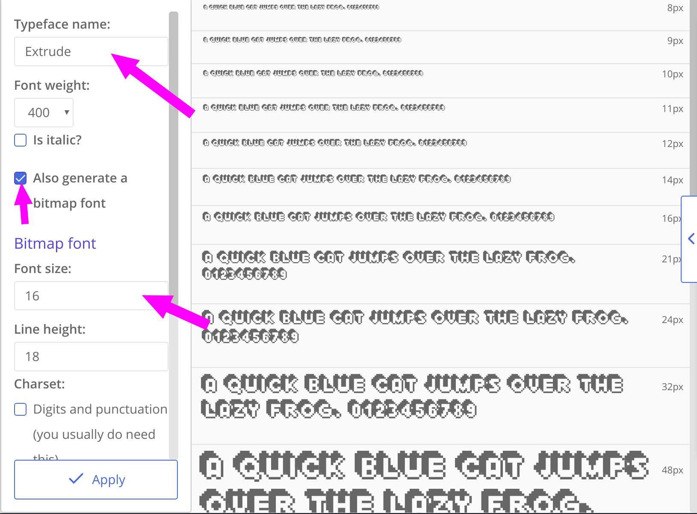

# Utilizzo di font bitmap

Ci sono due tipi di etichette di testo in ct.js: quello basato su font bitmap e quello basato su canvas. Il primo tipo è ottimo per testo dinamico, in movimento e modificabile, mentre il secondo tipo è ottimo per grandi quantità di testo statico. Scegliere il tipo giusto permette di ottimizzare il tuo gioco al meglio. Qualunque tu scelga, entrambe le etichette di testo possono essere trasformate nel loro insieme senza alcun impatto sulle prestazioni, ad esempio spostate, ruotate, colorate con la proprietà `this.tint`.

Oltre a ciò, i caratteri bitmap sono ottimi per i giochi pixelart, poiché i browser tendono a macchiare le etichette impostate su canvas e a rovinare i dettagli più piccoli.

## Importazione di un font e abilitazione di un font bitmap

Avrai bisogno di un font in formato TTF. Assicurati di avere i permessi di usarlo nei giochi.

Nella scheda "UI", fai clic sul pulsante "Import TTF" e individua il tuo file. Quindi, fai clic su questo carattere per aprire il visualizzatore di caratteri.



Inserisci il nome, quindi spunta la casella con l'etichetta "Genera anche un carattere bitmap". Appariranno un sacco di impostazioni. Qui, prima di tutto, dovresti inserire la dimensione del carattere. Fai attenzione che la maggior parte dei caratteri pixel minuscoli dovrebbe avere, ad  esempio, una dimensione di 7x5 pixel, ma in realtà avranno bisogno di  dimensioni del carattere più grandi, di solito 16px. Potresti aver bisogno di armeggiare con la dimensione del carattere per ottenere risultati perfetti.



Sotto i campi "Font size" e "Line height" (dimensione font e altezza riga) si  trovano una serie di caselle di controllo che consentono di includere un sottoinsieme di caratteri. Scegliendone alcuni invece del solo "Draw everything the font supports" (disegna tutto ciò che il carattere supporta) ne diminuirà le dimensioni, velocizzando il caricamento dei tuoi giochi.

A meno che tu non abbia bisogno di un carattere per visualizzare una parola senza spazi, dovrai selezionare "Digits and punctuation" (cifre e punteggiatura) — include  spazi, virgole, punti e altri delimitatori di parole e frasi.

Dopo aver configurato il tuo font, puoi prendere il nome di questo font come risorsa bitmap ed utilizzarla all'interno del codice. Fare clic sul pulsante per copiare accanto al nome della risorsa, in fondo alla colonna.

## Utilizzo di font bitmap nel codice

Il processo di creazione di un'etichetta di testo bitmap è simile a quella basata su canvas: creiamo un elemento *child* (figlio) con `new PIXI.BitmapText()`e aggiungiamolo a un *parent*, un tipo o una stanza.

```js
this.label = new PIXI.BitmapText('Initial text', {
  font: {
    name: 'Void_400',
    size: 16
  },
  align: 'left'
});
this.addChild(this.label);
```

La dimensione del carattere può essere diversa da quella impostata in ct.IDE. Quando aggiungi un certo numero di caratteri con dimensioni diverse ma con un unico nome, ct.js si adatterà meglio.

Possiamo manipolare il font in modo simile alle copie colorando, ridimensionando, ruotando l'etichetta:

```js
this.label.tint = 0xff0000; // Colora di rosso
this.label.rotation = 15; // Ruota leggermente
this.label.scale.y = 1.25; // Ingrandisci
```

Per modificare il testo, modifica il parametro `text`:

```js
this.label.text = 'Score: ' + this.score;
```

Infine, quando non hai più bisogno dell'etichetta, puoi rimuoverla con il metodo`destroy()`:

```js
this.label.destroy();
```
