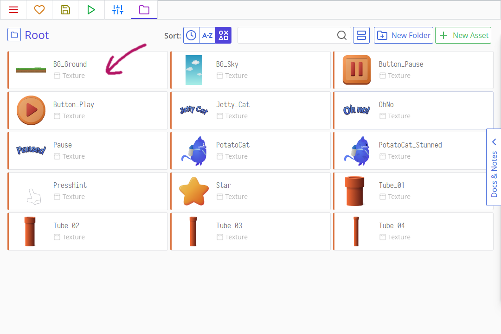
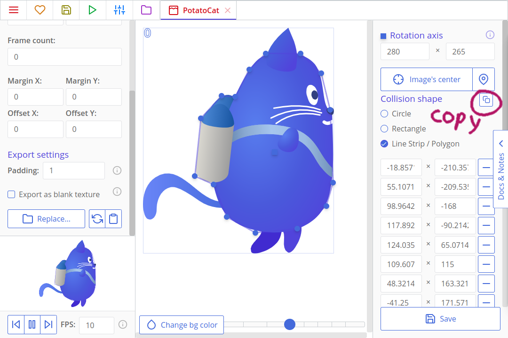
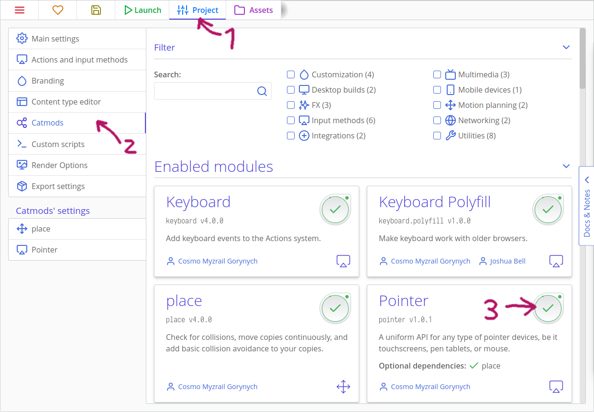

# Making Games: Jetty Cat

Come in Flappy Bird, Jetty Cat sarà un gioco in cui un gatto, guidato toccando o facendo clic, evita infiniti ostacoli utilizzando il suo jetpack. In primo luogo implementeremo la logica principale di gioco ed in seguito l'interfaccia utente. Infine, miglioreremo il gioco abbellendo il gioco con transizioni, sistemi di particelle ed effetti sottili.


Ecco ciò che realizzeremo:

[[toc]]

:::warning
Come avrai capito, questo non è un esempio base in stile "Hello world", ma piuttosto una guida per creare un gioco completo da zero. Concediti tutto il tempo necessario per realizzarlo.
:::

## Creazione del progetto e importazione degli assets (risorse grafiche)

Apri ct.js e crea un nuovo progetto scrivendo il nome del tuo progetto e facendo clic sul pulsante "Create". Dì a ct.js dove salvare il tuo progetto; una cartella come "Documenti" andrà benissimo.


Fai clic sulla scheda "Textures" nella parte superiore della finestra di ct.js. Quindi, apri Esplora file, dal tuo sistema operativo, e cerca la cartella `examples/JettyCat_assets` all'interno della cartella ct.js; contiene gli assets che useremo. Se hai utilizzato l'app itch.io per installare ct.js, puoi fare clic con il pulsante destro del mouse sull'icona del programma installato nella tua libreria per aprire la sua posizione nel file manager. Trascina le risorse da Esplora file dentro ct.js così da importarle rapidamente nel progetto.

Dovremo preparare queste texture: contrassegnare correttamente ciò che useremo come sfondi e impostare i contorni di collisione in modo che le copie ("Copies" ovvero gli sprite) all'interno del gioco interagiscano con precisione tra loro. Innanzitutto, apriamo lo sfondo del nostro progetto. Fai clic sulla scheda `BG_Ground`:



Qui, dovremo cliccare la casella di controllo "Use as a background?" ("Usa come sfondo?") Questo dice a ct.js di considerare questa texture in modo diverso permettendogli di ripetersi nei vari livelli.


Premi "Save" (Salva) nell'angolo in basso a sinistra. Ora, fai lo stesso con la texture `BG_Sky`.

Gli sfondi sono pronti! È ora di impostare i contorni di collisione dei nostri sprite. Non abbiamo bisogno di impostarli per chiunque, ma dobbiamo farlo per gli oggetti che entreranno no in collisione tra loro e per quelli su cui chiccheremo durante un gioco. Nomi come `Jetty_Cat`, `OhNo` e `Pause` indicano oggetti che non saranno interattivi ma solo decorazioni, così come `PressHint` avrà un ruolo informativo e non riceverà direttamente alcun clic. Ma il gatto e i tubi si scontreranno e le stelle dovranno sapere quando un gatto le colpisce.

Apriamo il `PotatoCat`! La prima cosa che dovremmo fare è spostare l'asse (Axis nell'originale, potrebbe tradursi come baricentro) della texture. Viene visualizzato come un quadratino, che si trova nell'angolo in alto a sinistra per impostazione predefinita. Un asse è un punto attorno al quale una copia (ogni futuro sprite che utilizzerà questa texture) viene ridimensionata e ruotata. Metti l'asse al centro del corpo del gatto. Quindi, definiamo il suo perimentro di collisione. Il gatto non assomiglia ad un cerchio o un rettangolo, quindi devi selezionare la sua forma di collisione scegliendo l'opzione "Line Strip / Polygon" (spezzata/poligono) nella colonna di sinistra. Apparirà un pentagono: puoi trascinarne gli angoli e aggiungere nuovi punti cliccando sulle linee gialle per delineare meglio la sagoma del gatto. 15 punti possono bastare per delinearlo bene.


::: tip
È meglio non delineare la coda, così come le orecchie. Quando una coda colpisce un tubo, potrebbe essere eccessivo far perdere il giocatore. In ogni caso, una coda è troppo flessibile per causare collisioni letali 😺
:::

Dopo aver definito la forma, dovremo creare la stessa maschera di collisione per la texture `PotatoCat_Stunned`. Ma invece di rifare tutto il lavoro nella creazione della maschera punto per punto, possiamo copiarlo! Fare clic sul pulsante copia maschera di collisione e quindi nella texture `PotatoCat_Stunned` fai clic sul pulsante incolla. Non dimenticare di regolare il punto dell'asse!




Dopo aver definito la forma, fare clic sul pulsante "Save" per tornare all'elenco degli asset. Dovremo anche mettere a punto la texture `Star`.

Per i tubi, useremo qualcosa *di leggermente* diverso. Apri il primo, `Tube_01`, e posiziona il suo asse quasi in fondo allo sprite. Ricordi che l'asse influisce non solo sulla rotazione ma anche sul ridimensionamento? Riutilizzeremo la stessa texture sia per i tubi che pendono dalla parte superiore dello schermo che per quelli che crescono dalla parte inferiore. Per creare quelli superiori, li scaleremo usando un valore negativo attorno al loro asse inferiore per capovolgere la loro estremità verso il basso. Possiamo anche ruotarli in un secondo momento e farli ondeggiare piacevolmente, mantenendo la base fissa.


Dovremo farlo per tutte e quattro le texture del tubo. Ora, possiamo iniziare a creare il nostro di livello e creare il codice per i movimenti!

## Creare la nostra stanza principale e spostare il gatto

Creiamo una stanza dove il gioco prenderà vita! Le stanze sono spesso chiamate livelli di gioco. Questi sono i luoghi in cui tutte le tue risorse grafiche vengono combinate e dove possono interagire tra loro. Apri la scheda "Rooms" (Stanze) nella parte superiore della finestra di ct.js e creane una nuova.


Apparirà un editor di stanze per questa stanza. Chiama la stanza `InGame` — useremo questo nome particolare più avanti nel codice. Non ci sono regole per scegleire i nomi, però; abbiamo solo bisogno di qualcosa di semplice da ricordare in seguito durante la codifica dei menu 😃

Successivamente, nella scheda Proprietà, individuata da un'icona a forma di ingranaggio, dobbiamo impostare le dimensioni della nostra stanza. Impostale su 1080x1920 pixel.


Ora aggiungiamo gli sfondi. Fai clic sulla scheda "Backgrounds" (Sfondi), quindi aggiungine due: per il cielo e per la terra. Il cielo sembra andar bene così com'è, il terreno invece ha bisogno di un ritocco. Fai clic sull'ingranaggio accanto alla miniatura dello sfondo nella colonna di sinistra e trova, in basso, il menu a discesa "Repeat" (Ripeti). Impostalo su "repeat-x": ripeterà il riquadro dello sfondo solo orizzontalmente, poiché X è l'asse orizzontale (Y è quello verticale). Quindi, dovremo spostare il terreno nella parte bassa della cornice della stanza, cambiando valore del campo Shift Y.


::: tip Suggerimento:
Puoi navigare nella stanza trascinandola con il mouse e zoomando con la rotellina del mouse, oppure con lo slider "zoom" che trovi nell'angolo in alto a destra.
:::

Imposteremo anche la profondità di entrambi gli sfondi in modo che siano allineati correttamente. La profondità è una terza dimensione che dice a ct.js come ordinare i nostri oggetti, in modo che il cielo non sia posta accidentalmente davanti a tutto il resto. I valori positivi avvicinano le cose alla fotocamera, il punto di vista del giocatore, e quindi gli oggetti con una profondità positiva copriranno quelli con una profondità negativa.

Imposta il valore della profondità del cielo a -20 e la profondità del suolo a -10. Ecco come ct.js interpreterà queste configurazioni:


### Template del gatto

Le texture sono essenziali per la maggior parte dei giochi, ma non fanno nulla da sole. Abbiamo già usato gli *sfondi*, che sono texture puramente decorative. *I template (modelli)* invece, possono includere la logica di gioco e vengono utilizzati per creare le cosiddette *copie* (copy o copies nell'originale). Le copie sono le entità che aggiungiamo alle nostre stanze e sono queste copie che interagiscono tra loro sullo schermo.

Creiamo un template per il nostro gatto! Apri la scheda "Templates" nella parte superiore della finestra di ct.js e premi il pulsante "Create" (Crea). Assegnagli un nome `PotatoCat`e imposta la sua texture facendo clic sul quadrato "Select" e selezionando la texture del gatto.


Ora possiamo aggiungere il gatto alla nostra "Room"! Torna alla scheda "Rooms" e apri il nostro unico livello di gioco. Il nostro gatto apparirà nella colonna di sinistra sotto la scheda "Copies" (Copie). Fai clic su di esso, quindi fai di nuovo clic in un punto in cui desideri che la tua copia appaia all'interno del livello. Avremo bisogno di un solo gatto per ora.


Se fai clic sul tasto "Launch" (il tasto play), verrà eseguito il debugger e vedremo una schermata statica con i nostri sfondi e il gatto. Il gatto non si muove ancora, ma è quello che faremo ora!


Apri di nuovo la scheda "Templates" e apri il template del gatto. Dovresti vedere l'evento "Frame start" selezionato, con del codice sulla destra. ct.js esegue blocchi di codice a seconda dell'evento che si sta verificando. Fare clic sul pulsante "Add an event" (Aggiungi un evento) per visualizzare altre opzioni. Ecco alcuni eventi da considerare:

- "Creation" per il codice che viene eseguito una volta sola quando viene creata una copia usando questo template;
- "Frame start" per il codice che verrà eseguito ad ogni frame (in genere 60 volte al secondo);
- "Frame end" che viene eseguito alla termine di ogni frame dopo altri calcoli e aggiornamenti sul movimento degli sprite;
- "Destruction" per il codice che viene eseguito quando una copia viene eliminata dal gioco.


Questo è quello che faremo:

- Faremo volare il nostro gatto a destra definendone velocità e direzione iniziale nell'evento "Creation";
- Verificheremo gli eventi del mouse e del tocco ad ogni fotogramma nell'evento "Frame start", accelerando, nel caso, il gatto in modo che possa volare in alto.

Fai clic sul pulsante "Add an event", quindi trova l'evento di "Creation" e selezionalo. Nell'evento "Creation" che ora appare a sinistra, fai clic su di esso per visualizzare il blocco di codice sul lato destro, quindi inserisci il seguente:

``` js
this.speed = 10;
this.direction = 0;
```


`this.speed = 10;` definisce la velocità di spostamento del gatto pari a 10 pixel ad ogni fotogramma. Con 60 FPS (frames per second) al secondo, saranno 600 pixel in un secondo, circa la metà della nostra "Room".

`this.direction = 0;` significa che la direzione di spostamento del gatto è pari a 0 gradi. 0 gradi significa che si sposterà a destra (altri valori sono i seguenti: 270 - in alto, 180 - a sinistra e 90 - verso il basso).

Ora muoviamo il nostro gatto ogni volta che un giocatore tocca lo schermo. Dovremo supportare sia gli eventi del mouse che quelli del tocco su dispositivi mobile, quindi dovremo abilitare un modulo che fornisca supporto per ciò. Fortunatamente è molto facile: apri la scheda "Project" (progetto) nella parte superiore della finestra di ct.js, quindi "Catmods" a sinistra. Cerca il modulo `Pointer` nella sezione "Enabled modules" (moduli disponibili). Fai clic per abilitarlo - ora avrà una casella di controllo verde con un piccolo cerchio rotante attorno:



Ora, in ct.js, i metodi di input sono raggruppati in *Actions* . In questo progetto, utilizzeremo un solo metodo di input - toccare lo schermo. Nella scheda "Project" nella parte superiore dello schermo, premi la scheda "Actions and input methods" (Azioni e metodi di input) in alto a sinistra.

Ci sono dei preset che impostano le azioni per noi, ma per ora facciamone di personalizzati facendo clic sul pulsante "Make from scratch". Aggiungi la prima azione, chiamala `Poof`. Quindi, fai clic su "Add an input method" a destra e trova il metodo "Qualsiasi stampa" sotto l'intestazione Puntatore. Puoi utilizzare la ricerca per filtrare rapidamente i contenuti.


L'azione è terminata, possiamo salvarla e tornare al nostro gatto.

::: tip Azioni? Come mai?
Per gli sviluppatori esperti, le definizioni delle "Actions" potrebbero sembrare un passaggio strano, ma torneranno molto utili quando sarà necessario supportare una serie di metodi di input diversi. Supponiamo di creare un gioco che supporti sia la tastiera che il gamepad e la tastiera supporti il movimento WASD e anche quello con le frecce. Un'unica *Action* supporterà tutti e tre i metodi e il tuo codice rimarrà snello, e se aggiungerai nuovi metodi di input in un secondo momento, dovrai solo aggiornare questa sezione e non il codice!

Puoi [leggere di più sulle "Actions" qui](../actions.html).
:::

Crea un nuovo evento "Action down" per il gatto. Questo è un evento parametrizzato, quindi puoi specificare quale azione desideri! Seleziona l'azione `Poof` dall'elenco a discesa, quindi aggiungi questo codice all'evento:

```js
    this.gravity = 2;
    this.addSpeed(ct.delta * 4, 270);
```

Questo codice verrà eseguito solo quando un giocatore toccherà lo schermo. Se il comando verrà eseguito, attiveremo una forza di gravità che spinge il gatto verso il basso e aggiungeremo la velocità che lo spinge verso l'alto. Dobbiamo moltiplicare la velocità con `ct.delta` per compensare possibili lag (rallentamenti) e rendere l'animazione il più possibile regolare.

::: tip ct.delta
`ct.delta` sarà uguale a 1 il più delle volte, ma questo moltiplicatore non dovrebbe essere trascurato. Se il framerate di un giocatore diminuisce o il gioco è in ritardo per qualche motivo, `ct.delta` aumenterà di valore per compensare questi cali di frame e ritardi. Ad esempio, se il framerate scende da 60 fotogrammi al secondo a 30, allora `ct.delta` sarà temporaneamente uguale a 2.

Oltre a ciò, `ct.delta` supporta l'allungamento del tempo di gioco e consente di creare effetti al rallentatore e pause nel gioco. (Come vedremo più avanti!)
:::

::: tip
Oltre a `On Poof press` ci sono anche `On Poof down ` `On Poof release` che ritornano `true` quando un giocatore inizia o smette di premere sullo schermo.
:::

La gravità definita nell'evento `On Poof down` ti sembra strana, vero? È infatti una costante che sarebbe meglio posizionare nell'evento "Creation" in modo che sia impostata una volta dall'inizio e non cambi. Ma posizionarlo all'interno della condizione con un controllo di input aggiunge un piccolo trucco: il gatto inizierà a cadere solo dopo che il giocatore avrà iniziato a giocare! Diversamente il gatto toccherebbe rapidamente il suolo, iniziando a cadere subito.

Se eseguiamo il progetto ora, vedremo che il gatto si sposta da sinistra a destra, che reagisce ai clic e inizia a volare e cadere. Vola rapidamente fuori dal viewport però. Sistemiamo la cosa!

### Muovere la fotocamera

Ct.js ha un'entità `ct.camera` che è responsabile della visualizzazione di elementi sullo schermo. Ha molte funzionalità e una di queste è quella di seguire una copia (lo sprite del giocatore per esempio).

Apri l'evento "Creation" del nostro gatto e aggiungi questo codice:

```js
ct.camera.follow = this;
ct.camera.followY = false;
ct.camera.shiftX = 250;
```

`ct.camera.follow` collega la camera alla copia che dovrebbe seguire e gli diciamo di seguire il gatto impostando il suo valore su `this`. `this` si riferisce alla copia a cui questa riga di codice appartiene. Anche le stanze hanno i loro eventi e le loro parole chiave `this`.

`ct.camera.followY = false;` indica che non è necessario spostare la telecamera verticalmente (mediante l'asse Y). Lo faremo scorrere solo verso destra.

`ct.camera.shiftX = 250;` dice che vogliamo che la fotocamera rimanga di 250 pixel a destra rispetto al gatto. Per impostazione predefinita, si posiziona in modo che il gatto rimanga al centro della finestra.

Se eseguiamo il gioco ora, la telecamera seguirà il nostro gatto. Sìì!

## Scrivere il codice per le collisioni

Ora è giunto il momento per implementare il gameplay vero e proprio. Aggiungeremo un template per i tubi, ne collocheremo alcuni nel livello del gioco  e scriveremo il codice per le collisioni sia con i tubi che con il terreno. Quindi, randomizzeremo le texture del tubo, cambiandone così la loro altezza durante il gioco.

### Aggiungere i tubi

Crea un nuovo template e chiamalo `Tube`. Seleziona come texture per il tubo una di quelle lunghe della nostra collezione. Quindi, imposta "Collision group" (gruppo di collisione) scrivendo `Obstacle` per esempio.


Quindi, apri il livello e aggiungi tubi a terra, così possiamo controllarne le collisioni. Per farlo apri la room `InGame`, seleziona il tubo nella colonna di sinistra, quindi aggiungilo facendo clic nella vista del livello, nel punto in cui desideri che compaia. Non ne avremo bisogno di molti per il test.


Quindi, apri il template del gatto e seleziona "Frame start". Faremo quanto segue:

- Verificheremo la collisione tra un gatto e un potenziale ostacolo.
- Se colpiamo un tubo, lanceremo il gatto a sinistra, cambieremo la sua texture e imposteremo un valore di flag per indicare che abbiamo perso.
- Questo flag, che potrà assumere valore vero o falso, verrà controllato all'inizio del codice e impedirà l'input del giocatore e altre logiche, se necessario.

Questo è il codice che controlla le collisioni. Posizionalo dopo il codice che controlla l'input del giocatore, ma prima della riga `this.move();`:

```js
// Se il gatto si è imbattuto in qualcosa di solido e il gioco non è finito
if (!this.gameover && ct.place.occupied(this, 'Obstacle')) {
    // Cambia la texture
    this.tex = 'PotatoCat_Stunned';
    // Imposta un flag che useremo per fermare la logica del gioco
    this.gameover = true;
    // Salta a sinistra
    this.speed = 25;
    this.direction = 135;
    // Fermare il movimento della telecamera
    ct.camera.follow = false;
}
```

`ct.place.occupied` verifica la collisione di una data copia con uno specifico gruppo di collisioni. Questo metodo è fornito dal modulo `ct.place` e puoi trovare il suo riferimento per altri metodi nella scheda "Catmods".

Avremo anche bisogno di questo blocco di codice proprio all'inizio dell'evento Frame start:

```js
if (this.gameover) {
    this.gravity = 2;
    this.move();
    return;
    // Nessun codice verrà eseguito dopo un'istruzione "return".
}
```

`this.gravity = 2;`si assicurerà che ci sia una gravità impostata per il gatto anche se il giocatore non ha ancora interagito con un gioco (nel caso in cui perda per nessuna interazione). `return;` interrompe l'ulteriore esecuzione in questo punto, è quindi necessario aggiungere nuovamente `this.move()`, perché la stessa riga in fondo al codice non verrà mai eseguita e quindi l'animazione.


È tempo di test! Se il gatto sussulta bruscamente durante una collisione, controlla che il suo perimetro di collisione e l'asse siano impostati allo stesso modo nelle rispettive texture.

### Impostare game over se il gatto tocca la terra o il bordo superiore dello schermo

Per qualche ragione, il pavimento - e persino il cielo - sono letali come tubi nei giochi tipo flappy bird. Ora, il terreno non ha un template e non funzionerà con `ct.place`, così come con il cielo, che non è affatto un'entità di gioco. Ma sono piatti, orizzontali e possiamo implementare i controlli di collisione con regole che verifichino la posizione del gatto nello spazio.

Se ora apriamo la nostra room e spostiamo il mouse sullo sfono, vedremo le coordinate correnti nell'angolo in basso a sinistra. Il bordo superiore del riquadro di visualizzazione è sempre a 0 pixel sull'asse Y e il bordo superiore del terreno è a 1750 pixel. La posizione delle copie inserite nel livello è definita da `this.x` e `this.y`, e possiamo leggerle e confrontarle con altri valori.


Modifica il codice della collisione del gatto come segue, in modo che il gatto rimanga sbalordito dall'urtare terra e cielo. Nota che abbiamo aggiunto parentesi attorno ai nuovi controlli e `ct.place.occupied` per separarli:

```js {3,4,5,6}
// Se il gioco non è finito, il gatto si è imbattuto in qualcosa di solido, o
if (!this.gameover && (ct.place.occupied(this, 'Obstacle') ||
    // il gatto è sotto il terreno meno la sua altezza approssimativa, o
    this.y > 1750 - 200) ||
    // il gatto è volato oltre il confine superiore,
    this.y < 0
) {
    // cambia la texture
    this.tex = 'PotatoCat_Stunned';
    // imposta un flag che useremo per fermare la logica del gioco
    this.gameover = true;
    // salta a sinistra
    this.speed = 25;
    this.direction = 135;
    // ferma il movimento della telecamera
    ct.camera.follow = false;
}
```

### Randomizzare l'altezza del tubo cambiandone la texture

Abbiamo già cambiato la texture del gatto con `this.tex = 'NewTextureName';`. Possiamo fare lo stesso con i nostri tubi per randomizzare la loro altezza, poiché abbiamo quattro diverse texture per rappresentarli.

Ct.js ha un modulo integrato chiamato `ct.random` che aiuta a generare valori casuali. Trovalo nella scheda Catmods in alto e abilitalo. Quindi, apri il codice "Creation" del tubo e aggiungi questo frammento di codice:

```js
this.tex = ct.random.dice(
    'Tube_01',
    'Tube_02',
    'Tube_03',
    'Tube_04'
);
```

`ct.random.dice` è una funzione che accetta un numero qualsiasi di argomenti e ne restituisce uno in modo casuale ogni volta che viene chiamata.

È tempo di provare! Se i tuoi tubi si generano disallineati, controlla di aver impostato le forme di collisione per tutte e quattro le trame e messo il loro asse sul fondo del tubo.

## Far apparire i tubi durante il gioco

Come i template, anche i livelli possono codici per definire la propria logica: sono nascosti sotto il pulsante "Events" (Eventi della stanza) all'interno dell'editor di ogni livello. Ci sono gli stessi quattro eventi già visti:

- "Room start" che viene eseguito una volta quando si passa a questo livello o si avvia una partita;
- "Frame start" che viene eseguito in ogni fotogramma dopo tutti gli eventi contenuti nelle schede "Frame start" di ogni copia esistente;
- "Frame end" che viene eseguito alla fine di ogni fotogramma;
- e "Room end" che viene eseguito quando si passa a un altro livello o si rimuove una stanza nidificata dallo stage.

Faremo quanto segue per generare nuovi tubi in modo temporizzato:

1. Imposteremo una variabile nell'evento "Room start" che sarà il nostro timer - conterà i frame rimanenti prima di generare nuovi tubi;
2. Ad ogni frame, decrementiamo questa variabile di un frame. Più precisamente - di `ct.delta` (che ricordo in genere vale 1).
3. Se la variabile del timer è uguale o inferiore a zero, significa che il tempo è scaduto, ricaricheremo il valore della variabile al massimo e creeremo nuovi tubi in una posizione visibile dalla telecamera.
   - Creeremo anche dei tubi nella parte superiore della finestra e scaleremo l'immagine per capovolgere questi tubi in modo che puntino verso il basso.

Apri l'unica stanza `InGame`. Rimuovi i tubi esistenti tenendo premuto il tasto Control e trascinando il mouse, oppure facendo clic con il pulsante destro del mouse su queste copie e utilizzando il menu contestuale. Quindi, fai clic sul pulsante "Events" nella colonna di sinistra.


Inserisci questa riga nel codice "Room start":

```js
this.timer1 = 5;
```

Qui `this.timer1` è un nome di variabile speciale che conta automaticamente fino a 0 senza necessità di aggiungere altro codice. A questo corrisponderà l'evento "Timer 1" che andremo a creare.

Clicca "Add an event" e scegli tra i "Timers"  l'evento "Timer 1" ed inserisci questo codice:

```js
// Riavvialo di nuovo
this.timer1 = 2

// Crea due tubi
var tube1 = ct.templates.copy('Tube', ct.camera.right + 250, ct.camera.bottom - 130); // At the bottom of the camera
var tube2 = ct.templates.copy('Tube', ct.camera.right + 250, ct.camera.top - 70); // At the top

// Cambia la texture del secondo tubo a seconda della texture utilizzata nel primo tubo
if (tube1.tex === 'Tube_01') { // Il tubo più corto verrà sostituito da un tubo più lungo
    tube2.tex = 'Tube_04';
} else if (tube1.tex === 'Tube_02') {
    tube2.tex = 'Tube_03';
} else if (tube1.tex === 'Tube_03') {
    tube2.tex = 'Tube_02';
} else if (tube1.tex === 'Tube_04') { // Il più lungo verrà sostituito dal più breve
    tube2.tex = 'Tube_01';
}
// Quindi manterremo lo stesso passo tra i tubi, ma questi saranno di altezza casuale.

// Ora, capovolgi il tubo superiore (il secondo)
tube2.scale.y = -1;
```

C'è molto codice!

`this.timer1` viene decrementato a ogni fotogramma e alla fine arriverà a zero e l'evento aassociato verrà eseguito. Quando ciò accadrà, verrà reimpostato nuovamente il suo valore ad un numero positivo, in modo che si attivi di nuovo in seguito. Qui abbiamo scelto 2 secondi. Ct.js conterà nuovamente alla rovescia automaticamente, essendo `this.timer1` una variabile speciale.

Creiamo due copie usando il template del tubo con il comando `ct.templates.copy (templateName, xPosition, yPosition)`e memorizziamo i riferimenti ad esse in variabili `tube1`e `tube2`. All'inizio, la loro altezza sarà scelta a caso poiché il loro codice "Creation" con `ct.random.dice` verrà eseguito immediatamente dopo la loro creazione. Ciò si tradurrà in un percorso bloccato in alcuni casi, per esempio quando entrambi i tubi si sono rivelati quelli lunghi. Per risolvere questo problema, leggiamo il nome della texture di un primo tubo `tube1`, memorizzata nella sua proprietà `tube1.tex`, e impostiamo la texture del secondo tubo `tube2` in base al valore estratto da `tube1`.

`ct.camera.right`, `ct.camera.left`, `ct.camera.top`, `ct.camera.bottom` rappresentano le coordinate dei confini della vista nelle coordinate del gioco. Qui li usiamo per creare tubi fuori campo, un po' a destra dove finisce la finestra e sopra il bordo inferiore e superiore della finestra.

Infine, capovolgiamo il secondo tubo eseguendo `tube2.scale.y = -1`. È esattamente la stessa operazione che faremmo per capovolgere un'immagine verticalmente in un editor grafico. Per informazione, esiste anche `tube2.scale.x` che imposta il suo fattore di scala orizzontale.

Se eseguiamo il progetto ora, vedremo tubi meglio posizionati che lasciano un piccolo spazio tra di loro per volare attraverso. Ma aspetta, il gatto è troppo grande per volare! Oh no, forse avrei dovuto chiamare questo tutorial "Gatto grasso"...

Nessun problema, una soluzione c'è ✨ Useremo la stessa scalatura per rendere il gatto un po' più piccolo. I valori di scala possono essere non solo `1` e `-1`, ma anche qualsiasi valore decimale compreso per rendere rimpicciolire un oggetto o più grande di 1 per ingrandirlo.

Esistono due metodi per ridimensionare il gatto:

* possiamo aggiungere una riga `this.scale.x = this.scale.y = 0.65; ` all'evento "Creation" del gatto;
* oppure possiamo fare lo stesso facendo clic con il pulsante destro del mouse nell'editor della stanza e modificandone la scala.


### Pulizia di copie inutili

Quando generiamo copie nel tempo, il loro numero aumenterà costantemente. Se non facciamo nulla, il gioco consumerà lentamente così tanta memoria del PC che alla fine andrà in crash. Per prevenirlo, elimineremo le copie che sono passate oltre il lato sinistro della fotocamera.

Aggiungi questo codice all'evento "Frame start" del tubo:

```js
if (this.x < ct.camera.left - 150) {
    this.kill = true;
}
```

Qui confrontiamo l'ascissa, la coordinata orizzontale x, di una copia con il lato sinistro della una fotocamera. Aggiungiamo un margine di 150 pixel a sinistra in modo che il tubo sparisca completamente dalla finestra prima di essere eliminato.

## Aggiunta di stelle

Aggiungiamo un template per i bonus stella che aumenteranno il punteggio una volta raccolti. Faremo quanto segue:

1. Creeremo una variabile di punteggio nel codice "Creation" della nostra stanza.
2. Creeremo un nuovo template per i bonus stella.
3. Aggiungeremo un po' di logica all'evento "Frame start" della stella per distruggerla quando entra in collisione con il gatto.
4. Creeremo un nuovo livello in "Rooms" e un template per visualizzare un contatore dei punteggi.
5. Metteremo questo nuovo livello in quello principale.

Ora apri l'evento "Creation" del livello `InGame` e aggiungi una riga  `this.score = 0;`. Questo comando creerà una variabile che potremo modificare e leggere in qualsiasi altra copia.

Crea un nuovo modello e chiamalo `Star`. Imposta la sua texture.

Crea un evento "Collision with a template" usando il modello che trovi cliccando "Add an event"  e seleziona PotatoCat come template. Quindi, inserisci questo script:

```js
this.kill = true;
ct.room.score += 1;
```

::: tip
Un'alternativa all'utilizzo dell'evento di collisione è chiamare `ct.place.meet` in un'istruzione if prima di eseguire questo codice all'interno dell'evento "Frame start".
:::

`ct.place.meet` è come `ct.place.occupied` ma mentre il secondo controlla gruppi di collisione, il primo controlla la collisione con un template.

Questo evento controlla se una stella si scontra con il nostro gatto. Se lo fa, `this.kill = true` dice che la stella dovrà essere rimossa. `ct.room.score += 1;` incrementa la nostra variabile di punteggio che è stata creata in precedenza nel codice "Creation" della room.

::: tip
`ct.room` punta sempre al livello di gioco in corso. Se hai room nidificate, `ct.room` punterà sempre a quella principale.
:::

Avremo anche bisogno di questo codice che rimuove le stelle che non sono state raccolte, per prevenire consumo di memoria:

```js
if (this.x < ct.camera.left - 150) {
    this.kill = true;
}
```

### Comparsa delle stelle

Nel codice dell'evento "Timer1" della romma `InGame`, aggiungi un paio di righe (quelle evidenziate) che aggiungeranno una stella con una probabilità del 30% da qualche parte tra i prossimi due tubi. Utilizzerà i metodi del modulo `ct.random`:

```js {27,28,29,30}
// Riavvialo di nuovo
this.timer1 = 2

// Crea due tubi
var tube1 = ct.templates.copy('Tube', ct.camera.right + 250, ct.camera.bottom - 130); // At the bottom of the camera
var tube2 = ct.templates.copy('Tube', ct.camera.right + 250, ct.camera.top - 70); // At the top

// Cambia la texture del secondo tubo a seconda della texture utilizzata nel primo tubo
if (tube1.tex === 'Tube_01') { // Il tubo più corto verrà sostituito da un tubo più lungo
    tube2.tex = 'Tube_04';
} else if (tube1.tex === 'Tube_02') {
    tube2.tex = 'Tube_03';
} else if (tube1.tex === 'Tube_03') {
    tube2.tex = 'Tube_02';
} else if (tube1.tex === 'Tube_04') { // Il più lungo verrà sostituito dal più breve
    tube2.tex = 'Tube_01';
}
// Quindi manterremo lo stesso passo tra i tubi, ma questi saranno di altezza casuale.

// Ora, capovolgi il tubo superiore (il secondo)
tube2.scale.y = -1;

// Crea un bonus a stella con una probabilità del 30% da qualche parte tra il bordo superiore e inferiore, a 300px dalle estremità.
if (ct.random.chance(30)) {
    ct.templates.copy('Star', ct.camera.right + 250 + 500, ct.random.range(ct.camera.top + 300, ct.camera.bottom - 300));
}
```

`ct.random.chance(30)`restituisce `true` 30 volte su 100, altrimenti `false`. Puoi modificare il numero per far apparire le stelle più o meno spesso.

`ct.random.range(a, b)`seleziona un valore casuale compreso tra l'intervallo specificato. Nel nostro caso, calcoliamo due coordinate relativamente alla nostra fotocamera in modo che le stelle non si generino troppo vicino al suolo o al bordo superiore.

### Creazione di un elemento dell'interfaccia utente con un contatore

In ct.js, a partire dalla v1.3, gli elementi dell'interfaccia utente vengono solitamente creati in una room separata che viene poi incorporata nelle altre. Queste stanze nidificate sono spesso chiamate anche "layer".

Vai alla scheda UI nella parte superiore della finestra ct.js e crea un nuovo stile di testo. Chiamalo "Orange". Qui creeremo uno stile di testo che useremo per visualizzare il nostro punteggio, così come altre righe di testo.

Nella prima scheda, "Font" (tipo di carattere), imposta la dimensione del carattere su 80 e il suo "Weight" (spessore) su 900. Quindi allinealo al centro. Questo renderà il testo più marcato e grande.


Passa alla scheda "Fill" (riempimento) e attivala. Creiamo un riempimento sfumato verticale. Useremo un giallo pallido e colori arancioni.


Quindi, passa alla scheda "Stroke" (bordo) e attivala. Imposta il colore del tratto su marrone scuro e il suo vallore su 10.


Possiamo salvare lo stile ora. Successivamente, avremo bisogno di un nuovo template che visualizzerà un'icona a forma di stella e un contatore del punteggio che utilizzi questo stile di testo.

Crea un nuovo template e chiamalo `StarCounter`. Come sua texture, riutilizzeremo la texture `Star`. Nel suo codice "Creation", inserisci il seguente frammento:

```js
this.label = new PIXI.Text('0', ct.styles.get('Orange'));
this.label.x = 130;
this.label.y = -60;
this.addChild(this.label);
```

Questo codice è una stregoneria creata nell'API di Pixi.js. Pixi.js è il framework grafico su cui è costruito ct.js e quando abbiamo bisogno di visualizzare qualcosa oltre a copie e sfondi, useremo le sueAPI. Qui, `new PIXI.Text` crea una nuova etichetta di testo. Il suo primo argomento è una stringa che verrà visualizzata: abbiamo 0 punti all'inizio della stanza, e quindi scriveremo `'0'` come testo iniziale. Il secondo argomento è uno stile di testo - lo carichiamo richiamando lo stile `'Orange'` appena creato.

Scrivendo `this.label = new Pixi.Text(…)`, ricordiamo istantaneamente il riferimento all'etichetta creata e lo salviamo come parametro di questa copia `this.label` in modo da poterlo utilizzare. Posizioniamo poi l'etichetta scrivendo `this.label.x = 130;`e `this.label.y = -60`, le coordinate sono relative alla copia. La copia `StarCounter` stessa è più un contenitore che usiamo per visualizzare il nostro testo più che un'icona. La riga `this.addChild(this.label)`inserisce finalmente l'etichetta di testo creata nella copia.

Abbiamo bisogno di aggiornare l'etichetta di testo in ogni fotogramma. Nell'evento "Frame end", inserisci il comando `this.label.text = ct.room.score;`.

Infine, creiamo una room per questo contatore e mettiamola all'interno del livello di gioco principale. Per farlo, crea una nuova stanza e chiamala `UI_InGame`. Quindi, imposta la dimensione della visualizzazione su 1080x1920 in modo che corrisponda alla finestra della room principale e metti una copia del contatore appena creato nell'angolo in alto a sinistra:


Quindi apri la room `InGame`e aggiungi questo codice in fondo al suo codice "Room start":

```js
ct.rooms.append('UI_InGame', {
    isUi: true
});
```

Fatto ciò, dovresti vedere che le stelle si generano nel livello e che il punteggio, in alto a sinistra della finestra, aumenta al toccarle.

## Creazione dei menu

Ora aggiungeremo altri livelli con i classici menù, in modo che il nostro gioco sia completo:

* il menu principale;
* una schermata di pausa;
* e una schermata del punteggio che verrà mostrata al gameover.

### Menù principale

Apri la texture `Jetty_Cat`e assicurati che il suo asse sia posizionato al centro di essa. Quindi, crea un nuovo template con essa. Sarà puramente decorativo, quindi non scriveremo alcun codice qui.

Poi, apri la texture "Button_Play" e assicurati che il suo asse sia al centro e che la sua forma di collisione sia **circolare** .


Successivamente, crea un nuovo template con questa texture. Crea un evento pointer di tipo "Click" ed inserisci quanto segue:

```js
ct.rooms.switch('InGame');
```

Questo controlla se un giocatore ha premuto l'immagine del pulsante e, se lo ha fatto, passa alla nostra stanza principale.

::: tip
Se desideri utilizzare `ct.pointer` per controllare i clic, poiché il pulsante di riproduzione si trova sul livello dell'interfaccia utente, dovrai utilizzare `ct.pointer.collidesUi(this)` invece di `ct.pointer.collides(copy)`
:::

Crea una nuova stanza e chiamala `MainMenu`. Aggiungi gli sfondi e impagina le copie create di recente in modo che assomigli a questo:


Tieni premuto il pulsante Alt sulla tastiera per posizionare le copie con precisione.

Se le tue copie sembrano scomparire o non vengono posizionate, controlla di aver impostato la profondità degli sfondi su -20 e -10. Potrebbero essere che questi stiano coprendo le tue copie!

Se ora eseguiamo il gioco, verrà comunque avviato dal livello principale. Per cambiarlo, apri la scheda "Rooms" e fai clic con il pulsante destro del mouse sul livello `MainMenu`. Dal menu contestuale, seleziona "Set as the starting room" (Imposta come stanza di partenza).


### Menù di pausa

Per un menù di pausa, avremo bisogno di un paio di nuovi pulsanti e di una nuova room che si sovrapporrà alla nostra stanza principale e all'interfaccia utente, quella contenente il punteggio.

Crea un template per la texture `Button_Pause`. Assicurati che la texture `Button_Pause` abbia il suo asse al centro e abbia una forma **rettangolare** che copra l'intera immagine.

Il template `Button_Pause` avrà questo codice nel suo "Pointer events Click":

```js
// Controlla se esistono stanze chiamate "UI_Paused"
if (ct.rooms.list['UI_Paused'].length === 0) {
    // crea una stanza "UI_Paused", mettila al di sopra di quella attuale (append),
    // e specificare che si tratta di un livello dell'interfaccia utente (isUi: true)
    ct.rooms.append('UI_Paused', {
        isUi: true
    });
    // Imposta ct.delta a 0, fermando di fatto il gioco
    ct.pixiApp.ticker.speed = 0;
}
```

Ricorda il nome `UI_Paused`. Avremo bisogno di creare una room con questo nome tra un po'.

`ct.pixiApp.ticker.speed` è il moltiplicatore che influenza il modo in cui viene calcolato `ct.delta`. Quando è impostato a 0, metterà praticamente in pausa il gioco poiché tutti `ct.delta` andranno a 0. Il nostro gatto e i timer dipendono da `ct.delta`.

Apri il livello `UI_InGame`e posiziona il template del pulsante pausa nell'angolo in alto a destra.

Successivamente, crea due nuovi template simili a quelli creati per `MainMenu`. Usa le texture `Button_Play`e `Pause`. Il pulsante dovrebbe essere chiamato `Button_Continue`, però.

Questo pulsante avrà il codice seguente nel suo "Pointer events Click":

```js
if (ct.touch.collideUi(this)) {
    ct.rooms.remove(this.getRoom());
    ct.pixiApp.ticker.speed = 1;
}
```

`ct.rooms.remove(room);` rimuove la stanza precedentemente aggiunta. Non può rimuovere quello principale, ma serve per rimuovere quelli nidificati. `this.getRoom()`cerca la room che contiene la copia corrente. `ct.pixiApp.ticker.speed = 1;` riporta `ct.delta` al comportamento normale, riattivando il gioco.

Il passaggio finale consiste nel creare questa stanza nidificata che avrà un pulsante per disattivare la pausa e un'intestazione decorativa. Crea una room e chiamala `UI_Paused`, posiziona all'interno, oltre ai soliti sfondi, una copia di `Button_Continue` e una copia della scritta "Paused". Assicurati di impostare anche le dimensioni della finestra di visualizzazione a 1080x1920!

### Schermata del punteggio

Il passaggio finale è creare una schermata del punteggio che verrà visualizzata quando il giocatore perde. Avremo bisogno di un'altra intestazione e di un modello che visualizzerà il punteggio finale. Per un pulsante che farà ripartire il gioco, riutilizzeremo il modello `Button_Play`.

Crea un template con una texture `OhNo`. Non avrà alcun codice.

L'altro, `EndGame_ScoreCounter`, non avrà alcuna texture. Servirà a visualizzare un'etichetta di testo usando il codice. Ricorderà e visualizzerà anche il punteggio più alto del giocatore. Inserisci questo codice nel suo evento "Creation":

```js
if (!('JettyCat_HighScore' in localStorage)) {
    localStorage['JettyCat_HighScore'] = ct.room.score;
} else if (localStorage['JettyCat_HighScore'] < ct.room.score) {
    localStorage['JettyCat_HighScore'] = ct.room.score;
}

var scoreText = 'Your score: ' + ct.room.score + '\nHighscore: ' + localStorage['JettyCat_HighScore'];

this.label = new PIXI.Text(scoreText, ct.styles.get('Orange'));
this.label.anchor.x = this.label.anchor.y = 0.5;
this.addChild(this.label);
```

`localStorage` è un oggetto integrato che consente di memorizzare dati testuali nel browser. Puoi trovare maggiori informazioni a riguardo e salvare i progressi [qui](https://docs.ctjs.rocks/tips-n-tricks/localstorage.html) .

`if (!('JettyCat_HighScore' in localStorage))`controlla se `JettyCat_HighScore` esiste una proprietà all'interno dell'oggetto `localStorage`. È un buon modo per verificare se sono presenti dati salvati. A proposito la memorizzazione in `localStorage`, funziona anche con copie, stanze e altri oggetti.

Se non è presente alcun record nel browser, la riga `localStorage['JettyCat_HighScore'] = ct.room.score;` lo scriverà nella memoria. In caso contrario, eseguiamo un altro controllo: `localStorage['JettyCat_HighScore'] < ct.room.score` verifica se il risultato salvato è inferiore a quello corrente. Se lo è, evviva! Il giocatore ha appena battuto il record. Il record viene aggiornato di nuovo.

Questa riga:

```js
var scoreText = 'Your score: ' + ct.room.score + '\nHighscore: ' + localStorage['JettyCat_HighScore'];
```
salva una stringa in una variabile temporanea. Tutto ciò che è definito con la parola chiave `var` esiste solo in un frame e in un evento. Sebbene non serva a molto, consente di scrivere codice più pulito e riutilizzare variabili temporanee. La combinazione `\n` dice che ci sarà un'interruzione di riga lì (il testo andrà a capo). Utilizzando l'operatore `+` operatore, uniamo le nostre stringhe con il punteggio corrente e quello salvato. Infine, creiamo una nuova etichetta di testo e impostiamo il suo testo sul valore della variabile creata ( usandolo come argomento in `new PIXI.Text(scoreText, ct.styles.get('Orange'));`).

Ora crea una stanza chiamata `UI_OhNo` con i template creati.


L'ultima cosa di cui abbiamo bisogno è creare questa stanza quando il gatto incontra un ostacolo. Apri il modello `PotatoCat`e trova il punto in cui rileviamo la collisione con la superficie o gli ostacoli nel suo evento "Frame start". Aggiungi questo codice subito dopo la riga con `ct.camera.follow = false;`:

```js
// Aspetta 1000 millisecondi (un secondo)
ct.u.wait(1000)
.then(() => {
    // Aggiungi un livello di interfaccia utente "Oh no!"
    ct.rooms.append('UI_OhNo', {
        isUi: true
    });
});
```

E-e-e... ta-da! Ce l'hai fatta! Il gioco è completo e giocabile!

::: tip
`ct.u.wait(1000)` è un metodo asincrono che attende un secondo, quindi esegue un determinato codice nella `.then(() => {…})`parte. "Asincrono" significa che il codice viene eseguito al di fuori dell'evento "Frame start" e si verifica più tardi nel gioco.

Troverai sempre la struttura `method().then(() => {…})`mentre lavori con azioni asincrone. Nel mondo JavaScript, tali azioni sono anche chiamate "Promises" (promesse). Quando non è necessario utilizzarli, tuttavia, è possibile omettere la parte con `.then(() => {…})`.
:::

## Questo è tutto!

Per transizioni, effetti particellari e altre cose stravaganti, visita [la seconda parte di questo tutorial](/it/tut-polishing-jettycat.html) in cui miglioriamo il gioco.

Prova a cambiare queste cose per allenarti nella programmazione:
  - Cambia il movimento del gatto in modo che sia più simile a quello che succede in Flappy Bird: fai volare il gatto verso l'alto all'improvviso quando un giocatore tocca lo schermo, ma non fare nulla se poi preme continuamente lo schermo.
  - Crea tubi rotanti per rendere il gioco più impegnativo.
  - Aggiungi un contatore per le vite e consenti a un giocatore di subire 3 scontri prima di perdere.
  - Aggiungi suoni! Visita la documentazione di [ct.sound](/ct.sound.html) per capire come riprodurre i suoni nel tuo gioco.
