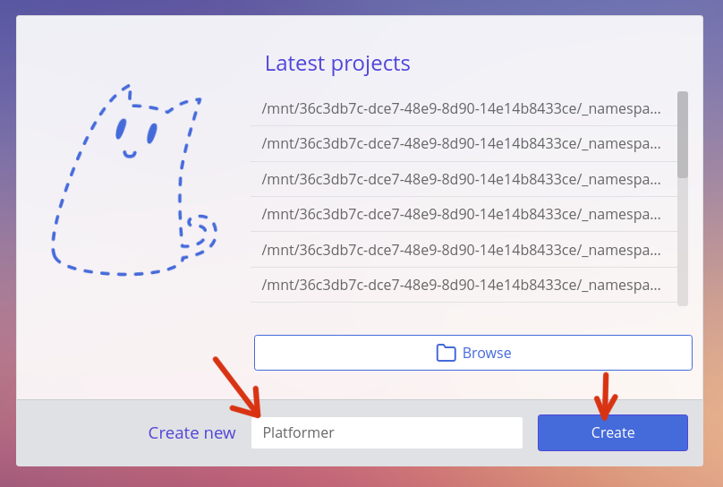
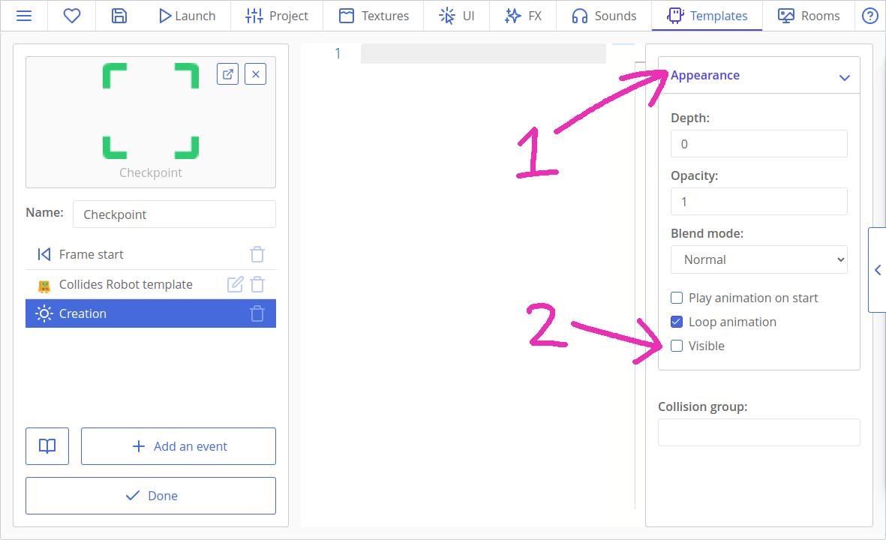
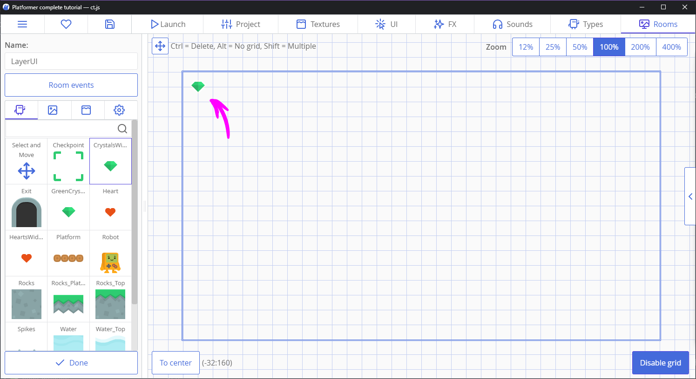
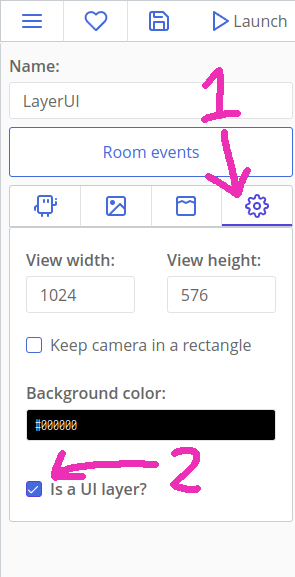
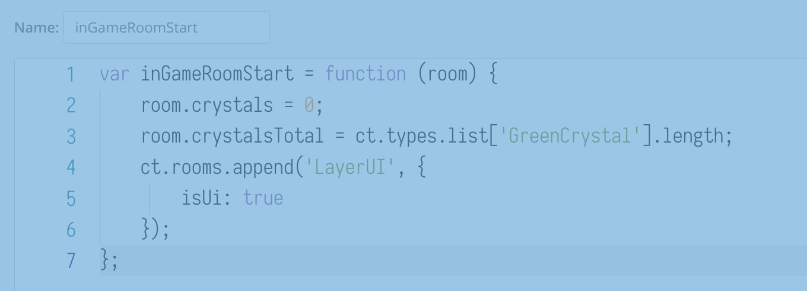

# Making Games: Platformer

In questo tutorial creeremo un piccolo platform con diamanti, checkpoint, piattaforme mobili e trappole! Imparerai come rilevare le collisioni, usarle per creare un movimento laterale e come manipolare gli sprite e spostare il giocatore tra i livelli.


Ecco cosa faremo:

[[toc]]

## Creazione di un progetto

Apri ct.js e inserisci il nome del tuo progetto nel campo inferiore della finestra iniziale. Chiamiamolo "Platformer". Quindi, fai clic sul pulsante "Select folder and create" e seleziona la cartella in cui ct.js lo  memorizzerà, ad esempio all'interno della cartella "Documenti".



## Importare le texture

Avremo bisogno di alcune risorse dal [platformer pack semplificato di Kenney](https://www.kenney.nl/assets/simplified-platformer-pack). Le risorse sono già incluse in ct.js e sono denominate correttamente; le trovi nella cartella `ct.js/examples/Platformer_assets/`.


Apri la scheda "Texture", premi il pulsante "Import", vai alla cartella `ctjs/examples/Platformer_assets/` e seleziona tutte le immagini. Appariranno nel pannello delle texture.

La prima cosa che possiamo notare è che l'animazione `Robot_Walking` viene contata come un'unica immagine, non come due fotogrammi separati. Cliccala per aprirla.


L'immagine è una piccola striscia orizzontale. Ha una riga e due colonne. Possiamo dire a ct.js di dividere l'immagine in questo modo impostando i campi `Columns`e `Rows` e quindi calibrando il campo `Width` (larghezza).

L'intera immagine è larga 192 pixel, quindi ogni fotogramma sarà largo 192 : 2 = 96 pixel. Le immagini del robot dovrebbero ora essere delineate con due rettangoli.


Ora modifichiamo la sua maschera di collisione. Questa determina quali aree di un'immagine vengono conteggiate come solide e quali no, e viene visualizzata come un rettangolo giallo sopra lo sprite.

Innanzitutto, sposta il suo asse in modo che sia posizionato nel punto centrale inferiore.

::: tip
Spiegazione Poiché abbiamo un'immagine di 96x96 pixel, abbiamo bisogno di 48 pixel sull'asse orizzontale e 96 su quello verticale. I pixel vengono misurati dall'angolo in alto a sinistra e il primo valore di un punto è solitamente la sua componente orizzontale, o il suo valore X, e il secondo è indicato come la componente Y.
:::

Il robot ha una bella forma rettangolare, quindi sarà più saggio contrassegnarlo come un rettangolo. Assicurati di aver selezionato una forma rettangolare, fai clic sul pulsante  "Fill" e calibra gli offset in modo che il corpo del robot sia coperto da un riquadro giallo.


Puoi coprire sia il corpo che le mani o selezionare solo il corpo.

Fai clic sul pulsante "Save" nell'angolo in basso a sinistra.

Ora dobbiamo impostare anche le maschere di collisione di `Robot_Idle` e `Robot_Jump`. Assicurati di spostare l'asse su 48x96 e di calibrare le maschere di collisione per entrambi.

::: tip
È anche utile fare in modo che gli offset di collisione siano uguali per ciascuno dei tre sprite, in modo che il robot non si attacchi alla superficie quando cambia animazione a causa di un cambio nella dimensione della maschera di collisione.
:::

Ora impostiamo le forme di collisione dei nostri cristalli e bonus a cuore. Questi possono essere individuati come cerchi. Apri il `GreenCrystal`, imposta la sua forma di collisione come "Circle", quindi fai clic sul pulsante "Image's center" (centro dell'immagine) in modo che l'asse si porti automaticamente nella punto esatto e calibra il raggio della forma di  collisione.

Fai lo stesso per la risorsa `Heart`.


L'ultimo asset che dobbiamo modificare è quello denominato `Spikes`. Non abbiamo bisogno di spostare il suo asse, perché in questo modo apparirerebbe disallineato sulla mappa, ma dobbiamo comunque impostare la sua forma  di collisione. Imposta il suo offset superiore su un valore negativo in modo che la parte superiore dell'immagine non sia riempita di giallo.


Salva le modifiche. Se guardi le altre texture importate, vedrai che hanno tutte una forma rettangolare che riempie l'intera immagine. Ciò va bene per tutte le altre immagini, quindi le lasceremo così come sono.

## Creazione del robot e del terremo

Apri la scheda "Templates" e crea un nuovo template. Chiamalo "Robot", imposta il suo sprite su `Robot_Idle` e salvalo.


::: tip
I template vengono utilizzati per creare copie identiche dello stesso oggetto. Riempiamo i nostri livelli (alias room) di copie, che sono le cose che interagiscono tra loro sullo schermo, ma ogni copia è stata creata da un determinato modello.
:::

Crea ulteriori template con le seguenti texture:

* `Rocks`;
* `Rocks_Top`;
* `Rocks_Platform`.

### Aggiunta di un livello di gioco

Fai clic sulla scheda "Rooms" in alto a destra e, con il pulsante "Add new, aggiungi una room (stanza). Imposta il suo nome su "Livello_01". Clicca l'icona a forma d'ingranaggio per accedere alla scheda "Room properties" e qui imposta le dimensioni della vista su 1024x576.


Quindi disegna un livello facendo clic su "Add copies" , selezionando un modello e posizionandolo con il mouse nella mappa. Tieni premuto per aggiungere più copie contemporaneamente. Non dimenticare il robot!

Puoi espandere il tuo livello su qualsiasi lato e non è necessario che le copie si trovino all'interno della cornice blu. Questa cornice, che è definita dalle dimensioni della vista, imposta solo la parte inizialmente visibile del tuo livello.

Io ho disegnato questo. È difficile rimanere bloccati in questo livello, ma servirà per imparare a saltare. Possiamo anche aggiungere cristalli sulla piattaforma rocciosa in un secondo momento e alcuni tesori in una caverna sotto l'ultima collina.


Ora aggiungiamo uno sfondo. Fare clic sull'icona "Manage backgrounds" a sinistra, premere "Add a Backgrounds" e selezionare la risorsa `BG`. Ora fai clic sull'ingranaggio vicino al nostro nuovo sfondo e cambia la sua profondità in `-10`. Stiamo dicendo al motore grafico che lo sfondo dovrebbe essere disegnato 10 livelli sotto il livello 0 predefinito.


Se salviamo ora il progetto e facciamo clic sul pulsante "Launch" in alto, potremo vedere una piccola porzione del nostro livello disegnata in una finestra del debugger. Niente si muove per il momento, ma è comunque un buon inizio!


::: tip
Il tuo sfondo si divide in quadrati? Vedi [Risoluzione dei problemi: lo sfondo si divide in quadrati! ](./troubleshooting-teared-background.md)
:::

### Aggiunta dei moduli per tastiera e collisioni

Ora avremo bisogno di ascoltare gli eventi della tastiera e di rilevare le collisioni tra il Robot e il suolo. Per tali superpoteri, avremo bisogno di **Catmods**! Fai clic sulla scheda "Project", quindi sulla scheda "Catmods" a sinistra. Fai clic sul modulo "Keyboard" (tastiera) nella sezione dei moduli disponibili in modo che compaia una casella di controllo verde e un piccolo cerchio rotante attorno ad esso. (Potrebbe essere già abilitato, però!) Fai lo stesso con il modulo `place`.


::: tip PRO TIP ✨
Abilita il catmod chiamato `fittoscreen`, quindi vai alla sua scheda delle impostazioni e abilita l'opzione  chiamata "Fast scale with letterboxing" per una visualizzazione a  schermo intero automagica.
:::

Ogni modulo ha la propria documentazione nella scheda "Modules' docs". Evidenzieremo alcune delle sue parti in seguito.

### Aggiunta di azioni per eventi da tastiera

Le azioni consentono di ascoltare gli eventi da tastiera, mouse, gamepad, ecc. Puoi leggere di più su di essi [qui](../actions.html) . Con loro creeremo "listeners" di tasti e frecce WASD.

Vai al pannello "Project", quindi premi la scheda "Actions and input methods" a sinistra.

Quindi, crea uno schema di input come nell'immagine qui sotto. Per farlo, premi innanzitutto il pulsante "Make from scratch" per non utilizzare un preset. Quindi, fai clic su "Add an action", assegna un nome a piacere e aggiungi i metodi di input nella colonna di destra. Puoi utilizzare la ricerca per aggiungere rapidamente le chiavi necessarie.


::: tip
Sebbene questo schema potrebbe essere semplificato a due sole azioni (vedi [esempi nella pagina Azioni](../actions.html#examples) ), useremo due azioni separate per spostarci a sinistra o a destra per non complicare eccessivamente il tutorial.
:::

### Codice collisioni e spostamenti

Ora vai alla scheda "Templates" nella parte superiore dello schermo e apri il template`Rocks`. Nella colonna di destra, riempi il campo chiamato "Collision group" (gruppo di collisione) con `Solid`:


Questo dirà al catmod `ct.place` che questo particolare template appartiene a uno speciale gruppo di collisioni chiamato `Solid`. Il nome di questo gruppo può essere qualunque e il numero di tali gruppi è illimitato. Per ora basterà averne uno.

Aggiungi la stessa riga a `Rocks_Top` e `Rocks_Platform`.

Ora apri il modello `Robot`. Se hai già completato il tutorial "Space Shooter", potresti ricordare che  il movimento viene eseguito utilizzando la manipolazione diretta dei parametri di una copia o utilizzando variabili integrate come `this.speed` o `this.direction`. La verità è che quest'ultimo metodo non ha mai funzionato con i platformer, nemmeno al di fuori di ct.js! Dovremo scrivere qualcosa di più complicato. Preparati! 😃

L'idea di un movimento laterale è che avremo un valore in base al quale ci sposteremo, quindi verificheremo se stiamo entrando in collisione con qualcosa o meno, pixel per pixel.

Impostiamo alcune variabili nell'evento "Creation", per farlo clicca "Add an event" per visualizzare il menu degli eventi e trovare l'evento "Creation", quindi aggiungi:

```js
this.jumpSpeed = -9;
this.gravity = 0.5;

this.hspeed = 0; // Velocità orizzontale
this.vspeed = 0; // Velocità verticale
```

::: tip
`this` è la copia che sta eseguendo il codice scritto. In questo caso si tratta di una copia `Robot`.
:::

Ora vai alla scheda "Frame start". Rimuovi `this.move();` la riga predefinita e aggiungi questo codice:

```js
this.movespeed = 4 * ct.delta; // Velocità orizzontale massima

if (ct.actions.MoveLeft.down) {
    // Se il tasto A o la freccia sinistra è mantenuta premuta, spostati a sinistra
    this.hspeed = -this.movespeed;
} else if (ct.actions.MoveRight.down) {
    // Se il tasto D o la freccia destra è mantenuta premuta, spostati a destra
    this.hspeed = this.movespeed;
} else {
    // Non muoverti orizzontalmente se nessun tasto è premuto
    this.hspeed = 0;
}

// Se c'è terreno sotto il robot ...
if (ct.place.occupied(this, this.x, this.y + 1, 'Solid')) {
    // ... e il tasto W o la barra spaziale è premuta ...
    if (ct.actions.Jump.down) {
        // ... allora salta!
        this.vspeed = this.jumpSpeed;
    } else {
        // Azzera lo spostamento verticale.Non andare sottoterra!
        this.vspeed = 0;
    }
} else {
    // Se non c'è terreno
    this.vspeed += this.gravity * ct.delta;
}
```

::: tip
Il codice dell'evento "Frame start" viene eseguito ogni frame per ogni copia. Il movimento e altre logiche di gioco di solito vanno qui.
:::

::: tip
`ct.actions.YourAction.down`controlla se una qualsiasi chiave che hai elencato in questa azione è attualmente premuta. Ci sono anche `ct.actions.YourAction.pressed`e `ct.actions.YourAction.released`.

`ct.place.occupied(copy, x, y, group)`controlla se una data copia ha eventuali collisioni in date coordinate con un gruppo specifico. Puoi omettere il gruppo se non ne hai bisogno. Questo metodo restituisce `false` (nessuna collisione) o la copia con cui si è entrati in collisione per primi.
:::

::: tip
`ct.delta` descrive quanto tempo ha richiesto l'elaborazione del frame precedente. Se tutto è a posto e il gioco funziona a FPS fluidi, è uguale a `1`, è maggiore se un gioco non riesce a raggiungere il valore FPS target.

Moltiplicando i valori per `ct.delta`, ci assicuriamo che tutto si muova uniformemente a qualsiasi framerate.
:::

Questo imposterà le variabili `hspeed`e `vspeed`, che comunque non bastano ancora per spostare effettivamente il giocatore. Vogliamo anche evitare che questo entri in un muro o si possa spostare quando è accanto ad un "Solid". Per fare ciò spostiamo, aggiornando il valore di `this.x` e `this.y`, il giocatore un pixel alla volta, verificando in continuazione la presenza di ostacoli, con questo codice aggiuntivo:

```js
// Spostati lungo l'asse orizzontale, pixel per pixel
for (var i = 0; i < Math.abs(this.hspeed); i++) {
    if (ct.place.free(this, this.x + Math.sign(this.hspeed), this.y, 'Solid')) {
        this.x += Math.sign(this.hspeed);
    } else {
        break;
    }
}
// Fai lo stesso per la velocità verticale
for (var i = 0; i < Math.abs(this.vspeed); i++) {
    if (ct.place.free(this, this.x, this.y + Math.sign(this.vspeed), 'Solid')) {
        this.y += Math.sign(this.vspeed);
    } else {
        break;
    }
}
```

::: tip
`ct.place.free`è l'equivalente opposto di `ct.place.occupied`. Ha gli stessi parametri e restituisce o `true` o `false`.

`Math.abs`restituisce il valore assoluto di un dato numero, il che significa che i numeri negativi diventeranno positivi. `Math.sign` restituisce -1 se il valore dato è negativo, 1 se è positivo e 0 se è 0. Combinati insieme, creano un ciclo `for` che funziona in entrambe le direzioni e controlla le collisioni pixel per pixel.
:::

Ora possiamo muovere il nostro Robot!

::: warning
Il tuo personaggio riesce a oltrepassare buchi larghi una cella della griglia. Provalo. Se si verifica, è necessario snellire leggermente le forme di collisione del robot.
:::

### Fare in modo che la camera segua il robot

Se avviamo il gioco ora, saremo in grado di spostare il robot in giro. C'è un problema, però: la camera non si muove!

Non è un problema difficile da risolvere, però. Se scaviamo nei documenti ct.js, troveremo l'entità `ct.camera` con le giuste proprietà `ct.camera.follow`, `ct.camera.borderX` ed `ct.camera.borderY` per seguire una copia che si muove.

Apri il template `Robot` e il relativo codice "Creation". Aggiungi questo code in basso:

```js
ct.camera.follow = this;
ct.camera.borderX = 450;
ct.camera.borderY = 200;
```

La camera ora seguirà il Robot.

## Aggiungere trappole e checkpoint

Ora aggiungeremo trappole mortali, fossati d'acqua e checkpoint, questi ultimo per fare in modo che il giocatore ricominci dalla loro e non all'inizio del livello.

Crea nuovi template per le texture `Water`, `Water_Top` , `Spikes` e `Checkpoint`.

Crea una nuova room e chiamala `Level_02`. Imposta le sue dimensioni su 1024x576 e aggiungi uno sfondo. Crea un livello pericoloso con picchi e fossati.

Posizionare le caselle dei checkpoint prima e/o dopo i passaggi più difficili. Non aver paura di metterne troppi, perché punire un giocatore per gli errori non è mai una buona idea!  😉


Qui la fine del presunto livello è posizionata sulla piattaforma centrale in alto. Ho anche posizionato alcune piattaforme al di fuori dello screenshot per raccogliere cristalli in futuro.

Ora passiamo al template `Checkpoint` di ' e modifichiamo il suo codice "Frame start".

Verificheremo la collisione con il robot e, quando accadrà, memorizzeremo un punto di salvataggio all'interno della copia del robot. Crea un nuovo evento "Collision with a template" e seleziona il Robot. Quindi aggiungi questo codice nell'evento:

```js
other.savedX = this.x + 32;
other.savedY = this.y + 32;
```

::: tip
L'evento "Collision with a template" ha una variabile speciale a cui puoi accedere chiamata `other`. Questa variabile memorizza il riferimento alla copia in collisione, che in questo caso è il nostro Robot. Fai attenzione a queste variabili locali speciali quando scrivi il codice dell'evento!
:::

Qui spostiamo anche il punto memorizzato di 32x32 pixel, perché l'asse del checkpoint è posizionato nell'angolo in alto a sinistra, ma l'asse del Robot è posizionato nel suo punto centrale in basso. Per questo, senza quest'aggiunta, il Robot si rigenerebbe un po' a sinistra e sopra il punto centrale desiderato.

Vogliamo rendere i checkpoint invisibili durante il gioco. Apri la sezione dell'aspetto sul lato destro e deseleziona la casella di controllo "Visibile".



Ora vai al template `Spikes` e imposta il valore "Deadly" nella colonna di destra, sotto "Collision group".

Fai lo stesso con `Water` e `Water_Top`.

Ora apri di nuovo il template `Robot` e aggiungi un nuovo evento "Collision with a group". Nel nome del gruppo indica "Deadly". Quindi nel suo codice evento aggiungi il seguente:

```js
this.x = this.savedX;
this.y = this.savedY;
this.hspeed = 0;
this.vspeed = 0;
```

Dovremmo anche scrivere questo codice nell'evento "Creation" del Robot, in modo che il  punto di respawn si trovi nel percorso di creazione per impostazione predefinita, nel caso qualcosa vada storto:

```js
this.savedX = this.x;
this.savedY = this.y;
```

Per testare una stanza specifica, apri la scheda "Rooms" in alto, quindi fai clic con il pulsante destro del mouse sulla stanza desiderata e  premi "Set as starting room".

## Trasformare e Animare il Robot

A questo punto, sarebbe bello aggiungere piccole animazioni al nostro robot. Come ricorderete, abbiamo tre diversi asset chiamati `Robot_Idle`, `Robot_Jump` e `Robot_Walking`.

Aggiungi questa riga al codice "Creation" del `Robot`:

```js
this.animationSpeed = 0.2;
```

`0.2` significa che vogliamo riprodurre 0,2 × 60 (che è 12) fotogrammi al secondo. Per una maggiore leggibilità, potremmo anche scriverlo come `12/60`.

Apri il codice "Frame start" del `Robot` e modifica la sezione dei movimenti in modo che cambi la texture  disegnata a seconda degli input dell'utente e della posizione del robot nello spazio:

```js {4,5,6,7,8,9,13,14,15,16,17,18,22,38,39}
if (ct.actions.MoveLeft.down) {
    // Se il tasto A è premuto, spostati a sinistra
    this.hspeed = -this.movespeed;
    // Imposta l'animazione della camminata
    if (this.tex !== 'Robot_Walking') {
        this.tex = 'Robot_Walking';
        this.play();
    }
    this.scale.x = -1;  // e fai guardare verso sinistra
} else if (ct.actions.MoveRight.down) {
    // Se il tasto D è premuto, spostati a destra
    this.hspeed = this.movespeed;
    // Imposta l'animazione della camminata
    if (this.tex !== 'Robot_Walking') {
        this.tex = 'Robot_Walking';
        this.play();
    }
    this.scale.x = 1; // e fai guardare verso sinistra
} else {
    // Non muoverti orizzontalmente se nessun tasto è premuto
    this.hspeed = 0;
    this.tex = 'Robot_Idle';
}

//  Se c'è terreno sotto il robot ...
if (ct.place.occupied(this, this.x, this.y + 1, 'Solid')) {
    // ... e il tasto W o la barra spaziale è premuta ...
    if (ct.actions.Jump.down) {
        // ... allora salta!
        this.vspeed = this.jumpSpeed;
    } else {
        // Azzera lo spostamento verticale.Non andare sottoterra!
        this.vspeed = 0;
    }
} else {
    // Se non c'è terreno
    this.vspeed += this.gravity * ct.delta;
    // Imposta l'animazione per saltare!
    this.tex = 'Robot_Jump';
}
```

Poiché il nostro movimento verticale non dipende dal movimento orizzontale,  l'animazione viene sostituita dalla texture del salto se non c'è terreno sotto il robot.

Il robot ora girerà nella direzione corrente e cambierà la sua texture a seconda del movimento. Che ragazzo!


## Aggiunta di transizioni di livello

Ecco l'idea:

- Ogni stanza memorizzerà un nome della stanza sotto forma di variabile.
- Ci saranno uscite dal livello verso cui il Robot dovrà dirigersi.
- Quando collideranno, l'uscita leggerà la variabile della stanza e passerà alla stanza successiva indicata nella variabile appena letta.

Crea un nuovo template e chiamalo `Exit`. Imposta la sua texture. Quindi crea un "Collides Robot event" e scrivi questo codice al suo interno:

```js
// Ci sono livelli di gioco successivi a questo?
if (ct.room.nextRoom) {
    // Allora passa alla stanza successiva
    ct.rooms.switch(ct.room.nextRoom);
}
```

:::
tip Qui `ct.room` punta alla stanza corrente. `ct.rooms.switch` esce dal livello corrente corrente e entra in quello indicato dal nome tra parentesi.
:::

Ora vai nella scheda "Rooms", apri il `Level_01`, fai clic sul pulsante "Events" e scrivi quanto segue nel codice "Room start":

```js
this.nextRoom = 'Level_02';
```

Posiziona un template `Exit` per abbandonare il livello.

Ora salva la stanza, contrassegnala `Level_01` come stanza di partenza facendo clic con il pulsante destro del mouse e verifica se funziona tutto..

::: tip
Da solo! Crea uscite aggiuntive che portano a sottolivelli segreti e indietro al punto di partenza. Ottieni [più risorse da qui](https://www.kenney.nl/assets/simplified-platformer-pack), se ne hai bisogno.
:::

## Oggetti da raccogliere: contare e visualizzare

### Aggiunta di cristalli

Crea un nuovo modello chiamato `GreenCrystal` e imposta il suo sprite. Crea un "Collides Robot event" e scrivici questo codice:

```js
ct.room.crystals ++;
this.kill = true;
```

:::
tip `this.kill = true;` dice che la copia corrente deve essere rimossa dalla stanza. Accadrà dopo tutti gli eventi di tipo "Frame start" ma prima di "Frame end".
:::

Come puoi già intuire, il numero di cristalli raccolti verrà memorizzato nella stanza.

Ma se continuiamo ad aggiungere più funzionalità ai codici specifici dei livelli, presto causeremo qualche bug o dimenticheremo di copiare e incollare alcuni snippet. Ad ogni modo, sarebbe un lavoro noioso già farlo nella terza stanza. (E avremo *una* terza stanza!)

Quindi ora dobbiamo creare funzioni riutilizzabili. Può sembrare strano, ma in realtà non è così difficile.

Vai alla scheda "Progetto" nella parte superiore dello schermo, quindi fai clic sulla scheda "Custom scripts" a sinistra. Premi il pulsante "Add a New Script":


Chiama il nuovo script `inGameRoomStart` ed inserisci questo codice:

```js
var inGameRoomStart = function (room) {
    room.crystals = 0;
    room.crystalsTotal = ct.templates.list['GreenCrystal'].length;
};
```

::: tip
`ct.templates.list['TemplateName']` restituisce un array (una lista) di tutte le copie del template dato all'interno del livello attivo. `length` restituisce la dimensione dell'array.
:::


Ora vai al codice "Room start" di ogni stanza e aggiungi questa riga:

```js
inGameRoomStart(this);
```

Hmmm... sembra familiare! Come per `ct.place.free(this, this.x, this.y)`! In realtà è così che funziona la maggior parte dei metodi ct.js: hai un metodo e dici a questo metodo di fare qualcosa con quella copia o quella stanza.

Quando `inGameRoomStart(this);` viene chiamato, imposterà la variabile `crystals` e `crystalsTotal` da solo, senza la necessità di riscrivere tale codice in ogni singola stanza.

Quindi è così che raccogliamo e contiamo i cristalli, ma dobbiamo anche creare una semplice interfaccia per visualizzare il loro conteggio e farlo con *stile* .  ✨

Fortunatamente, c'è uno strumento per la progettazione di eleganti stili di testo all'interno di ct.js. Apri la scheda "UI" nella parte superiore dello schermo e crea un nuovo stile. Chiamalo `CrystalCounter`.

Quindi attiva la sezione "Font" (tipo di carattere), imposta la dimensione del carattere su 24 e il suo peso su 600. Allinealo a sinistra.


Quindi apri la scheda "Fill" (riempimento), attivala e imposta il colore di riempimento su verde. Ho scelto `#00A847`. Altre ottime scelte potrebbero essere i colori principali del cristallo, come `#2ECC71`e `#28B463`.


Possiamo anche aggiungere una linea bianca spessa tutt'intorno al testo. Apri la scheda "Stroke" (bordo), quindi imposta il colore su bianco e la larghezza della linea su 5. Se non riesci a vedere il risultato a destra, prova a passare per breve tempo al tema scuro dell'interfaccia utente facendo clic sul menu sandwich in alto a sinistra.


Ora dovremmo creare un nuovo template chiamato `CrystalsWidget`. Visualizzerà un'icona di cristallo e un contatore. Imposta il suo sprite su `GreenCrystal` e scrivi quanto segue nel suo evento "Creation":

```js
this.text = new PIXI.Text('0 / ' + ct.room.crystalsTotal, ct.styles.get('CrystalCounter'));
this.text.x = 32;
this.text.anchor.y = 0.5;

this.addChild(this.text);
```

Qui creiamo una nuova etichetta di testo e la colleghiamo alla nostra icona. `this.text.anchor.y = 0.5;` indica che l'asse verticale dell'etichetta deve essere allineato al centro della nostra icona.

Per finire, aggiungi questo codice all'evento "Frame end" di `CrystalsWidget`:

```js
this.text.text = `${ct.room.crystals} / ${ct.room.crystalsTotal}`;
```

Ora dovremmo creare una stanza speciale per i nostri elementi dell'interfaccia utente. Crealo nella scheda "Room" e chiamalo `LayerUI`. Imposta le sue dimensioni identiche a quelle delle altre stanze: 1024x576. Quindi, aggiungi il nuovo template `CrystalsWidget` nell'angolo in alto a sinistra della room:



L'aggiunta di elementi dell'interfaccia utente a una stanza separata consente di progettare l'interfaccia utente visivamente e quindi di riutilizzarla in altre livelli tramite il codice. Ct.js ha anche un flag speciale che blocca i livelli dell'interfaccia utente in posizione, in modo da poter spostare, ridimensionare e persino  ruotare liberamente la camera, senza che gli elementi dell'interfaccia utente ne vengano influiti. Vai nelle impostazioni della stanza e spunta la casella di controllo "Is a UI layer?" in modo che `LayerUI` venga fissato rispetto alla vista del gioco.



Ora, per importare la stanza `LayerUI` in un'altra, torno allo script `inGameRoomStart`creato prima nella scheda "Project -> Custom scripts" e aggiungi  questo codice prima della parentesi di chiusura della funzione:

```js
ct.rooms.append('LayerUI');
```

Dovrebbe apparire così:



::: tip
Il metodo `ct.rooms.append` (così come `ct.rooms.prepend`) può essere utilizzato anche per riutilizzare altre cose oltre ai livelli dell'interfaccia utente. Ad esempio, possiamo posizionare tutti gli sfondi in una stanza separata e quindi chiamare `ct.rooms.prepend("YourBackgroundRoom");` per importarli. Ciò è particolarmente utile durante la creazione di sfondi a più strati aventi effetto di parallasse.
:::

Se ora esegui il gioco, dovresti vedere il contatore dei cristalli nell'angolo in alto a sinistra:


### Aggiunta di vite e bonus salute

Quanto segue è molto simile alla raccolta dei cristalli, a meno di qualche modifica:

- Iniziamo con 3 vite.
- Non avremo più di 3 vite contemporaneamente.
- Se abbiamo perso l'ultima vita, il livello ricomincia.

::: tip Da solo!
Prova a fare tutto da solo! Se ti perdi, cerca le istruzioni qui sotto. Ora, smetti di scorrere! 😃
:::

Crea un nuovo modello chiamato `Heart` e imposta uno sprite adeguato. Aggiungi questo codice all'evento "Collides Robot event":

```js
if (ct.room.lives < 3) {
    ct.room.lives++;
    this.kill = true;
}
```

Non dimenticare di inserire i cuori nei tuoi livelli!

Avremo anche bisogno di uno stile di testo per un contatore. I passaggi sono gli stessi già visti e un colore adeguato potrebbe essere questo `#E85017`. Possiamo anche duplicare lo stile esistente! Chiamiamo questo stile un `HeartCounter`.

Avremo bisogno anche di un altro widget per i cuori. Crea un nuovo modello chiamato `HeartsWidget`, imposta il suo sprite su `Heart` e il suo codice per l'evento "Creation" così:

```js
this.text = new PIXI.Text(ct.room.lives, ct.styles.get('HeartCounter'));
this.text.x = -32;
this.text.anchor.y = 0.5;
this.text.anchor.x = 1;

this.addChild(this.text);
```

Ora aggiungi questo all'evento "Frame end" di `HeartsWidget`:

```js
this.text.text = ct.room.lives;
```

Quindi aggiungi una copia di questo template alla stanza `LayerUI`.

Ora modifica il codice di respawn ("Collides Deadly group") del `Robot` in modo che perda un cuore ad ogni respawn:

```js
this.x = this.savedX;
this.y = this.savedY;
this.hspeed = 0;
this.vspeed = 0;
// remove one life
ct.room.lives --;
if (ct.room.lives <= 0) {
    // Restart a room: switch to the room of its own name
    ct.rooms.switch(ct.room.name);
}
```

E assicurati di modificare la funzione `inGameRoomStart` per inizializzare le vite all'ingresso di ogni stanza:

```js {3}
var inGameRoomStart = function (room) {
    room.crystals = 0;
    room.lives = 3;
    room.crystalsTotal = ct.templates.list['GreenCrystal'].length;

    ct.rooms.append('LayerUI', {
        isUi: true
    });
};
```

Questo è tutto! È tempo di fare dei test.

## Aggiungere piattaforme mobili

Crea un nuovo template chiamato `Platform` e seleziona lo sprite corrispondente. Crea un nuovo livello chiamato `Level_03` che presenta ampi fossati o lunghe trappole con piattaforme che ti possano trasportare.


Le piattaforme mobili agiranno in questo modo:

- Si muovono orizzontalmente, iniziando a muoversi, per esempio, a destra.
- Se una piattaforma rileva che toccherà un oggetto `Solid`nel fotogramma successivo, inverte la propria direzione.
- Le piattaforme spostano il giocatore se questo risulta essere proprio sopra essa.

Apriamo il template `Platform` e inizializziamo la sua velocità:

```js
this.speed = 2;
```

Inoltre, imposta il suo gruppo di collisione a "Solid" nella colonna di destra.

Quindi, aggiungi del codice alla scheda "Frame start" per spostare il nostro Robot insieme alla piattaforma:

```js
var robot = ct.place.meet(this, this.x, this.y - 1, 'Robot');
if (robot) {
    robot.x += this.speed;
}
```

E la logica del movimento della piattaforma:

```js
if (ct.place.occupied(this, this.x + this.speed * ct.delta, this.y, 'Solid')) {
    // Flip direction
    this.direction += 180;
}
this.move();
```

Sembra semplice! Forse anche troppo. Ed ecco il problema: se il Robot tocca il lato sinistro o destro di una piattaforma, si blocca per sempre! Dobbiamo rendere solide le piattaforme solo quando non si sovrappongono.


Ecco un codice migliore:

```js
var robot = ct.place.meet(this, this.x, this.y, 'Robot');
if (robot) {
    this.cgroup = undefined;
} else {
    this.cgroup = 'Solid';
    robot = ct.place.meet(this, this.x, this.y - 1, 'Robot');
    if (robot) {
        robot.x += ct.u.ldx(this.speed, this.direction);
    }
}

if (ct.place.occupied(this, this.x + this.speed * ct.delta, this.y, 'Solid')) {
    // Flip direction
    this.direction += 180;
}
this.move();
```

Che succede qui? Prima di tutto, controlliamo se un robot si sta già sovrapponendo a una piattaforma. In tal caso, diciamo che la piattaforma dovrebbe smettere di essere solida entro `this.cgroup = undefined;`, in modo che il robot possa cadere attraverso la piattaforma invece di rimanervi bloccato.  La proprietà `cgroup` è il valore del campo denominato "Collision group" che stavamo modificando nella colonna di sinistra dell'editor del modello! Se non c'è collisione tra la piattaforma e il robot, la piattaforma diventa solida ( `this.cgroup = 'Solid';`) e cerchiamo di nuovo il robot, ma ora un pixel sopra la piattaforma. Dato che abbiamo collisioni precise al pixel, uno sarà sufficiente.

::: tip Da solo!
Aggiungi piattaforme che si muovono verticalmente! E assicurati che non schiaccino il Robot. 😉
:::

## Questo è tutto!

Accidenti! È stato un tutorial piuttosto lungo. Tuttavia, c'è molto spazio per migliorare.

Ecco come puoi migliorare questo gioco:

- Aggiungi nemici e motoseghe mortali! Puoi ottenere sprite di loro e molto altro [qui](https://www.kenney.nl/assets/platformer-art-deluxe) .
- Crea una storia e raccontala attraverso NPC, note su piatti di legno o semplicemente attraverso i sottotitoli!
- Migliora il processo di respawn. Assicurati che il robot non cada nelle trappole dopo il respawn. Questo può essere fatto bloccando l'input di un giocatore per mezzo secondo o  semplicemente rendendo più sicure le aree dei checkpoint.
- Aggiungi suoni! Niente rende un gioco più vivo di alcuni effetti sonori di buona qualità.
- Assicurati che il robot venga respawnato se occasionalmente cade da un livello.
- Basta aggiungere più livelli.  😉 Decorale con le piante, crea mondi di diversi colori.

Ricorda che puoi pubblicare i tuoi giochi su **itch.io** o piattaforme di giochi on line simili. È facile, [leggi le istruzioni nella guida](deployment-itch-io.html).

::: tip Una nota a margine
Guarda come le nuove funzionalità nel tuo codice appaiono gradualmente nei tuoi livelli! Questo è anche un buon modo per introdurre nuove cose a un giocatore. Offri loro un nuovo concetto alla volta, ma preserva quelli precedenti con difficoltà crescenti. *Questo è stato un suggerimento professionale sul level design di Comigo* 😎
:::

**Happy coding!**
Comigo
