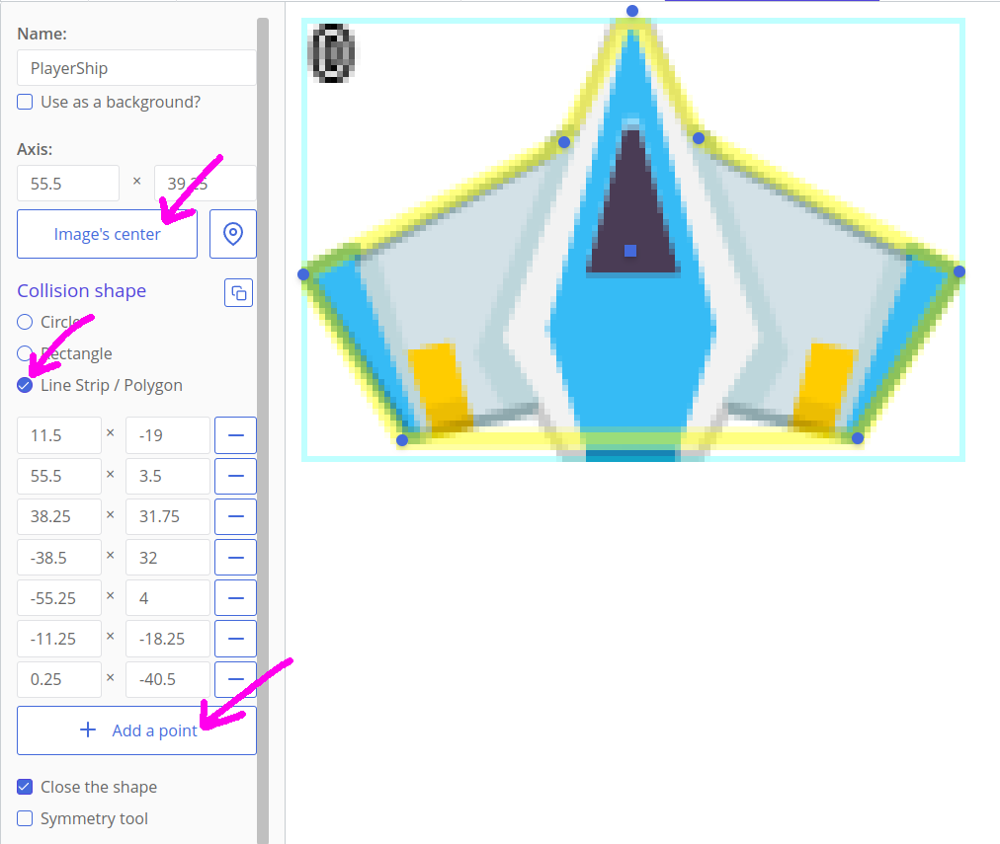

# Making Games: Sparatutto spaziale

Facciamo un piccolo gioco di guerre stellari con asteroidi, laser e cannoni nemici! Questo tutorial ti insegnerà come importare risorse, gestire l'input dell'utente, spostare oggetti e rispondere alle collisioni.


Ecco cosa faremo:

[[toc]]

## Importazione delle texture

Apri ct.js e crea un nuovo progetto e chiamalo "SpaceShooter".


Quindi, [scarica un pacchetto di risorse](http://www.kenney.nl/assets/space-shooter-redux) dal sito di Kenney. È gratuito ed è ottimo per la prototipazione, l'apprendimento o semplicemente per fare dei test.

Puoi anche utilizzare le risorse collocate all'interno della cartella `ct.js/examples/SpaceShooter_assets`.

Queste sono tutte le risorse di cui avremo bisogno oggi:


Ora apri la scheda "Texture" nella parte superiore della finestra di ct.IDE e trascina e rilascia queste risorse all'interno della finestra di  ct.IDE. Puoi anche premere il pulsante "Import" per farlo manualmente.

Apparirà una miniatura per ciascuna delle immagini. Apriamo `PlayerShip` e configuriamolo. Vedrai una forma gialla che definisce il suo perimetro di collisione. Per ora copre troppo spazio vuoto, specialmente sopra le ali. Per sistemarlo, dovrai modificare questa forma di collisione agendo nella colonna di sinistra.

Innanzitutto, premi il pulsante "Image's center", in modo che il suo asse (il baricentro della figura) sia posizionato al centro della nave.

Quindi, seleziona l' opzione " **Line Strip / Polygon** " sotto l'etichetta "Collision shape" (forma della collisione). Aggiungi un paio di punti aggiuntivi e spostali con il mouse in modo che il poligono risultante contenga la forma della nave.



Premi "Save" e passa alla texture successiva: "LaserRed". Come per la nave, imposta il suo asse al centro cliccando "Image's center". Quindi, seleziona una forma di collisione di tipo **Circle** proprio sotto questo pulsante. Ora la forma della collisione gialla è circolare.

Anche la texture successiva, `Laser_Blue`, dovrà essere centrata e poiché la forma della collisione dovrebbe  coprire tutta l'immagine, clicca sul pulsante "Fill" (riempi).


Entrambi gli asteroidi sono definiti da poligoni dalle loro forme concave o taglienti. Imposta la loro forma di collisione su **Line Strip / Polygon** e non dimenticare di impostare il loro asse al centro.


La forma della tecture `EnemyShip` forma può essere trattata come un **Poliygon** .

L'immagine di sfondo deve essere lasciata così com'è, perché non entrerà in collisione con nessuna entità del gioco.

## Creare i primi modelli e disporre gli oggetti

**Le texture** non fanno molto da sole e per visualizzarle nel gioco, dobbiamo creare dei **template** usando queste risorse grafiche. I template verranno poi utilizzati per creare **Copies** (Copie, cioè le entità grafiche che compariranno nel gioco) e queste ultime sono gli oggetti che metterai all'interno di **Rooms** (stanze o livelli di gioco) che interagiscono tra loro e rispondono ai tuoi input.

Premi la scheda "Template" nella parte superiore dello schermo e crea un nuovo template per la nave del giocatore. Dopo aver fatto clic sul pulsante "Crea", fai clic sul grande gatto tratteggiato nella colonna di sinistra sopra la scritta "Select". Ti mostrerà tutte le tue trame. Premi la miniatura della tua nave. Ora dovrebbe apparire nella colonna di sinistra dell'editor.

Ora, cambia il nome del template in `PlayerShip` in modo da identificarlo facilmente durante la scrittura del codice.


Crea template per tutte le altre texture ad eccezione dell'immagine di sfondo (BG). Le immagini di sfondo non si spostano o interagiscono con nulla e sono spesso ripetute, quindi non serve un template. Aggiungeremo lo sfondo in seguito in una **room**  (stanza, il livello di gioco).


Posizioniamo i template creati da qualche parte sulla mappa. Per creare questa mappa (o room o stanza o livello di gioco), premi la scheda "Rooms" (Stanze) nella parte superiore delle finestre di ct.IDE e fai clic sul pulsante "Add new" (aggiungi nuova). Quindi, apri la room appena creata facendo clic su di essa.


Qui ci fermeremo un po' per spiegare come utilizzare l'editor delle "Room". In primo luogo, possiamo impostare il nome di un livello e le dimensioni del suo riquadro di visualizzazione.

In ct.js, ogni singolo livello ha dimensioni infinite e ci si può spostare in qualsiasi direzione. È possibile posizionare oggetti all'interno e all'esterno del riquadro di visualizzazione.

Poi abbiamo gli "Events" (eventi) associati ad ogni livello del gioco. È una sezione che definisce la logica di gioco specifica per questa stanza. È possibile definire l'interfaccia utente o lo scenario di livello qui.

Abbiamo poi un pannello con i pulsanti "Add copies" (aggiungere gli sprite) e "Manage backgrounds" (aggiungere gli sfondi). Clicca "Add copies", scegli un oggetto e posizionalo sulla mappa facendo clic in un punto nell'ampia area disponibile. Per disabilitare l'aggiunta di nuove copie, seleziona il gatto tratteggiato (None). Puoi eseguire una panoramica della vista dell'editor trascinando il mouse quando non è selezionato nulla. È possibile modificare il livello di zoom impostando il suo valore nella barra in alto o tramite la rotellina del mouse.

Se ti perdi navigando la mappa, è possibile resettare la vista premendo il tasto `H` o l'apposito comando `Reset view` (resetta la vista).

Usando il pulsante "Grid" puoi impostare la dimensione griglia, sceglierne una diagonal, attivare e disattivarne la visualizzazione.

Infine, puoi spostare tutte le copie nella stanza contemporaneamente usando lo strumento di selezione a forma di freccia (Select tool).

Per ora, posizioniamo la nave di un giocatore, una nemica e un paio di asteroidi.


Quindi aggiungi uno sfondo. Fare clic sull'icona degli sfondi "Manage backgrounds" e premere "Add a background", quindi selezionare `BG`. Apparirà come una texture ripetuta più volte (tiled) nella vista principale.


Sebbene gli sfondi vengano sempre disegnati prima delle copie dello stesso livello di profondità ( `0` per impostazione predefinita), è meglio cambiare il loro livello di profondità. Fai clic sull'ingranaggio a sinistra della miniatura dello sfondo e inserisci `-5` nel campo "Depth" (profondità). In questo modo comunichiamo al motore che questo sfondo è posizionato più in basso rispetto ad altre copie e sfondi. La profondità rappresenta un terzo asse di coordinate che va verso l'alto, mentre X e Y vanno verso i lati.


Successivamente, salva il progetto e fai clic sul pulsante "Launch" (Avvia). A questo punto, avrai un progetto di gioco con navi e asteroidi immobili.


## Aggiunta del movimento per il giocatore

La gestione dell'input dell'utente è l'attività più importante. In questa sezione faremo muovere la nave blu quando un giocatore preme i tasti freccia o WASD.

Per gestire gli input da tastiera, dobbiamo abilitare il modulo Tastiera. Premi la scheda "Project" (progetto), quindi la scheda "Catmods" a sinistra, e  cerca il modulo "Keyboard" (tastiera) nella sezione con i moduli disponibili. Fai clic per abilitarlo (potrebbe essere abilitato per impostazione  predefinita, tuttavia: una casella di controllo verde con un piccolo cerchio rotante indica che il modulo è abilitato). Quindi assicurati che anche i moduli `mouse`, `random` e `place` siano abilitati, poiché ne avremo bisogno in seguito.


### Aggiunta di azioni

Le "Action" (azioni) in ct.js sono entità che raggruppano diversi metodi di input in  eventi e ti consentono di ascoltare l'input del giocatore nel codice. Puoi leggere di più su di loro [qui](../actions.html) .

Per ora, creiamo uno schema di input di base per il nostro sparatutto. Apri la scheda "Project", quindi la scheda "Actions and input methods" (azioni e metodi di input) sul lato sinistro. Dovremo definire tre diverse azioni: per sparare proiettili laser, per spostarsi in orizzontale e per spostarsi in verticale.

Innanzitutto, fai clic sul pulsante "Make from scratch" (crea da zero). Quindi, inserisci il nome della prima azione. Fai clic sul pulsante "Add an input method" per associare pulsanti specifici alla tua azione. Usa la sua ricerca per filtrare rapidamente i metodi di input disponibili. Fai clic sul pulsante "Add an action" per continuare a creare le altre azioni.


Crea tre azioni come nell'immagine qui sopra. Cambia il valore del moltiplicatore su `-1` per `keyboard.ArrowUp`, `keyboard.KeyW`, `keyboard.ArrowLeft` e per `keyboard.KeyA`, in modo che questi tasti spostino la nave nella direzione opposta.

### Codice del movimento

Apri la scheda "Template" in alto, quindi fai clic su `PlayerShip` e quindi clicca l'evento `Frame start`.

::: tip
L'evento `Frame start` viene eseguito ad ogni fotogramma prima del suo disegno, mentre `Frame end` viene eseguito subito dopo e serve per disegnare un nuovo fotogramma aggiuntivo, come vedrai più avanti nei tutorial. L'evento`Creation` si verifica, e viene eseguito una sola volta, quando si genera una nuova copia usando il template e `Destruction` viene eseguito prima di `Frame end` se una copia viene eliminata.
:::

Scrivi il seguente codice:

```js
/**
 * Sposta la nave
 * Vedi Project > Pannello Actions and input methods
 * e "Actions" nella documentazione.
 */

this.x += 8 * ct.delta * ct.actions.MoveX.value; // Spostamento lungo l'asse x


/**
 * Controlla se la nave è uscita dalla schermata
 */
if (this.x < 0) { // La nave ha oltrepassato il bordo sinistro?
    this.x = 0; // Torna al bordo sinistro
}
if (this.x > ct.camera.width) { // La nave ha oltrepassato il bordo destro?
    this.x = ct.camera.width; // Torna al bordo destro
}

this.move();
```

Qui stiamo usando le azioni create poco fa. Per prima cosa, proviamo a spostare la nave orizzontalmente (di `x`, linea 6). `ct.actions.MoveX` varrà `1` se abbiamo premuto la freccia destra della tastiera o il tasto "D", e varrà `-1` se un giocatore preme la freccia sinistra o il tasto "A".  Se non viene premuto nulla, varrà `0`, disabilitando il movimento orizzontale.

`ct.delta` è necessario per compensare possibili ritardi e cali di FPS. Di solito è uguale `1` e non aggiunge molto, ma accelererà il movimento se alcuni fotogrammi venissero persi.

Infine, moltiplichiamo il nostro valore di velocità intermedia per la velocità desiderata, `8`.

Successivamente controlliamo se la sua coordinata X risulta fuori dallo schermo. Qui `0` indica il lato sinistro del livello e `ct.camera.width` indica la dimensione orizzontale della finestra, che definisce il lato destro.

::: tip Da solo!
Aggiungi un movimento verticale al giocatore. Quindi, prova a limitare il suo movimento in modo che la nave non possa volare al di sopra del centro dello schermo.
:::

## Spostamento di nemici e asteroidi

Anche i nemici dovrebbero muoversi. Per questo tutorial, la nostra nave ostile si sposterà dall'alto verso il basso e gli asteroidi voleranno in una direzione casuale.

### Navi nemiche

Apri la scheda "Template", quindi fai clic su `EnemyShip`. Aggiungi l'evento `Creation` e il seguente codice al suo interno:

```js
this.speed = 3;
this.direction = 270;
```

Qui, utilizziamo le variabili integrate per lo spostamento. La modifica manuale delle coordinate è utile per gestire l'input del  giocatore, ma per la maggior parte delle attività è meglio utilizzare  queste variabili poiché automatizzano la maggior parte delle cose. Ad esempio, non è necessario utilizzare `ct.delta` durante l'utilizzo `this.speed` e `this.direction`. Qui, `this.speed` indica la velocità della copia e `this.direction` si riferisce alla sua direzione di movimento.

::: tip
In ct.js, la direzione è misurata in gradi, muovendosi in senso orario. 0° significa destra, 90° significa in basso, 180° è per sinistra e 270° indica in alto.


:::

Se clicchil'evento `Frame start`, vedrai questo piccolo codice:

```js
this.move();
```

Questa riga legge le variabili integrate e sposta la copia in base ad esse. Senza di essa, `this.speed` e `this.direction` sarebbero inutili.

Ci sono anche altre variabili integrate, le puoi trovare nella [`ct.templates` pagina](../ct.templates.html) .

Modificheremo il codice di `Frame start` in modo che i nemici vengano eliminati se escono dallo schermo, ciò per liberare memoria.

```js
this.move();

if (this.y > ct.camera.height + 80) {
    this.kill = true;
}
```

::: tip Da solo!
E se le navi nemiche potessero muoversi in diagonale, a zig zag?
:::

### Asteroidi

Gli asteroidi conterranno lo stesso codice nell'evento `Frame start`, ma la loro `direction` sarà definita in modo casuale.

Apri il `Asteroid_Medium` nella scheda "Template", quindi scrivi il codice qui sotto riportato nell'evento `Creation` (ricordati che devi cliccare "Add an event" per aggiungerlo).

```js Creation event
this.speed = ct.random.range(1, 3);
this.direction = ct.random.range(90 - 30, 90 + 30);
```

L'evento `Frame start` sarà uguale a quello di `EnemyShip`.

```js Frame start event
this.move();

if (this.y > ct.camera.height + 80) {
    this.kill = true;
}
```

Fai lo stesso per l'altro asteroide.

Salva il progetto e fai clic sul pulsante "Launch" in alto. La nave nemica si sposterà lentamente verso il basso, mentre gli asteroidi si muoveranno in modo più caotico. Se aggiorni la pagina, gli asteroidi si sposteranno in una nuova direzione.

::: tip
Hai errori con `ct.random`? Assicurati di aver abilitato il modulo `random` nella scheda "Project" -> "Catmods".
:::


## Proiettili e collisione

Ora è il momento di affilare le armi 😎

Apri il template `PlayerShip` e aggiungi l'evento "Action press". Una finestra ti chiederà quale azione desideri utilizzare. Seleziona l'azione "Shoot" e poi premi applica. Ora all'interno dell'evento "On Shoot press" aggiungi questo codice:

```js
ct.templates.copy('Laser_Blue', this.x, this.y);
```

Questa è la prima volta che aggiungiamo nuove copie a livello di codice. Evviva!

::: tip
`ct.templates.copy` è una funzione molto importante che genera un nuovo oggetto all'interno della stanza corrente. In primo luogo, scriviamo il nome di un template esistente tra virgolette. Quindi, scriviamo le coordinate in cui vorremmo, indicando le coordinate orizzontale e verticale rispettivamente. `this.x` indica l'ascissa della copia corrente e `this.y` l'ordinata.
:::

Con i dati forniti creiamo un proiettile laser proprio sotto la nostra nave. I proiettili verranno generati quando viene premuto il tasto Spazio o il tasto del mouse.

Ora passiamo al template del `Laser_Blue`. Definiremo il suo movimento con questi valori di default.

```js Creation code
this.speed = 18;
this.direction = 270;
```

Quindi, assicuriamoci che questi proiettili laser scompaiano dopo che escono fuori dalla visuale. Poiché si spostano solo verso l'alto, potremmo scrivere un'unica condizione per il bordo superiore.

```js Frame start code
if (this.y < -40) {
    this.kill = true;
}

this.move();
```

La prossima cosa da gestire saranno le collisioni del proiettile con nemici ed asteroidi. È meglio scrivere la logica di collisione nel codice di questi ultimi piuttosto che nel codice del laser, ciò perché si comporteranno in modo diverso come vedrai tra poco, e quindi eviteremo di creare confusione nel codice del proiettile.

Apri il template `EnemyShip` e crea un evento "Collision with a template" (Collisione con un template), quindi seleziona `Laser_Blue`. Nel codice, aggiungi quanto segue:

``` js
other.kill = true;
this.kill = true;
```

::: tip
`other` è una variabile speciale a cui è possibile fare riferimento all'interno del codice dell'evento di collisione. `other` si riferisce all'altra copia in collisione con il proiettile. Cerca altre variabili locali che potrebbero essere accessibili in determinati eventi!
:::

Se una nave si scontra con un proiettile laser, sia il proiettile che la nave andranno distrutti.

Copia esattamente lo stesso codice in `Asteroid_Medium`. Anche per `Asteroid_Big` potremmo usare lo stesso codice, se non fosse che vogliamo che questo si spacci in due asteroidi più piccoli e quindi è il seguente:

``` js
other.kill = true;
this.kill = true;
ct.templates.copy('Asteroid_Medium', this.x, this.y);
ct.templates.copy('Asteroid_Medium', this.x, this.y);
```

Se esegui il gioco, sarai in grado di distruggere navi e asteroidi nemici. Gli asteroidi più grandi dovrebbero rompersi in due più piccoli.

### Proiettili nemici

Anche le navi nemiche dovrebbero essere in grado di sparare. Aggiungi il codice seguente nell'evento `Creation` di `EnemyShip`:

``` js
this.timer1 = 1;
```

Con questo, imposteremo il nostro timer in modo che la nave nemica spari a intervalli precisi. `timer1` è una variabile speciale che ct.js eseguirà automaticamente contando alla rovescia per noi, 1 al secondo. Allo scadere del tempo, l'evento associato al `Timer 1` verrà eseguito. Ciò significa che  aspetteremo 1 secondo prima di sparare il primo proiettile.

Clicca "Add an event", nella sezione `Timers` scegli `Timer 1`  e aggiungi il seguente codice al suo interno:

```js
this.timer1 = 3;
ct.templates.copy('Laser_Red', this.x, this.y + 32);
```

Quando la variabile `timer1` si azzera, la riavviamo impostandola a 3 e quindi creiamo un copia usando il template "Laser_Red" . Ora il prossimo proiettile apparirà automaticamente dopo 3 secondi. Come puoi vedere, scrivendo `this.y + 32` l'apparizione avverrà in corrispondenza della punta della nave.

Scriviamo del codice per il template "Laser_Red" . Aggiungi questo codice al suo evneto `Creation`:

```js
this.speed = 8;
this.direction = 270;

this.angle = ct.random.deg();
```

`this.angle` ruota la texture della copia. `ct.random.deg()` restituisce un valore casuale compreso tra 0 e 360, utile durante la definizione di valori angolari.

::: tip
C'è anche `this.scale.x` e `this.scale.y`, che impostano la scala orizzontale e verticale di una copia e `this.alpha` che manipola l'opacità (0 significa completamente trasparente, 1 completamente opaco).
:::

Il codice di `Frame start` sarà il seguente:

``` js
if (this.y > ct.camera.height + 40) {
    this.kill = true;
}

this.move();

this.angle -= 4 * ct.delta;
```

`this.angle -= 4 * ct.delta;` significa che ruoteremo una copia di circa 4 gradi ad ogni passaggio. `ct.delta` riequilibrerà le cose se il gioco soffrisse di FPS incoerenti.

Definiremo la logica per distruggere la nave del giocatore in seguito. Per ora, è il momento di aggiungere la generazione di nemici e asteroidi durante il gioco.

## Generare di oggetti nel tempo

Apri `Main` nella sezione "Rooms". Rimuovi asteroidi e nemici esistenti selezionandoli singolarmente o in gruppo, con un riquadro di selezione o i tasti shift o ctrl, ed il tasto **canc**.

Quindi, premi il `Events` della barra in alto.

Le stanze hanno tutti gli stessi eventi come già visto per le copie:

- `Room start` che, come `Creation`, è chiamato una volta sola, quando avvii il gioco o ti sposti in questa stanza a livello di codice;
- `Frame start` è chiamato ad ogni frame, dopo il corrispondente `Frame start` delle varie copie esistenti;
- `Frame end` viene chiamato dopo aver disegnato tutto il livello. È utile per aggiornare l'interfaccia utente;
- `Room end` viene chiamato prima di trasferirsi in un'altra stanza.

Genereremo nemici quasi nello stesso modo in cui le navi nemiche generano i loro proiettili. Avremo un paio di timer e collocheremo delle copie sopra l'orizzonte del giocatore.

Per fare ciò, imposta due timer nel codice `Room start`:

```js
this.timer1 = 0.3; // Timer per gli asteroidi
this.timer2 = 3; // Timer per i nemici
```

Quindi aggiungi questo codice nell'evento `Timer 1` per generare gli asteroidi nel corso della partita:

```js
// Timer per gli asteroidi
this.timer1 = ct.random.range(0.3, 3);
ct.templates.copy(ct.random.dice('Asteroid_Big', 'Asteroid_Medium'), ct.random(ct.camera.width), -100);
```

Quindi aggiungi questo codice nell'evento `Timer 2` per generare i nemici:

```js
// Timer per i nemici
this.timer2 = ct.random.range(3, 6);
ct.templates.copy('EnemyShip', ct.random(ct.camera.width), -100);
```

Questo è tutto ciò di cui abbiamo bisogno per generare asteroidi e nemici!

::: tip
`ct.random.dice` restituisce uno dei valori forniti tra parentesi. Puoi inserire qualsiasi valore qui, inclusi numeri, stringhe, oggetti complessi. Qui, c'è una probabilità del 50% che `'Asteroid_Big'` venga restituito e ugualmente che lo sia `'Asteroid_Medium'`.

`ct.random.range(a, b)` restituisce un valore numerico casuale compreso tra `a` e `b`.

`ct.random(b)` è lo stesso di `ct.random.range(0, b)`.
:::

## Vite, punteggio e GUI

Aggiungiamo il punteggio al gioco e la reazione della nave del giocatore ai nemici.

### Aggiunta e visualizzazione del punteggio

Il punteggio è una variabile numerica memorizzata a livello globale. Nel nostro caso è meglio posizionarla all'interno della room `Main`.  Aprila quindi, quindi fai clic sul pulsante "Events" e aggiungi questo codice alla sezione `Room start`:

```js
this.score = 0;

this.scoreLabel = new PIXI.Text('Score: ' + this.score);
this.addChild(this.scoreLabel);
this.scoreLabel.x = 30;
this.scoreLabel.y = 30;
this.scoreLabel.depth = 1000;
```

Qui creiamo una variabile chiamata `score`. Quindi, costruiamo un'etichetta di testo con `new PIXI.Text('Some text')`, la salviamo `this.scoreLabel` e la aggiungiamo alla stanza con `this.addChild(this.scoreLabel);`. Successivamente, la posizioniamo in modo che venga visualizzato nell'angolo in alto a sinistra, ad una distanza di 30px dai bordi. Abbiamo anche impostato la sua profondità: questo è lo stesso parametro che  utilizziamo nelle impostazioni dei modelli e questo grande valore positivo collocherà l'entità `scoreLabel` sopra tutto quanto all'interno della nostra stanza.

Abbiamo anche bisogno di questo codice `Frame end` per mantenere l'etichetta aggiornata:

```js
this.scoreLabel.text = 'Score: ' + this.score;
```

Ora passa al codice di `EnemyShip`, seleziona l'evento`Collides Laser_Blue template`e aggiungi `ct.room.score += 100;` in fondo e così l'intero codice assomiglierà al seguente:

```js
other.kill = true;
this.kill = true;
ct.room.score += 100;
```

::: tip
`ct.room` punta all'oggetto della stanza corrente.
:::

Fai lo stesso anche per gli asteroidi. Modifica il numero di punti assegnati come desideri.

Se avvii il gioco, potresti notare un piccolo numero nero nell'angolo in alto a sinistra che cambia quando asteroidi e navi nemiche vengono distrutte. Non è certo bellissimo, è quindi necessario un po' di restyling.

Il testo può essere disegnato con stili predefiniti che contengono il colore di riempimento, lo stile della linea, le impostazioni del tipo di carattere, l'ombreggiatura. Questi stili vengono creati nella sezione `UI` che trovi nella barra in alto. Creane uno cliccando il pulsante `Create`. Vedrai un editor di stile, che ha una barra a sinistra con schede per l'impostazione delle proprietà e un'anteprima a destra.

Rendiamo il carattere più grande ed evidente. Cambia le sue dimensioni e imposta "Weight" (peso) a 800. Quindi allinealo a sinistra.


Fare clic sulla scheda `Fill`, attivala, quindi seleziona il tipo di riempimento "Diffuse". Seleziona un colore appropriato; io ho scelto qualcosa di simile ai colori della nave del giocatore.


Aggiungi ombreggiatura, bordo o entrambi! Quindi salva le modifiche facendo clic sul pulsante "Appy" (applica) nell'angolo in basso a sinistra.

Assegna un nome allo stile creato tipo `ScoreText`. Puoi rinominarlo facendo clic con il pulsante destro del mouse nella visualizzazione ad elenco.

Ora torniamo agli eventi della room. Seleziona `Room start` e modifica il codice per applicare lo stile appena creato:

```js{5}
this.timer1 = 0.3; // Timer per gli asteroidi
this.timer2 = 3; // Timer per i nemici

this.score = 0;
this.scoreLabel = new PIXI.Text('Score: ' + this.score, ct.styles.get('ScoreText'));
this.addChild(this.scoreLabel);
this.scoreLabel.x = 30;
this.scoreLabel.y = 30;
```

::: tip
`ct.styles.get('Style');` carica lo stile dato. Puoi usarlo all'interno del costruttore PIXI.Text per definire lo stile dell'etichetta creata.
:::

Se avvii il gioco, il punteggio verrà disegnato nello stile che hai creato. Evviva!

### Visualizzare e gestire le vite

La gestione delle vite è simile alla gestione dei punti. Aggiungi questo codice al codice del livello di gioco in `Room start` in modo che memorizzi e disegni anche il numero di vite:

```js
this.lives = 3;
this.livesLabel = new PIXI.Text('Lives: ' + this.lives, ct.styles.get('ScoreText'));
this.addChild(this.livesLabel);
this.livesLabel.x = ct.camera.width - 200;
this.livesLabel.y = 30;
this.livesLabel.depth = 1000;
```

::: tip Da solo!
Crea un nuovo stile e applicalo all'etichetta `livesLabel`.
:::

Ora dovremmo aggiungere la logica in modo che la nave del giocatore perda una vita in caso di collisione. Potremmo procedere come già fatto per nemici e asteroidi in relazione ai laser del giocatore, ma è meglio usare un'altra strategia e cioè usare il *gruppo di collisioni* . Ciò ci consentirà di scrivere meno codice e non richiederà alcuna modifica se aggiungeremo altri nemici, missili o asteroidi di dimensioni diverse.

Per aggiungere le copie a un gruppo di collisione, dovremmo scrivere il nome del gruppo di collisione nella colonna di destra dell'editor di ogni template interessato. Scriviamo la parola `Hostile`. Fallo per tutti gli asteroidi, per la nave nemica e per i laser rossi.

Apri il template della nave del giocatore e crea un nuovo evento "Collision with a group". Specificare `Hostile` nel campo di testo visualizzato. Ora aggiungi questo codice all'evento `Collides Hostile group`:

```js
if(ct.templates.isCopy(other)) {
    other.kill = true;    
}

ct.room.lives --;
if (ct.room.lives <= 0) {
    this.kill = true;
    setTimeout(function() {
        ct.rooms.switch('Main');
    }, 1000);
}
```

`ct.rooms.switch` scarica la stanza corrente e ne carica una nuova. Indicando la stessa stanza in cui stavamo giocando, lo riavviamo.

`setTimeout` è una funzione standard del browser che esegue una funzione dopo un determinato numero di millisecondi. Qui aspettiamo un secondo (1000 millisecondi) e poi riavviamo la stanza.

::: tip
`setTimeout` può sembrare un modo migliore per lavorare con eventi ritardati rispetto alla scrittura di timer. La differenza è che i timer esistono mentre esiste il suo proprietario, mentre `setTimeout` verrà eseguita in qualsiasi circostanza, anche se la copia che lo ha chiamato è stata rimossa da una stanza. (In realtà, c'è *un* modo per annullare un `setTimeout`, ma non è così utile quando si lavora con copie diverse. Ok, dimentica quello che ho detto.)

Nel nostro caso, vogliamo che la stanza venga riavviata anche se non ci  sono navi dei giocatori sullo schermo, quindi utilizziamo `setTimeout`. Usiamo i timer per sparare e generare i nemici perché non vogliamo che i  proiettili appaiano casualmente dopo che i nemici sono stati distrutti.
:::

Salva il tuo progetto e provalo. Ora hai uno sparatutto spaziale piccolo ma perfettamente funzionante! Ci sono molti modi per migliorare ulteriormente questo gioco:

- modificare i valori esistenti, come la velocità del nemico o segnare punti per un gameplay migliore;
- aggiungere più nemici;
- migliorare lo sparo con i timer in modo da poter tenere semplicemente premuta la barra spaziatrice, anzichè premerla in continuazione;
- aggiungere bonus e armi diverse;
- progettare un menu principale e una schermata della vittoria;
- aggiungere suoni;
- creare capi e compagni.

Questo è quello che ho realizzato io personalizzando questo tutorial: [Catsteroids](https://comigo.itch.io/catsteroids) .

Puoi anche iniziare un nuovo progetto se non ti piacciono gli sparatutto spaziali :D

Ricorda che puoi pubblicare i tuoi giochi su **itch.io** o piattaforme di giochi on line simili. È facile, [leggi le istruzioni nella guida](deployment-itch-io.html).
