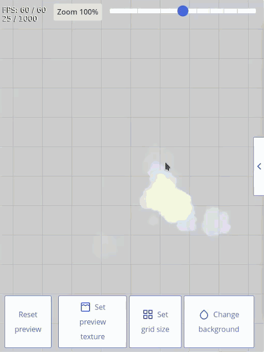
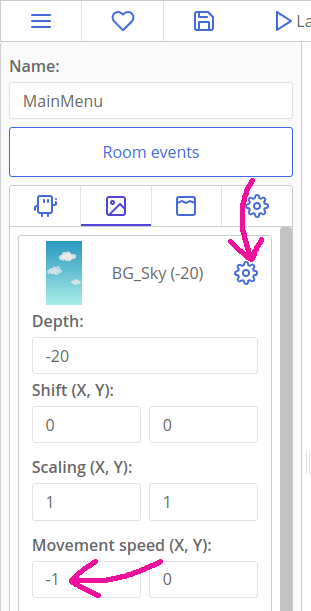

# Migliorare JettyCat

::: tip Ehi,
Questo tutorial presuppone che tu abbia terminato il tutorial [Making Games: Jetty Cat](tut-making-jettycat.html). Dovresti completare questo prima.
:::

Il gioco è già completo dal punto di vista meccanico, ma ci sono molti modi per migliorarlo esteticamente e dal punto di vista del gameplay! Questa sezione evidenzia anche alcune nuove funzionalità della v1.3.

[[toc]]

## Transizione tra le stanze

Ct.js ha un modulo chiamato `ct.transition`. Ti permette di creare facilmente delle belle transizioni tra i livelli. L'idea è che inizi la prima metà di una transizione alla pressione di un pulsante o a qualche altro evento, quindi passi a un'altra stanza e chiami la seconda metà di una transizione nel relativo codice "On Create".

Abilita il modulo `transition` nella scheda "Catmods". Noterai che il modulo dipende dal catmod `tween`, quindi abilitalo.

Ora, modifica il codice dell'evento pointer "Click" del template `Button_Play` in modo che mostri una transizione cerchiata in blu quando lo si clicca:

```js
if (!this.pressed) {
    this.pressed = true;
    // Effetto grafico: un cerchio blu che si ingrandisce in 1 secondo
    ct.transition.circleOut(1000, 0x446ADB)
    .then(() => {
        ct.rooms.switch('InGame');
    });
}
```

`this.pressed` è la nostra variabile personalizzata che ricorda che è stato premuto un pulsante. Ci aiuterà a prevenire i clic multipli occasionali, che potrebbero avere effetti negativi sulla logica del gioco.

Il primo argomento `ct.transition.circleOut(1000, 0x446ADB)`è la durata dell'effetto (1000 millisecondi = 1 secondo) e il secondo è il colore della transizione. È come il colore esadecimale, ma con `0x`invece che `#`all'inizio.

::: tip
Ci sono molti più metodi ed esempi nelle schede "Info" e "Reference" del modulo.
:::

La transizione stessa è un'azione asincrona! Usiamo `.then(() => {…})`per passare alla stanza successiva proprio quando la transizione finisce.

Quella era la prima parte della transizione. La seconda andrà inserita nel codice "Room start" di `InGame`. Aprila e metti questa riga:

```js
ct.transition.circleIn(500, 0x446ADB);
```

Possiamo anche far comparire i nostri livelli dell'interfaccia utente (il menu di pausa e la schermata del punteggio) rendendoli da trasparenti ad opachi. Lì useremo `ct.tween` - quel catmod richiesto da `ct.transition`.

La maggior parte delle entità in ct.js ha gli stessi parametri che ti consentono di modificarne l'aspetto grafico. Abbiamo usato `this.scale.x` e `this.scale.y` per impostare la scala di una copia, ma possiamo anche applicarla a stanze, etichette di testo, effetti speciali e così via. Oltre al ridimensionamento , ci sono parametri come `this.angle`, `this.alpha`e `this.tint` per ruotare un oggetto, impostare l'opacità e il colore.

Cambieremo la proprietà `this.alpha` nel tempo. È un numero compreso tra 0 e 1. Quando è impostato su 1 - il suo valore iniziale -, una copia o una stanza risulterà completamente opaca. Quando è impostato su 0, sarà invisibile. Qualsiasi numero in mezzo renderà un oggetto parzialmente trasparente. Il modulo `ct.tween` aiuterà a creare una transizione graduale a tutto ciò.

Quindi, per sfumare in un livello dell'interfaccia utente, dobbiamo inserire questo codice nell'evento "Room start" dei livelli `UI_OhNo` e `UI_Paused`:

```js
this.alpha = 0;

ct.tween.add({
    obj: this,
    // Transizione da trasparente ad opaco in 500 millisecondi (mezzo secondo)
    fields: {
        alpha: 1
    },
    duration: 500,
    useUiDelta: true
});
```

In primo luogo, rendiamo una stanza completamente trasparente impostandola `alpha`su 0. Quindi, chiamiamo `ct.tween.add` per avviare una transizione graduale. `obj`punta a un oggetto che dovrebbe essere animato ed `fields` elenca tutte le proprietà e i valori che vogliamo modificare. La chiave `duration` imposta la durata dell'effetto, in millisecondi. Infine, la chiave `useUiDelta` indica che l'animazione dovrebbe essere eseguita nella scala temporale dell'interfaccia utente, ignorando il nostro stato di gioco "in pausa" (`ct.delta` è stato annullato).

Possiamo anche sfumare un livello dell'interfaccia utente. Nascondiamo gradualmente il menu di pausa quando il giocatore preme il pulsante "continue". Apri il template `Button_Continue`e modifica il codice dell'evento "Click":

```js
if (!this.pressed) {
    this.pressed = true;
    ct.tween.add({
        obj: this.getRoom(),
        // Transizione da opaco a trasparente in 500 millisecondi (mezzo secondo)
        fields: {
            alpha: 0
        },
        duration: 1000,
        useUiDelta: true
    })
    .then(() => {
        // Imposta nuovamente ct.delta ad 1 e il gioco riprende
        ct.pixiApp.ticker.speed = 1;
        ct.rooms.remove(this.getRoom());
    });
}
```

Creiamo un flag `this.pressed` per assicurarci che il codice che esegue l'animazione venga avviato solo una volta. Eseguirlo più volte non sarebbe un problema, ma mantiene pulito il registro del debugger poiché `ct.tween` avviserebbe riguardo a tutte le animazioni interrotte.

Quindi avviamo l'animazione per `this.getRoom()`, che restituirà la stanza `UI_Paused` che contiene questo pulsante e riporterà il suo valore alfa su 0. Dopodiché, possiamo vedere che `ct.tween.add` crea un evento asincrono che rimuove questa room e riattiva il gioco all'interno della clausola `.then(() => {…});`.

## Riprendere lentamente il gioco dopo che è stato messo in pausa

Sebbene il menu "paused" svanisca lentamente, è comunque difficile per un giocatore intervenire prontamente ed impedire al gatto di sbattere contro il suolo. Per evitarlo, possiamo usare `ct.tween` per... animare il tempo! `ct.pixiApp.ticker.speed = 1;` può essere non solo 0 e 1, ma anche qualsiasi valore nel mezzo, e anche oltre 1. Valori grandi renderanno il gioco più veloce, mentre valori vicini a 0 rallenteranno il gioco. Pertanto, possiamo animare il valore `ct.pixiApp.ticker.speed` per effettuare la transizione del gioco dallo stato in pausa allo stato di esecuzione completa.

Apri il template `Button_Continue` nuovamente e modifica il codice in modo che attivi un altro `ct.tween.add` dopo aver terminato il primo:

```js {13,14,15,16,17,18,19,20}
if (!this.pressed) {
    this.pressed = true;
    ct.tween.add({
        obj: this.getRoom(),
        // Transizione da opaco a trasparente in 500 millisecondi (mezzo secondo)
        fields: {
            alpha: 0
        },
        duration: 1000,
        useUiDelta: true
    })
    .then(() => {
        ct.tween.add({
            // ct.delta viene aumentato fino ad 1 in modo graduale
            obj: ct.pixiApp.ticker,
            fields: {
                speed: 1
            },
            duration: 1000,
            useUiDelta: true
        });
        ct.rooms.remove(this.getRoom());
    });
}
```

Ora i giocatori possono riprendere il gioco e salvare il loro gatto dalla caduta.

## Fumo dal jet del gatto e particelle di stelle

Dalla v1.3, ct.js ti consente di progettare visivamente effetti particellari e riprodurli nel tuo gioco. Ed è bello! Creiamo due effetti: uno sarà un getto di fumo per il gatto. L'altro mostrerà un'esplosione di stelle più piccole quando ne raccogli una.

### Fare uno starburst

Apri la scheda "FX" in alto e crea un nuovo emettitore di particelle. Chiamalo `StarBurst`.

Seleziona la sua texture nell'angolo in alto a sinistra e inizia a modificare i valori! Ci sono molte categorie che manipolano il modo in cui le particelle si muovono, cambiano nel tempo e si generano.

Prova a farlo sembrare così:


::: tip
Puoi impostare una texture di anteprima nell'angolo in basso a destra per vedere come appare il tuo effetto rispetto a un bonus stella.
:::

Ecco alcune indicazioni su come ottenere questo effetto:

- Per fare lo scoppio e non un flusso infinito, apri la sezione "Spawning" e imposta la durata dell'emettitore. Questo è un effetto veloce, quindi avrai bisogno di piccoli valori come 0,1 secondi.
- La sezione "Gravità" farà cadere le stelle dopo che sono esplose. Avrai bisogno della verticale, dell'asse Y e di valori piuttosto grandi: ho usato ~1400 per il mio effetto.
- Quando la gravità è abilitata, solo il primo punto di velocità influenzerà il movimento delle particelle.
- Per rendere l'effetto irregolare e meno artificiale, assicurati che le particelle abbiano una durata diversa nella categoria "Spawning" (comparsa), in modo che diventino più casuali. Anche la modifica della velocità e delle dimensioni minime aiuta.
- Un'area circolare relativamente ampia che copre la maggior parte della texture di anteprima renderà l'effetto più simile a una grande stella che si scompone in pezzi più piccoli. Puoi impostare la forma dello spawn e le sue dimensioni nella categoria "Shape and Positioning" (forma e posizione). Seleziona la casella "Show shape visualizer" (mostra la forma) per vedere la forma.

Quando sei pronto, premi il pulsante "Applica" nella parte inferiore della colonna di sinistra.

Per creare un'esplosione di stelle quando ne viene raccolta una grande, apri il template `Star`, aggiungi l'evento "Destruction" e scrivi una riga `ct.emitters.fire('StarBurst', this.x, this.y);`. Ta-da!

::: tip
Qui leggiamo la posizione della stella ( `this.x, this.y`) e diciamo di generare un effetto `StarBurst`.
:::

### Creare un getto di fumo

Per prima cosa avremo bisogno di una texture che assomigli a fumo. Vai nella scheda delle texture e fai clic sul pulsante Galleria nella parte superiore. Questo game engine include pacchetti di texture che puoi importare direttamente nel tuo gioco! Entra nel Jumperpack e importa la texture Smoke. Ora chiudi la galleria e vedrai che la texture del fumo fa parte del tuo progetto!


Apri la scheda "FX" in alto e crea un nuovo emettitore di particelle. Chiamalo `Jet`.

Per iniziare, premi il pulsante `Select` nella sezione "Texture" e carica la texture chiamata `Smoke`. Nell'angolo in basso a destra, trova il pulsante "Imposta texture di anteprima" e seleziona il nostro gatto. Dopodiché, sentiti libero di armeggiare con l'editor per ottenere l'effetto che desideri. Io ho realizzato un getto di bolle bianche di diverse dimensioni:



Ecco alcuni suggerimenti:

- Cambia il colore di sfondo nell'angolo in basso a destra della finestra per vedere meglio le bolle bianche;
- Inizia modificando, nella scheda "Direction » Starting", i valori "Starting direction" in modo che le particelle scorrano verso il basso. Un buon intervallo è compreso tra 90 e 110 gradi.
- La dimensione della texture predefinita sarà troppo grande; modifica la sua scala nel grafico sotto la sezione "Scaling", usa valori intorno a `0.3`.
- Modifica il valore "Scaling » Minimum size" per generare particelle di dimensioni diverse.
- Posiziona con precisione l'emettitore in modo che si generi direttamente dal getto modificando la posizione dell'emettitore, nella sezione chiamata "Shape and Positioning".
- Modificare il valore "Spawning » Time between bursts" per modificare la densità del fumo. Valori più piccoli generano quantità maggiori di particelle.

Per aggiungere l'effetto al gatto, apri il suo modello e metti questo codice alla fine del suo codice "On Create":

```js
this.jet = ct.emitters.follow(this, 'Jet');
```

`ct.emitters.follow` dice di creare un effetto particella che segua una copia. Sembrerà attaccato al gatto. Il primo argomento è la copia a cui vogliamo allegare l'effetto ( `this` è il nostro gatto), il secondo il nome dell'effetto ( `'Jet'`).

Salviamo anche un riferimento a questo emettitore in un parametro `this.jet`. Questo ci permetterà di manipolare l'emettitore in un secondo momento.

::: tip
Leggi [i documenti su`ct.emitters`](https://docs.ctjs.rocks/ct.emitters.html) saperne di più su altri metodi per creare effetti e le loro opzioni.
:::

Il gatto ora dovrebbe avere un getto di fumo che fuoriesce dal suo jetpack. Potrebbe essere regolare meglio la dimensione delle particelle del jet e la sua velocità nella scheda "FX".

Aggiungiamo un po' di dinamica a questo jet: genereremo nuove particelle solo quando il gatto prende quota. Abbiamo il riferimento `this.jet`e possiamo usarlo per mettere in pausa l'emettitore e riattivarlo quando il giocatore preme o rilascia lo schermo.

Crea un nuovo evento di tipo "Action release", seleziona l'azione Poof e inserisci questo pezzo di codice al suo interno:

```js
this.jet.pause();
```

Questo metterà in pausa l'effetto. Per riattivarlo, aggiungi questa riga ad nuovo evento di tipo "Action down":

```js
this.jet.resume();
```

E questo è tutto per le particelle; è tempo per fare alcune prove!

## Animazioni dettagliate per il gatto e per le stelle

Le particelle aiutano a ravvivare il gioco, ma può comunque sembrare ancora rigido e statico. Aggiungiamo piccole animazioni al gatto e alle stelle. Faremo ruotare il gatto in base alla sua velocità verticale e la stella in base al tempo.

### Ruotare il gatto

Ogni copia ha un parametro `this.angle`, che imposta l'angolo visivo di una texture in gradi. Ogni copia ha anche `this.speed`e `this.direction` che abbiamo usato, ed entrambi definiscono parametri aggiuntivi `this.vspeed`e `this.hspeed` - le componenti verticale ed orizzontale della velocità. Questi due possono essere valori negativi quando una copia si sposta nella direzione opposta rispetto a come è diretto l'asse. (Ad esempio, l'asse X punta a destra, i suoi valori crescono da sinistra a destra. Spostandosi a destra rende positivo `hspeed`, spostandosi a sinistra rende negativo `hspeed`.)

Possiamo legare `this.vspeed` e `this.angle` di un gatto in modo che ruoti quando cade o vola verso l'alto. Viene fatto semplicemente assegnando un valore a un altro nell'evento "Frame end"'.

Questa istruzione funzionerà:

```js
this.angle = -this.vspeed;
```

Anche se determinerà una rotazione eccessiva. L'aggiunta di un moltiplicatore la migliorerà:

```js
this.angle = -this.vspeed * 0.3;
```

###  Ruotare le stelle

Con le stelle, non possiamo semplicemente legare `this.angle` al valore di altri in ct.js. Possiamo definirne di nostri, però, e applicare un po' di matematica per trasformare i numeri in simpatiche oscillazioni. Tutto questo ti ricorderà i timer di spawn.

Apri il template `Star` e aggiungi questa riga in "Creation":

```js
this.wiggleTime = 0;
```

Quindi, nell'evento "Frame end", aggiungi questa scheda:

```js
this.wiggleTime += ct.delta * 0.2;
this.angle = Math.sin(this.wiggleTime) * 5;
```

Qui cambiamo `this.wiggleTime` ad ogni fotogramma per il tempo trascorso, moltiplicato per 0.2 per rallentare l'animazione. Quindi usiamo `Math.sin` per ottenere un seno di `wiggleTime` - cambiando quest'ultimo ad ogni fotogramma si otterrà un'oscillazione regolare tra -1 e 1. Moltiplicandolo per 5, rendiamo l'effetto cinque volte più evidente.


## Aggiunta di un invito per iniziare a toccare

Usiamo lo stesso approccio per creare un suggerimento visivo per suggerire ad un utente di iniziare a toccare! Sarà un'icona a forma di mano.

Crea un nuovo template chiamato `PressHint` con una texture `PressHint`. Assicurati che la texture abbia il suo asse centrato.

Nel codice "Creation" del template, aggiungi una riga `this.pulsePhase = 0;`. Nel suo codice "Frame start", inserisci questo snippet:

```js
this.pulsePhase += ct.delta * 0.2;

this.scale.x = this.scale.y = 1 + Math.sin(this.pulsePhase) * 0.1;
```

Aggiungi un evento "Action press" selezionando `Poof`e aggiungi questa riga:
```js
this.kill = true;
```


Qui cambiamo di nuovo una proprietà che viene utilizzata nella funzione `Math.sin`. Impostiamo la scala orizzontale e verticale di una copia su questa onda sinusoidale aumentata di  `1` in modo che la copia non venga ridotta ad un punto. (Senza questo `1 +`, l'onda sinusoidale oscillerebbe intorno a 0, il che significa quasi lo 0% delle dimensioni di una copia.)

Quando un utente preme lo schermo, l'evento associato viene eseguito e quindi la copia rimossa e l'utente può ricominciare a pilotare il proprio gatto.

L'ultimo passaggio consiste nell'aggiungere questa copia a `UI_InGame`, da qualche parte al centro della vista.

## Sfondo animato nel menu principale + effetto parallasse

L'effetto di parallasse è usato nella creazione di videogiochi fin dai tempi antichi - una volta che i processori della console sono diventati abbastanza potenti da disegnare gli sfondi. L'effetto è ottenuto spostando diversi livelli di sfondo a velocità diverse per creare un effetto di profondità. Sebbene non otterremo un grande effetto in questo tutorial, impareremo come configurare gli sfondi in ct.js e ravviveremo il nostro menu principale e la vista generale.

Vai nella stanza `MainMenu` e apri la scheda "Backgrounds" nella colonna di sinistra. Quindi, fai clic sull'icona a forma di ingranaggio accanto allo sfondo `BG_Sky`. Dovremo spostare lentamente lo sfondo da sinistra a destra in modo che le nostre nuvole si muovano. Impostare la Velocità di movimento su `-1`, `0`. Questi valori indicano allo sfondo di spostarsi contro l'asse X di un pixel al secondo.



Quindi, vai nella stanza chiamata `InGame`. Apri le stesse impostazioni dello sfondo `BG_Sky`. Imposta i suoi valori di parallasse su 0.25: ciò dirà allo sfondo di muoversi quattro volte più lentamente rispetto al resto della stanza, creando l'effetto di profondità.


Il menu principale ora avrà un cielo animato e il cielo nel livello di gioco principale scivolerà notevolmente più lentamente di qualsiasi altro oggetto nella stanza. Perfetto!

## Questo è tutto!

Il gioco è rifinito e sembra fantastico, evviva! È ora di leggere altri tutorial o di creare un nuovo gioco da zero!

**Happy coding!**
Comigo
