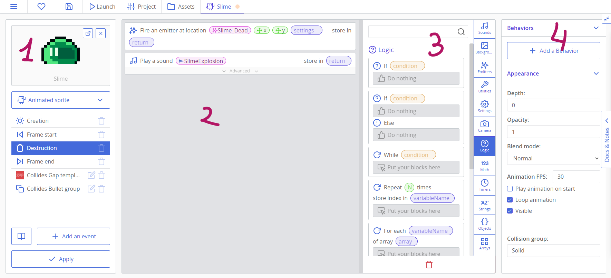
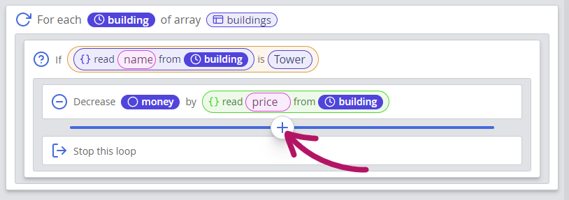
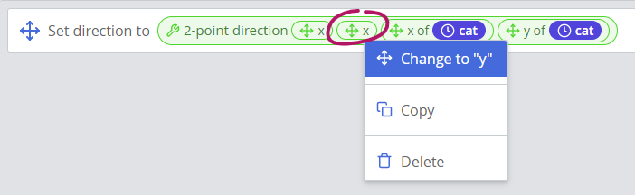

# Introduction to Catnip

Catnip is a visual programming language made specifically for ct.js. It is similar to Google Blocks or Scratch languages, but also has tons of QoL improvements compared to these languages. It compiles directly to JavaScript and thus is as swift and powerful. In this page, we will look into its features and how to write scripts with it.

::: tip
If you haven't done this yet, read about [basic concepts](../ct-concepts.md) to get acquainted with different asset types in ct.js.
:::

## Creating a Catnip project

When you create a project, you can select Catnip as the main programming language. After that, every Template, Room, and Behavior will have Catnip editor instead of a regular code editor.

You can also use Catnip in any Script asset, because they have a language setting inside of them.

## Writing Catnip scripts

When you open a scriptable asset (a Template, a Behavior, or if you go to a Room's events panel), you will see three to four columns:

1. A column with **main asset settings**, like a Template's texture, and a list of events in this asset;
2. The main **coding area** where you put your blocks;
3. The **block library** with all the blocks you can put;
4. In templates, there is a fourth column with **template properties**. If you need more space, you can collapse it with a small button in the top-right corner.

Firstly, you will need to create an event at the bottom of the first column. An event is what runs your scripts, and you can create different events for your templates to react to.

You can place blocks in a couple of ways:

1. You can drag blocks from the block library into the coding area.
2. You can also _hover your mouse in-between blocks_ or at the top of a script; a line with a "plus" button will appear with which you can open a search field. You can put the first block with Enter button or cycle through them with a Tab key. Putting any block with this search will automatically open a new search window, allowing you to quickly input series of blocks with your keyboard.

A similar search is placed at the top of the block library, though you will be able to put blocks with drag-and-drop only. (Because how otherwise to know where to put these blocks?) Both searches will output blocks both if you write blocks' names in English or in the UI language you use in Catnip.

## Types of blocks

Every block in Catnip is either a **computed block** or a **command**. Commands have a rectangular shape and are usually used for doing something. Computed blocks retrieve values or calculate things that you can use in command blocks, or compose complex formulas made of several computed blocks. Both block types can have **arguments**, which are slots you can fill with computed blocks or manually write a value in.

| A command with one argument | A computed block |
|-|-|
| <catnip-block class=" command void   selected">  Switch to             MainMenu     </catnip-block> | <catnip-block class=" computed wildcard wildcard  ">  current room     </catnip-block> |

Computed blocks differ by color, and color means the type of the value this block returns:

- Yellow blocks are for Boolean values — values that can be either `true` or `false`. These values are usually used in logical statements, and sometimes as toggles for certain options.
- Green blocks store numerical values — these can be whole numbers or numbers with floating point, it doesn't matter.
- Pink blocks store strings — text values.
- Cyan blocks store color values.
- Purple blocks are called **wildcards** — they can store values of any type, and can also fit in any computed slot regardless of its type. They are usually used to link to other copies, to store complex structures and to store data you define.

| Boolean | Number | String | Color | Wildcard |
| - | - | - | - | - |
| <catnip-block class=" computed boolean wildcard  ">  not         <catnip-block class=" computed boolean boolean constant ">  true     </catnip-block>      </catnip-block> | <catnip-block class=" computed number wildcard  ">  speed     </catnip-block> | <catnip-block class=" computed string wildcard  ">            <input type="text" class="catnip-block-aConstantInput string " style=" width: 5.5ch;    " value="pizza" readonly="readonly">     </catnip-block> | <catnip-block class=" computed color wildcard  ">  color          <input type="text" class="catnip-block-aConstantInput color " style=" width: 7.5ch; background-color: #4FBEE7; border-color: #4FBEE7; color: black; " value="#4FBEE7" readonly="readonly">     </catnip-block> | <catnip-block class=" computed wildcard wildcard  ">  current room     </catnip-block> |

Except for wildcards, you can put a computed block only in slots of its type.

To help with type conversions (for example, when you need to format a string with a dynamic price variable), catnip has several special computed blocks:

- <catnip-block class=" computed string wildcard  ">  to string          <input type="text" class="catnip-block-aConstantInput wildcard invalid" style=" width: 3.5ch;    " readonly="readonly">     </catnip-block>
- <catnip-block class=" computed number wildcard  ">  to number          <input type="text" class="catnip-block-aConstantInput wildcard invalid" style=" width: 3.5ch;    " readonly="readonly">     </catnip-block>
- <catnip-block class=" computed boolean wildcard  ">  to boolean          <input type="text" class="catnip-block-aConstantInput wildcard invalid" style=" width: 3.5ch;    " readonly="readonly">     </catnip-block>

### Example: Change text to a string that contains a number

<catnip-block class=" command    selected">  Set text         <catnip-block class=" computed string string  ">            <input type="text" class="catnip-block-aConstantInput string " style=" width: 9.5ch;    " value="Buy for $" readonly="readonly"> +                  <catnip-block class=" computed string string  ">  to string         <catnip-block class=" computed number wildcard  ">           <catnip-block class=" computed wildcard number userdefined ">   price              </catnip-block>  ×                  <catnip-block class=" computed wildcard number userdefined ">   discountMod              </catnip-block>      </catnip-block>      </catnip-block>      </catnip-block>      </catnip-block>

## Properties and variables

Catnip has tons of blocks to manipulate appearance, position, and movement of your copies, but most of the time you will need to create additional values to drive your gameplay logic. These values are called **properties** and **variables**, and they can be though of as named shelves with data. Both properties and variables are computed blocks you can use everywhere in Catnip.

Depending on where and in which event you write code, you can use several types of variables and properties:

- Regular **properties** (for example, <catnip-block class=" computed wildcard number userdefined ">   price</catnip-block>). You can create these in the top of the block library, in the Properties category. These properties are saved directly in a copy (or a room instance, if you define it in a room event), and are not shared. Such variables are useful for tracking unit's hit points.
- Regular **variables** (for example, <catnip-block class=" computed wildcard wildcard userdefined ">   target</catnip-block>). Contrary to properties that exist while a copy or a room storing it exists, variables exist only during the event you edit. Every time your event starts again, variables' values will reset to nothing. (To `undefined`, if to be specific.) This makes variables unusable in a long run, but good for storing computation results or stuff you don't want to accidentally use later, like using a reference to a now destroyed copy.
- **Global variables** (for example, <catnip-block class=" computed wildcard wildcard userdefined ">   money</catnip-block>). These are the variables stored in a game itself while it runs. A global variable stores one value that can be read and written from everywhere, and its value will remain until a game is closed. (If you do want to preserve a variable between runs, you will need "Save/Load from storage" blocks.)
- **Event variables** (like <catnip-block class=" computed wildcard wildcard userdefined ">   other</catnip-block>) can be provided by some events to provide you with additional specifics of when the event was run.
- **Behavior properties** (for example, <catnip-block class=" computed wildcard wildcard userdefined ">   power</catnip-block>) are inherited from behaviors you link in your templates and rooms, and work in the same way as like regular properties.

## Useful Catnip features for script writing

### Right-side return values
Some of the command blocks do return a value, similarly to computed values. The returned values can be stored in a variable or a property and used later — but usually these slots are optional. For example, you can save the instance of music played in a global variable and stop it later:

<catnip-block class=" command    selected">  Play a sound             InGameTheme   

        store in                  <catnip-block class=" computed wildcard wildcard userdefined ">   music              </catnip-block>         
 
 Advanced  
    
       </catnip-block>
<catnip-block class=" command   note selected">  Note      <textarea value="Later — when a level ends or when a pause menu is opened" style="height: 21px;" readonly="readonly"></textarea>         </catnip-block>
<catnip-block class=" command void   selected">  Stop sound         <catnip-block class=" computed wildcard wildcard userdefined ">   music              </catnip-block>      </catnip-block>

### Mutators

Right-clicking some blocks will display an expanded context menu with commands to replace the clicked block with a similar one. Values that are present in both blocks will be preserved. For example, try right-clicking a math, logical block, or blocks with x/y or width/height values.

::: center

*Fixing a mistake by changing a block by right-clicking*
:::

## What's next?

Learn how to use If-Else and other logic blocks to run scripts conditionally and to automate repetitive actions [in the next chapter](./conditions-and-loops.md).