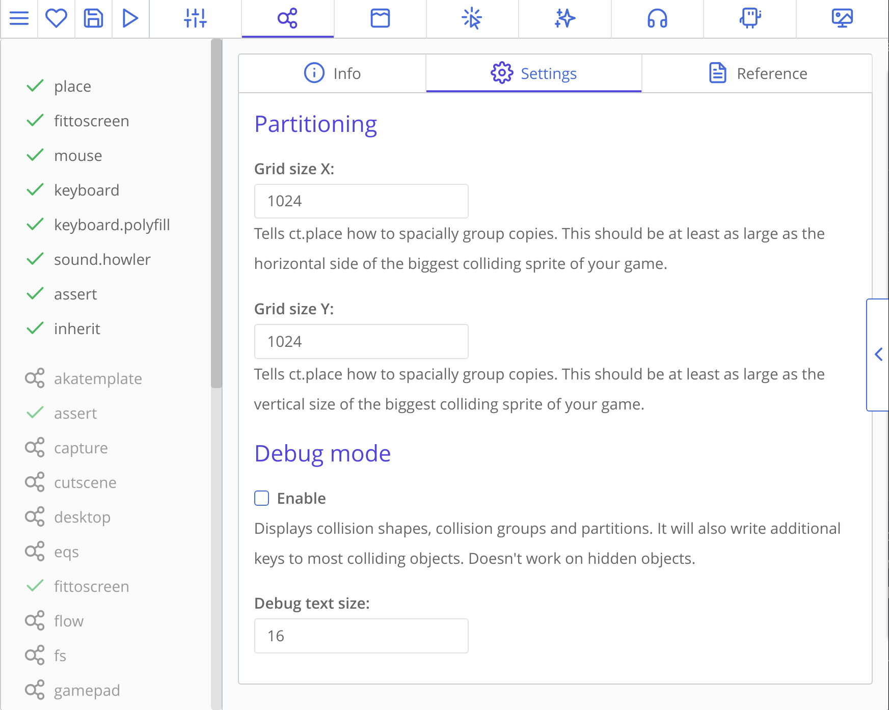
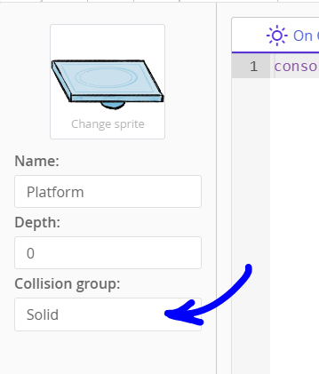

# Adding settings to your catmod and new fields for assets

Adding new fields allows users configure your mods from inside ct.IDE, on a 'Settings' tab of your mod. You can have any number of fields and use them inside your main code or injections. Additionally, any extension fields defined for templates and other assets will be available during the game in events and injections. This adds flexibility both for you and your users.

## Adding settings

Currently, settings are displayed at each mod's panel, in the "Settings" tab. It may look like this:



Settings are defined in `module.json` file, under the `fields` key, and are an array of objects, each object being one field or grahical element.

Here is how the screen above was implemented:

```json Example from default ct.place module
{
    "main": {
        "name": "ct.place",
        "version": "3.1.0",
        "authors": [{
            "name": "Cosmo Myzrail Gorynych",
            "mail": "admin@nersta.ru"
        }]
    },
    "fields": [{
        "name": "Partitioning",
        "type": "h2"
    }, {
        "name": "Grid size X",
        "help": "Tells ct.place how to spacially group copies. This should be at least as large as the horizontal side of the biggest colliding sprite of your game.",
        "key": "gridX",
        "default": 512,
        "type": "number"
    }, {
        "name": "Grid size Y",
        "help": "Tells ct.place how to spacially group copies. This should be at least as large as the vertical size of the biggest colliding sprite of your game.",
        "key": "gridY",
        "default": 512,
        "type": "number"
    }, {
        "name": "Debug mode",
        "type": "h2"
    }, {
        "name": "Enable",
        "help": "Displays collision shapes, collision groups and partitions. It will also write additional keys to most colliding objects. Doesn't work on hidden objects.",
        "key": "debugMode",
        "default": false,
        "type": "checkbox"
    }, {
        "name": "Debug text size",
        "key": "debugText",
        "default": 16,
        "type": "number"
    }]
    /* ... */
}
```

There are actually more input types; all of them, as well as description of other keys, can be found in [Fields declarations](./fields-declaration.html) page.

Settings' values are used for templating in your index.js and injections. Injections allow you to place your code in particular ct.js events. More about them and templating [here](./events-and-injections.html).

## Adding extensions to built-in assets

You can define additional fields that will be available in asset editors. Currently, you can define these fields for templates, rooms, copies, and tile layers. Here is where such fields are placed at the template editor:



And that's how you define them inside the `module.json`:

```json
{
    "main": {
        /*...*/
    },
    "typeExtends": [{
        "name": "Field name in the UI",
        "type": "text",
        "key": "varName"
    }]
}
```

We currently have two keys where you can define new fields:

* `templateExtends`, for templates (applied directly to copies);
* `tileLayerExtends` for tile layers (written to `layer.extends` field);
* `copyExtends` for individual copies (applied directly to copies); <badge>new in v1.4.2</badge>
* `roomExtends` for your levels (applied directly to rooms).

Since v1.4, extensions support all the fields that are supported by injections. See [Fields declarations](modding/fields-declaration.html) page for more info.

With `templateExtends`, defined fields will be available in `this.extends` object to avoid overriding built in fields (and there are lots of them). For example, if you have a field with a key `tag`, then you will be able to read its value at `this.extends.tag`. Most of the time, you will need [injections](modding/events-and-injections.html) to make use of these fields, though not necessarily.

With `tileLayerExtends`, parameters are applied directly to a tile layer. You can get a list of all the tile layers with `ct.templates.list['TILELAYER']`.
