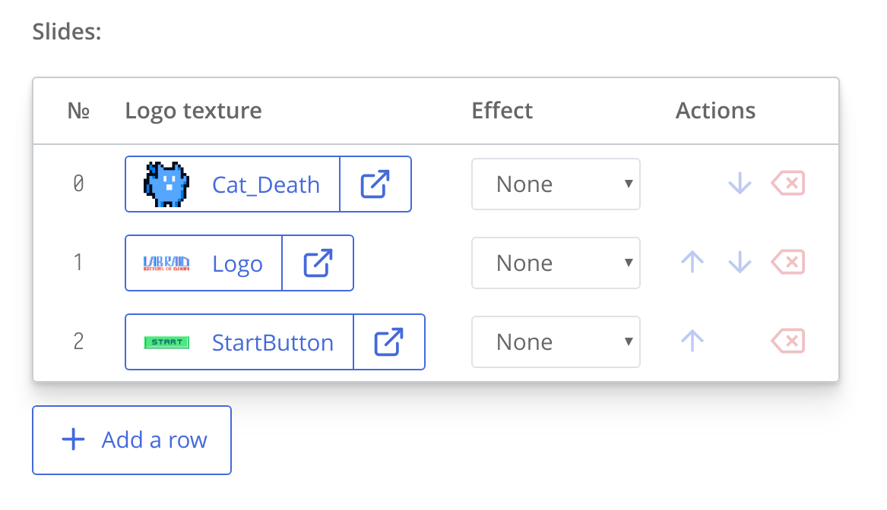

# Fields reference for module settings and additional fields

Both [module settings](modding-settings-and-extensions.html) and extensions for built-in templates are implemented by writing a declaration of editable fields in `module.json`. A declaration is an array of objects, with each object being one editable field. Let's take a look at `ct.place` module and its `module.json` (look at the `fields` array):

```json
{
    "main": {
        "name": "ct.place",
        "version": "3.1.0",
        "authors": [{
            "name": "Cosmo Myzrail Gorynych",
            "mail": "admin@nersta.ru"
        }]
    },
    "fields": [{
        "name": "Partitioning",
        "type": "h2"
    }, {
        "name": "Grid size X",
        "help": "Tells ct.place how to spacially group copies. This should be at least as large as the horizontal side of the biggest colliding sprite of your game.",
        "key": "gridX",
        "default": 512,
        "type": "number"
    }, {
        "name": "Grid size Y",
        "help": "Tells ct.place how to spacially group copies. This should be at least as large as the vertical size of the biggest colliding sprite of your game.",
        "key": "gridY",
        "default": 512,
        "type": "number"
    }, {
        "name": "Debug mode",
        "type": "h2"
    }, {
        "name": "Enable",
        "help": "Displays collision shapes, collision groups and partitions. It will also write additional keys to most colliding objects. Doesn't work on hidden objects.",
        "key": "debugMode",
        "default": false,
        "type": "checkbox"
    }, {
        "name": "Debug text size",
        "key": "debugText",
        "default": 16,
        "type": "number"
    }]
    /* ... */
}
```

So a field is an object with this interface:

```ts
declare interface IExtensionField {
    name: string, // The displayed name.
    type: string, // The type of a field
    key?: string, // The name of a JSON key to write into the `opts.entity`. Not needed for hN types, but required otherwise
    default?: any, // The default value; it is not written to the `opts.entity`, but is shown in inputs.
    help?: string, // A text label describing the purpose of a field
    options?: Array<{ // Used with type === 'radio' and type === 'select'.
        value: any,
        name: string,
        help?: string
    }>,
    if?: string, // Tells to show this field only if another field in this module is set (or true-ish)
    fields?: Array<IExtensionField>, // These are for type === 'table'
    arrayType?: string, // The type of the fields used for the array editor (when `type` is 'array').
                        // It supports a subset of moddable fields,
                        // excluding headers, groups, tables, icons, radio, select, and arrays.
    // These three are used with type === 'number', 'slider', or 'sliderAndNumber'
    min?: number,
    max?: number,
    step?: number
    // These are used with type === 'group'
    openedByDefault: boolean,
    lsKey: string,
    items: Array<IExtensionField>
}
```

Here we mark optional fields in form of `key?: type`. The required fields are `name` and `type`. The former is a text label that is shown before an input field; the latter is a string that defines input method displayed for a user. It can be one of these strings:

* `input` — a simple text input for short strings;
* `textfield` — a large textarea for a long input;
* `code` — similar to `textfield`, but with monospace font and usually wider than `textfield`;
* `number` — an input field for integers;
* `slider` — a slider (aka range) input for inputs that are better inputed with mouse;
* `sliderAndNumber` — displays both a slider and a number in one row;
* `checkbox` — a checkbox for Boolean variables;
* `radio` — a list of predefined values to choose from. This type also requires an `options` array to be set;
* `select` — a dropdown with a list of predefined values. Requires an `options` array to be set. If any option has value equal to `''` (to an empty string), then this option will be blank and won't be selectable, acting as a divider;
* `texture`, `template`, `room`, `sound`, `tandem` — a link to an asset in a project;
* `point2D` — displays a pair of number inputs with X and Y labels. Stores values as an array of two numbers;
* `h1`, `h2`, `h3` and `h4`. These are not really for any input, but display a heading to categorize fields in catmod's settings tab. Such fields require `type` and `name` only;
* `array` — editable series of simple values. Requires `arrayType` to be set;
* `table` — editable series of complex objects in a table form. Requires `fields` to be set.

For settings, field's `key` must be unique for a module. For extended fields of templates and other assets, it should be unique all across a user's codebase, so naming a key in form of `mymodMyfieldname` is a good idea.

## Additional tweaks for number and range inputs

`number`, `slider`, `sliderAndNumber` input types accept additional fields for setting restrictions on input:

* `min` — the minimum allowed value;
* `max` — the maximum allowed value;
* `step` — the step size for the slider and number input. Users still can input arbitrary values in number inputs.

## Adding radio inputs

You can present a number of choices for your user in a group, and allow them to pick one in it. This can be done with `radio` input type, and it requires an `options` array that describes possible values and their labels:

```json
{
    "main": {
        ...
    },
    "fields": [{
        "name": "List name",
        "type": "radio",
        "key": "variable",
        "id": "variable",
        "default": "value1",
        "options": [{
            "value": "value1",
            "name": "First value",
            "help": "A little hint that will go right after the first variant"
        }, {
            "value": "value2",
            "name": "Second value",
            "help": "A little hint that will go right after the second variant"
        }, {
            ...
        }]
    }]
}
```

## Tables

Tables allow users to describe an array of entities of a specific structure. Users can add/remove rows, and reorder them. Nested tables are supported, though they look terrible.



A table field is defined by setting field's type to `table`. Its fields are described in an array `fields`, in the same way as you define fields for the whole module.

### Example: Early settings of ct.splashscreen catmod

```json{22,24-45}
{
    "main": {
        /* … */
    },
    /* Two regular fields come first */
    "fields": [{
        "name": "Slide duration, ms",
        "key": "slideDuration",
        "default": 3000,
        "type": "number",
        "min": 0
    }, {
        "name": "Transition duration, ms",
        "key": "transitionDuration",
        "default": 1000,
        "type": "number",
        "min": 0
    }, {
        "name": "Slides",
        "key": "slides",
        /* A field with "type": "table" defines a table control */
        "type": "table",
        "default": [],
        /* Table's fields are described here */
        "fields": [{
            "name": "Logo texture",
            "key": "texture@@texture",
            "default": -1,
            "type": "texture"
        }, {
            "name": "Effect",
            "key": "effect",
            "type": "select",
            "default": "none",
            "options": [{
                "value": "none",
                "name": "None"
            }, {
                "value": "zoomIn",
                "name": "Zoom in"
            }, {
                "value": "zoomOut",
                "name": "Zoom out"
            }]
        }]
    }]
}
```

### Default values for tables

For tables themselves, the `default` key must be an array of default elements in it. Each element is an object with `"key": "value"` entries You can put an empty array `[]` if you don't need to define default elements.

For tables' fields, the `default` key sets the default values for newly added rows.

## Unwrapping UIDs of templates and textures

When you define a field with type `texture` or `template` and a user selects an asset for this field, a UID of a resource is stored. To tell ct.js to turn this UID into a name of a particular asset, you should add a postfix `@@assetType` at the end, writing the correct asset type:

* `yourVarName@@template` for templates;
* `yourVarName@@texture` for textures.

The exported value will then be the name of an asset, as it is displayed in IDE and is usually used in code.

This works both for injections and extensions for assets. For injections, if you have a `key` in form of `yourVarName@@assetType`, matches with `/*%yourVarName%*/` or `%yourVarName%` will be replaced.

## Field groups

You can create a collapsable group of fields by setting `type` parameter of a field to `group`. This helps saving space at type and room editors or simlpy hiding less-used fields.

The `group` type requires three additional properties to be set:

* `openedByDefault` — whether or not the panel should be opened by default.
* `lsKey` — a key in local storage to store whether a user left this group opened or not. It should be unique, and it is recommended to contain your module's name to avoid collisions with other modules.
* `items` — the array of fields inside a group. These are the same fields you would define outside of one.

### Example: creating one regular field and a group of fields for ct.js templates

```json
// ...
"templateExtends": [
    {
        "name": "Create a hoverboard",
        "type": "checkbox",
        "key": "createHoverboard",
        "default": false
    }, {
        "name": "Hoverboard properties",
        "type": "group",
        "openedByDefault": false,
        "lsKey": "hoverboards.advancedProperties",
        "items": [{
            "name": "Speed, mps",
            "type": "number",
            "key": "hoverboardSpeed",
            "default": 100
        }, {
            // Another field can be defined here
        }, {
            // And any quantity of others
        }]
    }
]
// ...
```