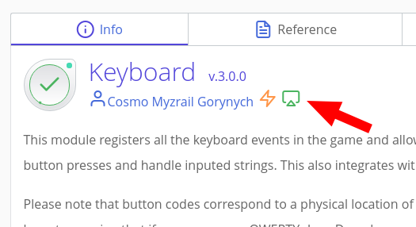

# Ações

Ações são uma camada de abstração sobre vários métodos de entrada que permite que você escreva um único código para vários dispositivos, seja ele um teclado, mouse, gamepad, controle virtual ou qualquer outra coisa que possa ser conectado ao ct.js. A vantagem é que uma ação não reage apenas a vários dispositivos de uma vez, mas, por exemplo, a vários botões de um dispositivo também. Por exemplo, você pode simultaneamente reagir as teclas WASD e as setas direcionais do teclado, e o código será como se você estivesse ouvindo por uma única coisa (e menos ainda). Se o controle de gamepad é adicionado lá, então uma grande quantidade do seu código não mudará.

Para a ação funcionar, você precisa conectar um módulo particular: provedores de métodos de entrada. As próprias ações são descritas "Actions and input methods", localizado painel esquerdo da aba "Project". Ct.js vem com um número de provedores de entrada padrão: `ct.pointer` que reage aos eventos de mouse e de touch, `ct.keyboard` para o pressionamento de teclas e `ct.gamepad` para joystick.

Todos esses módulos podem ser encontrados e habilitados na aba catmods nas configurações do projeto, na categoria "Input methods":

<!--  -->

## Criando novas ações

Para cria uma nova ação, vá para a aba "Project", e click na guia à esquerda "Actions and input methods". Um painel aparecerá no qual as ações são definidas na coluna esquerda, e os métodos de entradas na coluna direita.

Click no botão "Add Action". Por exemplo, nós descreveremos o padrão e, talvez, o mais importante recurso em qualquer jogo ­– "Movimento". Se você tem um jogo de plataforma, então você precisa apenas de movimento horizontal. Caso contrário, você pode precisar de movimento vertical também. Defina essas ações, `MoveX` e `MoveY` para os movimentos horizontais e verticais, respectivamente.

Adicione o primeiro método de entrada como movimento horizontal com um botão correspondente. No formulário exibido, localize o botão `A` (Você pode inseri-lo através da barra de pesquisa), e então click em "Select". Faça a mesma coisa para os botões `D`, `ArrowLeft` e `ArrowRight`. Devendo ficar assim:

Espera aí, `A` e `D` aponta para direções diferentes! Como fazer o código entender para qual direção o personagem deve ir? O fato é que no código, ações têm valores de -1 até 1, e ao usar um valor negativo, podemos determinar que devemos ir, digamos, para a esquerda, e usar um valor positivo - ir para a direita. Isso é feito utilizando a coluna **multipliers**. Se você especificar o multiplicador -1 para o botão `A`, então quando você pressioná-lo, a ação retornará o valor -1, e se `D` for deixado como 1, então quando você pressionar `D`, ele será 1.

Em ct.js, o valor `X` cresce da esquerda para a direita, e o `Y` cresce de cima para baixo. Se você não rotacionar a câmera e se você tem um teclado QWERTY, então `A` levará para a esquerda — contra o movimento da coordenada `X` —, e `D` apontará para a direita junto com o movimento da coordenada `X`. Então, assinaremos o multiplicador -1 para `A` e para a seta esquerda de navegação.

Depois adicione mais uma ação, `MoveY`, defina -1 para os botões `ArrowUp` e `W`.

Se a gente fosse definir uma ação elementar (por exemplo, um pulo), então não precisaríamos de multiplicadores. Se estivéssemos usando um gamepad, então um multiplicador poderia ser necessário no caso do personagem está se movendo na direção errada.

## Exemplos

**Uma configuração inicial típica para um jogo de plataforma**

**Uma típica configuração inicial para um jogo top-down shooter**

