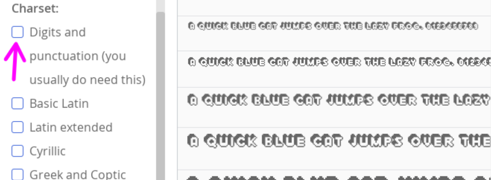
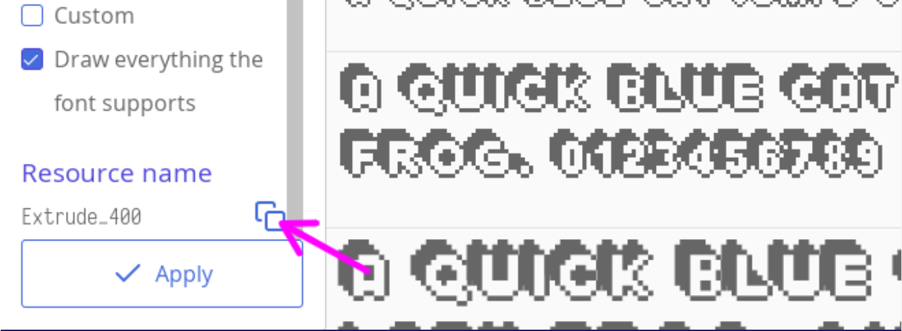

# Usando fontes bitmap

Existe dois tipos de rótulos de texto em ct.js: fontes bitmap e as baseada em tela. A primeira é boa para texto dinâmico e para mover e alterar o mesmo, já a segunda é melhor para grandes quantidades de texto estático. Escolher o tipo certo torna o seu jogo mais otimizado. Note que ambos os rótulos de textos podem ser transformados sem qualquer impacto na performance,isto é, mover, rotacionar, colorir com a propriedade `this.tint`.

Além disso, fontes bitmap são muito melhores para jogos em pixel art, porque os navegadores tende a borrar os rótulos bitmap, arruinando todos os pequenos detalhes.

## Importando uma fonte e habilitando uma fonte bitmap

Você precisará de uma fonte no formato TTF. Certifique-se de que você tem os direitos legais de uso da fonte em seu jogo.

Na aba "UI", click no botão "Import TTF" e procure pelo seu arquivo. Em seguida, click nessa fonte para abrir o visualizador de fontes.


Defina uma nome apropriado,  em seguida marque a caixa com o rótulo "Also generate a bitmap font". Aparecerá um monte de configurações. A primeira coisa que você deve fazer é definir o tamanho da fonte. Note que a maioria das fontes pequenas tem o seu tamanho definido para, digamos, 7x5 pixels, mas no mundo real, elas precisam ser maiores que isso, normalmente 16px. Você pode precisar alterar o tamanho da fonte com o objetivo de encontrar o melhor resultado possível.


Observe que abaixo dos campos de tamanho da fonte (`Font size:`) e altura da linha (`Line height:`), você pode notar várias caixas de seleção que permitem que você inclua um subconjunto de caracteres. Selecionar apenas algumas fontes em vez de usar "Draw everything the font supports", fará com que o tamanho seja menor, fazendo com que o seu jogo carregue muito mais rápido.

A menos que você precise de uma fonte que mostre apenas palavras sem espaços, você vai precisar marcar "Digits and punctuation" — Ele inclui espaços, vírgulas, pontos e outros sinais de pontuação para as palavras e frases.




Depois de configurar a sua fonte, você pode pegar o nome dessa fonte como um recurso de bitmap, localizado no campo `Resource name` ou `Nome do recurso` se você estiver usando a ferramenta em pt-BR, esse nome é o que usaremos em nosso código de exemplo. Click no botão de copiar ao lado.



## Usando a fonte bitmap no código

O processo de criação de um rótulo de texto bitmap é o mesmo como se estivéssimos criando para o baseado em tela: criamos um elemento filho com `new PIXI.BitmapText()` e o adicionamos ao pai — como por exemplo, em um type ou em uma room.

```js
this.label = new PIXI.BitmapText('Initial text', {
  fontName:'Extrude_400',
  fontSize: 73,
  align: 'center'
});
this.addChild(this.label);
```

O tamanho da fonte pode ser diferente do que foi definido em ct.IDE. Quando você adiciona várias fontes com tamanhos diferentes mas com um nome, o ct.js  When you add a number of fonts with different sizes but with one name, ct.js escolherá o melhor ajuste entre elas.

Podemos manipular a fonte semelhante ao que é feito com as copies, seja tingindo, dimensionando ou rotacionando esse rótulo:

```js
this.label.tint = 0xff0000; // Paint it in red
this.label.rotation = 15; // Tilt it a bit
this.label.scale.y = 1.25; // Make it taller
```

Para alterar o texto, use a propriedade `text`:

```js
this.label.text = 'Score: ' + this.score;
```

Finalmente, qunado você não mais precisar desse rótulo, você pode removê-lo com o método `destroy()`:

```js
this.label.destroy();
```
