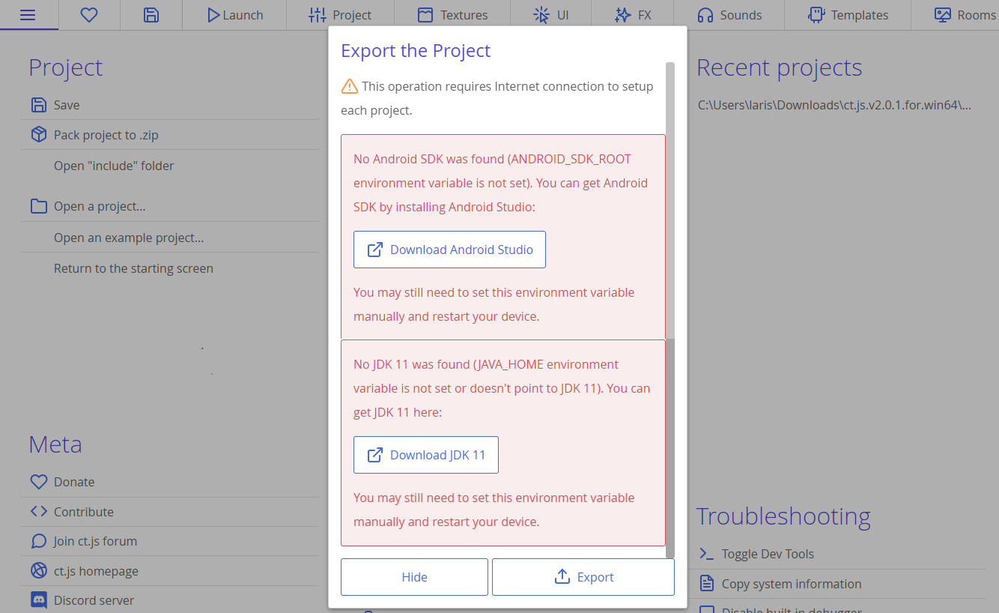
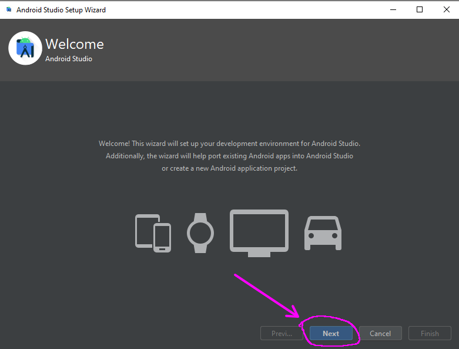
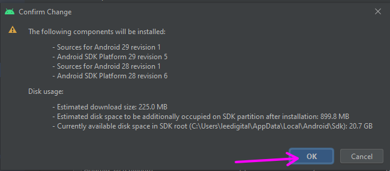
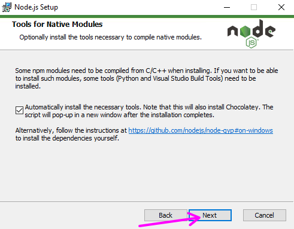
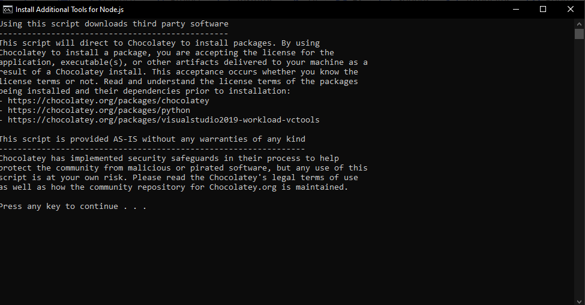

# Construindo o Seu Jogo

Uma vez que você tenha finalizado o seu jogo, você está pronto para compartilhar a sua obra-prima com o resto do mundo. Então vem comigo, porque nessa seção vou te mostrar como você pode gerar e distribuir o seu jogo.

Aqui está o que você verá:

[[toc]]

## Autoria

Abra a aba `Project` e selecione `Authoring` na aba lateral, aqui podemos adicionar os detalhes de autoria do projeto.

1. **Name:** Esse será o nome do arquivo executável ou .zip quando o jogo for exportado.
2. **Developer:** Adicione os nomes dos desenvolvedores aqui.
3. **Homepage:** O endereço do site do seu jogo vai aqui.
4. **Version:** Adicione um número de versão aqui, para que dessa forma você tenha um controle de correções e atualizações do seu jogo.

## Marca

Abara a aba `Project`, selecione `Branding` na aba lateral, aqui temos algumas opções de marca para o projeto exportado.

1. **Game icon:** Adiciona um ícone para o seu jogo, você pode escolher um a partir de qualquer uma das texturas que importou.
2. **Splash screen:** Adiciona uma imagem para a tela de carregamento do seu jogo, você pode escolher uma a partir de qualquer uma das texturas que importou.
3. Define se deve ser utilizado ícones suaves ou pixelados independente das configurações de renderização.
4. **Accent:** Isso muda a cor de destaque da tela de carregamento.
5. Aqui você pode alterar como a
cor de destaque afeta a cor de fundo ou de preenchimento, apenas invertando a mesma. Você também pode ocultar a expressão "Made with ct.js" da tela de carregamento.

## Definições de exportação

Na aba `Project`, selecione `Export Settings` na aba lateral.

Aqui você encontrará algumas das mais avançadas definições que terão efeito quando você exportar o seu jogo. Para muito projetos, as definições padrões estarão ótimas.

## Exportando o seu jogo

Na aba `Main Menu`, você verá três opções de exportação sob o título `Deploy`.

### Exportar para web

Exportar para a web é tão fácil como apertar um botão. Uma vez que a exportação do jogo seja finalizada, você verá um arquivo zip contendo  os arquivos do seu jogo.

### Exportar para desktop

Ao exportar para desktop, você precisará escolher para qual sistema operacional você deseja criar o arquivo executável.

Uma vez que a exportação seja finalizada, você verá os diretórios contendo os seus arquivos executáveis.

Apenas abra o diretório e rode o executável.

### Exportar para android

Ao exportar para android, você vai precisar definir as configurações da aba lateral `Authoring` localizada na aba `Project`

#### Requisitos

Para exportar para Android, você vai precisar instalar e configurar um ambiente para isso.

#### Java Development Kit - JDK
Para a exportação é necessário instalar o JDK e definir a variável de ambiente `JAVA_HOME`. O download do JDK pode ser feito [aqui](https://www.oracle.com/br/java/technologies/javase/jdk11-archive-downloads.html).

Após a instalação do JDK, você deve seguir os passos abaixo para definir a variável de ambiente `JAVA_HOME`.

Primeiramente você de abrir o Windows Explore e seguida clicar com o botão direito do mouse sobre a opção **This PC** ou **Este Computador**, em seguida click em Properties ou Propriedades como mostra a imagem abaixo.

Na janela que abrir, localize a opção **Advanced system settings** ou **Configurações avançadas do sistema**, como mostra a imagem abaixo.

Após clicar sobre essa opção, será aberta uma outra janela, nela, localize a opção **Environment Variables...** ou **Variáveis de Ambiente...** como mostra a imagem abaixo.

Em campo 1, você deve pôr o nome da variável, `JAVA_HOME`, já no campo 2, você deve definir onde o JDK está instalado, você pode utilizar o campo 3 para localizar a pasta de instalação. Após isso, você clicar no botão indicado com o número 4. Veja a imagem abaixo que mostra o resultado dessa ação.

Agora precisamos configurar a variável de ambiente **Path**, click sobre ela e depois click em **Edit** ou **Editar**.

Na janela seguinte, click em **New** ou **Novo** e insira `%JAVA_HOME%\bin`. Para dinalizar click em **OK**.

#### Android Studio

Para exportar para android também será necessário instalar o **Android Studio**, que pode ser baixado [aqui](https://developer.android.com/studio). Após o Download, abra o instalador e siga a sequências de imagens a seguir para concluir a instalação.

Após a instalação, devemos definir a pasta de instalação do **SDK Manager** nas variáveis de ambiente do sistema. Para obter o caminho da pasta de instalação, acesse a opção **More Actions** e depois **SDK Manager**, como mostrada na imagem a seguir.

No campo 1 você encontra a localização da pasta de instalação do **Android SDK**, copie esse endereço, pois é ele que vamos usar para definir a variável de ambiente `ANDROID_SDK_ROOT`. Então, primeiramente vamos definir essa variável de ambiente, depois disso voltamos aqui para explicar o campo 2 definido na imagem.

Na janela de criação de variáveis de ambiente, click em **New** ou **Novo**, na janela que abrir, insira no campo 1, **ANDROID_SDK_ROOT**, no campo 2 cole o endereço que compiamos anteriormente e click em **OK**. Veja as imagens a seguir.

Agora, de volta a tela do **SDK Manager**.

O campo 2 define as plataformas que devem ser instaladas, em nosso caso, estamos instalando o **Android 10** e o **Android 9**, mas você pode instalar aquele que você quiser ou que você julgar que terá um resultado melhor. Após escolher a(s) plataforma(s) que você quer instalar, click em **OK**. As imagens a seguir descrevem as telas seguintes.

De volta a janela inicial do **Android Studio** precisamos criar um dispositivo virtual. Para isso, click **More Actions** e em seguida click em **Virtual Device Manager**, como mostrado na imagem a seguir.

Na próxima janela, você vai poder criar um novo dispositivo clicando no botão **Create device** ou em **Create virtual device**, click em um deles para prosseguir.

Na tela seguinte, podemos escolher um dispositivo da lista padrão ou criar o nosso próprio como indicado na seta 1.

Nós escolheremos aqui o dispositivo **Pixel 4**, selecione ele ou fique livre para escolher o que  você achar melhor. Após a escolha, click em **Next**. Como mostra a imagem a seguir.

Na próxima tela devemos escolher qual a versão do android que queremos trabalhar, note que se a versão não estiver instalada, você pode instalar a mesma agora, veja a seta 1. Aqui nós escolheremos a versão **Android Pie**. Após a escolha, click em **Next**.

Na tela seguinte podemos escolher o nome do dispositivo virtual, como mostrado na seta 1. Também podemos definir a orientação inicial do dispositivo, como mostra a seta 2. Nós deixaremos a configuração padrão, mas você pode escolher o que for melhor para você. Após a escolha, click em **Finish**. As imagens a seguir descrevem o processo de criação.

#### NodeJS

Também vamos precisar do NodeJS, que pode ser baixado [aqui](https://nodejs.org/en/download/). As imagens a seguir mostram o processo de instalação.

Após esse processo de instalação será aberta uma janela de terminal para que seja feita a instalação de ferramentas adicionais para NodeJS que marcamos na caixa de seleção anterior.

As imagens a seguir descrevem esse processor de instalação.

#### CapacitorJS

Para finalizar a configuração do nosso ambiente, devemos instalar o capacitorjs, para isso, vamos precisar usar a ferramenta `npm`, instalada com o **nodejs**. Abra o prompt de comando e execute o comando mostrado na imagem a seguir.

::: tip Dica
Para abrir o prompt de comando, pressione a tecla **Windows** e com a mesma pressionada, pressione a tecla **R**, na janela que abrir, digite `cmd` e pressione a tecla enter.
:::

::: warning Alerta
Caso o camando `npm` não seja reconhecido pelo prompt de comando, então isso significa que o mesmo não está no **%PATH%** do sistema, nesse caso, você pode fazer uso da mesma técnica que utilizamos com o **%JAVA_HOME%\bin** para pôr a ferramenta `npm` no **%PATH%** do sistema.
:::

Se tudo ocorrer bem, você verá algo como na imagem a seguir.

Depois disso, será possível exportar o seu jogo para android pelo ct.js.

::: warning Alerta
Vai ser preciso ter uma conexão com a internet para continuar com a exportação.
:::

