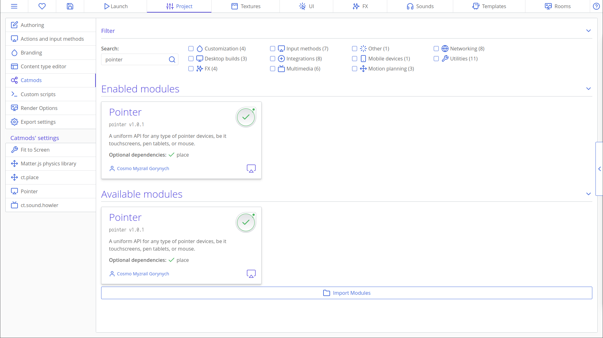
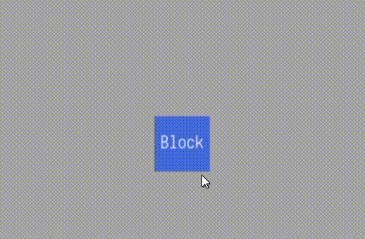

# Arrastando as Copies por aí

Nesse tutorial veremos como podemos fazer uma implementação de arrastar e soltar para copies em ct.js!

Teremos um block que servirá de exemplo para que a gente possa arrastá-lo por aí. Vamos começar indo até o menu 'Catmods' sob a aba Project e habilitar o módulo (catmod) `ct.touch`. Estamos usando esse catmod porque queremos ser capazes de arrastar o nosso cubo em dispositivos mobile e touchscreen com os nossos dedos. E não se preocupe, nós também seremos capazes de usar o nosso mouse para arrastar o objeto, porque por padrão `ct.touch` também pode manipular eventos de mouse. Caso você precise, você pode desabilitar esse comportamento a partir do menu 'Touch' sob o 'Catmods' Settings'.



Agora nós queremos adicionar uma ação de touch a partir do menu 'Actions and Input Methods'. Click em 'Add an Action' e chame a sua ação de "TouchAction". Agora click em 'Add an Input Method' e escolha `touch.Any` a partir da lista. No final, ele deve parecer com algo assim:


Usaremos a ação que acabamos de criar para registrar eventos de press (pressionar) e release (soltar).

Agora vamos começar realmente a arrastar. Vá para a aba `On Create` do seu template (modelo) e declare uma variável chamada `this.dragging`.

```js
this.dragging = false;
```

Essa variável booleana se tornará `true` se a copy estiver sendo arrastada, caso contrário, será `false`. Então vá para a aba `On Step` e faça o seguinte:

```js
if (ct.touch.hovers(this) && ct.actions.TouchAction.pressed) {
    this.dragging = true;
}
```

Precisamos que a ação de arrastar seja iniciada quando o usuário pressionar o botão do mouse quando o mesmo estiver sobre a copy. Nós verificamos isso na instrução `if` com a ação "TouchAction" declarada no menu 'Actions and Input Methods'.

Precisamos também, finalizar o arrasto quando o usuário soltar o botão do mouse enquanto arrasta a copy. Basicamente faremos o seguinte na aba `On Step`.

```js
if (this.dragging && ct.actions.TouchAction.released) {
    this.dragging = false;
}
```

Também vamos querer que a posição da nossa copy seja atualizada enquanto arrastamos a mesma com o mouse.

```js
if (this.dragging) {
    this.x = ct.touch.x;
    this.y = ct.touch.y;
}
```

Agora podemos testar:


funciona! foi tão simples definir isso.

## Adicionando descolcamentos

Implementamos com sucesso a ação de arrastar copy por aí em ct.js, mas ainda existe uma coisa que precisamos fazer. Como você pode ver na imagem acima, quando clicamos em nossa copy para arrastá-la; a posição superior esquerda dela é deifinida para posição do cursor do mouse. Podemos corrigir isso apenas usando duas varáveis. Uma para o deslocamento em *x* e a outra para o deslocamento em *y*, para que assim, a posição inicial da copy não seja alterada quando ela for pressionada pelo cursor do mouse para ser arrastada. Então vamos para a aba `On Create` para declará-las.

```js
this.xOffset = 0;
this.yOffset = 0;
```

Agora vamos alterar essas variáveis quando a copy é pressionada pelo cursor do mouse. Então vamos voltar para a aba `On Step` e alterar o corpo da instrução `if` onde a ação de arrastar é iniciada (a copy é pressionada pelo cursor do mouse).

```js
if (ct.touch.hovers(this) && ct.actions.TouchAction.pressed) {
    this.dragging = true;
    this.xOffset = ct.mouse.x - this.x;
    this.yOffset = ct.mouse.y - this.y;
}
```

Agora precisamos usar essas variáveis para determinar a posição da nossa copy quando ela estiver sendo arrastada pelo cursor do mouse. Vamos para a instrução `if` onde a ação de arrastar acontece e vamos alterar as duas linhas que estão lá.

```js
if (this.dragging) {
    this.x = ct.touch.x - this.xOffset;
    this.y = ct.touch.y - this.yOffset;
}
```

Podemos agora reiniciar o nosso jogo para testá-lo.



Perfeito! Ele funciona lindamente. Toda vez que o nosso bloco for pressionado pelo cursor do mouse, ele não irá para a posição do cursor do mouse e ação de arrastar será uma ação muito mais real, como mostrado na imagem acima.
