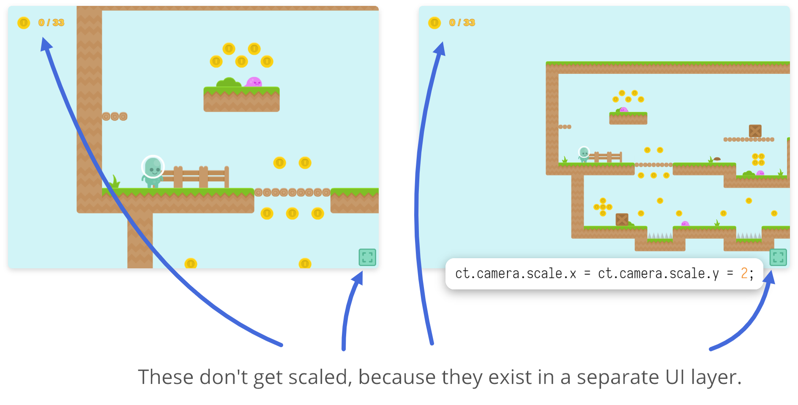

# Coordenadas de Jogo e de UI: A diferença

Em ct.js, existem dois espaços de coordenadas: para elementos de UI (coordenadas de UI) e para elementos de jogo que vivem uma grade de coordenadas sepadara. Por padrão, eles serão iguais, mas uma vez que você inicie o movimento da câmera, a rotação e processo de zoom, elas serão diferentes. Por exemplo, você pode redimensionar o viewport e assim mostrar mais coisas na tela, através de um retângulo maior no *espaço de jogo*, mas no *espaço de UI* o retângulo será o mesmo, veja a imagem a seguir.

Usando essas coordenadas, você pode separar as camadas de UI e de jogo, reutilizar a sua UI em diferentes rooms e assim simplificar o desenvolvimento de UI, pois as coordenadas de UI normalmente são constantes e você pode planejar seus menus e outros elementos no editor de room.

::: tip Dica
*Layers* são rooms adicionadas pelo `ct.rooms.append` e `ct.rooms.prepend`. Junto com a room principal, eles forma uma *fase*.
:::

## Espaço de Jogo

O Espaço de Jogo era o único espaço em ct.js até que um objeto de câmera fosse implementado. Se você migrar um projeto da versão 1.2 para a versão 1.3, notará que o seu jogo estará totalmente em coordenadas de jogo. [Veja o guia de migração aqui](/migration-1.2to1.3.html), se você tiver algum problema. Diferentes rooms colocadas em coordenadas de jogo colidem uma com as outras.

## Entrando no Espaço de UI

Qualquer room nova adicionada para a room principal pode ser posta nas coordenadas de UI com os métodos `ct.rooms.append('NameOfTheRoom', {isUi: true})` e `ct.rooms.append('NameOfTheRoom', {isUi: true})` (veja o guia de referência desses métodos [aqui](/ct.rooms.html)). Essa é toda a linha de código que você precisa!

::: tip Dica
Tecnicamente, ct.js transformará cada layer na fase dependendo da posição da câmera, enquanto que as layers de UI serão deixadas como estão. Isso significa que as coordenadas de mundo Pixi são na verdade coordenadas de UI, a qual não é intuitiva, mas é dessa forma que o objeto câmera é codificado. Portanto, não use as coordenadas de mundo Pixi.

O que isso significa para você? Em primeiro lugar, você não pode reposicionar essas rooms que usam coordenadas de jogo por conta própria, pois elas são gerenciadas pelo `ct.camera` e as mesmas são substituídas por ele. Em vez disso, você pode simplesmente manipular a câmera — ela tem alguns recursos interessantes para o gerenciamento do viewport (janela/tela de visualização). Para mais informação sobre isso, acesse [Trabalhando com o Viewport](/tips-n-tricks/viewport-management.md).

Em segundo lugar, você pode reposicionar as layers de UI! Isso pode ser usado para criar widgets que se movem pela tela e para animações de slides.
:::

## Espaço de UI

O espaço de UI é um retângulo que na horizontal é de `0` até `ct.camera.width` e que na vertical é de `0` até `ct.camera.height`. A menos que o `ct.fittoscreen` com os modos especiais como "Expand" ou "Scaling without letterboxing" seja usado, esse retângulo será igual ao que você define como tamanho de visualização em sua room. Caso contrário, será igual à tela (modo "Expand") ou será mais alta ou mais larga depenendo da sua tela ("Scaling without letterboxing").

Para atualizar a posição dos seus elementos de UI para que eles fiquem bem alinhados em diferentes tipos de telas, use `ct.camera.width` e `ct.camera.height`. Para alinhar interfaces básicas automaticamente, use `ct.camera.realign(room);`.

## Convertendo as Coordenadas de um Espaço para o Outro

Você precisará destes métodos para converte de um espaço de coordenadas para o outro:

* `ct.u.uiToGameCoord(x, y)`, e
* `ct.u.gameToUiCoord(x, y)`.

Eles retornarão um objeto (`PIXI.Point`) com duas propriedades: as componentes `x` e `y`. Esses métodos podem ser usados para alinhar os elementos de UI às copies no espaço de jogo e para outras tarefas de sobreposição.

A câmera também tem um número de métodos e propriedades que retornam a posição no espaço de jogo:

* `ct.camera.left` — retorna a posição do lado esquerdo onde a região retangular visível termina;
* `ct.camera.right` — retorna a posição do lado direito onde a região retangular visível termina;
* `ct.camera.top` — retorna a posição da parte superior onde a região retangular visível termina;
* `ct.camera.bottom` — retorna a posição da parte inferior onde a região retangular visível termina.

::: tip Observação
O retângulo de visualização da câmera tem a origem do seu sistema de coordenadas definida no centro, por esse motivo é que o `ct.camera.left` termina do lado esquerdo, porque a origem é iniciada a partir do centro.
:::

Eles podem ser utilizados por exemplo, para determinar se uma copy está visível ou não.

Para viewport (janela/tela de visualização) rotacionados, use estes métodos:

* `ct.camera.getTopLeftCorner();`
* `ct.camera.getTopRightCorner();`
* `ct.camera.getBottomLeftCorner();`
* `ct.camera.getBottomRightCorner();`

Eles retornarão um objeto (`PIXI.Point`) com duas propriedades: as componentes `x` e `y`.