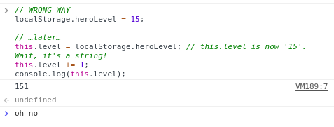
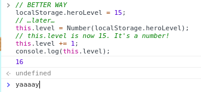

# Salvando e Carregando o Jogo com LocalStorage(Armazenamento Local)

Salvar o progresso do jogo é um recurso necessário. Talvez você queira também armazenar a pontuação e o apelido para um jogo acelerado e de sessão curta, tipo o jogo dino do google-chrome. LocalStorage ao resgate! Esse objeto global permite armazenar diferentes tipos de valores string e acessá-los depois. Esse recurso funciona tanto em navegadores modernos como em jogos exportados. Combinado com outros recursos acessíveis, nós podemos armazenar qualquer tipo de dados ou quase todos os tipos de dados!

## Salvando Valores Simples

Salvar e lê valores string é muito fácil:

```js
// Escrevendo valores para o localStorage
localStorage.heroName = 'Isaac Newcat';
localStorage.heroTitle = 'The Allmighty';

// Lendo os valores armazenados
if ('heroName' in localStorage) { // alguma coisa foi salva anteriormente?
    // Leia os valores
    this.name = localStorage.heroName;
    this.title = localStorage.heroTitle;
} else {
    // Faz alguma com os dados inexistentes
    requestNameAndTitle();
}
```

Quando os dados lindos são números, datas, booleanos ou qualquer outra coisa, precisamos converter esses valores antes de usá-los.

```js
// JEITO ERRADO
localStorage.heroLevel = 15;

// …depois…
this.level = localStorage.heroLevel;
// this.level agora é '15'. Espera aí, é uma string!
this.level += 1;
console.log(this.level);
```



`this.level` agora é `'151'`! Isso definitivamente não erá o que esperávamos. E a razão é porque o `localStorage` pode apenas fazer armazenamento em strings. E por causa disso, precisamos converter os valores de `localStorage` para os tipos que precisamos.

```js
// UM JEITO MELHOR
localStorage.heroLevel = 15;
// …depois…
this.level = Number(localStorage.heroLevel);
// this.level agora é 15. É um número!
this.level += 1;
console.log(this.level);
```



Aqui está como podemos converter os objetos do tipo Date e do tipo Boolean:

```js
localStorage.gameStartTime = new Date();
localStorage.hardcoreMode = false;

// depois…

this.startTime = new Date(localStorage.gameStartTime);
this.hardcoreMode = localStorage.hardcoreMode === 'true';
```

## Armazenando Objetos Complexos

Para qualquer coisa além das simples strings e números, precisamos de funções especiais para a codificação e decodificação. Mas como o javascript é maravilhoso, temos uma função assim para isso! Elas são`JSON.parse(encodedString)` e `JSON.stringify(complexObject)`.

```js
var inventory = [{
    name: 'A rusty axe',
    type: 'weapon',
    twoHanded: true
    durability: 0.87,
    damage: [8, 11],
    effects: {
        poison: 1,
        duration: 5
    },
    icon: 'BattleAxe_Old'
    stack: 1
}, {
    name: 'Health Potion',
    type: 'consumable',
    effects: {
        regen: 5,
        duration: 15
    },
    icon: 'Potion_Red',
    stack: 15
}, {
    // …outras coisas
}];

localStorage.heroInventory = JSON.stringify(inventory);

// …depois

this.inventory = JSON.parse(localStorage.heroInventory);
```

Isso já é o bastante para coisas complexas! Aqui nós codificamos um array, mas você pode passar tanto arrays como objetos com `JSON.stringify`.

O que não pode ser codificado, as functions, os objetos do tipo Date, referências cíclicas. Mas em muitos casos você não precisará salvar dados assim para o seu jogo!
