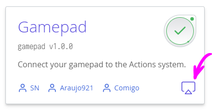

# Criando os seus próprios módulos ct.js: estrutura de diretórios e manifesto

O Ct.js é modificável e o processo de criação de novos módulos é bem fácil! Módulos, ou catmods, podem colocar novo código no framework ct.js, hackear eventos e procedimentos internos, adicionar novas configurações de projeto e campos editáveis ​​para assets de jogos.

Qualquer módulo é um diretório com a seguinte estrutura, colocada em `ct.js/data/ct.libs`:

```
mycatmod
  |
  |  (Arquivos principais)
  |-- index.js
  |-- module.json (obrigatório)
  |
  |  (Documentos mostrados no painel de expansão à direita)
  |-- README.md
  |-- docs
      \-- (qualquer número de documentos .md)
  |
  |-- CHANGELOG.md
  |-- LICENSE (texto simples, fortemente recomendado)
  |
  |-- includes
  |   \-- (arquivos a serem copiados para o jogo resultante)
  |
  \-- injections
      \-- (injeções vão aqui)
```
(mais sobre injeções [aqui](./modding-events-and-injections.html))

* `module.json` permite que seu módulo seja descoberto pelo ct.IDE e contém informações básicas, lista de autores e descrição das definições do módulo.

* `index.js` normalmente representa o código principal do seu módulo e é empacotado com todo o código restante do jogo compilado. Uma regra prática é empacotar todas as suas dependências em um arquivo. Se sua dependência for um outro módulo ct, você pode listar este módulo como tal em `module.json`. (Veja abaixo os exemplos.) Este arquivo suporta [templating](./modding-events-and-injections.html#templating).

* `README.md` é um arquivo markdown com informações gerais, exemplos, notas especiais, etc. Se presente, torna o cabeçalho do módulo clicável no painel com todos os documentos dos módulos.

* `CHANGELOG.md` deve conter um histórico de alterações, se houver.

## Estrutura do `module.json`

`module.json` é o único arquivo obrigatório para seus módulos. Sua versão mínima tem o seguinte formato:

```json
{
    "main": {
        "name": "Module's name",
        "tagline": "A short description of a module",
        "version": "1.0.0",
        "authors": [{
            "name": "Cosmo Myzrail Gorynych",
            "mail": "admin@nersta.ru"
        }, {
            ...
        }]
    }
}
```

### Listando dependências <badge>novo em v1.3</badge>

Atualmente, catmods podem expressar sua dependência em outro módulo com os campos `dependencies` e `optionalDependencies` dentro de `module.json`. Ele permite que o ct.IDE alerte os usuários sobre módulos ausentes (desativados). Por favor, escreva informações sobre como obter módulos personalizados na seção "readme".

```json {9,10}
{
    "main": {
        "name": "An example module json with dependencies",
        "tagline": "Add dependencies to your modules!",
        "version": "1.0.0",
        "authors": [
            ...
        ]
    },
    "dependencies": ["tween"],
    "optionalDependencies": ["place"]
}
```

## Especificando uma categoria <badge>novo em v1.4</badge>

Desde v1.4, módulos podem especificar uma ou duas categoria em module.json, assim eles podem ser filtrados na página de definições do projeto. As categorias são escritas e, um array sob a chave `main.categories`, e pode ser uma dessas strings:

* `customization`;
* `desktop` — módulos para compilações de desktop;
* `fx`;
* `inputs` — módulos que fornecem novos métodos de entrada para o sistema de Ações;
* `integrations`;
* `media`;
* `misc`;
* `mobile`;
* `motionPlanning`;
* `networking`;
* `tweaks`;
* `utilities`;

A primeira categoria também é usada para criar um ícone no canto inferior direito do cartão de um módulo:



**Um exemplo do módulo `ct.flow`:**

```json {10,11,12}
{
    "main": {
        "name": "Flow control and timing",
        "tagline": "Add high-level methods for asynchronous events, e.g. gate, cumulative delay, retriggerable delay.",
        "version": "0.0.0",
        "authors": [{
            "name": "Cosmo Myzrail Gorynych",
            "mail": "admin@nersta.ru"
        }],
        "categories": [
            "utilities"
        ]
    }
}
```

## Escrevendo um módulo

Depende das suas necessidades, você provavelmente vai precisar:

* Escrever a sua lógica principal no arquivo `index.js`;
* [Injetar código personalizado](./modding-events-and-injections.html) em eventos e procedimentos do ct.js;
* [Adicionar definições ao seu módulo](./modding-events-and-injections.html) editável a partir do ct.IDE e lê-los de volta através de injeções;
* [Adicionar novos campos editáveis](./modding-events-and-injections.html) para templates e outros poucos tipos de asset;
* [Implementar novos método de entrada](./modding-input-methods.html) para integrá-los em [Sistema de Ações](./actions.html);
* [Adcionar sugestões](./modding-typings-and-intellisense.html) para um autocompletar inteligente e com verificações de tipo.

Siga os links para encontrar exemplos e referências sobre implementação adicional.