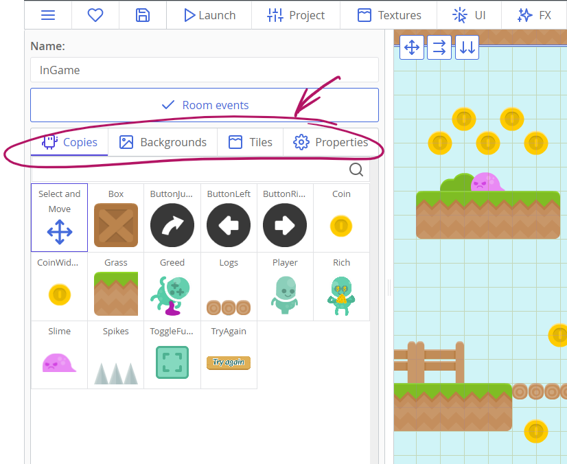

# Using the room editor

Rooms are the spaces where your actual game happens. A room can represent a level, a menu, a UI widget, and is a place where you place your copies (instances of your templates), backgrounds, and tiles. Knowing how to use it to the fullest will ease the level design process.

The room editor has four tabs that define its state. These tabs are located in the left column of the room editor, right under the "Room events" button.

* Copies tab for adding new and manipulating existing copies.
* Backgrounds tab for adding and tweaking backgrounds.
* Tiles tab for adding new tiles and managing already placed ones.
* Properties tab with room's and camera's settings.

## Navigating around the room

Moving around:

* Hold the middle mouse button (the wheel) down and move the cursor to move the camera.
* Holding the left button and moving your pointer also works while the Backgrounds or Properties tabs are open.
* When the Copies tab is open, clicking on the "Select and move" swatch will also allow you to move around with the left mouse button. This is mostly made for touchpads as there is rarely a middle button there.

To zoom in and out, use mouse wheel or the zoom slider in the top-right corner of the room editor.

## Managing copies

Copies management is only possible while the "Copies" tab in the left column is opened. While this is opened, you can do various things:

* When a template is selected in the left column, you can click on the room view to place a new copy.
  * Hold the `Shift` key while moving the cursor to create multiple copies (similar to painting with a brush).
  * Holding the `Alt` key will place copies ignoring the grid.
  * Holding the `Ctrl` key will enable the eraser mode, where you can remove copies by dragging the red circle around the room.
* Right-clicking anywhere will find the nearest copy, select it and show a context menu with some goodies:
  * Delete the selected copy;
  * Move, rotate, or scale it;
  * Add or change its custom properties. These will then be available as `this.yourPropertyName` inside templates' events.
* While "Select and Move" is active, holding `Shift` key while moving the cursor will allow you to select multiple copies.
  * Selected copies can be moved together by dragging them around with your pointer.
  * When multiple copies are selected, a context menu appears while right-clicking on them. It allows shifting them by a set value and deleting them.
* Clicking with a `Shift` key pressed will also work; it will select the nearest copy. An additional dialogue will appear where you can view and change a copy's scale, rotation, and position.

## Adding backgrounds

Backgrounds are added in the second tab in the left column of the room editor. Inside it, there is a button "Add a Background" that opens a texture selector. There are several things to consider while using backgrounds:

* A texture should be marked as a background; otherwise it will have rips and holes in its seams. There will be a warning message if you try to use a regular texture.
* Multi-frame backgrounds are not supported, at least yet.

You can change background's texture by clicking on the current texture. Other properties are hidden in a panel that you can open by clicking the ⚙ cog icon.

* Depth changes the drawing order relative to copies, tiles, and other backgrounds. Setting it to higher value will cause it to be drawn on top of other things.
* Shift fields position your background in the room.
* Scaling fields stretch your background. Values smaller than 1 will make it smaller, while values greater than 1 will make it larger. Using negative values will flip the background.
* Movement speed allows making moving backgrounds. This can be used to create effects of rain falling down, or clouds moving.
* Parallax changes how the background moves relative to the camera. You can make the values lower than 1 to create a sense of depth. Values greater than 1 are usually used for foregrounds.
* The "Repeat" box lets you choose how the background will be tiled:
  * `repeat` means that the background will tile in both directions.
  * `repeat-x` will tile the background only horizontally.
  * `repeat-y` will tile the background vertically.
  * `no-repeat` won't tile the background at all.

## Working with tiles and tilesets

To work with tiles, you need a texture that is setup properly — make sure that you've set a proper frame size and the count of columns and rows in your tilesets. In any way, any ct.js texture can work as a tile, even if it has just one frame. You can use it to place static decorations inside your rooms.

Here is an example of a properly set tileset:

To start working with tiles, press the "Tiles" tab in the left column of the room editor and press the "Find a Tileset" button. Then select a tile on the texture you've imported and place it inside the room with a click. You can also select multiple tiles by pressing and dragging your pointer across several frames.

:::tip
Remember that each tile is placed on a tile layer of a particular depth. You can move tiles to another layer with a context menu and also change the depth of any tile layer, but placing every tile on an arbitrary depth level is not possible.

Creating a ton of layers is also not recommended, because 1) it is dumb, and 2) each tile layer caches its contexts to boost rendering performance, so you better minimize the amount of tile layers you use to get the most of it.
:::

:::warning
Ct.IDE becomes funky when one tries to use multiple tiles from a texture that uses margins and offsets. It works perfectly in a game, but looks broken inside the room editor. Consider remaking the texture so it has no offsets.

This issue will be fixed with a new room editor.
:::

The tile mode has controls similar to the copy tab:

* Clicking with a tile selected places it inside the room.
  * Hold the `Shift` key while moving the cursor to create multiple tiles.
  * Holding the `Alt` key will position tiles with grid being ignored.
  * Holding the `Ctrl` key will enable the eraser mode, where you can remove tiles by dragging the red circle around the room.
* Right-clicking anywhere will find the nearest tile and show a context menu to delete it.
* Holding `Shift` key while moving the cursor will allow you to select multiple tiles.
  * Clicking with a `Shift` key pressed will also work; it will select the nearest tile.
  * When multiple tiles are selected, a context menu appears while right-clicking on them.
    * One menu item allows to delete them. Pretty simple, eh?
    * "Move to layer" opens a modal to input a new depth for the selected tiles. If there is no tile layer with the specified depth, a new one will be created.
    * "Shift tiles" shifts all the selected tiles by a set amount of pixels.

## Room properties

The "Properties" tab of the room editor has options for render and camera tweaks.

* View width/height define the starting size of the camera — the area it shows. As resolution and the size of the rendered canvas is a stretchy thing in ct.js, thanks to `ct.fittoscreen`, these do not correspond to screen resolution — they only set how much your camera shows and what aspect ratio it has. Everything else is done by `ct.fittoscreen` (and you can change its settings in the Project tab).
* The checkbox "Keep camera in a rectangle" shows controls to limit what a camera can show. By default, rooms and cameras in ct.js are boundless, but when enabled, camera borders won't exceed the specified region.
* "Background color" sets the color of the areas not covered by copies, tiles, or background textures.
* The checkbox "Is a UI layer" tells how the room should be positioned if used inside another room. UI layers follow the camera and are not affected by zooming, perfect for UI controls.

:::tip
To read more about UI layers, see [the reference for append/prepend methods](ct.rooms.html#ct-rooms-append-nameoftheroom-ext-and-ct-rooms-prepend-nameoftheroom-ext), or [see how it is done in the JettyCat tutorial](tut-making-jettycat.html#creating-menus).
:::