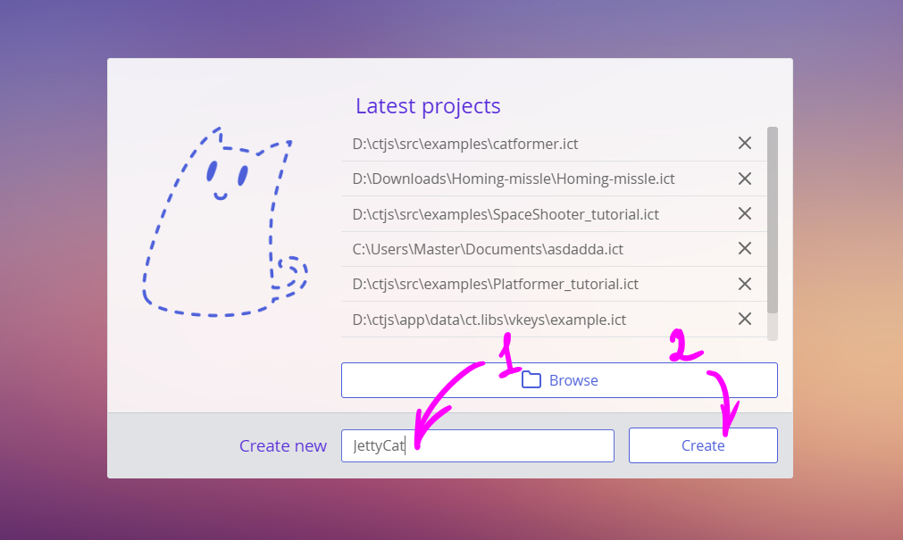
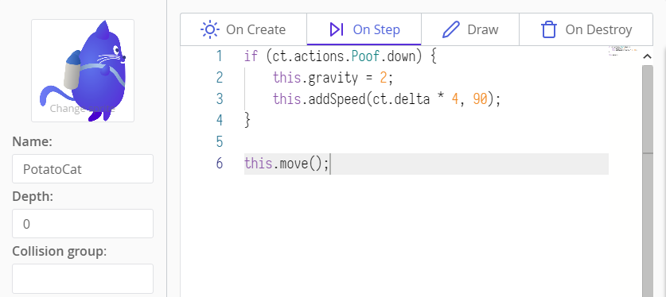
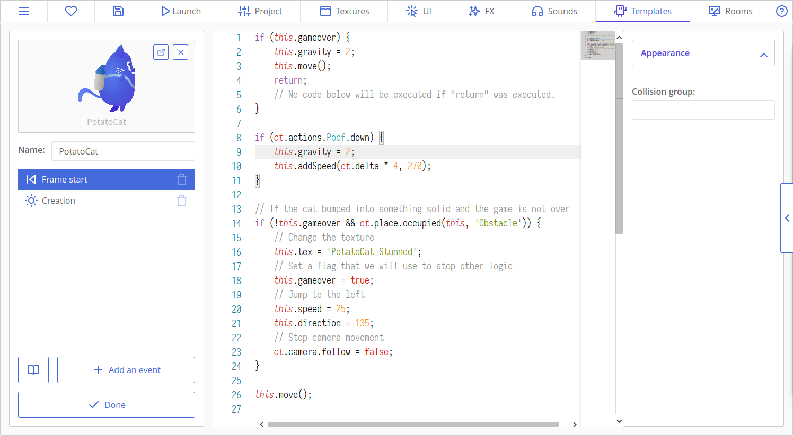

# Criando Jogos: Jetty Cat

Da mesma forma como Flappy Bird, Jetty Cat será um jogo onde um gato, manipulado pelo toque ou pelo click, evita infinitos obstáculos através do uso do seu jetpack. Primeiramente, nós implementaremos a lógica principal do jogo, em seguida — UI(Interface de Usuário). E por fim, vamos polir o jogo adicionando belas transições, sistema de partículas e efeitos sutis.


Isto é o que nós faremos:

[[toc]]

:::warning Alerta
Como você pode ver, isso não é apenas um exemplo de "Hello world", mas sim, um guia para criar um jogo completo do zero. Dê a você mesmo, bastante tempo, paciência e dedicação para terminá-lo!
:::

## Criando o projeto e importando os assets

Abra o ct.js e crie um novo projeto definindo o nome do seu projeto e clicando no botão "Create". Informe ao ct.js onde salvar o seu projeto. Uma pasta como "My Documents" seria uma boa escolha.



Click na aba "Textures" na parte superior da janela do ct.js. Em seguida a abra o seu explorador de arquivos, e localize a pasta `examples/JettyCat_assets` dentro da pasta do ct.js. Lá dentro, existem os assets que nós usaremos. Arraste os assets do seu visualizador de arquivos para o ct.js, e o ct rapidamente importará os mesmos para o projeto.

Precisamos preparar essas texturas: informar de forma adequada ao ct.js quais são os backgrounds(planos de fundo) e definir as formas de colisão para que as copies em seu jogo possam interagir de forma precisa uma com as outras. Primeiro vamos abrir o background(plano de fundo) do nosso projeto. Click no cartão `BG_Ground`:


Aqui vamos precisar clicar na caixa de seleção "Use as a background?"(Usar como um background?). Dessa forma, informamos ao ct.js que ele deve tratar essa textura de forma diferente e assim permitir que a mesma se repita em nossa fase.


Click em "Save"(Salvar) no canto inferior esquerdo. Agora faça o mesmo com a textura `BG_Sky`.

Os planos de fundo(backgrounds) estão prontos! Agora é a vez de definir a máscara de colisão de nossos sprites. Não precisamos definir todas elas, apenas para os objetos que colidem uns com os outros e para aqueles que clicamos durante o jogo. Sprites de cabeçalho como `Jetty_Cat`, `OhNo` e `Pause` não são interativos, são apenas de decoração e portanto não precisam de máscaras de colisão, assim como `PressHint` será apenas um sprite informativo e dessa forma não receberá clicks e também não precisa de uma máscara de colisão. Mas o gato e os canos colidirão, assim como as estrelas precisam saber quando o gato colide com elas.

Vamos abrir o `PotatoCat`! A primeira coisa que devemos fazer é alterar a origem do eixo da textura. Que inicialmente é mostrado como um eixo quadrado que por padrão está localizado no canto superior esquerdo. Um eixo é um ponto pelo qual uma copy é redimensionada e rotacionada em torno dele. Coloque o eixo no centro do corpo do gato. Em seguida, vamos definir a máscara de colisão. O gato não se parece com um círculo ou com um retângulo, então vamos definir a máscara de colisão como sendo um polígono(polygon) na coluna esquerda. Um pentágono aparecerá: Você pode arrastar os vértices(os cantos com os pontos) e adicionar novos vértices clicando nas arestas(linhas) amarelas para uma melhor definição da silhueta do gato. Uns 15 vértices nos parece ser suficiente para descrever a sua silhueta.


::: tip Dica
Seria uma boa ideia deixa de fora da silhueta a calda e as orelhas do gato. Pois a calda colidir com um cano e perder por conta disso pode parecer injusto aos olhos do jogador. Até porque, uma calda é muito flexível para causar colisões fatais 😺
:::

Depois de definir a máscara de colisão, click no botão "Save"(Salvar) para retornar para a lista de assets. Nós também precisaremos ajustar a textura `PotatoCat_Stunned` da mesma forma, assim como a textura `Star`.

Para os canos, usaremos alguma coisa *um pouco* diferente. Abra o primeiro, `Tube_01`, em seguida coloque o seu eixo bem próximo da parte inferior do sprite. Você lembra que o eixo não afeta apenas a rotação mas o redimensionamento tambṕem? Vamos reutilizar a mesma textura tanto para os canos que ficam pendurados na parte superior da tela bem como para os que crescem na parte inferior também. Para fazer com que o cano superior funcione de forma correta, nós faremos com que a sua escala seja um valor negativo, dessa forma o mesmo vai fazer um flip(giro) vertical em torno do eixo X, dando a ideia que ele está de cabeça para baixo. Nós podemos até rotacioná-lo depois, mas nesse caso a sua base será fixa e chegaremos ao mesmo resultado do procedimento anterior.


Precisamos fazer isso para todas as 4 texturas de cano. Depois disso, poderemos iniciar a criação da nossa fase e da codificação do movimento!

## Criando a nossa room(sala) principal e movendo o gato

Vamos criar uma room(sala) onde toda a diversão acontecerá! As salas(rooms) são frequentemente chamadas de cenas, fases ou níveis. Esses são os lugares onde todos os seus recursos são combinados e onde os mesmos interagem uns com os outros. Click na aba "Rooms" no canto superior da janela do ct.js e crie uma sala(room) nova.


Um editor de room(sala) para essa room aparecerá. Chame essa room de `InGame` — pois usaremos esse nome depois em nosso código. Não há regras para a definição de nomes, apenas note que precisamos de um nome que possamos lembrar quando estivermos codificando os menus :)

Em seguida, na aba `Properties` com o ícone de engrenagem, precisamos definir o tamanho da nossa room(sala). Defina um tamanho de 1080x1920 pixels.


Agora, vamos adicionar os nossos backgrounds(planos de fundo). Click na aba "Backgrounds" e adicione os dois existentes: para o céu e para o chão. O céu parace bom do jeito que está, mas o chão precisa de alguns ajustes. Click na engrenagem do lado nome a textura na coluna esquerda, em seguida localize o menu suspenso "Repeat". Definindoo o mesmo para "repeat-x": fará com que o plano de fundo se repita apenas no eixo horizontal, pnote que como o X é o eixo horizontal(Y é o eixo vertical
). Depois, precisaremos deslocar o chão verticalmente através do campo `Shift(X, Y)`, altere esse campo verticalmente como mostrado na imagem abaixo.


::: tip Dica:
Você pode navegar pela sala(room) arrastando-a com o mouse ou através da roda do mesmo, ou ainda, com os botões de "zoom" no canto superior direito.
:::

Nós também precisaremos definir a profundidade dos dois planos de fundo para que assim eles fiquem alinhados de forma correta. A profundidade(depth) é uma dimensão que determina como o ct.js deve organizar os nossos objetos, para que assim o céu não fique sobre todos os outros. Valores positivos deixas as coisas mais próximo da câmera, dessa forma, os objetos com valores de profundidade positivos ficam sobre os que têm valores de profundidade menor ou negativa.

Defina a profundidade do céu para o valor de -20 e o do chão para uma profundidade de -10. É dessa forma que o ct.js entenderá essas configurações:


### O template(modelo) do gato

As texturas são essenciais em muitos jogos, mas elas não fazem nada sozinhas. Já usamos *backgrounds*(planos de fundo), e eles são texturas puramente decorativa. *Templates*(modelos) por outro lado, podem conter a lógica do jogo e são usados para criar *copies*. As copies são as coisas que adicionamos para as nossas rooms(salas), e essas copies são as entidades que interagem uma com as outras na tela.

Vamos criar um template(modelo) para o nosso gato! Abra a aba "Templates" na parte superior da janela do ct.js, e click no botão "Create". Chame-o como `PotatoCat` e defina a sua textura clicando no quadro "Select" e em seguida escolha a textura do gato.


Agora podemos adicionar o gato para a nossa room(sala)! Click em `Done` e navegue de volta até a aba "Rooms", em seguida abra a nossa única room. O nosso gato aparecerá na coluna esquerda abaixo da aba "Copies". Click nele e em seguida click em algum lugar que você queira que a copy apareça na fase. Nesse momento precisaremos de apenas um gato.


Se você clicar no "Play button" agora, o debugger será executado e veremos apenas uma tela estática com os nossos backgrounds e com o nosso gato. O gato não se move ainda, e é isso o que faremos agora!


Abra a aba "Templates" outra vez e o template do nosso gato. Aqui teremos 4 abas de codificação:

* "On Create" para o código que executa apenas uma vez quando a copy é criada;
* "On Step" executa a cada frame;
* "Draw" executa ao final de cada frame depois de todos os outros cáculos e atualizações de movimentos;
* "On Destroy" executa apenas uma vez quando uma copy é removida.

Isto é o que nós faremos:

* Determinaremos que o nosso gato voe para a direita definindo a velocidade e direção na aba `On Create`;
* Também checaremos por eventos de mouse e touch a cada frame na aba `On Step` e vamos acelerar o gato para que ele possa voar.

Na aba `On Create`, coloque o código abaixo:

``` js
this.speed = 10;
this.direction = 0;
```

`this.speed = 10;` significa que precisaremos mover o gato 10 pixels a cada frame. Com 60 FPS( frames por segundos) teremos 600 pixels em 1 segundo — metade da nossa room.

`this.direction = 0;` significa que vamos mover o gato na direção de 0 graus. 0 é o mesmo que mover para a direita, 90 — para cima, 180 — para esquerda e 270 — para baixo.

Agora vamos mover o nosso gato sempre que o player clicar ou tocar na tela. Nós precisaremos fornecer o suporte para ambos, os eventos de mouse e de touch, dessa forma precisaremos habilitar um módulo que dê suporte para isso. É muito simples: abra a aba "Project" na parte superior da janela do ct.js e em seguida o "Catmods" no painel à esquerda. Localize o módulo `touch` na seção de módulos disponíveis, "Available modules". Click nele para habilitá-lo — ele ficará com uma caixa de seleção verde com um pequeno círculo giratório ao redor, como ilustrado na imagem abaixo:


Existe uma opção no módulo `touch` que ajudará o nosso código a ficar mais legível. As definições para os módulos habilitados aparecem à esquerda abaixo do cabeçalho "Catmods' settings". Click na aba Touch e em seguida click na opção "Detect mouse events as touch events" para marcar a mesma caso ela não esteja marcada, como mostrado na imagem abaixo. Com essa opção, podemos escrever apenas o código para eventos de touch(toque) e ele automaticamente funcionará para o evento de mouse também.


Agora, em ct.js, os métodos de entrada são agrupados em *Actions*. Nesse projeto, usaremos apenas um método de entrada — tocando a tela. Na aba "Project" na parte superior da tela click em "Actions and input methods" no painel lateral à esquerda.

Adicione a nossa primeira ação clicando no botão "Make from scratch" e chame-a de `Poof`. Em seguida click "Add an input method" e loalize o método "Any touch" sob o cabeçalho Touch. Você pode usar a pesquisa para filtrar os resultados.


A ação está pronta, podemos agora salvá-la e voltar para o nosso gato.

::: tip Ações? Por quê?
Para desenvolvedores experientes, as ações podem parecer uma etapa irrelevante aqui, mas elas brilham quando você precisa oferecer suporte a vários métodos de entrada diferentes. Digamos que você crie um jogo que suporte teclado e gamepad, e que o teclado deve suportar o movimento com as teclas WASD e o movimento com setas. Uma ação dará suporte a todos os três métodos e seu código permanecerá pequeno, mesmo que depois você adicione novos métodos de entrada. Além disso, todos eles podem ser usados ​​com o mesmo código!

Você pode [ler mais sobre ações aqui](actions.html).
:::

Adicione o código abaixo no evento `On Step` do nosso gato:

```js
if (ct.actions.Poof.down) {
    this.gravity = 2;
    this.addSpeed(ct.delta * 4, 90);
}
```

`if (ct.actions.Poof.down)` funciona apenas quando o player clica ou toca a tela. Se houve uma interação dessa com a tela, definimos uma força gravitacional que faz o gato cair e adcionaremos uma velocidade que faz o gato subir. Precisamos multiplicar a velocidade adicionada com `ct.delta` para que funcione sem problemas em todas as ocasiões.

::: tip ct.delta
`ct.delta` será igual a 1 na maior parte do tempo, mas este multiplicador não deve ser esquecido. Se a framerate(taxa de quadros) de um player cair ou o jogo atrasar por algum motivo, `ct.delta` se tornará um valor maior para compensar essas quedas e atrasos de frames. Por exemplo, se a framerate(taxa de quadros) cair de 60 frames por segundo para 30, então `ct.delta` será temporariamente igual a 2.

Além disso, o `ct.delta` suporta stretching(alongamento) de tempo no jogo e permite criar efeitos de câmera lenta e pausas no jogo. (E vamos implementar esses recursos!)
:::

::: tip Dica
Também existe o `ct.actions.Poof.pressed` e `ct.actions.Poof.released` que retorna `true` quando um player inicia e para de clicar ou tocar a tela.
:::

A gravidade definida em "On Step" parece estranha, certo? Na verdade ela é uma constante que seria melhor colocada no evento "On Create" para que seja definida apenas uma vez no início e assim não mude mais. Mas deixar onde ela está nesse momento, permite que tenhamos o nosso pulo do gato, sacaram o trocadilho ? ;-), o que significa que o gato só vai começar a cair quando o player iniciar interação com o jogo! Assim o player não pederá o jogo instantaneamente, uma vez que o gato atingiria o chão rapidamente.

Agora confira se você tem a linha padrão `this.move();` em sua aba "On Step". Essa linha manipula a posição de uma copy. Ela deve ser a última linha em seu código "On Step".



Se você executar o projeto, verá que o nosso gato se move da esquerda para a direita e reage aos click ou toques na tela, iniciando assim a sua jornada de voar e cair. Ele rapidamente voa para fora do nosso viewport(janela de visualização). Vamos alterar esse comprtamento!

### Movendo a câmera

Ct.js tem uma entidade `ct.camera` a qual é responsável por mostrar as coisas em sua tela. Ela tem um monte de recursos, e um deles é o de seguir uma copy.

Abra a aba "On Create" do nosso gato e adicione o código abaixo:

```js
ct.camera.follow = this;
ct.camera.followY = false;
ct.camera.shiftX = 250;
```

`ct.camera.follow` se conecta com uma copy que ele deve seguir, e determinamos que que ele deve seguir o gato através do `this`. `this` representa uma referência para a copy que executa o código. As rooms(salas) também têm os seus eventos e a palavra reservada `this`.

`ct.camera.followY = false;` determina que não precisamos mover a câmera verticalmente, eixo Y.Precisamos apenas mover a câmera para a direita.

`ct.camera.shiftX = 250;` determina que queremos que a câmera fique 250 pixels à direita do gato. Por padrão, o foco é que o gato fique no centro do viewport(janela de visualização).

Se executarmos o jogo agora, a câmera seguirá o nosso gato graciosamente. Maravilha!

## Escrevendo o código para colisões

É uma boa hora para implementar a jogabilidade real. Adicionaremos um template(modelo) para os canos, colocaremos alguns deles na fase e codificaremos as colisões para os canos e chão. Em seguida vamos randomizar as texturas dos canos, alterando assim a sua altura.

### Adicionando os canos

Crie um novo template(modelo) e chame-o de `Tube`. Selecione a sua textura como um dos canos relativamente longo em nossa coleção. Em seguida, defina o seu grupo de colisão para o "Obstacle".


Em seguida abra a nossa room(sala) e adicione os canos ao chão, para que assim possamos verificar as colisões. Abra a room `InGame`, selecione o cano na coluna esquerda e então adicione os mesmos clicando onde você quiser na fase. Não preciamos de muitos canos para testar.


Em seguida, abra o template do gato e click na aba "On Step". Nela faremos o seguinte:

* Verificaremos por colisões entre o gato e um obstáculo em potencial.
* Se houver uma colisão com um cano, jogaremos o gato para trás, mudaremos a sua textura e definiremos uma flag(indicação) de que perdemos.
* Essa flag será verificada a cada início de código e caso seja necessário, prevenirá a interação de entrada do player e de outras lógicas com o jogo.

Este é o código que verifica se houve colisões. Coloque-o entre o código que verifica as entradas do player e método `this.move();`:

```js
// Verifica se o gato colidiu com alguma coisa sólida e se o jogo ainda não terminou
if (!this.gameover && ct.place.occupied(this, 'Obstacle')) {
    // Altera a textura
    this.tex = 'PotatoCat_Stunned';
    // Define a flag que usaremos para parar outra lógica
    this.gameover = true;
    // Salta para a esquerda
    this.speed = 25;
    this.direction = 135;
    // Para o movimento da câmera
    ct.camera.follow = false;
}
```

`ct.place.occupied` verifica se há uma colisão entre a copy passada e um grupo de colisão específico. Esse recurso é fornececido pelo módulo `ct.place` e você pode encontrar a sua referência para outros métodos na aba "Catmods".

Também precisaremos deste bloco de código no início do evento "On Step":

```js
if (this.gameover) {
    this.gravity = 2;
    this.move();
    return;
    // Nenhum código abaixo será executado se "return" foi executado.
}
```

`this.gravity = 2;` garantirá que haja uma gravidade para o gato mesmo se o player não tiver interagido com o jogo ainda (no caso de perder por nenhuma interação). `return;` para o fluxo de execução e por isso colocamos `this.move()` acima dele, porque qualquer coisa abaixo do `return;` não executará.



É chegada a hora de fazer alguns testes! Se o gato balançar ou sacurdir de forma brusca durante uma colisão, verifique se a sua forma de colisão e eixo estão definidos do mesmo modo como na textura inicial.

### Fazendo o gato perder se ele tocar o chão ou a parte superior da tela

Por algum motivo, o chão — e até mesmo o céu — é tão mortal como os canos em jogos no estilo flappy bird. Nesse momento, o chão não tem um template e não funciona com o `ct.place`, o mesmo acontece com o céu, uma vez que eles não são uma entidade do jogo. Mas eles são planos horizontais e podemos aumentar a nossa lógica de colisão com regras que verifica a posição do gato no espaço.

Se abrirmos a nossa room e mover o mouse sobre a fase, veremos as coordenadas no canto inferior esquerdo. O canto superior do quadro inicial de visualização é sempre 0 pixel no eixo Y, e a parte superior do chão em algum lugar dos 1750 pixels. A posição das copies é definida por `this.x` e `this.y`, e podemos lê-las e compará-las com alguns outros valores.


Modifique a lógica de colisão do gato da forma seguinte para que o mesmo fique atordoado ao colidir com o chão e/ou com o céu também. Observe que adicionamos parênteses em torno das novas comparações e `ct.place.occupied` com o bjetivo de dividir as mesmas:

```js {3-6}
// Se o jogo não terminou, o gato colidiu em algo sólido, ou
if (!this.gameover && (ct.place.occupied(this, 'Obstacle') ||
    // o gato está abaixo do chão menos a sua altura aproximada, ou
    this.y > 1750 - 200) ||
    // o gato voou para fora do limite superior da tela,
    this.y < 0
) {
    // Altera a textura
    this.tex = 'PotatoCat_Stunned';
    // Define uma flag que usaremos para parar outra lógica
    this.gameover = true;
    // Salta para a esquerda
    this.speed = 25;
    this.direction = 135;
    // Para o movimento da câmera
    ct.camera.follow = false;
}
```

### Randomizando a altura dos canos através da alteração da sua textura

Anteriormente alteramos a textura do gato com `this.tex = 'NewTextureName';`. Podemos fazer o mesmo com os nossos canos para randomizar as suas alturas, uma vez que temos quatro texturas de diferentes para eles.

Ct.js tem um móduo interno chamado de `ct.random` que ajuda a gerar valores randômicos ou aleatórios. Localize-o na aba "Catmods" e o habilite. Em seguida abra a aba "OnCreate" do nosso cano na aba "Templates" localizado na parte superior da janela do ct.js e adicione o trecho de código abaixo:

```js
this.tex = ct.random.dice(
    'Tube_01',
    'Tube_02',
    'Tube_03',
    'Tube_04'
);
```

`ct.random.dice` é uma função que aceita qualquer quantidade de argumentos e retorna randomicamente um deles a cada vez que ela é chamada.

É uma boa hora para testar! Se os seus canos aparecerem de forma desalinhada, verifique se você definiu as formas de colisão para todas as quatro texturas e colocou o seu eixo na parte inferior do cano.

## Gerando canos ao decorrer do tempo

Da mesma forma que os templates, rooms pode ter a sua própria lógica também — elas estão escondidas sob o botão "Room events" no editor de room. Lá você vai encontrar quatro eventos também:

* "On Create" executa apenas uma vez quando você alterna para essa room ou quando um jogo inicia nessa room;
* "On Step' executa a cada frame depois de qualquer outro evento "On Step" das copies;
* "On Draw" executa ao final de cada frame;
* e "On Leave" é executado quando você alterna da room atual para uma outro ou quando você remove uma room interna da fase.

Faremos o seguinte para gerar novos canos ao decorrer do tempo:

1. Definiremos uma variável nop evento "On Create" que será o nosso temporizador — ele contará os frames restantes antes de gerar novos canos;
2. A cada frame, vamos decrementar essa variável em um frame. Mais precisamente — via `ct.delta`.
3. Se a variável é menor ou igual a zero, isso significa que o tempo acabou, e vamos reiniciar o temporizador e criar novos canos em relação a posição da câmera.
    * Também criaremos novos canos na parte superior da viewport(janela de visualização) e usaremos o scaling(redimensionamento) para fazer um flip(giro) nos canos para que assim eles apontem para baixo.

Abra nossa única room `InGame`. Remove os canos existentes segurando a tecla Control e arrastando o mouse, ou clicando com o botão direito do mouse nessas copies e usando o menu que aparece. Em seguida click no botão "Room events" na coluna à esquerda.


Coloque essa linha de código em "OnCreate":

```js
this.spawnTimer = ct.speed * 5;
```

Aqui, `ct.speed` é quantidade de frames em um segundo, então aguardaremos por exatos 5 segundos antes de gerar o nosso primeiro cano.

Em "On Step", coloque o código abaixo:

```js
// Subtrai o tempo decorrido do temporizador
this.spawnTimer -= ct.delta;
// Se o tempo acabou…
if (this.spawnTimer <= 0) {
    // Reinicia novamente
    this.spawnTimer += ct.speed * 2;

    // Cria dois canos
    var tube1 = ct.templates.copy('Tube', ct.camera.right + 250, ct.camera.bottom - 130); // Na parte inferior da câmera
    var tube2 = ct.templates.copy('Tube', ct.camera.right + 250, ct.camera.top - 70); // No topo

    // Altera a segunda textura do cano dependendo de qual textura é usada no primeiro cano
    if (tube1.tex === 'Tube_01') { // Cano mais curto resultará em cano mais longo
        tube2.tex = 'Tube_04';
    } else if (tube1.tex === 'Tube_02') {
        tube2.tex = 'Tube_03';
    } else if (tube1.tex === 'Tube_03') {
        tube2.tex = 'Tube_02';
    } else if (tube1.tex === 'Tube_04') { // O mais longo resultará no mais curto
        tube2.tex = 'Tube_01';
    }
    // Dessa forma sempre obteremos lacunas de mesmo tamanho, mas com canos randômicos.

    // Agora, flip(gira) o cano para cima
    tube2.scale.y = -1;
}
```

Existe um monte de código!

`this.spawnTimer` é decrementado a cada frame e em algum momento será igual a zero ou um valor menor que zero. Quando isso acontecer, definiremos o seu valor novamente para um valor positivo para que possa ser acionado novamente depois. Aqui adicionamos 2 segundos. (`ct.speed` é a quantidade de frames em um segundo.)

Criamos duas copoes com `ct.templates.copy(templateName, xPosition, yPosition)` e guardamos as suas referências nas variáveis `tube1` e `tube2`. No início, a sua altura será completamente normal, uma que o código com `ct.random.dice` em "On Create" executará imediatamente após a sua criação. Isso resultará em um caminho bloqueado em boa parte dos casos quando os dois canos forem os longos. Para corrigir isso, lemos o nome da primeira textura do primeiro cano `tube1` com `tube1.tex` e definimos a textura do segundo cano `tube2` dependendo do valor extraído.

`ct.camera.right`, `ct.camera.left`, `ct.camera.top`, `ct.camera.bottom` representa as coordenadas que limita a visualização nas coordenadas de jogo. Aqui as usamos para criar canos fora da tela, um pouco à direita de onde a viewport(janela de visualiação) finaliza e acima da aresta inferior e superior da viewport.

E por fim, fazemos um flip(giro) no segundo cano através da execução da linha `tube2.scale.y = -1`. É exatamente a mesma operação feita quando flipping(giramos) uma imagem verticalmente em um editor gráfico. Apenas como informação, também existe `tube2.scale.x` para redimensionamento e flip horizontal.

Se executarmos o projeto agora, veremos os canos sendo gerados de forma linda e graciosa com uma pequena lacuna entre eles para voar. Mas espere, o gato é muito grande para voar através dessas lacunas! Essa não, talvez devesse ter chamado esse tutorial como "Fatty Cat"(Gato Gordo)…

Não se preocupe, existe uma solução ✨ Usaremos o mesmo método de redimensionamento para fazer o gato um pouco menor. Os valores de redimensionamento não podem ser `1` e `-1`, mas alguma coisa entre para tornar um objeto menor ou maior que 1 para tornar os objetos maiores.

Existem duas formas de redimensionar o gato:

* podemos adicionar uma linha `this.scale.x = this.scale.y = 0.65;` ao gato em sua aba de evento "On Create";
* ou podemos fazer o mesmo clicando nele com o botão direito do mouse no editor de room e alterar o scale(redimensionamento).


### Limpando as copies não usadas

Quando geramos copies ao decorrer do tempo, a sua quantidade aumentará constantemente. Se não fizermos alguma coisa com elas, o jogo ficará lento e aumentará o consume de memoria do PC e o mesmo irá travar em algum momento. Para prevenir isso, delete as copies que já passaram pelo lado esquerda da câmera e que portanto não são mais visíveis.

Adicione o código abaixo na aba "On Step" do nosso cano:

```js
if (this.x < ct.camera.left - 150) {
    this.kill = true;
}
```

Aqui comparamos a coordenada horizontal da copy com o lado esquerdo da câmera. Também subtraímos  150 pixels à esquerda para que ter a certeza que o cano tenha passado por completo pela viewport antes de ser removido.

## Adicionando estrelas

Vamos adicionar um template para uma estrela bônus que aumentará a pontuação quando coletada. faremos o seguinte:

1. Definiremos uma variável de pontuação(score) na aba "On Create" da nossa room.
2. Criaremos um novo template de estrela bônus.
3. Adicionaremos um pouco de lógica ao evento "On Step" da nossa estrela que a removerá do jogo quando coletada pelo gato.
4. Criaremos uma nova room e um template para ela mostrar um contandor de score(pontuação).
5. Colocaremos essa nova room dentro da room principal.

Agora, abra a aba "On Create" da nossa room `InGame` e adicione a seguinte linha: `this.score = 0;`. Isso criará uma variável em que seremos capazes de editar e ler em qualquer outra copy.

Crie um novo templae e chame-o de `Star`. Em seguida defina a sua textura.

Na aba "On Step" adicione o trecho de código abaixo:

```js
if (ct.place.meet(this, 'PotatoCat')) {
    this.kill = true;
    ct.room.score += 1;
}
```

`ct.place.meet` é como `ct.place.occupied`, com a diferença que ele não verifica colisão contra um grupo e sim contra um template específico. Aqui verificamos se uma estrela colidiu com o nosso gato. Em caso positivo, faremos `this.kill = true` para indicar que a estrela dever removida do jogo. `ct.room.score += 1;` incrementa a nossa variável de pontuação(score) que criamos anteriormente na aba "On Create" da nossa room.

::: tip Dica
`ct.room` sempre aponta para a room atual. Se você tiver rooms internas, o `ct.room` sempre apontará para room principal.
:::

Também precisaremos evitar o vazamento de memória e remover as estrelas que não foram coletadas:

```js
if (this.x < ct.camera.left - 150) {
    this.kill = true;
}
```

### Gerando estrelas

Na aba "On Step" da nossa room, adicione as poucas linhas destacadas abaixo que adicionará uma estrela com 30% de chance de está em algum lugar entre os próximos dois canos. Usaremos os métodos do módulo `ct.random`:

```js {27-30}
// Subtrai o tempo decorrido do temporizador
this.spawnTimer -= ct.delta;
this.spawnTimer -= ct.delta;
//  Se o tempo acabou…
if (this.spawnTimer <= 0) {
    // Reinicia novamente
    this.spawnTimer += ct.speed * 2;

    // Cria dois canos
    var tube1 = ct.templates.copy('Tube', ct.camera.right + 250, ct.camera.bottom - 130); // // Na parte inferior da câmera
    var tube2 = ct.templates.copy('Tube', ct.camera.right + 250, ct.camera.top - 70); // No topo

    // Altera a segunda textura do cano dependendo de qual textura é usada no primeiro cano
    if (tube1.tex === 'Tube_01') { // Cano mais curto resultará em cano mais longo
        tube2.tex = 'Tube_04';
    } else if (tube1.tex === 'Tube_02') {
        tube2.tex = 'Tube_03';
    } else if (tube1.tex === 'Tube_03') {
        tube2.tex = 'Tube_02';
    } else if (tube1.tex === 'Tube_04') { // O mais longo resultará no mais curto
        tube2.tex = 'Tube_01';
    }
    // Dessa forma sempre obteremos lacunas de mesmo tamanho, mas com canos randômicos.

    // Agora, flip(gira) o cano para cima
    tube2.scale.y = -1;

    // Cria uma estrela bônus com 30% de chance de está em algum lugar entre a parte superior e inferior, com um espaço de 300px entre a parte superior e inferior.
    if (ct.random.chance(30)) {
        ct.templates.copy('Star', ct.camera.right + 250 + 500, ct.random.range(ct.camera.top + 300, ct.camera.bottom - 300));
    }
}
```

De cada 100 chamadas ao`ct.random.chance(30)` ele retorna `true` em 30 delas e `false` nas outras. Você pode ajustar o valor para que as estrelas apareçam com mais ou menos frequência.

`ct.random.range(a, b)` obtém um valor aleatório entre o intervalo passado. Em nosso caso, calculamos esses dois valores de acordo com as coordenadas da nossa câmera para que assim a estrela não seja criada próxima ao chão ou da parte superior do nosso céu.

### Criando um elemento de Ui com um contador

Em ct.js, desde a versão 1.3, elementos de UI são geralmente criados em uma room separada que então é incluída dentro de outras rooms. Essas rooms internas que foram incluídas em outras rooms são chamadas de "layers".

Click para a aba UI localizada na parte superior da janela do ct.js e crie um novo estilo de texto. Chame-o de `Orange`(Laranja). Aqui criaremos um estilo de texto que usaremos para mostrar a nossa pontuação assim como outras linhas de texto.

Na primeira aba, "Font", defina o tamanho da fonte para 80 e o seu peso para 900. Em seguida alinhe ao centro. Isso fará com que o texto seja mais ousado e maior.


Vá para a aba "Fill" e ative-a. Vamos criar um preenchimento gradiente vertical. Usaremos as cores laranja e amarelo pálido.


Em seguida vá para a aba "Stroke" e ative-o. Defina a cor da linha como marrom escuro e o seu peso para 10.


Agora podemos salvar o estilo. Depois disso, precisaremos mostrar um ícone de estrela e um contador de pontuação.

Crie um novo template e chame-o de `StarCounter`. Comno textura, reutilizaremos a nossa textura `Star`. Na sua aba "On Create" adicione o trecho de código abaixo:

```js
this.label = new PIXI.Text('0', ct.styles.get('Orange'));
this.label.x = 130;
this.label.y = -60;
this.addChild(this.label);
```

Esse código é uma feitiçaria feita na API do  Pixi.js. Pixi.js é uma ferramenta de renderização gráfica sobre a qual o ct.js é construído, e quando precisarmos mostrar alguma coisa além de copies e backgrounds, usaremos a sua API. Aqui, `new PIXI.Text` uma novo rótulo de texto. O primeiro argumento é uma string que será exibida: teremos 0 de pontuação no início da room, dessa forma escreveremos `'0'` como um texto inicial. O segundo argumento é um estitlo de texto — o carregaremos através do nosso estilo `'Orange'` criado.

Escrevendo `this.label = new Pixi.Text(…)`, guardamos a referência criada como um objeto da copy `this.label`. Nós então definimos a sua posição escrevendo `this.label.x = 130;` e `this.label.y = -60`, mas estamos fazendo isso relativo à copy. A copy `StarCounter` é mais como um painel que usamos para mostra o nosso texto, embora ainda exiba um ícone. A linha `this.addChild(this.label)` finalmente coloca o rótulo de texto criado dentro da copy.

Precisamremos atualizar o rótulo de texto a cada frame. Na aba "On Draw" adicione a linha `this.label.text = ct.room.score;`.

E finalmente, vamos criar uma room para esse contador e colocar essa room dentro da room principal. Crie uma nova room e chame-a de `UI_InGame`. Em seguida, defina o tamanho da sua visualização para 1080x1920 para que assim seja igual ao viewport da room principal, e adicione a copy contador no canto superior esquerdo:


Então abra a room `InGame`, click naba "On Create" e adicione o trecho abaixo na última linha de código:

```js
ct.rooms.append('UI_InGame', {
    isUi: true
});
```

Depois disso, você deve ter estrelas sendo geradas na fase, que aumenta a pontuação exibida na canmto superior do viewport.

## Criando menus

Agora adicionaremos mais rooms com menus mais usuais ou mais comuns para que o nosso jogo seja um pouco mais completo:

* o menu principal;
* uma tela de pausa;
* e uma tela de pontuação que será exibida em caso de game over.

### Menu principal

Abra a textura `Jetty_Cat` e verifique se o seu eixo está no centro dele. Em seguida, crie um novo template com ele. Ele será puramente decorativo, o que significa que não escreveremos qualquer código aqui.

Agora abra a textura "Button_Play" e certifique-se que o seu eixo esteja no centro e que a sua máscara de colisão seja **circular**.


Depois disso, crie um novo template com essa textura. Na sua aba "On Step" adicione o código abaixo:

```js
if (ct.touch.collideUi(this)) {
    ct.rooms.switch('InGame');
}
```

Existe algo novo aqui! `ct.touch.collideUi(this)` verifica se a copy passada foi tocada. Ele funciona com as camadas de UI; existe também o `ct.touch.collide(copy)` caso você precise dele para a mecânica de seus elementos em seus projetos futuros. Em outras palavras, `ct.touch.collideUi` verifica se o player pressionou o botão, e em caso positivo, mudaremos para a nossa room principal.

Crie uma nova room e a chame-a de `MainMenu`. Adicione os backgrounds nela e construa um layout com as copies criadas anteriormente para que fique assim:


Pressione o botão `Alt` em seu teclado para adicionar as copies com precisão.

Se as suas copies parecem desaperecer ou não estão sendo adicionadas, verifique se você definiu a profundidade dos seus backgrounds para -20 e -10. Eles podem está sobrepondo os seus elementos!

Se executarmos o jogo agora, ainda será iniciada a nossa room principal. Para alterar isso, abra a aba Rooms e click com o botão direito sobre a room `MainMenu`. No menu que será mostrado, click em "Set as the starting room".


### Menu de pausa

Para um menu de pausa, precisaremos de mais alguns botões novos e de uma room nova que sobreponha a nossa room principal e UI.

Crie um template para a textura `Button_Pause`. Certifique-se que a textura `Button_Pause` esteja com o seu eixo posicionado no centro e que a sua máscara de colisão seja **rectangular** e que cubra toda a textura.

O template `Button_Pause` terá o trecho de código abaixo em sua aba "On Step":

```js
// Se o botão foi pressionado,
if (ct.touch.collideUi(this)) {
    // verifica se não temos qualquer room chamada 'UI_Paused'
    if (ct.rooms.list['UI_Paused'].length === 0) {
        // Cria uma room UI_Paused, adicionando-a acima da atual (append it),
        // e determina que ela é uma camada de UI (isUi: true)
        ct.rooms.append('UI_Paused', {
            isUi: true
        });
        // Transforma o ct.delta em 0, parando assim efetivamente o jogo
        ct.pixiApp.ticker.speed = 0;
    }
}
```

Lembre-se do nome `UI_Paused`. Porque precisaremos dele depois para criar uma room com esse nome.

`ct.pixiApp.ticker.speed` é o multiplayer que afeta como o ct.delta é calculado. Quando ele está definido para 0, ele efetivamente pausará o jogo, pois o `ct.delta` usando em todos lugares se tornará 0. Nosso gato e temporizadores são dependentes de `ct.delta`.

Abra a room `UI_InGame` e adicione o template criado no canto superior direito.

Depois disso, crie dois novos templates semelhantes aos criados para `MainMenu`. Use a textura `Button_Play` e `Pause`. O botão deve ser chamado de `Button_Continue`, no entanto.

Esse botão terá o trecho de código abaixo em sua aba "On Step":

```js
if (ct.touch.collideUi(this)) {
    ct.rooms.remove(this.getRoom());
    ct.pixiApp.ticker.speed = 1;
}
```

`ct.rooms.remove(room);` remove a room adicionada anteriormente. Ele não pode remover a principal, porque foi criado para remover as internas. `this.getRoom()` procura por uma room que possui a copy atual. `ct.pixiApp.ticker.speed = 1;` reverte o `ct.delta` para o seu comportamento normal, despausando o jogo.

O passo final é criar essa room interna que terá um botão de despausar e um título decorativo. Crie uma room chamada `UI_Paused` e adicione uma copy `Button_Continue` e um título "Paused". Certifique-se que você também definiu o tamanho do seu viewport para 1080x1920!

### Tela de pontuação

O passo final é criar uma tela de pontuação será exibida depois após o player perder. Precisaremos de mais um título e um template que mostrará a pontuação final. Para um botão que reinicie o jogo após o player perder, reutilizaremos o template `Button_Play`.

Crie um template com uma textura `OhNo`. Ele não terá qualquer lógica.

O outro, `EndGame_ScoreCounter`, não terá nenhuma textura. Em vez disso, mostrará um rótulo de texto via código. Ele também lembrará e mostrará a maior potuação do player. Adicione o trecho de código abaixo em sua aba "On Create":

```js
if (!('JettyCat_HighScore' in localStorage)) {
    localStorage['JettyCat_HighScore'] = ct.room.score;
} else if (localStorage['JettyCat_HighScore'] < ct.room.score) {
    localStorage['JettyCat_HighScore'] = ct.room.score;
}

var scoreText = 'Your score: ' + ct.room.score + '\nHighscore: ' + localStorage['JettyCat_HighScore'];

this.label = new PIXI.Text(scoreText, ct.styles.get('Orange'));
this.label.anchor.x = this.label.anchor.y = 0.5;
this.addChild(this.label);
```

`localStorage` é um objeto interno que permite você armazenar dados em forma de texto no navegador. Você pode saber mais sobre isso e salvar o progresso [aqui](localstorage.html).

`if (!('JettyCat_HighScore' in localStorage))` verifica se uma propriedade `JettyCat_HighScore` existe dentro do objeto `localStorage`. É uma boa forma de verificar se existe algum dado salvo. A propósito, ele funciona com copies, rooms e outros objetos também.

Se não existir nenhum registro salvo no navegador, a linha `localStorage['JettyCat_HighScore'] = ct.room.score;` o salvará para o armazenamento local. Caso contrário, realizamos uma outra verificação: `localStorage['JettyCat_HighScore'] < ct.room.score` verifica se o resultado salvo é menor que o atual. Se ele for, aí sim, estamos bem na fita! O player bateu o recorde. O registro é então atualizado novamente.

Esta linha:
```js
var scoreText = 'Your score: ' + ct.room.score + '\nHighscore: ' + localStorage['JettyCat_HighScore'];
```
armazena uma string para uma variável temporária. Tudo o que é definido com a palavra reservada `var` existe apenas em um frame e em um evento. Embora não sirva muito, permite escrever um código mais limpo e reutilizar variáveis ​​temporárias. A combinação `\n` indica que temos uma quebra de linha aqui. Ao usar o operador `+`, estamos concatenando/juntando as nossas strings com a potuação atual e com a que está salva. E por fim, criamos um novo rótulo de texto e definimos o seu texto para o valor da variável criada (usando-a como um argumento em `new PIXI.Text(scoreText, ct.styles.get('Orange'));`).

Agora criaremos uma room chamada `UI_OhNo` com os templates criados.


A última coisa que precisamos é criar essa room quando o gato colidir com um obstáculo. Abra o template `PotatoCat` e localize o lugar onde detectamos as colisões com o chão e com os obstáculos em sua aba "On Step". Adicione o trecho de código abaixo após a linha com `ct.camera.follow = false;`:

```js
// Espera por 1000 milissegundos (um segundo)
ct.u.wait(1000)
.then(() => {
    // Adiciona uma camada de UI "Lose"
    ct.rooms.append('UI_OhNo', {
        isUi: true
    });
});
```

A-a-and… ta-da! Você fez isso! O jogo completo e jogável!

::: tip Dica
`ct.u.wait(1000)` é um método assíncrono que espera por um segundo, então executa o código fornecido na parte `.then(() => {…})`. "Assíncrono" significa que o código é executado fora do evento "On Step" e acontece mais tarde no jogo.

Você sempre encontrará a estrutura `method().then(() => {…})` ao trabalhar com ações assíncronas. No mundo JavaScript, ações assim também são chamadas de "Promises". Quando você não precisar usá-las, você pode omitir a parte com `.then(() => {…})`.
:::

## Isso é tudo!

Para transições, efeitos de partículas e outras coisas legais, visite [a segunda parte desse tutorial](tut-polishing-jettycat.html) onde polimos o jogo.

Tente alterar estas coisas para treinar a sua codificação:

* Altere o movimento do gato para algo que fique mais próximo do que acontece no Flappy Bird: Faça o gato voar de forma abrupta quando um player5 tocar na tela, mas não faça nada se ele pressionar a tela continuamente.
* Faça canos giratórios para um jogo mais desafiador.
* Adicione um contador de vidas e permita que um player receba 3 danos antes de perder.
* Adicione sons! Visite a documentão de [ct.sound](ct.sound.html) sobre como reproduzir sons em seu jogo.