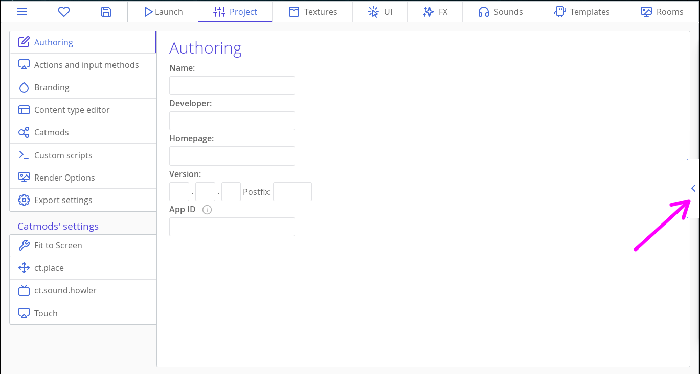
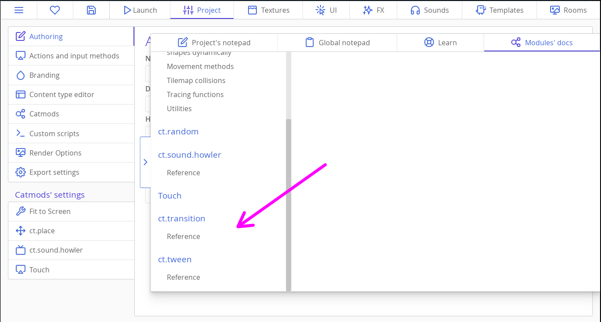

# Polindo o JettyCat

::: tip Hey,
Esse tutorial assume que você concluiu o tutorial [Criando Jogos: Jetty Cat](tut-making-jettycat.html). Você deve completá-lo primeiro.
:::

O jogo é completo em termos de mecânica, mas há várias maneiras de melhorá-lo esteticamente em termos de jogabilidade! Esta seção também destaca alguns recursos novos da versão 1.3 do ct.js.

[[toc]]

## Transição entre rooms(salas)

O ct.js tem um módulo chamado `ct.transition`. Ele permite que você facilmente crie boas transições entre as fases. A ideia é que você comece a primeira parte de uma transição ao pressionar um botão ou em algum outro evento, então mude para uma outra room e chame a segunda parte da transição em sua aba "On Create".

Habilite o módulo `transition` em "Catmods" na aba "Project localizada na parte superior da janela do ct.js. No próprio módulo está descrito que depende do `tween` catmod, então o habilite também.

Agora modifique o botão `Button_Play` em sua aba "On Step" para que ele mostre quando clicado uma transição circular azul:

```js
if (ct.touch.collideUi(this)) {
    if (!this.pressed) {
        this.pressed = true;
        ct.transition.circleOut(1000, 0x446ADB)
        .then(() => {
            ct.rooms.switch('InGame');
        });
    }
}
```

`this.pressed` ie a nossa variável de controle que guarda quando um botão foi pressionado. Ela ajudará a prevenir duplo clicks involuntários, que poderia ocasionar efeitos negativos na lógica do jogo.

O primeiro argumento em `ct.transition.circleOut(1000, 0x446ADB)` é a duração do efeito (1000 milissegundos = 1 segundo), e o segundo é a cor da transição. Ela é como as cores em hexadecimal, mas começando com o `0x` em vez do `#`.

::: tip Dica
Existem muito mais métodos e exemplos na aba da documentação de referência. Para acessá-la, click na seta(<) do painel recolhido à direita do ct.IDE, em seguida click na aba Module's docs, na coluna esquerda dessa aba você notará os itens `ct.transition` e `ct.tween`.




:::

A própria transição é uma ação assíncrona! Usamos o `.then(() => {…})` para mudar para a próxima room quando a transição terminar.

E essa foi a primeira parte da transição. Nessa segunda parte vá para a room `InGame` e em sua aba "On Create" adicione o trecho de código abaixo:

```js
ct.transition.circleIn(500, 0x446ADB);
```

Podemos também mostrar as nossas camadas de UI (o menu de pausa e tela de pontuação) deixando-as transparentes, mas lentamente tornanado-as opaca. Usaremos o `ct.tween`, aquele mesmo catmod que utilizado pelo `ct.transition`.

Várias entidades em ct.js têm os mesmos parâmetros que permite que você ajuste a sua aparência. Já usamos o `this.scale.x` e `this.scale.y` para definir o redimensionamento de uma copy, mas podemos aplicá-lo também para rooms, rótulos de texto, efeitos especiais e por aí vai. Além do redimensionamento, existem os parâmetros `this.angle`, `this.alpha` e `this.tint` que rotaciona o objeto, define a sua opacidade e a sua cor, respectivamente.

Mudaremos a propriedade `this.alpha` ao longo do tempo. Ele é um número entre 0 e 1. Quando definido para 1 — que é o seu valor inicial —, uma copy ou uma room será completamente opaca. Quando defindo para 0, ele será completamente invisível. Qualquer número entre eles fará com que o objeto seja translúcido ou parcialmente transparente. O módulo `ct.tween` ajudará a criar uma transição suave.

Então, para fazer a camada de UI aparecer de forma gradual, precisamos adicionar o trecho de código abaixo na aba "On Create" das rooms `UI_OhNo` e `UI_Paused`:

```js
this.alpha = 0;

ct.tween.add({
    obj: this,
    fields: {
        alpha: 1
    },
    duration: 500,
    useUiDelta: true
});
```

Primeiro fazemos com que a room fique completamente transparente com a definição da sua propriedade `alpha` para `0`. Em seguida chamamos o método `ct.tween.add` para iniciar uma transição suave. `obj` se refere ao objeto que deve ser animado, e `fields` lista todas as propriedades e valores que queremos alterar. A propriedade `duration` define a duração do efeito, em milissegundos. E finalmente, a pripriedade `useUiDelta` define que a animação deve executar em uma escala de tempo de UI, ingnorando assim o nosso estado de jogo "paused"(pausado).

Também podemos fazer uma camada de UI desaparecer. Vamos ocultar gradualmente o menu de pausa quando o player clicar/tocar no botão "continue". Abra o template `Button_Continue` e modifique o seu código:

```js
if (ct.touch.collideUi(this)) {
    if (!this.pressed) {
        this.pressed = true;
        ct.tween.add({
            obj: this.getRoom(),
            fields: {
                alpha: 0
            },
            duration: 1000,
            useUiDelta: true
        })
        .then(() => {
            ct.pixiApp.ticker.speed = 1;
            ct.rooms.remove(this.getRoom());
        });
    }
}
```

Criamos uma flag `this.pressed` para ter a certeza que o código executará a animnação apenas uma vez. Executá-lo várias vezes não vai doer, mas mantém o log(registro) do debugger(depurador) limpo, uma vez que o `ct.tween` alertará sobre as animações interrompidas.

Então iniciamos a animação para `this.getRoom()`, a qual retornará a room `UI_Paused` que é a dona desse botão, e altera o seu valor de opacidade( alpha) para 0. depois disso, podemos ver que `ct.tween.add` cria um evento assíncrono, e removemos a room e retomamos o jogo dentro da cláusula `.then(() => {…});`.

## Retomando suavemente o jogo após ter sido pausado

Embora o menu "paused" desapareça lentamente, ainda é complicado para o player manipular e prevenir que o gato caia no chão. Para prevenir isso, podemos usar o `ct.tween` para… animar o tempo! `ct.pixiApp.ticker.speed = 1;` não precisa ser apenas 0 e 1, mas qualquer coisa entre eles e até mesmo maior que 1. Valores altos farão com que o jogo execute mais rápido, enquanto que valores próximos de 0 executarão o jogo mais lentamente. Desse modo, podemos animar o valor `ct.pixiApp.ticker.speed` para fazer a transição do estado pausado para executando por completo.

Mais uma vez abra template `Button_Continue` e modifique o código para que dispare um outro `ct.tween.add` depois que o primeiro terminar:

```js {13,14,15,16,17,18,19,20}
if (ct.touch.collideUi(this)) {
    if (!this.pressed) {
        this.pressed = true;
        ct.tween.add({
            obj: this.getRoom(),
            fields: {
                alpha: 0
            },
            duration: 1000,
            useUiDelta: true
        })
        .then(() => {
            ct.tween.add({
                obj: ct.pixiApp.ticker,
                fields: {
                    speed: 1
                },
                duration: 1000,
                useUiDelta: true
            });
            ct.rooms.remove(this.getRoom());
        });
    }
}
```

Agora o player consegue manipular o jogo e evitar que o gato caia.

## O jato de fumaça do gato e as partículas de estrela

Desde a versão 1.3 que o ct.js permite que você crie efeitos de partículas visualmente e as reproduzas em seu jogo. E isso é perfeito! Vamos criar dois efeitos: uma será o jato de fumaça para o gato. O outro mostrará uma explosão de pequenas estrelas ao coletar uma estrela.

### Criando uma explosão de estrelas

Abra a aba "FX" localizada no topo da janela do ct.js e crie um novo emissor de partículas. Chame-o de `StarBurst`.

Escolha a sua textura no canto superior esquerdo e comece a ajustar os valores! Exitem várias que manipulam como as partículas se movem, como são alteradas ao longo do tempo e como são criadas.

Tente fazer algo que pareça com isso:


::: tip Dica
Você pode definir uma textura de visualização no canto inferior direito para ver como o seu efeito se parece em comparação com a estrela bônus.
:::

Aqui estão algumas instruções de como você pode criar esse efeito:

* Para fazer uma explosão e não um fluxo infinito, abra a seção "Spawning" e defina o clico de vida do emissor. Esse é um efeito tão rápido que você pricisará de valores pequenos como 0.1 segundos.
* A seção "Gravity" fará a estrelas cairem após explodirem. Você precisará editar os valores da vertical, o eixo Y, e com valores bem altos: Para esse efeito usei um valor em torno de 1400.
* Quando a gravidade está ativada, apenas o primeiro ponto de velocidade afeterá o movimento das partículas.
* Para fazer com que o efeito seja mais desigual e menos artificial, certifique-se que as partículas tenha um ciclo de vida diferente na categoria "Spawning", para que assim se tornem mais aleatória. Ajustar a velocidade mínima e o tamanho também ajuda.
* Um área circular relativamente grande que cobre a maior parte da textura de visualização fará com que o efeito se pareça mais como uma grande estrela se partindo em pedaços menores. Você pode definir a forma de gerar as partículas e o tamanho dessa forma na ctegoria "Shape and Positioning". Marque a caixa "Show shape visualizer" para ver a forma.

Quando você tiver terminado, click no botão "Apply" na parte inferior da coluna esquerda.

Para criar uma explosão de estrelas quando uma maior é coletada, vá para aba "Templates" e click em `Star`, navegue até a aba "On Destroy" e escreve a linha `ct.emitters.fire('StarBurst', this.x, this.y);`. Ta-da!

::: tip Dica
Aqui estamos lendo a posição da estrela (`this.x, this.y`) e dizendo para gerar um efeito `StarBurst`.
:::

### Criando um jato de fumaça

Abara a aba "FX" no topo da janela e crie um novo emissor de partículas. Chame-o de `Jet`.

Para iniciar, click no botão `Select` na categoria "Texture" e escolha a textura chamada `Circle_08`. No canto inferior direito, click no botão "Set preview texture" e selecione o nosso gato. Depois disso, sinta-se livre para escolher a melhor forma de construir o efeito desejado. Eu fiz um jato de bolhas brancas de tamanhos diferentes:


Aqui estão algumas instruções:

* Para uma melhor visualização das bolhas brancas, altere a cor de fundo clicando no botão "Change Background" no canto inferior direito;
* Comece alterando os campos de direção, localizado na aba Direction » Starting direction, para que as partículas fluam para baixo. Um bom intervalo de valores está entre 90 e 110 graus.
* O tamanho da textura padrão será muito grande; ajuste o seu tamanho no gráfico da seção chamada "Scaling", para alguma coisa em torno de `0.3`.
* Ajuste o valor de Scaling » Minimum size para gerar partículas de tamanhos diferentes.
* Posicione com precisão o emissor para que as partículas sejam geradas diretamente do jato, ajuste a posição do emissor na seção chamada "Shape and Positioning".
* Altere o valor de Spawning » Time between bursts para alterar a densidade do jato. Valores menores geram maiores quantidades de partículas.

Para adicionar o efeito ao gato, abra o seu template e vá para a aba "On Create", em seguida adicione depois da última linha o trecho de código abaixo:

```js
this.jet = ct.emitters.follow(this, 'Jet');
```

`ct.emitters.follow` diz para criar um efeito de partícula e determina que ele deve seguir a copy. Pra gente, ele parecerá que está anexado ao gato. O primeiro argumento é a cópia à qual queremos anexar o efeito (`this` é o nosso gato), o segundo é o nome do efeito (`'Jet'`).

Também guardamos uma referência desse emissor para a propriedade `this.jet`. Isso nos permitirá manipular o emissor depois.

::: tip Dica
Leia [a documentação para o `ct.emitters`](ct.emitters.html) para aprender mais sobre outros métodos para a criação de efeitos e as suas opções.
:::

O gato agora deve ter um jato de fumaça saindo de sua jetpack(mochila a jato). Você pode precisar ajustar o tamanho das partículas do jato e a sua velocidade na aba "FX".

Vamos adicionar um pouco de dinamismo para esse jato: vamos gerar novas partículas apenas quando o gato voar. Temos a referência `this.jet` e podemos usá-la para pausar o emissor e retomar o mesmo quando o player clicar/tocar ou soltar a tela.

Abara a aba "On Step" e adicione o trecho de código abaixo depois da condição "game over":

```js
if (ct.actions.Poof.released) {
    this.jet.pause();
}
```

Isso pausará o efeito. Para retomá-lo, adicione o trecho de código abaixo para a condição com `if (ct.actions.Poof.down) {…}`:

```js
this.jet.resume();
```

E isso é tudo para as partículas; é hora de fazer algum teste!

## Adicionando animações sutis para o gato e para as estrelas

As partículas ajudam a dá vida ao jogo. Mas ele ainda podem parecer rígido e estático. Vamos adicionar pequenas animação ao gato e às estrelas. Rotacionaremos o gato de acordo com a sua velocidade vertical e as estrelas de acordo com o tempo.

### Rotacionando o gato

Toda copy tem um parâmetro `this.angle`, que define em graus o ângulo de uma textura. Toda copy também tem o parâmetro `this.speed` e `this.direction`, que já usamos anteriormente, ambas definem parâmetros adicionais `this.vspeed` e `this.hspeed` — a velocidade vertical e horizontal decomposta a partir de speed(velocidade) e direction(direção). Eles, speed e direction, podem ser valores negativos quando uma copy se move na direção oposta do sentido de percuso do eixo. (Por exemplo, o sentido de percurso do eixo X é para direita, o que significa que os seus valores vão crescendo da esquerda para a direita. Mover para direita vai tornar `hspeed` positivo, enquanto que movê-lo para a esquerda vai torná-lo negativo.)

Podemos amarrar `this.vspeed` e `this.angle` ao gato para que ele rotacione/gire ao cair ou ao voar. Isso é feito simplesmente atribuíndo uma linha de instrução na aba "Draw".

Abaixo segue a linha que vai fazer isso funcionar:

```js
this.angle = -this.vspeed;
```

Embora isso resulte em uma rotação muito forte. Adicionar um fator multiplicador fará com que se pareça melhor:

```js
this.angle = -this.vspeed * 0.3;
```

### Rotacionando as estrelas

Com as estrelas não podemos simplesmente amarrar o `this.angle` a alguma valor do ct.js. Podemos definir o nosso próprio, entretanto precisaremos de um pouco de mátemática para obter bons números de rotação. Tudo isso pode fazer você lembrar dos nossos temporizadores de geração/criação.

Abara o template `Star`, e adicione o trecho de código abaixo na aba "On Create":

```js
this.wiggleTime = 0;
```

Em seguida, na aba sua "Draw", adicone o trecho de código abaixo:

```js
this.wiggleTime += ct.delta * 0.2;
this.angle = Math.sin(this.wiggleTime) * 5;
```

Aqui alteramos o `this.wiggleTime` a cada frame pelo tempo decorrido, multiplicado por 0.2 para desacelerar a animação. Então usamos `Math.sin` para obter seno de `wiggleTime` — alterar o último a cada frame resultará em uma oscilação suave entre -1 e 1. Multiplicando o mesmo por 5, faremos com que o efeito seja cinco vezes mais forte.


## Adicionando uma dica para começar a click/tocar na tela

Vamos usar a mesma abordagem para criar uma dica visual para que o usuário comece a clicar/tocar na tela! Será um ícone de mão pulsante.

Creie um novo template chamado `PressHint` com a `PressHint`. Certifique-se que a textura tem o seu eixo no centro.

Na aba "On Create" do template, adicione uma linha `this.pulsePhase = 0;`. E em sua aba "On Step", adicone o trecho de código abaixo:

```js
this.pulsePhase += ct.delta * 0.2;

this.scale.x = this.scale.y = 1 + Math.sin(this.pulsePhase) * 0.1;

if (ct.actions.Poof.pressed) {
    this.kill = true;
}
```

Aqui estamos passando a propriedade `this.pulsePhase` para `Math.sin`. Definimos um redimensionamento vertical e horizontal da copy para uma onda senoidal mais `1`, esse `1` é para que a copy não seja reduzida de tal forma que nem possamos vê-la. (Sem esse `1 +`, a onda seno oscilaria próximo de 0, o significa perto de 0% do tamanho da copy.)

Quando o usuário clicar/tocar na tela, `ct.actions.Poof.pressed` torna-se `true`, e aqui é onde removemos a copy tão logo o usuário comece a manipular o gato.

O último passo é adicioinar essa copy para `UI_InGame`, em algum lugar no centro da view.

## Animando o background no menu principal + efeito parallax

O efeito parallax é utilizado no desenvolvimento de jogos desde muito tempo atrás — uma vez que os processadores dos console ficaram fortes o suficiente para renderizar os backgrounds(planos de fundo). O efeito é feito através do movimento de várias camada de background em diferentes velocidades para produzir o efeito de profundidade. Embora não tenhamos um efeito forte nesse tutorial, aprenderemos como definir backgrounds em ct.js e como animar o nosso menu principal e a view de forma geral.

Vá para a room `MainMenu` e abra a aba "Backgrounds" na coluna esquerda. Em seguida, click no ícone de engrenagem próximo ao background `BG_Sky`. Precisaremos mover o background lentamente da esquerda para a direita para que assim as nossas nuvens se movam. Defina a "Movement speed"(Velocidade de movmento) para `-1`, `0`. Esses valores dizem ao background para ele se mover no sentido contrário(da direita para a esquerda) ao do eixo x, um pixel por segundo.


Em seguida, vá para a room chamada `InGame`. Abra as mesmas definições de background `BG_Sky`. Defina o seu valor parallax para 0.25:  isso dirá ao background para se mover quatro vezes mais lento que o restante da room, criando assim o efeito de profundidade.


O menu principal agora terá um céu animado, o céu da room principal se moverá visivielmente mais devagar que qualquer outro objeto na room. Limpo, elegante e agradável!

## E isso é tudo!

O jogo está polido e parece bastante agradável, show de bola! É hora de ler outros tutoriais ou criar um novo jogo do zero!

Boa codificação!
