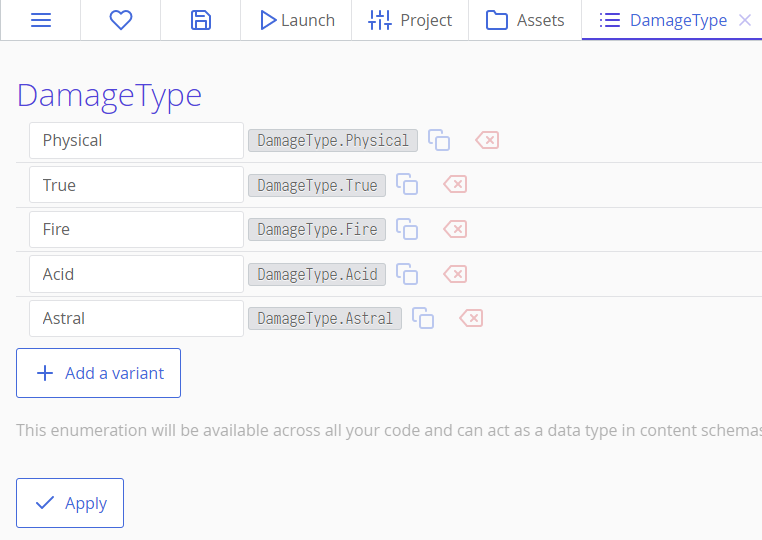
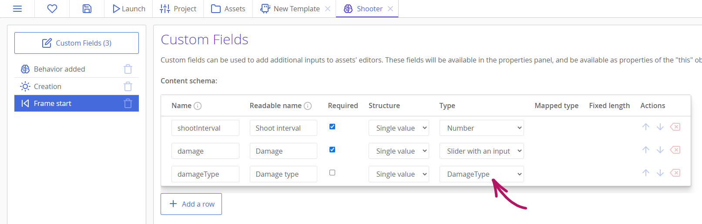
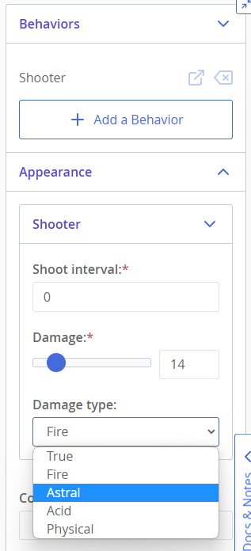

# Перечисления

В принципе, перечисления представляют собой тип из языка TypeScript, который можно редактировать в ct.js. Их обычно используют для описания типа, имеющего несколько вариантов значений. Например, в фентезийной игре вы можете создать перечисление Тип Урона с такими значениями: физический, истинный, огненный, кислотный и астрологический урон. Затем вы можете эффективно использовать это перечисление в своем коде для определения того, к чему применять какой тип атаки. Под капотом эти значения будут компилироваться в простые числа, но ваш код будет читаемым и определенным типом.



Если вы используете JavaScript, TypeScript или CoffeeScript в своем проекте, значения перечислений будут доступны по адресу `YourEnumerationName.VariantName`, например, в редакторе перечислений. Для Catnip создается специальный блок в категории Свойства для каждого перечисления в вашем Проекте.

## Приведение значений перечислений обратно в имена

Вы можете получить имя варианта перечисления следующим образом:

```js
var damageType = DamageType.Fire;
console.log(damageType); // вернет целое число, соответствующее этому типу урона
console.log(DamageType[damageType]) // вернет 'Fire'
```

Это обычно полезно только для отладки вашей игры или для отображения значений в интерфейсе пользователя, если ваша игра не требует перевода этих имен.

## Использование перечислений в типах контента и поведениях

Каждое перечисление становится типом поля в пользовательских полях поведения и типах контента. Такие поля создадут поля с выпадающим меню — выбором. Во время экспорта эти значения будут заменены целыми числами, соответствующими выбранным вариантам значений.



