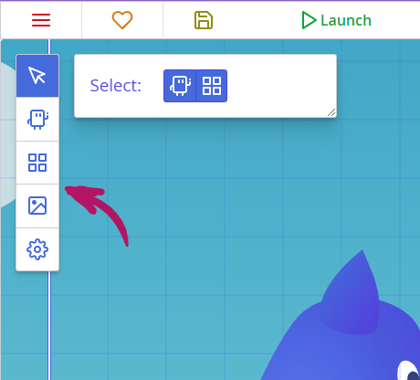
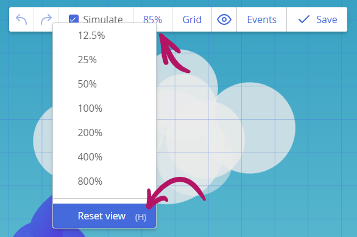
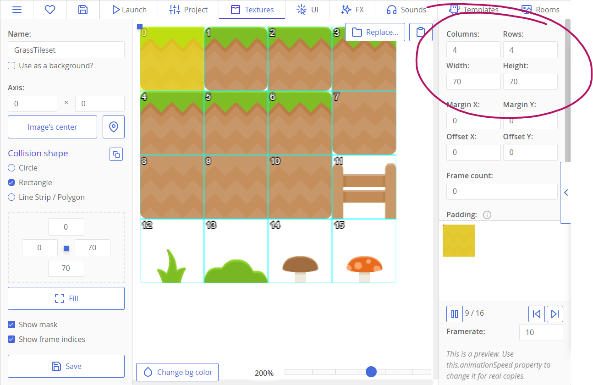
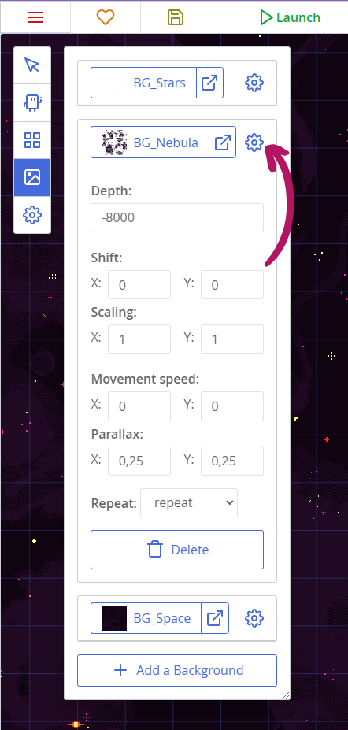
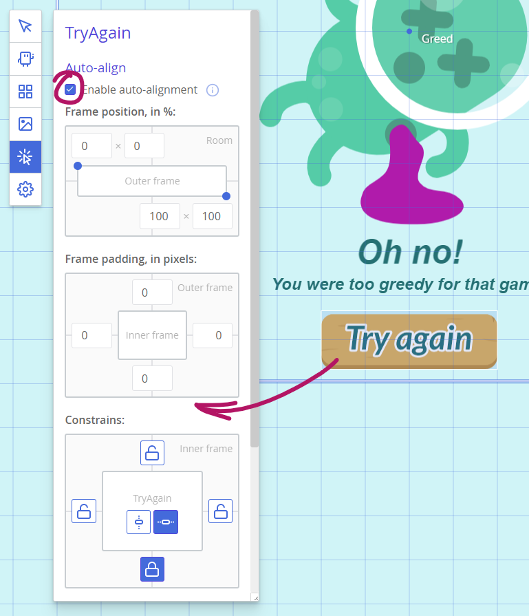
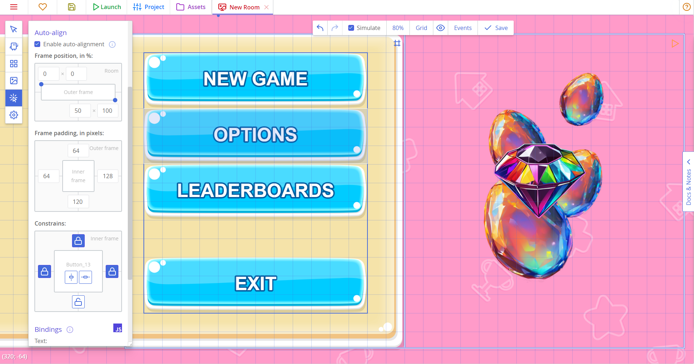
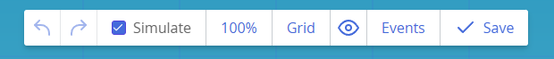
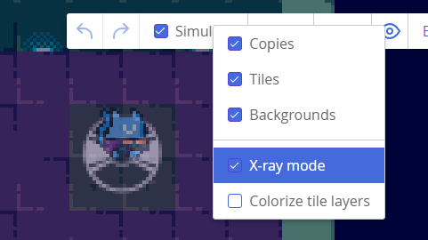
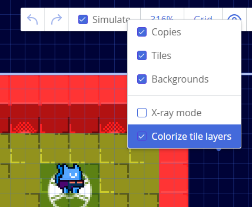

# Использование редактора комнаты

::: note Автоматически переведённая страница
К сожалению, на полный ручной перевод у нас не хватает ресурсов.
Если вы увидели ошибку — отправьте пул-риквест с исправлениями (ссылка для редактирования в конце страницы).
:::

Комнаты — это пространства, где происходит ваша игра. Комната может представлять уровень, меню, виджет интерфейса и т. д., и это место, где вы размещаете свои копии (инстанции шаблонов), фоны и тайлы. Понимание того, как использовать его наилучшим образом, облегчит процесс разработки уровней.

Начиная с версии 3.0, в редакторе комнаты есть пять инструментов, расположенных в левом панели:

* Инструмент выбора для перемещения, масштабирования, вращения и настройки других способов ваших объектов. Он поддерживает как копии, так и тайлы.
* Инструмент "Добавить копии" для размещения новых копий в уровне — инстанции ваших шаблонов.
* Инструмент "Добавить тайлы" для размещения неподвижных текстурных фрагментов для создания структуры уровня и просто для декорирования.
* Инструмент "Управление фонами", который открывает панель, в которой вы можете добавлять и управлять своими фонами — повторяющимися фоновыми изображениями с декоративной целью.
* Инструмент "Свойства комнаты" с настройками комнаты и камеры.

## Переход по комнате

Перемещение:

* Нажмите и удерживайте среднюю кнопку мыши (колёсико), чтобы переместить курсор, перемещая камеру.
* Вы можете масштабировать с помощью колесика мыши — это будет масштабировать место, на которое вы указываете.

::: tip
Если вы потерялись, нажмите клавишу «H», чтобы вернуться в центр уровня и сбросить масштаб. Вы также можете найти эту команду в выпадающем меню масштабирования:

:::

## Добавление копий и плиток

Инструменты для добавления новых копий и плиток имеют похожую функциональность.

* По умолчанию вы можете создавать несколько копий или плиток, нажав и проведя мышью. Если включен сетка, каждая копия и плитка будут прилипать к ней; в противном случае они будут размещаться свободно с учетом ранее установленного размера сетки.
* Если зажать клавишу `Shift`, прежде чем начать размещать плитки или копии, ваши копии и плитки будут располагаться по прямой линии — диагональной, вертикальной или горизонтальной.
* Если зажать `Shift` и `Ctrl`, можно будет разместить объекты заполненным прямоугольником.
* Если вы нажимаете клавишу `Alt`, временно отключается прилипание к сетке.
* Наконец, если вы нажимаете клавишу `Ctrl`, вы сможете удалять объекты с помощью курсора, как с помощью зилка.

### Работа с плитками

Для работы с плитками требуется текстура, настроенная правильно: убедитесь, что вы установили правильный размер кадра и количество колонок и строк в ваших наборах плиток. Во всяком случае, любая текстура ct.js может работать как плитка, даже если у нее всего одна кардина. Вы можете использовать ее для размещения статичных украшений внутри ваших комнат.

Вот пример правильно настроенного набора плиток:

Чтобы начать работу с плитками, нажмите на инструмент "Добавить плитки" в левой панели редактора комнат и нажмите кнопку "Найти набор плиток". Убедитесь, что у вас есть слой плиток — они перечислены прямо под выбранной текстурой. Если у вас его нет, нажмите кнопку "Добавить слой плитки" и введите его глубину.

Затем выберите плитку на текстуре, которую вы импортировали, и поместите ее в комнату с помощью щелчка мыши. Вы также можете выбрать несколько плиток, нажав и перетащив указатель через несколько кадров. После этого начните рисовать плитками с помощью мыши.

:::tip
Помните, что каждая плитка размещается на слое плиток определенной глубины — размещение каждой плитки на произвольной глубине уровня невозможно.

Создание большого количества слоев также не рекомендуется, потому что 1) это глупо, и 2) каждый слой плиток кэширует свои контексты для повышения производительности отрисовки, и если вы все же используете много слоев, это аннулирует повышение производительности и ухудшит ситуацию с использованием оперативной памяти.
:::

## Инструмент выбора

Инструмент выбора, вероятно, самый мощный творческий инструмент в редакторе комнаты — он работает аналогично программам для обработки изображений, позволяя перемещать, вращать, масштабировать и даже изменять цвет нескольких элементов одновременно.

При активированном инструменте выбора перетаскивайте мышь по копиям или плиткам, чтобы нарисовать прямоугольник и выделить их. Вы также можете выбрать отдельные объекты, щелкнув по ним.

:::tip
Вы можете изменить, какие элементы выбраны, а какие игнорируются, переключая их рядом с заголовком "Выбор".
:::

Когда у вас есть что-то выбранное, появится прямоугольник со многими цветными ручками:

* Ручка в уголках прямоугольника масштабирует выделение при перетаскивании;
* Ручка по бокам масштабирует выделение горизонтально или вертикально.
* Ручка, плавающая справа, вращает выделение.

При работе с ручками масштабирования вы можете использовать следующие клавиши-модификаторы:

* Нажатие клавиши "Shift" сделает діагональні ручки масштабировать выделение пропорционально;
* Нажатие клавиши "Alt" игнорирует сетку;
* Использование клавиши "Ctrl" сделает выделение масштабироваться в обоих направлениях.

При вращении объектов удерживайте клавишу "Shift", чтобы вращать их в множестве из 15 градусов.

Вы также можете изменять значения в панели свойств слева, но имейте в виду, что, в отличие от рамки выбора, которая преобразует все как группу, панель свойств изменяет значения для каждого объекта отдельно.

## Добавление фона

Фоны добавляются в четвертом инструменте редактора комнаты. Внутри него есть кнопка "Добавить фон", которая открывает селектор текстур. Существует несколько моментов, которые следует учитывать при использовании фонов:

* Текстура должна быть помечена как фон; в противном случае у нее будут разрывы и дыры по швам. появится предупреждение, если вы попытаетесь использовать обычную текстуру.
* Многофреймовые фоны пока не поддерживаются.

Вы можете изменить текстуру фона, нажав на текущую текстуру. Другие свойства скрыты в панели, которую можно открыть, нажав на значок шестеренки.

* Глубина меняет порядок рисования относительно копий, плит и других фонов. Установка более высокого значения приведет к тому, что он будет рисоваться поверх других вещей.
* Перемещение смещает фон в комнате.
* Масштабирование растягивает фон. Значения меньше 1 сделают его меньшим, а значения больше 1 сделают большим. Использование отрицательных значений перевернет фон.
* Скорость движения позволяет создавать движущиеся фоны. Это может быть использовано для создания эффектов падающего дождя или движущихся облачков.
* Параллакс изменяет то, как фон двигается относительно камеры. Вы можете установить значения меньше 1, чтобы создать ощущение глубины. Значения больше 1 обычно используются для переднего плана.
* Полоса "Повторять" позволяет выбрать, как будет тянуться фон:
  * `repeat` означает, что фон будет тянуться в обоих направлениях.
  * `repeat-x` будет тянуть фон только по горизонтали.
  * `repeat-y` будет тянуть фон только по вертикали.
  * `no-repeat` не будет тянуть фон вообще.

## Инструменты пользовательского интерфейса

Эта панель позволяет регулировать внешний вид и положение копий, в основном используется для настройки элементов графического пользовательского интерфейса. Содержимое инструментов UI зависит от того, какая копия выбрана.

Эти инструменты могут:

* Изменить шрифт и текст кнопок и текстовых меток;
* Выровнять копии относительно рамки комнаты (или той, которую вы определили), чтобы они автоматически подстраивались под разные размеры экрана;
* Добавить привязки к общим свойствам с помощью выражений JavaScript.

### Инструмент автоматического выравнивания

Инструмент включается с помощью флажка, и **только работает для комнат UI**. (Вы можете изменить тип комнаты в панели свойств.)

Инструмент имеет три редактируемые диаграммы, которые описывают положение и отступы рамки, к которой вы ссылаетесь, и как выравниваете копии относительно этой рамки.

Диаграммы следующие:

* **Внешняя рамка положения.** Она определяется верхними левыми и нижними правыми точками, и их положение измеряется в процентах от размеров просмотра комнаты.
* **Отступы рамки**, определенные для каждого из четырех сторон в пикселях.
* **Ограничения.** Горизонтальные и вертикальные ограничения влияют на копии отдельно.
  * Каждая заблокированная сторона означает, что расстояние от соответствующей стороны копии до края рамки не изменится при изменении размеров экрана. Блокировка одной стороны будет прикреплять копию к ней, блокировка обеих противоположных сторон будет заставлять копию растягиваться с фиксированными промежутками вокруг нее.
  * Нажатие на центральные кнопки заставит копию расположиться относительно центра рамки.
  * Отключение всех запоров и центрирования будет заставлять копию масштабироваться относительно рамки.

:::tip
Как только вы измените свою комнату, чтобы она была слоем UI, вы можете протестировать настройки автоматического выравнивания, изменив размеры просмотра комнаты.
:::

Если вы хотите выровнять копию относительно краев просмотра, вы можете пропустить первые две диаграммы. Но с ними, например, вы можете выровнять копию относительно столбца, занимающего 50% экрана.

Рассмотрим ужасный неестественный пример:

Панель под кнопками занимает именно 50% экрана. Его рамка выравнивания имеет стандартные параметры, так как она расположена относительно просмотра, и ее ограничения блокируют верхние и нижние стороны, поэтому между копией и панелью нет пробела, а горизонтальные ограничения отключены, поэтому панель растягивается вместе с просмотром и по-прежнему занимает именно 50% экрана.

Кнопки придется расположить относительно панели, поэтому их рамка положения установлена на 0;0 – 50;100. Это делает внешнюю рамку совпадающей с панелью. (Обратите внимание на рамку с символом `#`.)

Панель также имеет отступы, так что мы добавляем эти отступы к отступам кнопок. Обвод внутри панели покажет исходную справочную рамку для кнопок.

Все кнопки имеют горизонтальные ограничения, поэтому они хорошо растягиваются по горизонтали. Верхние кнопки имеют верхние ограничения, а нижняя кнопка имеет нижнее ограничение. Это заставляет их цепляться к верхним и нижним сторонам панели соответственно.

### Связывающие переменные

Связующие переменные используются для автоматического изменения свойств копий при изменении значения выражения связывающей переменной. Это можно использовать для создания динамических текстовых меток без необходимости создавать отдельную шаблонную метку или, например, изменить цвет кнопки при выполнении определенных условий.

Связующие переменные должны быть написаны на JavaScript. Например:

* `rooms.current.score` для текстовой метки, показывающей текущий счет.
* `'Счет: ' + room.current.score` показывает текущий счет и добавляет перед ним метку «Счет:».
* `` `Счет: ${rooms.current.score}` `` использует шаблон строки JS, который делает то же самое.
* `rooms.current.money < 50` может использоваться в поле «Отключить» кнопки для предотвращения ее использования, когда у игрока недостаточно денег.

## Свойства комнаты

В вкладке "Свойства" редактора комнаты представлены параметры для настройки рендеринга и камеры.

* View width/height задают начальный размер камеры — область, которую она отображает. Поскольку разрешение и размер полотна для рендеринга в ct.js гибкие благодаря `ct.fittoscreen`, эти значения не соответствуют разрешению экрана. Они просто устанавливают, сколько области показывает ваша камера и какое у нее соотношение сторон. Остальное регулируется `ct.fittoscreen` (и вы можете изменить его параметры во вкладке "Проект").
* Флажок "Ограничить камеру по прямоугольнику" отображает параметры для ограничения области, которую может показать камера. По умолчанию комнаты и камеры в ct.js не имеют границ, но при включении флажка границы камеры не будут выходить за заданную область.
* "Цвет фона" устанавливает цвет областей, которые не покрыты копиями, плитками или текстурами фона.
* Флажок "Это слой интерфейса" указывает, как будет размещаться комната при использовании внутри другой комнаты. Слой интерфейса следует за камерой и не подвержен масштабированию, что идеально подходит для элементов управления интерфейсом.

:::tip
Для получения дополнительной информации о слоях интерфейса см. [справочную информацию о методах append/prepend](./rooms.md#ct-rooms-append-nameoftheroom-ext) или [см. пример их использования в руководстве по созданию JettyCat](./tutorials/making-jettycat.md#создание-меню).
:::

## Дополнительные инструменты

В верхней панели инструментов редактора комнаты есть несколько дополнительных инструментов.

* Первые две кнопки отменяют или повторяют последние изменения в комнате (`Ctrl+Z`, `Ctrl+Shift+Z` горячие клавиши). Помните, что история ограничена примерно 30 действиями!
* Переключатель " Simulate" включает или отключает анимацию спрайтов и фонов в комнате.
* Селектор масштабирования позволяет изменить масштаб, если у вас нет указателя с колесиком. Он также имеет опцию вернуться в центр комнаты.
* Кнопка "Мешок" имеет подменю со следующими пунктами:
  * Включение/отключение сетки (`Ctrl+G` горячая клавиша);
  * Включение диагональной сетки. Если вам нужна псевдо-изометрическая сетка, установите соотношение сетки 1:2;
  * Изменение сетки размера.
* Меню "Око" имеет переключатели для скрытия/отображения конкретных сущностей в уровне. Оно также имеет два специальных режима просмотра:
  * Рентген-режим: делает всё прозрачным, позволяя видеть сквозь объекты. Полезно для размещения секретов и поиска проблем накладывания.
  
  * Целевые цветовые слои плит: кодирует каждый слой плит по цвету, чтобы визуально отличать, где находятся плиты.
  
* Кнопка "События" открывает редактор сценариев со всеми событиями текущей комнаты.

## Горячие клавиши

* Кнопки «Q», «W», «E», «R» и «T» переключают инструменты: «Q» включает инструмент выбора, «W» переключает добавление копий и т. д.
* `Ctrl+Z` отменяет последнее изменение. `Ctrl+Shift+Z` повторяет его.
* `Ctrl+C` копирует выбранный контент, а `Ctrl+V` вставляет его (функция работает только с инструментом выбора).
* `Ctrl+G` включает сетку.
* Вы можете перемещать выбранные объекты, используя клавиши со стрелками. Нажатие клавиши со стрелкой + `Ctrl` отключает прилипание к сетке.

