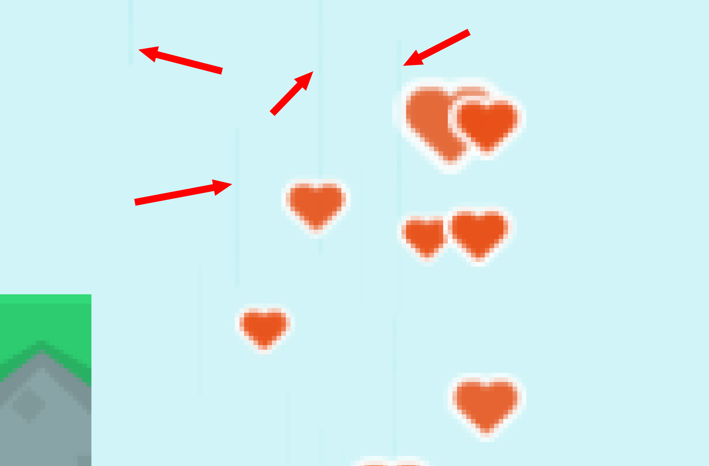
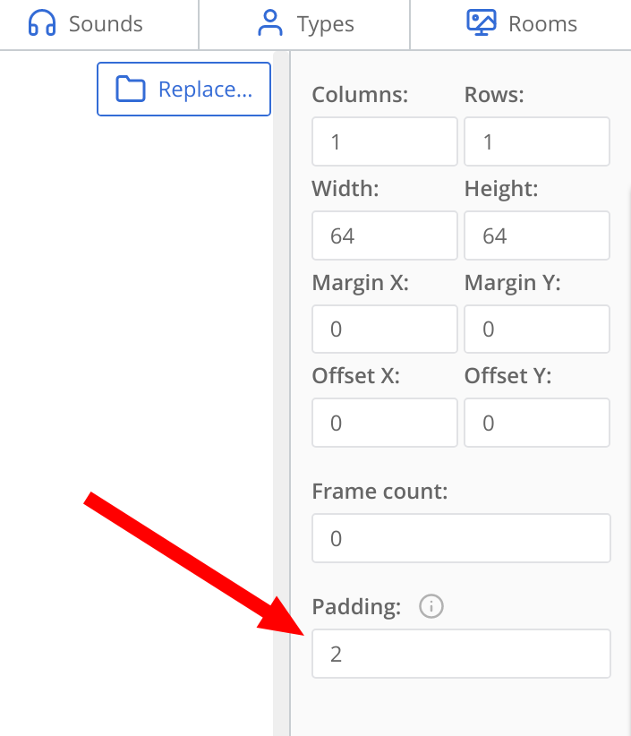
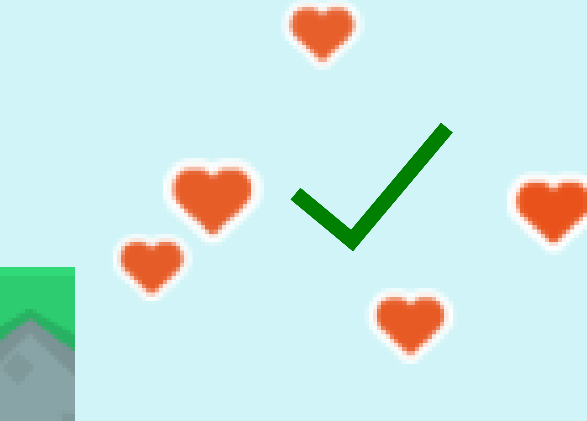

# У масштабированных копий или частиц в игре ct.js есть странные края! Что мне делать?

::: note Автоматически переведённая страница
К сожалению, на полный ручной перевод у нас не хватает ресурсов.
Если вы увидели ошибку — отправьте пул-риквест с исправлениями (ссылка для редактирования в конце страницы).
:::

Вы можете заметить размытие/утечку артефактов на ваших текстурах, особенно при использовании сильно масштабированных текстур. Это особенно распространено в системах частиц. Эффект может быть слабым или сильным в зависимости от того, как вы используете свои текстуры и как они упакованы для игры.

Ниже приведен пример того, как это может выглядеть в системах частиц (обратите внимание на темные вертикальные линии — они не должны присутствовать):

Это можно исправить, увеличив заполнение затронутой текстуры несколькими пикселями. Откройте текстуру и найдите поле «Заполнение»:

Вам может потребоваться установить его всего на 2 пикселя (в моем случае этого хватило), но, чем больше текстура масштабируется, тем больше требуется большее заполнение. Тем не менее, стремитесь к самому низкому необходимому значению, поскольку большие значения могут увеличить количество текстурных атласов в вашей игре, что влияет на производительность при чрезмерном использовании.

Обратите внимание, что если у вас возникают проблемы с фоном, скорее всего, у вас другая проблема, которая [описана здесь](./teared-background.md).

