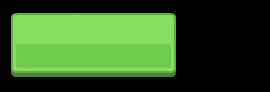

# Руководство по миграции

::: note Автоматически переведённая страница
К сожалению, на полный ручной перевод у нас не хватает ресурсов.
Если вы увидели ошибку — отправьте пул-риквест с исправлениями (ссылка для редактирования в конце страницы).
:::

Версия 1.0 немного отличается от 0.5.2 и предыдущих версий ct.js. Эти изменения включают в себя перемещение и, в большей степени, рисование. Ниже приведены некоторые советы и примеры того, как обновить ваш проект 0.x до 1.x.

## Общие изменения

### Движение

Движение в основном остается таким же, хотя следует отметить, что некоторые переменные теперь переименованы, а их старые варианты устарели и работают немного медленнее:

- `dir` теперь называется `direction`;
- `spd` → `speed`;
- `grav` → `gravity`;
- `dravdir` → `gravityDir`.

Такие переменные, как `speed`, `gravity`, по-прежнему отражают количество пикселей, добавляемых каждый кадр, но, поскольку стандартная частота кадров теперь составляет 60, вам нужно разделить их вдвое, если вы использовали 30 кадров в секунду.

Кроме того, были представлены две новые переменные: `hspeed` и `vspeed`. Вы можете читать и записывать в них значения.

Изменения в реализации: по умолчанию система движения теперь основана на вертикальном и горизонтальном скорости, а не на направлении и общей скорости. В результате могут возникнуть некоторые несоответствия, особенно при конкретных порядках выполнения инструкций:

```js
this.speed = 4;
this.direction = 90;
```

В этом случае `this.vspeed` будет равно -4.

```js
this.direction = 90;
this.speed = 4;
```

Заявление `this.direction = 90` здесь бессмысленно, поскольку `this.vspeed` и `this.hspeed` равны нулю, а это вращение не оказало никакого эффекта.

При создании инкрементального движения без использования переменных по умолчанию или добавлении ускорения необходимо умножать ваши значения на `ct.delta`. Вместо этого:

```js
this.speed += 0.5;
this.x -= 10;
```

Написать так:

```js
this.speed += 0.5 * ct.delta;
this.x -= 10 * ct.delta;
```

Это не является обязательным, но рекомендуется, поскольку помогает обеспечить последовательное движение при любой частоте кадров.

Метод `this.move()` использует `ct.delta`, поэтому по умолчанию система движения будет последовательной при любой частоте кадров.

### Трансформации (`Не удается создать свойство '_parentID' у логического значения 'true'` )

Если вы напишете `this.transform = true`, ваша игра сейчас ломается, так как `transform` теперь является объектом.

Вместо того, чтобы писать:

```js
this.transform = true;
this.tx = 0.5;
this.ty = -1;
this.tr = 45;
this.ta = 0.5;
```

Напишите это:

```js
this.scale.x = 0.5;
this.scale.y = 0.5;
this.rotation = 45;
this.alpha = 0.5;
```

### Границы видимости

Вместо использования `ct.room.width` и `ct.room.height` используйте только `ct.viewWidth` и `ct.viewHeight`. Эти понятия различны, а значения `ct.room.width` и `ct.room.height` могут меняться с течением времени.

::: warning
Что-то изменилось в версии 1.3. См. руководство по миграции [здесь](./migration-1-2to1-3.md). Коротко говоря, теперь `ct.room.width` равно `ct.camera.width`, а `ct.room.height` равно `ct.camera.height`, но есть нюансы при масштабировании или вращении камеры.
:::

### Таймеры

Вместо:

```js
this.shootTimer--;
```

Лучше написать:

```js
this.shootTimer -= ct.delta;
```

## Рисование

Прежде всего: вы не можете прямо рисовать на событии Draw в настоящее время. Вместо этого вы должны создать объект для рисования (например, в событии On Create), добавить его в свою комнату или прикрепить к объекту, образуя своего рода виджет.

### Отрисовка текстовых меток

Вместо:

```js
ct.styles.set('ScoreText');
ct.draw.text('Score: ' + this.score, 20, 20);
ct.styles.reset();
```

Напишите в коде On Create следующее:

```js
this.scoreLabel = new PIXI.Text('Score: ' + this.score, ct.styles.get('ScoreText'));
this.scoreLabel.x = this.scoreLabel.y = 20;
this.addChild(this.scoreLabel);
```

И обновляйте метку в событии Draw:

```js
this.scoreLabel.text = 'Score: ' + this.score;
```

### Геометрия рисования

Для этого используйте [PIXI.Graphics](https://pixijs.download/release/docs/PIXI.Graphics.html). Его API похоже на API HTMLCanvas, и один объект PIXI.Graphics может содержать больше одной фигуры.

Пример (на событии Create):

```js
var overlay = new PIXI.Graphics();
overlay.beginFill(0x5FCDE4);
overlay.drawRect(0, 0, 59, 48);
overlay.endFill();
overlay.alpha = 0.65;

this.addChild(overlay);
```

### Создание полос здоровья, маны и т. д.

Для этого рассмотрим возможность использования встроенного [9-слойного масштабирования](https://en.wikipedia.org/wiki/9-slice_scaling). Вам нужно использовать изображение, которое можно растягивать по горизонтали и/или вертикали, например:


Добавьте это в код On Create:

```js
this.healthBar = new PIXI.mesh.NineSlicePlane(
    ct.res.getTexture('Healthbar', 0),
    8, 8, 8, 16); /* это также можно записать в одной строке */
this.addChild(this.healthBar);
this.healthBar.x = this.healthBar.y = 32; /* где разместить эту полосу */
this.healthBar.height = 64;
this.healthBar.width = ct.game.health * 2; // Предполагается, что максимальное здоровье равно 100, и вы хотите, чтобы ширина полосы составляла 100×2 = 200 пикселей
```

И обновляйте ее на каждом шаге следующим кодом:

```js
this.healthBar.width = ct.game.health * 2;
```



Константы `8, 8, 8, 16` указывают, какие области не следует растягивать, в этом порядке: слева, сверху, справа и снизу.

Фон для этих полос можно создать таким же образом.

### Рисование статичных изображений

Существует два способа сделать это:

1. Создание нового шаблона, который будет отображать нужное изображение;
2. Или создание PIXI.Sprite и добавление его в комнату (или в объект).

Второй подход может быть реализован следующим образом:

```js
this.coinIcon = new PIXI.Sprite(ct.res.getTexture('coinGold', 0));
this.coinIcon.x = 20;
this.coinIcon.y = this.y + 35;
this.addChild(this.coinIcon);
```

## Изменения с 1.0.0-next-1 до 1.0.0-next-2

Для работы с разными разрешениями теперь следует использовать `ct.viewWidth` и `ct.viewHeight` вместо `ct.width` и `ct.height`. Последние теперь обозначают размер полотна для рисования, который не всегда совпадает с вашим просмотром, особенно при использовании новых режимов масштабирования `ct.fittoscreen`.

## Изменения в версии 1.0.0-next-3

### Поддержка клавиатуры и мыши

В ct.js теперь используются действия для сопоставления ввода пользователя с событиями игры. Вы можете узнать о действиях [здесь](../actions.md). Из-за этого `ct.mouse` больше не является частью ядра и теперь является catmod.

Все старые проекты будут автоматически работать с `ct.mouse.legacy` и, при необходимости, с `ct.keyboard.legacy`. Они соответствуют предыдущему поведению этих модулей и не должны вызывать проблем совместимости.

Новый `ct.keyboard` больше не имеет `ct.keyboard.pressed`, `ct.keyboard.down` и `ct.keyboard.released`. Вместо этого он полностью полагается на новую систему действий.

### Графика -> Текстуры

Теперь графические ресурсы, графические активы и т. д. называются "Текстурами".

Теперь, вместо написания в коде `this.graph = 'Сосиска';` для изменения текстуры, нужно писать `this.tex = 'Сосиска';`.

