# Пишем игры: платформер

В этом уроке мы создадим маленький платформер с изумрудами, чекпоинтами, движущимися платформами и ловушками! Вы узнаете, как обнаруживать столкновения, использовать их для создания движения с видом сбоку, а также как управлять спрайтами и перемещать игрока между уровнями.

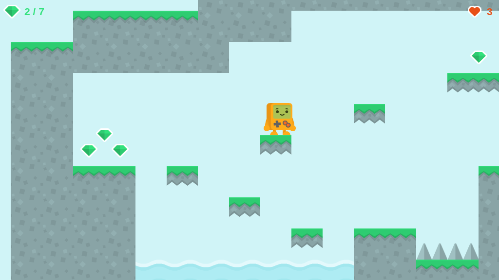

## Создание проекта

Откройте ct.js и создайте новый проект "Platformer".

## Импорт текстур

Нам понадобится парочка ассетов из [упрощённого набора для платформеров от Kenney](https://www.kenney.nl/assets/simplified-platformer-pack). Эти же ассеты можно найти в папке `ctjs/examples/Platformer_assets/`.

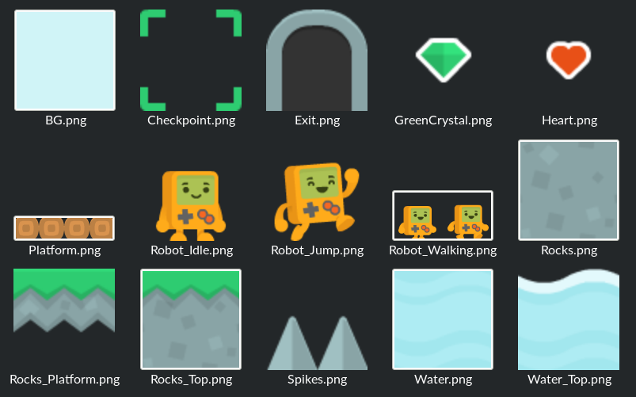

Откройте вкладку «Текстуры», нажмите кнопку «Импорт», перейдите в папку `ctjs/examples/Platformer_assets/` и выберите там все изображения. Они появятся на панели текстур.

Сразу можно заметить, что анимация `Robot_Walking` учитывается как одно изображение, а не как два отдельных кадра. Нужно исправить! Нажмите на текстуру `Robot_Walking`.

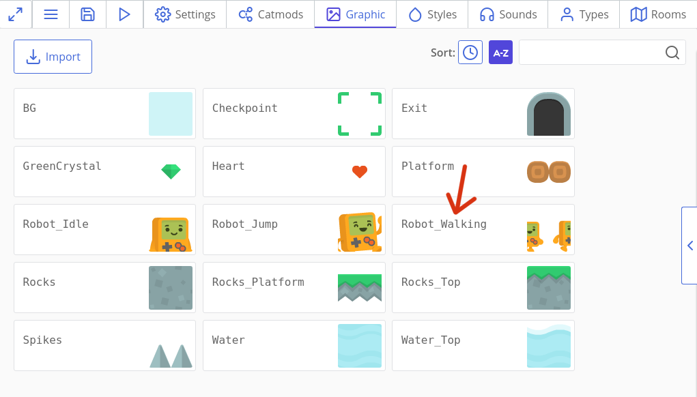

Эта анимация представляет собой небольшую горизонтальную полосу. Мы можем указать ct.js разделить изображение на два столбца, заполнив поля «Столбцы» и «Строки», а затем откалибровав поле «Ширина».

Изображение целиком шириной в 192 пикселя, поэтому один кадр будет иметь ширину 192 : 2 = 96 пикселей. Рамки робота теперь должны быть обведены двумя прямоугольниками.

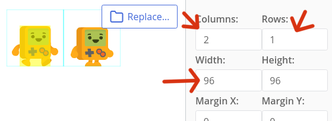

Теперь давайте отредактируем его маску столкновения. Маска определяет, какие области изображения участвуют в коллизии, а какие нет, и отображается в виде жёлтого прямоугольника поверх спрайта.

Для начала, сместите ось текстуры так, чтобы она находилась в нижней средней точке.

::: tip Пояснение
Поскольку у нас есть изображение 96x96 пикселей, нам нужно 48 пикселей по горизонтали и 96 пикселей по вертикали. Пиксели измеряются от верхнего левого угла, и первое значение точки обычно обозначает горизонтальную компоненту (значение X), а второе — вертикальную компоненту (Y).
:::

У робота красивое прямоугольное тельце, поэтому будет разумнее пометить его как прямоугольник. Убедитесь, что выбрана форма коллизии "Прямоугольник", а затем нажмите кнопку «Заливка» и откалибруйте поля, чтобы тело робота было покрыто жёлтой маской.

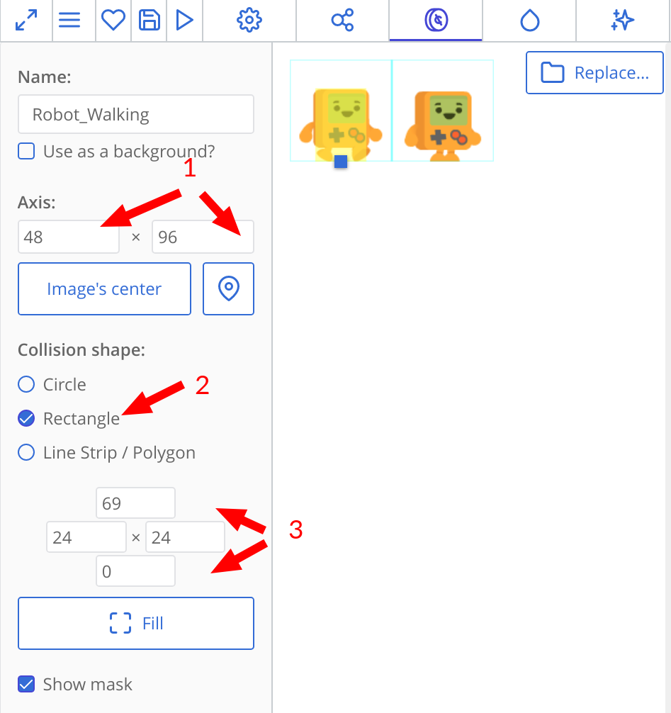

Можно отметить для коллизии как всё тело целиком, так и одно только туловище.

Нажмите кнопку «Сохранить» в левом нижнем углу.

Теперь нам нужно установить маски столкновений для `Robot_Idle` и` Robot_Jump`. Убедитесь, что вы сдвинули ось до 48x96 и откалибровали маски столкновений для обоих текстур.

::: tip
Желательно, чтобы ось вращения была одинаковой для каждого из спрайтов, чтобы робот не застревал в объектах при переключении анимации, а его форма коллизии не увеличивалась в размерах.
:::

Теперь давайте установим маски столкновений для изумрудов и сердец-бонусов. Их можно отметить как окружности. Откройте `GreenCrystal`, установите его форму столкновения как «Круг», затем нажмите кнопку «По центру», чтобы ось автоматически установило к нужным значениям, и откалибруйте радиус формы столкновения.

Сделайте то же самое для текстуры сердечка.

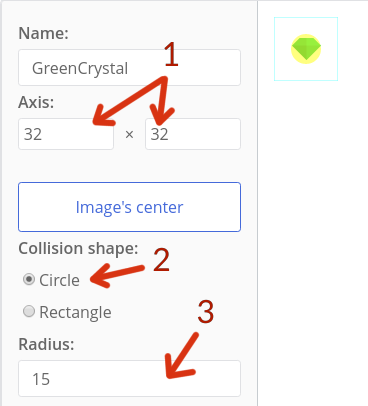
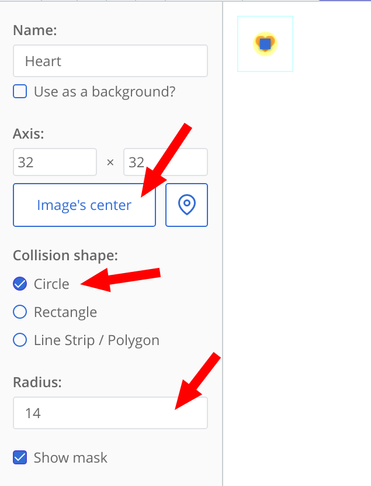

Последнее, что нужно настроить — это текстура `Spikes`. Здесь не нужно смещать ось вращения — иначе на карте пики будут смещены —, но нам всё равно нужно настроить маску столкновений. Установите для её верхнего поля отрицательное значение, чтобы верхняя часть изображения не была заполнена желтым цветом.

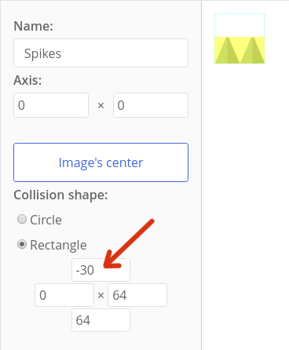

Сохраните текстуру. Если мы откроем оставшиеся, то окажется, что все они имеют прямоугольную маску, заполняющую всё изображение. Удобно — мы оставим всё как есть.

## Создание робота и блоков земли

Откройте вкладку "Типы" и создайте новый тип. Назовите его `Robot`, установите текстуру `Robot_Idle`, и сохраните.

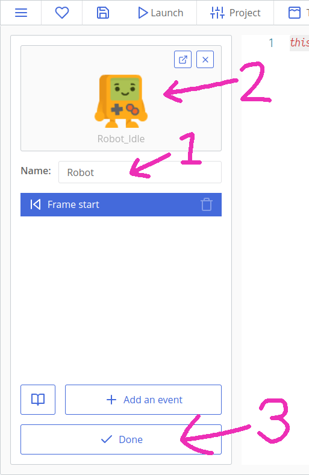

::: tip
Типы — это шаблоны, из которых создаются новые копии. Комнаты наполняются копиями, и именно копии в процессе игры взаимодействуют друг с другом на экране, а каждая копия соответствует определённому типу.
:::

По аналогии сделайте ещё типы:

* Rocks;
* Rocks_Top;
* Rocks_Platform.

### Создание комнаты

Нажмите на вкладку "Комнаты" вверху экрана и создайте новую комнату. Назовите её "Level_01". Установите размер вида на 1024х576 пикселей.

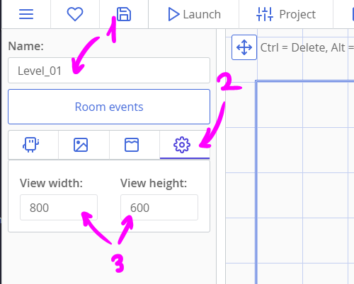

Теперь нарисуйте уровень, щёлкнув по нужному типу слева, а затем поместив копию щелчком мыши в большой области справа. Удерживайте «Shift», чтобы добавить несколько копий сразу. Не забудьте добавить робота!

Можно расширять уровень в любую сторону, и копии не обязательно должны быть внутри синей рамки. Синяя рамка — это обзор камеры, и показывает первоначально видимую часть вашего уровня.

Вот что нарисовал я. Игроку здесь трудно застрять, но этот небольшой уровень показывает, как прыгать в мире этого платформера. Позднее на каменной платформе мы сделаем изумруды, и, возможно, секретики в окне под холмом.

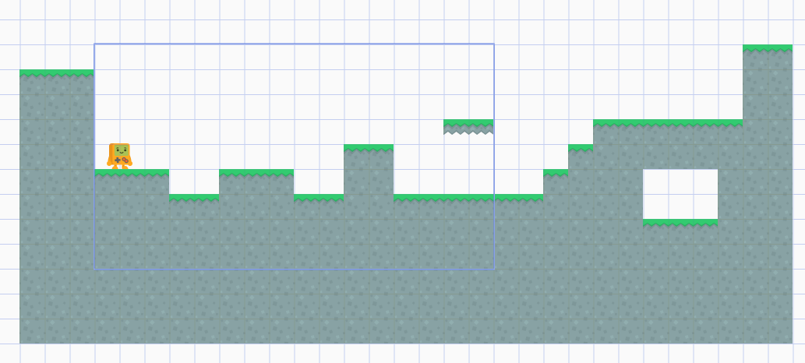

Теперь давайте добавим фон. Нажмите на вкладку «Фоны» слева, нажмите «Добавить» и выберите текстуру «BG». Теперь нажмите на гайку возле нашего нового фона и измените его глубину на `-10`. Таким образом, мы сообщаем движку, что фон должен быть нарисован на 10 слоёв ниже слоя по умолчанию 0.

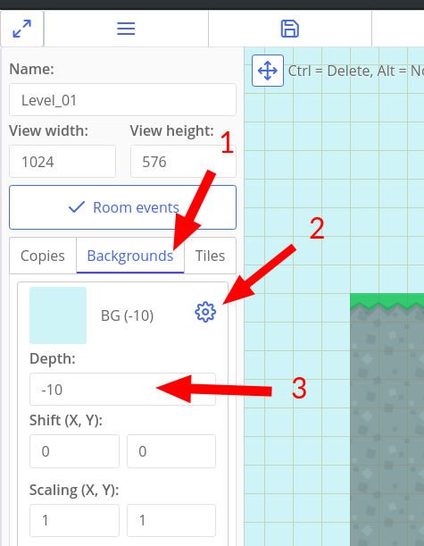

Если мы сохраним проект сейчас и нажмём кнопку «Play» вверху, мы сможем увидеть небольшую часть нашего уровня, нарисованную в окне отладчика. Пока ещё нет ничего подвижного, но это всё равно хорошее начало!

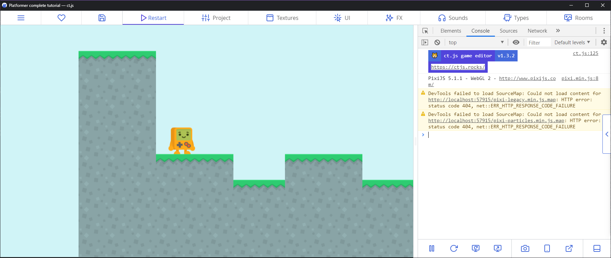

### Подключение модулей клавиатуры и для обнаружения коллизий

В проекте понадобится прослушивать события клавиатуры и обнаруживать столкновения робота с поверхностью земли. Для таких суперсил понадобятся котомоды! Откройте вкладку "Котомоды" вверху экрана и выберите модуль `keyboard`. Нажмите на большую красную кнопку, чтобы активировать модуль (он может уже работать). Проделайте то же самое с модулем `place`.

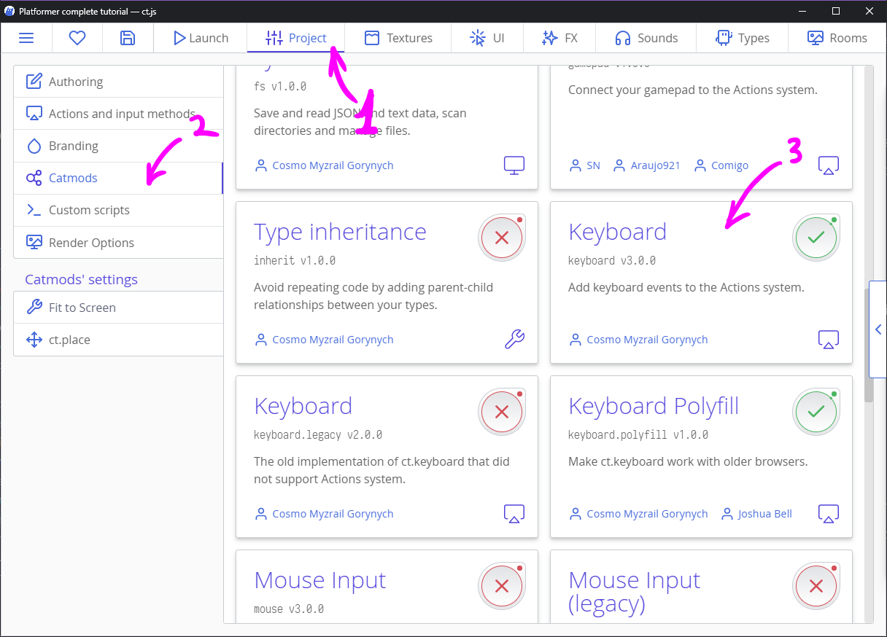

::: tip ПОДСКАЗКИ ОТ ПРОФИ ✨
Включите модуль `fittoscreen`, затем откройте его вкладку "Настройки" и отметьте вариант "Fast scale with letterboxing" для автомагического полноэкранного режима в игре.
:::

У каждого модуля есть своя документация на одноимённой вкладке. Некоторые функции оттуда совсем скоро предстоит изучить.

### Добавление Действий для событий клавиатуры

Действия позволяют прослушивать события мыши, клавиатуры, геймпада и др. О них можно прочитать подробнее [здесь](/actions.html). С помощью действий мы будем слушать события клавиш WASD и стрелок клавиатуры.

Зайдите на вкладку "Настройки" вверху экрана и нажмите кнопку "Редактировать действия".

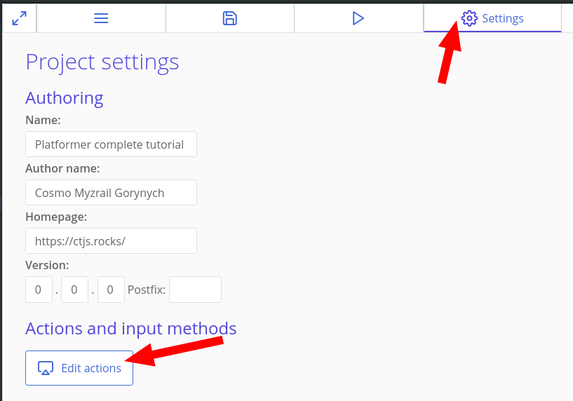

Затем создайте схему ввода, как показано на рисунке ниже. Для этого сначала нажмите кнопку «Добавить действие», затем назовите его в столбце слева и добавьте методы ввода в правом столбце. Чтобы отфильтровать методы ввода, можно воспользоваться поиском.


::: tip
Хоть эту схему и можно упростить до двух действий (см. [примеры на документации к действиям](/actions.html#examples)), чтобы не усложнять урок, мы сделаем два отдельных действия для перемещения влево и вправо.
:::

### Обнаружение коллизий и передвижение

Теперь перейдите на вкладку «Типы» в верхней части экрана и откройте тип `Rocks`. В левом столбце заполните поле "Collision Group" значением `Solid`:

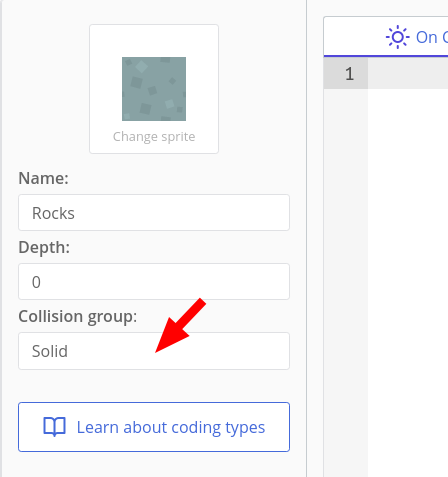

Это поле укажет котомоду `ct.place`, что этот конкретный тип принадлежит особой группе столкновений "Solid". Назвать эту группу можно как угодно, и количество таких групп неограничено. Для этого туториала одной группы будет достаточно.

Заполните это поле в типах `Rocks_Top` и `Rocks_Platform`.

Теперь откройте тип `Robot`. Если вы уже выполнили туториал «Космический шутер», то вспомните, что перемещение выполняется с помощью прямых манипуляций с параметрами копии `x` и `y` или с помощью встроенных переменных: например, `this.speed` или `this.direction`. Суть в том, что последний метод никогда не работал с платформерами, даже за пределами ct.js! Нам нужно будет написать кое-что посложнее. Будьте готовы! 😃

Задумка движения с видом сбоку заключается в том, что у нас будет значение, на которое мы хотим сместиться, а затем попиксельно будем проверять, сталкиваемся ли мы с чем-то или нет.

Давайте настроим некоторые переменные на вкладке Код создания»:

```js
this.jumpSpeed = -9;
this.gravity = 0.5;

this.hspd = 0; // Горизонтальная скорость
this.vspd = 0; // Вертикальная скорость
```

::: tip
`this` указывает на копию, которая выполняет текущий код. В нашем случае это будет копия типа `Robot`.
:::

Теперь перейдите на вкладку "Кадр" и добавьте этот код:

```js
this.speed = 4 * ct.delta; // Максимальная скорость движения по горизонтали

if (ct.actions.MoveLeft.down) {
    // Если клавиша A или стрелка влево зажата, то перемещаемся налево
    this.hspd = -this.speed;
} else if (ct.actions.MoveRight.down) {
    // Если клавиша D или стрелка вправо зажата, то перемещаемся направо
    this.hspd = this.speed; 
} else {
    // Если ничего не зажато — не двигаемся
    this.hspd = 0;
}

// Если под ногами робота есть земля…
if (ct.place.occupied(this, this.x, this.y + 1, 'Solid')) {
    // …и кнопка W или пробел зажаты…
    if (ct.actions.Jump.down) {
        // …то прыгаем!
        this.vspd = this.jumpSpeed;
    } else {
        // Иначе сбросим скорость по вертикали. Не хочется оказаться под землёй!
        this.vspd = 0;
    }
} else {
    // Если под ногами нет земли  
    this.vspd += this.gravity * ct.delta;
}
```

::: tip
Код "Кадр" выполняется каждый игровой кадр для каждой копии. Здесь обычно описывают передвижение и другую игровую логику. 
:::

::: tip
`ct.actions.YourAction.down` проверяет, зажата ли хоть одна клавиша действия `YourAction`. Есть ещё переменные `ct.actions.YourAction.pressed` и `ct.actions.YourAction.released`.

`ct.place.occupied(copy, x, y, group)` проверяет, сталкивается ли указанная копия с данной группой столкновений в данных координатах. Если группа столкновений не нужна, её можно опустить. Метот возвращает `false` (если нет столкновений) или первую попавшуюся копию, участвующую в столкновении.
:::

::: tip
`ct.delta` показывает, как долго отрисовывался предыдущий кадр. Если всё нормально и в игре плавный FPS, то `ct.delta` равно `1`, но будет больше, если игра не может дойти до целевого значения FPS.

Перемножая наши значения с `ct.delta`, мы компенсируем любые лаги и просадки FPS.
:::

Этот код установит переменные `hspd` и` vspd`, но они не будут что-либо делать сами по себе. Добавьте ещё код для перемещения:

```js
// Движение по горизонтали, пиксель за пикселем
for (var i = 0; i < Math.abs(this.hspd); i++) {
    if (ct.place.free(this, this.x + Math.sign(this.hspd), this.y, 'Solid')) {
        this.x += Math.sign(this.hspd);
    } else {
        break;
    }
}
// То же самое, но по вертикали
for (var i = 0; i < Math.abs(this.vspd); i++) {
    if (ct.place.free(this, this.x, this.y + Math.sign(this.vspd), 'Solid')) {
        this.y += Math.sign(this.vspd);
    } else {
        break;
    }
}
```

::: tip
`ct.place.free` — полная противоположность `ct.place.occupied`. У этого метода те же самые параметры, но он возвращает либо `true`, либо `false`.

`Math.abs` возвращает абсолютное значение заданного числа (модуль), что означает, что отрицательные числа станут положительными. `Math.sign` возвращает -1, если данное число отрицательное, 1, если оно положительное, и 0, если оно равно 0. Вместе они создают цикл `for`, который работает в обоих направлениях и проверяет столкновения пиксель за пикселем.
:::

Теперь мы можем управлять роботом!

::: warning
Персонаж может игнорировать дырки шириной в одну ячейку сетки. Проверьте. Если это происходит, вам нужно сделать маски столкновения робота немного уже.
:::

### Настройка камеры для следования за персонажем

Если мы сейчас запустим игру, то сможем перемещать робота. Однако есть проблема: камера не движется!

В ct.js проблема решается легко. Если мы покопаемся в документации и прочитаем раздел ct.rooms, то обнаружим свойства `ct.rooms.current.follow`, ` ct.rooms.current.borderX` и `ct.rooms.current. .borderY` именно для следования за копией.

Откройте тип `Robot` и его "Код создания". Добавьте в конец:

```js
ct.room.follow = this;
ct.room.borderX = 450;
ct.room.borderY = 200;
```

Теперь камера будет следовать за роботом.

## Создание чекпоинтов и ловушек

Теперь мы добавим смертельные ловушки, водяные рвы и чекпоинты, чтобы робот возвращался к их локации при смерти, а не телепортировался в начале уровня.

Создайте новые типы для текстур `Water`, `Water_Top`, `Spikes` и `Checkpoint`.

Создайте новую комнату и назовите её «Level_02». Установите размер вида 1024x576 и добавьте фон. Создайте опасный уровень с шипами и озёрами.

Поместите чекпоинты до и/или после опасных мест. Не бойтесь ставить много чекпоинтов, потому что больно наказывать игрока за ошибки — всегда плохая идея! 😉

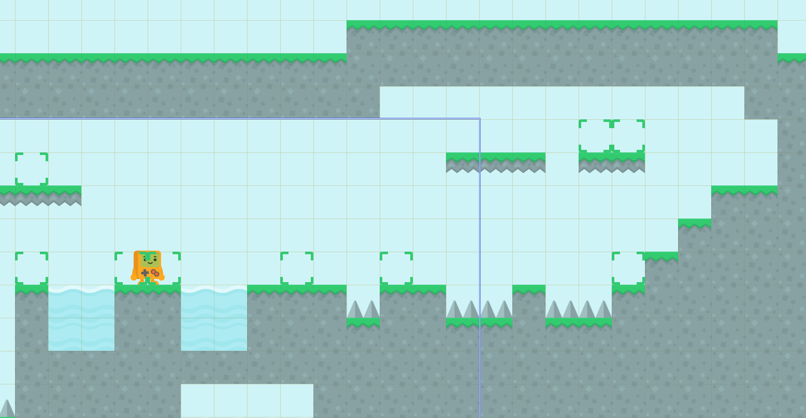

Здесь конец предполагаемого уровня находится на верхней средней платформе. Я также разместил несколько платформ за пределами скриншота для будущих изумрудов.

Теперь давайте перейдём к типу `Checkpoint` и отредактируем его код «Кадр».

Будем проверять столкновение с роботом, и во время него занесём точку сохранения внутрь робота. Удалите строку `this.move ();` и добавьте этот код:

```js
var robot = ct.place.meet(this, this.x, this.y, 'Robot');
if (robot) {
    robot.savedX = this.x + 32;
    robot.savedY = this.y + 32;
}
```
::: tip
Строка `this.move ();` отвечает за перемещение копий, использующих стандартные переменные ct. В нашем случае чекпоинт не должен двигаться вообще. 😉

`ct.place.meet` — почти такой же метод, как `ct.place.occupied`, но он проверяет столкновения с типом копий, а не группой столкновений.
:::

Мы также сдвигаем точку сохранения на 32x32 пикселя, потому что ось контрольной точки находится в её верхнем левом углу, а ось робота — в средней нижней точке. Из-за этого робот будет возрождаться немного левее и выше желаемой центральной точки.

Перейдите на вкладку «Код создания» и добавьте строку `this.visible = false;`. Это сделает чекпоинты невидимыми во время игры.

Теперь перейдите к типу `Spikes` и отметьте их группу коллизии "Deadly":

```js
this.ctype = 'Deadly';
```

Сделайте то же самое с `Water` и `Water_Top`.

Теперь снова откройте тип `Robot` и добавьте этот код в начало кода "Кадр":

```js
if (ct.place.occupied(this, this.x, this.y, 'Deadly')) {
    this.x = this.savedX;
    this.y = this.savedY;
    this.hspd = 0;
    this.vspd = 0;
    return;
}
```

::: tip
Оператор `return;` останавливает выполнение функции. Здесь нам не понадобится движения и другие проверки, если нам нужно возродить робота в другой позиции.
:::

Мы также должны записать этот код во вкладку «Код создания», чтобы точка возрождения была в точке изначального расположения робота, если что-то вдруг пойдет не так:

```js
this.savedX = this.x;
this.savedY = this.y;
```

Чтобы протестить конкретную комнату, откройте вкладку «Комнаты» вверху, затем щелкните правой кнопкой мыши нужную комнату и нажмите «Сделать стартовой комнатой».

## Трансформации и анимация робота

На этом этапе будет разумно добавить немного анимациий для нашего робота. Как вы помните, у нас есть три разные текстуры: `Robot_Idle`, `Robot_Jump` и `Robot_Walking`.

Добавьте эту строку к «Коду создания» в типе `Robot`:

```js
this.animationSpeed = 0.2;
```

`0,2` означает, что мы хотим воспроизводить 0,2 × 60 (т.е. 12) кадров в секунду. Для большей читабельности можно вместо этого написать `12 / 60`.

Откройте код робота «Кадр» и измените ту часть кода, что отвечает за передвижение, так, чтобы он изменял нарисованную текстуру в зависимости от ввода пользователя и положения робота в пространстве:


```js{4,5,6,7,8,9,13,14,15,16,17,18,22,38,39}
if (ct.actions.MoveLeft.down) {
    // Если зажата клавиша A или стрелка влево, то двигаемся влево
    this.hspd = -this.speed;
    // Назначим анимацию ходьбы и отразим робота влево
    if (this.tex !== 'Robot_Walking') {
        this.tex = 'Robot_Walking';
        this.play();
    }
    this.scale.x = -1;
} else if (ct.actions.MoveRight.down) {
    // Если зажата клавиша D или стрелка вправо, то двигаемся вправо
    this.hspd = this.speed;
    // Назначим анимацию ходьбы и отразим робота вправо
    if (this.tex !== 'Robot_Walking') {
        this.tex = 'Robot_Walking';
        this.play();
    }
    this.scale.x = 1;
} else {
    // Если ничего не зажато, то не двигаемся
    this.hspd = 0;
    this.tex = 'Robot_Idle';
}

// Если у робота есть почва под ногами…
if (ct.place.occupied(this, this.x, this.y + 1, 'Solid')) {
    // …и клавиша W зажата…
    if (ct.actions.Jump.down) {
        // …то прыгаем!
        this.vspd = this.jumpSpeed;
    } else {
        // Иначе сбрасываем вертикальную скорость, чтобы не оказаться под землёй!
        this.vspd = 0;
    }
} else {
    // Если под ногами нет опоры  
    this.vspd += this.gravity;
    // Поставим анимацию прыжка!
    this.tex = 'Robot_Jump';
}
```

Поскольку вертикальное движение не зависит от горизонтального движения, анимация переходит в состояние прыжка, если под роботом нет земли в не зависимости от движения по горизонтали.

Теперь робот будет менять своё направление и менять текстуры в зависимости от скорости и положения в пространстве. Просто прелесть!

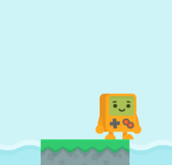

## Добавление переходов между уровнями

Вот в чём задумка:

* Каждая комната будет хранить имя следующей комнаты как переменную.
* На уровне будут расположены выходы, которые будут проверять коллизию с Роботом.
* Когда происходит коллизия, выход прочитает переменную комнаты и переключится на следующую комнату.

Создайте новый тип и назовите его `Exit`. Укажите текстуру. Затем откройте вкладку «Кадр» и напишите этот код:

```js
// Существует ли переменная со следующей комнатой?
if (ct.room.nextRoom) {
    // Есть ли столкновение с роботом?
    if (ct.place.meet(this, this.x, this.y, 'Robot')) {
        // Перейти в другую комнату
        ct.rooms.switch(ct.room.nextRoom);
    }
}
```

::: tip
Здесь `ct.room` указывает на текущую комнату. `ct.rooms.switch` выходит из текущей комнаты и открывает другую с заданным именем.
:::

Теперь перейдите на вкладку «Комнаты» вверху, откройте `Level_01`, нажмите кнопку «События комнаты» и напишите следующее в «Код создании»:

```js
this.nextRoom = 'Level_02';
```

Осталось только разместить выходы на уровнях.

Теперь сохраните комнату, отметьте `Level_01` как начальную комнату, щелкнув по неё правой кнопкой мыши, и протестируйте, работает ли переход.

::: tip Самостоятельно!
Создайте дополнительные выходы, ведущие к секретным подуровням и обратно. [Скачайте дополнительные ресурсы](https://www.kenney.nl/assets/simplified-platformer-pack), если понадобится.
:::

## Сбор предметов: подсчёт и рисование

### Добавление кристаллов

Создайте новый тип с именем `GreenCrystal` и укажите его текстуру. Запишите этот код в событие «Кадр»:

```js
if (ct.place.meet(this, this.x, this.y, 'Robot')) {
    ct.room.crystals ++;
    this.kill = true;
}
```

::: tip
`this.kill = true;` говорит, что текущая копия должна быть удалена. Это произойдёт после всех событий «Кадр», но до события «Прорисовка».
:::

Как вы уже догадались, количество собранных кристаллов будет храниться в комнате.

Но если мы продолжим добавлять дополнительные функции к скриптам уровней, то скоро будем делать кучу ошибок, забывая скопировать нужные сниппеты. В любом случае, это лишняя работа.

Поэтому сейчас мы создадим функцию, чтобы многократно её повторять без копипасты. Она может выглядеть странно, но на самом деле работает она довольно просто.

Перейдите на вкладку «Настройки» в верхней части экрана и нажмите кнопку «Добавить новый скрипт» в правом нижнем углу:

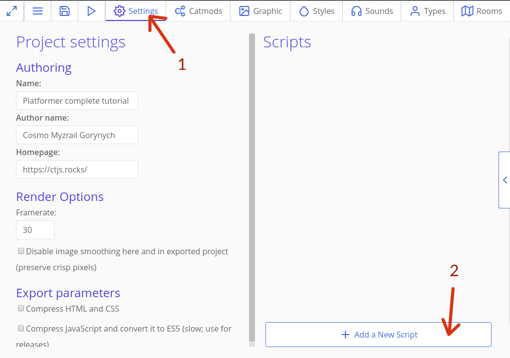

Назовите скрипт `inGameRoomStart`. Добавьте код: 

```js
var inGameRoomStart = function (room) {
    room.crystals = 0;
    room.crystalsTotal = ct.types.list['GreenCrystal'].length;
    ct.types.copy('CrystalsWidget', 0, 0);
};
```

::: tip
`ct.types.list['TypeName']` возвращает массив всех копий данного типа в комнате. `length` возвращает размер массива.
:::

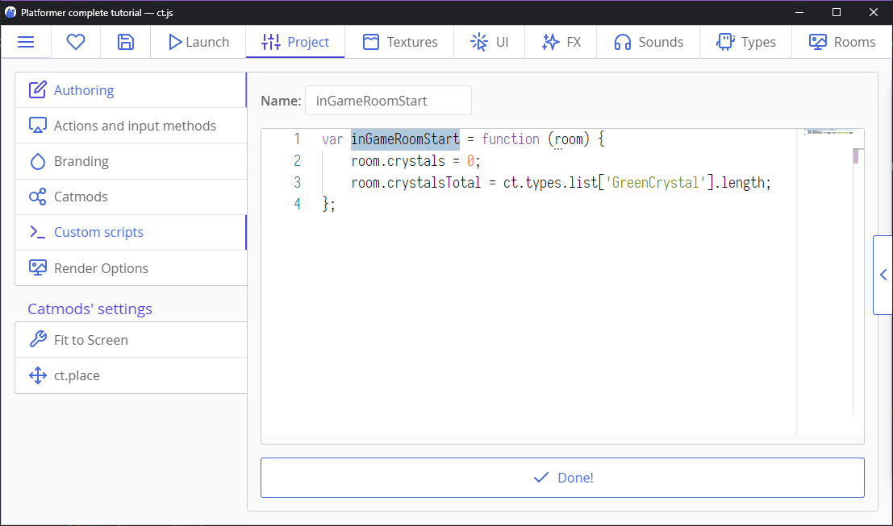

Теперь перейдите к «Коду создания» каждой комнаты и добавьте эту строку:

```js
inGameRoomStart(this);
```

Выглядит знакомо, не так ли? Похоже на `ct.place.free (this, this.x, this.y)`. Так работает большинство методов в ct.js: им указывается копия или комната, над которой нужно выполнить определённое действие.

Когда вызывается `inGameRoomStart(this);`, скрипт устанавливает параметры `crystal` и `crystalTotal` самостоятельно, без необходимости писать такой код непосредственно в комнате.

Это были коды для подсчёта и сбора кристаллов, но нам также нужно нарисовать их количество, и сделаем мы это со *стилем*. ✨

К счастью, в ct.js есть инструмент для создания классных текстовых стилей. Откройте вкладку «Интерфейс» в верхней части экрана и создайте новый стиль. Назовите его `CrystalCounter`.

Затем активируйте раздел «Шрифт», установите размер шрифта 24 и его вес 600. Выровняйте его по левой стороне.

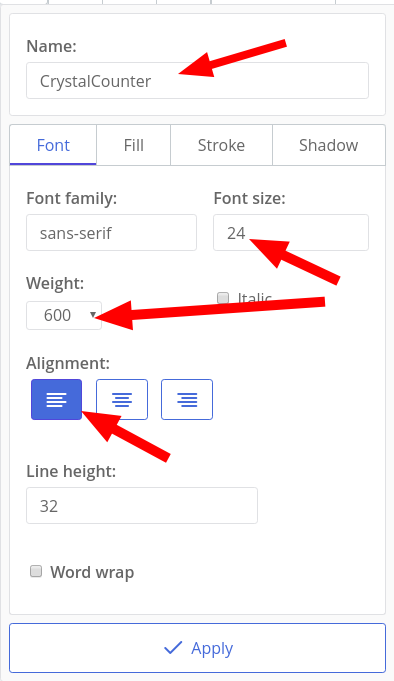

Затем откройте вкладку «Заливка», активируйте её и выберите зелёный цвет заливки. Я выбрал `#00A847`. Другие хорошие цвета — `#2ECC71` и `#28B463`, взятые с текстуры изумруда.

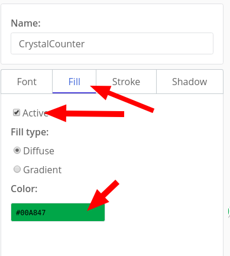

Мы также можем добавить толстую белую обводку нашему тексту. Откройте вкладку «Обводка», затем установите цвет на белый и ширину линии на 5. Если обводку в превью справа не видно, попробуйте на время переключиться на тёмную тему пользовательского интерфейса, открыв гамбургер-меню сверху.


Теперь понадобится создать новый тип, который будет отображать значок кристалла и счётчик изумрудов. Назовём его `CrystalsWidget`. Установите ему текстуру `GreenCrystal` и напишите следующее в его «Код создания»:

```js
this.text = new PIXI.Text('0 / ' + ct.room.crystalsTotal, ct.styles.get('CrystalCounter'));
this.text.x = 32;
this.text.anchor.y = 0.5;

this.addChild(this.text);
```

Здесь мы создаём новый блок текста и прикрепляем его к нашей иконке. `this.text.anchor.y = 0.5;` указывает, что текст должен выравниваться по центру нашего значка.

Теперь откройте вкладку «Прорисовка» и добавьте этот код:

```js
this.x = ct.room.x + 24;
this.y = ct.room.y + 24;

this.text.text = ct.room.crystals + ' / ' + ct.room.crystalsTotal;
```

Здесь мы привязываем наш виджет к верхнему левому углу и обновляем его значение.

Теперь у нас есть счётчик изумрудов в верхнем левом углу экрана.

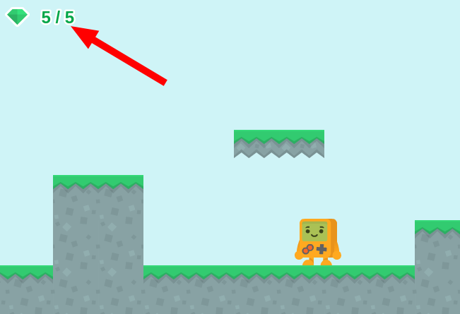

### Добавление жизней и бонусов-сердечек

В целом, всё как со сбором кристаллов, но есть несколько изменений:

* Мы начинаем с 3 жизнями.
* У нас будет не более 3 жизней одновременно.
* Если мы потеряли последнюю жизнь, уровень перезапускается.

::: tip Самостоятельно!
Попробуйте сделать всё это самостоятельно! Если вы заблудились, просто посмотрите инструкции ниже. Теперь всё, хватить скроллить! 😃
:::

Создайте новый тип с именем `Heart` и установите соответствующий спрайт. Добавьте этот код на вкладке «Кадр»:

```js
if (ct.place.meet(this, this.x, this.y, 'Robot')) {
    if (ct.room.lives < 3) {
        ct.room.lives++;
        this.kill = true;
    }
}
```

Затем перейдите на вкладку «Настройки» и измените скрипт `inGameRoomStart`:

```js{6,7}
var inGameRoomStart = function (room) {
    room.crystals = 0;
    room.crystalsTotal = ct.types.list['GreenCrystal'].length;
    ct.types.copy('CrystalsWidget', 0, 0);
    ct.types.copy('HeartsWidget', 0, 0);
    room.lives = 3;
};
```

Не забудьте разместить сами бонусы на своих уровнях!

Нам также понадобится стиль для счетчика. Процесс создания стиля тот же, а подходящий для заливки цвет — `#E85017`. Мы можем даже продублировать существующий стиль! Давайте назовём новый `HeartCounter`»`.

Нам понадобится ещё один виджет для отображения оставшихся жизней. Создайте новый тип с именем `HeartsWidget`, установите в качестве текстуры `Heart` и поместите в его код создания следующее:

```js
this.text = new PIXI.Text(ct.room.lives, ct.styles.get('HeartCounter'));
this.text.x = -32;
this.text.anchor.y = 0.5;
this.text.anchor.x = 1;

this.addChild(this.text);
```

А этот код поместите в событие "Прорисовка":

```js
this.x = ct.room.x + ct.viewWidth - 24;
this.y = ct.room.y + 24;

this.text.text = ct.room.lives;
```

Обратите внимание, как мы используем свойство `room.view Width`, чтобы расположить виджет в правой части экрана.
Теперь измените код респауна `Robot`, чтобы он терял одно сердце при каждом респауне:


```js
if (ct.place.occupied(this, this.x, this.y, 'Deadly')) {
    this.x = this.savedX;
    this.y = this.savedY;
    this.hspd = 0;
    this.vspd = 0;
    // отминусовать одну жизнь
    ct.room.lives --;
    if (ct.room.lives <= 0) {
        // Перезапустить комнату: перейти к комнате с текущим названием
        ct.rooms.switch(ct.room.name);
    }
    return;
}
```

Так-то! Пора тестить.

## Добавление движущихся платформ

Создайте новый тип с именем `Platform` и выберите соответствующую текстуру. Создайте новый уровень под названием `Level_03` с широкими рвами и длинными ловушками, а также с платформами, которые через эти рвы и ловушки переведут робота.

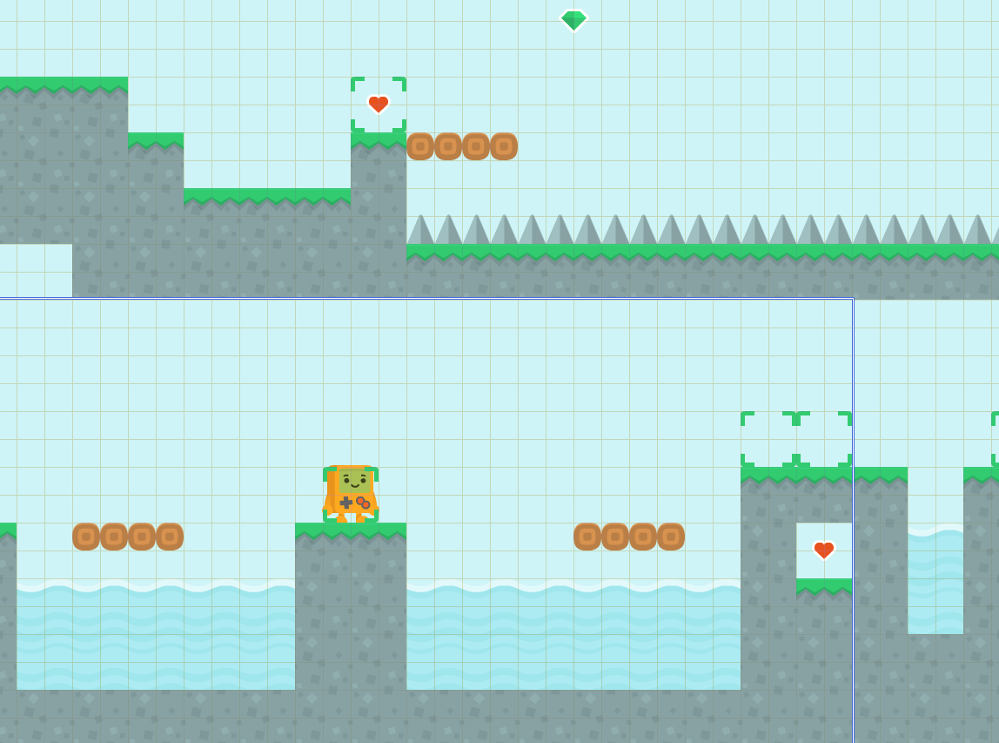

Движущиеся платформы будут действовать следующим образом:

* Они двигаются горизонтально, начиная двигаться, скажем, вправо.
* Если платформа обнаружит, что в следующем кадре она коснётся объекта группы `Solid`, она поменяет направление.
* Платформы перемещают игрока, если он находится прямо над платформой.

Давайте откроем тип `Platform` и инициализируем его скорость и группу коллизии:

```js
this.speed = 2;
this.ctype = 'Solid';
```

Затем добавьте код на вкладку «Кадр», чтобы переместить нашего робота:

```js
var robot = ct.place.meet(this, this.x, this.y - 1, 'Robot');
if (robot) {
    robot.x += this.speed;
}
```

И код для перемещения:

```js
if (ct.place.occupied(this, this.x + this.speed * ct.delta, this.y, 'Solid')) {
    // Сменить направление
    this.direction += 180;
}
this.move();
```

Выглядит просто! Быть может, даже слишком просто. И вот в чём проблема: если робот каснётся левой или правой стороны платформы, он там застрянет! Мы должны делать платформы твёрдыми только тогда, когда они находятся под роботом.

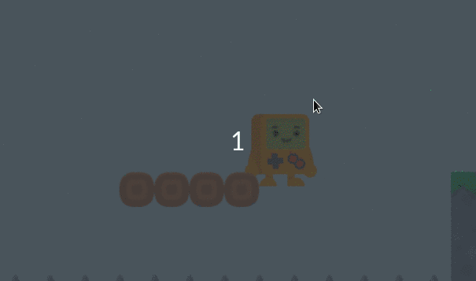

Вот код получше:

```js
var robot = ct.place.meet(this, this.x, this.y, 'Robot');
if (robot) {
    this.ctype = undefined;
} else {
    this.ctype = 'Solid';
    robot = ct.place.meet(this, this.x, this.y - 1, 'Robot');
    if (robot) {
        robot.x += ct.u.ldx(this.speed, this.direction);
    }
}

if (ct.place.occupied(this, this.x + this.speed * ct.delta, this.y, 'Solid')) {
    // Сменить направление
    this.direction += 180;
}
this.move();
```

::: tip Самостоятельно!
Добавьте вертикально движущиеся платформы! И убедитесь, что они не раздавили робота. 😉
:::

## Вот и всё!

Уф! Это был довольно длинный урок. Тем не менее, есть много вариантов улучшения.

Вот как можно сделать эту игру лучше:

* Добавьте врагов и смертельно движущиеся бензопилы! Вы можете скачать текстуры для них и для многого другого [здесь](https://www.kenney.nl/assets/platformer-art-deluxe).
* Создайте историю и расскажите её через NPC, через заметки на деревянных табличках или просто через субтитры!
* Сделайте процесс возрождения лучше. Убедитесь, что робот не попадает в ловушки после возрождения. Это можно сделать, заблокировав управление на полсекунды, или просто сделав зоны сохранения более безопасными.
* Добавьте звуки! Ничто не делает игру более живой, чем качественные звуковые эффекты.
* Убедитесь, что робот респавнится, если  падает за пределы уровня.
* Просто добавьте больше уровней. 😉 Украсьте их растениями, создайте миры разных цветов.

::: tip Заметка на полях
Обратите внимание, как новые функции в вашем коде постепенно появляются на уровнях! Это хороший приём плавно познакомить игрока с новыми вещами. Предложите им один новый концепт за раз, но добавляйте старые, увеличивая сложность. *Это был совет по дизайну уровней от Comigo* 😎
:::

**Счастливого кодинга!**
Comigo
