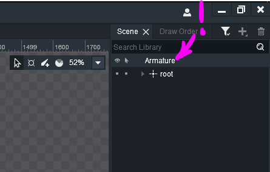
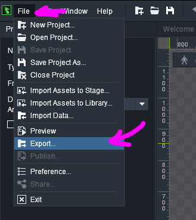
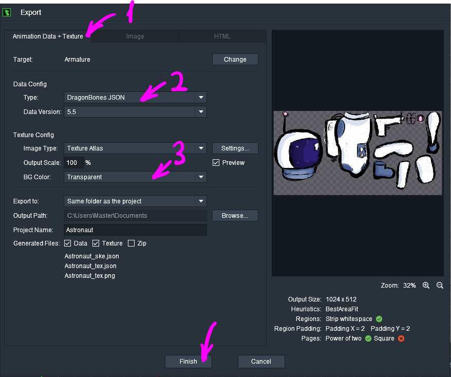

# Using Skeletal Animation in ct.js Projects

ct.js supports importing DragonBones & Spine2D animations. It was tested with DragonBones v5.6, but, as DragonBones has a good backwards compatibility, it should work back to v4.0, too. Dragonones is free to use and is available at [their official site](http://dragonbones.com/).

Spine is a proprietary skeletal animation tool, and you can get it [here](https://esotericsoftware.com/).

:::warning
You need to have a valid Spine License in order to use skeletal animations in ct.js, even if you are using DragonBones animations. See [Spine Editor License Agreement](https://en.esotericsoftware.com/spine-editor-license), section 2.

Someone please make an opensource Spine alternative with pixi.js runtime, this whole proprietary situation sucks.
:::

## Importing Skeletal Animation

To import animations with their textures, you should first open your DragonBones project. Make sure that your armature is called exactly as `Armature`.



Select File — Export…



You should then open the tab "Animation Data + Texture". Make sure that you export DragonBones **JSON** (not the binary format!) and that your background is transparent. You can set other parameters as you like. Then, smash the "Finish" button.



You will get three files in the output directory:

* `Animation_ske.json`;
* `Animation_tex.json`;
* `Animation_tex.png`.

We will need all the three files to be in the same location. Open ct.js, then the Textures tab, and press the "Import" button next to Skeletal Animation label. Locate the `Animation_ske.json` file and add it. Ct.js will then import all the three files into your project.

## Using Skeletal Animations

Skeletal animations are different from regular copies' sprites, and thus they will lack such features like collision detection, but they can be added to any regular copy.

To add a skeletal animation to a copy, write this to its Creation code:

```js
this.skel = ct.res.makeSkeleton('YourAnimationName');
this.skel.animation.play('DefaultAnimation');

this.addChild(this.skel);
this.graph = -1; // This will hide the copy's own sprite
```

These are some useful functions to manipulate the skeleton:

* `skel.animation.play('AnimationName');`
* `skel.animation.fadeIn('NewAnimation', durationInSecs);`
* `skel.armature.getSlot("SlotName").display = false;`

Example of adding dynamic skeletal animation with blends:

```js
/* Frame end event */
var anim = this.skel.animation;

if (this.onGround) { // should be defined before
    if (this.hspeed === 0) {
        if (anim.lastAnimationName !== 'Stand') {
            anim.fadeIn('Stand', 0.2);
        }
    } else {
        if (anim.lastAnimationName !== 'Run') {
            anim.fadeIn('Run', 0.3);
        }
    }
} else {
    if (anim.lastAnimationName !== 'Jump') {
        anim.fadeIn('Jump', 0.2);
    }
}
```

## Responding to Animation Events

ct.js will automatically listen for sound events inside DragonBones skeleton. The names you define in the DragonBones project should be named in the same way as ct.js' sounds.

For listening for custom events, add such code right after attachment of a skeleton to a sprite:

```js
this.skel.on(dragonBones.EventObject.FRAME_EVENT, event => {
    if (event.name === 'Shoot') {
        /* Define logic for shooting here */
    } else if (event.name === '...') {
        /* ... */
    }
});
```
