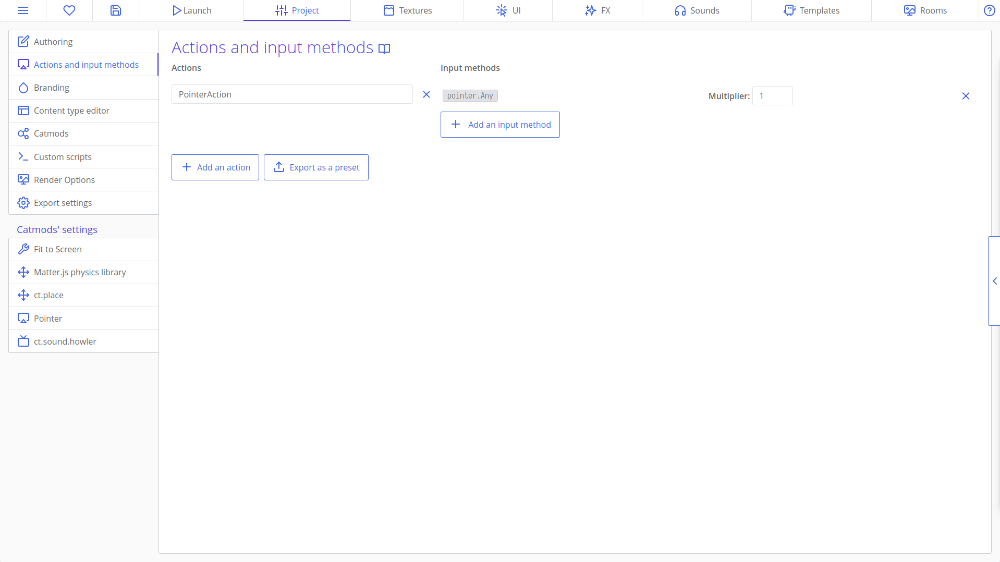
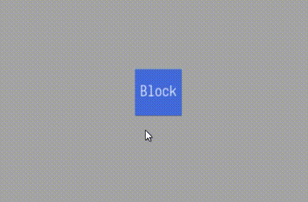

# Dragging Copies Around

In this tutorial we are going to take a look at how we can do a drag and drop implementation for copies in ct.js!

We have a placeholder block template that we are going to drag around. Let's start by going to the the 'Catmods' menu under the Project tab and enable the `ct.pointer` catmod. This catmod lets us easily work with mouse and touchscreen input.


Now we want to add a touch action from the 'Actions and Input Methods' menu. Click 'Add an Action' and name your action "TouchAction". Now click 'Add an Input Method' and select `touch.Any` from the list. It should look like this at the end:



We will use the action we just created to register touch events such as press and release.

Now let's start actually making the dragging. Head on to your template's `Creation` tab and declare a variable called `this.dragging`.

```js
this.dragging = false;
```

This boolean variable will become `true` if the copy is currently getting dragged, `false` otherwise. So let's head over to the `Frame Start` tab and do that. We need the dragging to start when the user presses the mouse button while hovering the copy. We can check this with the "TouchAction" action that we declared in the 'Actions and Input Methods' menu and an `if` statement.

```js
if (ct.pointer.hovers(this) && ct.actions.TouchAction.pressed) {
    this.dragging = true;
}
```

We also want the dragging to end when the user releases the mouse button while dragging the copy. Letting go of it basically.

```js
if (this.dragging && ct.actions.TouchAction.released) {
    this.dragging = false;
}
```

And we want to set the position of our copy to the current position of the touch while dragging.

```js
if (this.dragging) {
    this.x = ct.pointer.x;
    this.y = ct.pointer.y;
}
```

Now we can test it:



It works! it was this simple to set it up.

## Adding Offsets

We successfully implemented dragging in ct.js but there is still one thing we need to do. As you can see in the gif above, when we click on our copy to drag it; the copy positions itself so it's top left is at the cursors position. We can fix this by using two variables. One for the x offset and one for the y offset of the mouse according to the copy's location when it gets picked up.  So let's go to the `Creation` tab and declare them.

```js
this.xOffset = 0;
this.yOffset = 0;
```

Now we want to change these variables when the copy is picked up. So let's head back to the `Frame Start` tab and change them inside the if statement where the dragging begins (the copy gets picked up).

```js
if (ct.pointer.hovers(this) && ct.actions.TouchAction.pressed) {
    this.dragging = true;
    this.xOffset = ct.mouse.x - this.x;
    this.yOffset = ct.mouse.y - this.y;
}
```

Now we need to use these variables to determine the location of our copy when it is getting dragged. Let's navigate to the if statement where the dragging happens and change the two lines inside.

```js
if (this.dragging) {
    this.x = ct.pointer.x - this.xOffset;
    this.y = ct.pointer.y - this.yOffset;
}
```

We can now relaunch our game to test it.


Great! It works perfectly. Now when we pick up our block, it will get picked up and move like a real object.
