# Making Games: Jetty Cat

Like the Flappy Bird, Jetty Cat will be a game where a cat, manipulated by tapping or clicking, avoids infinite obstacles by using its jetpack. We will firstly implement main game logic, then — UI. After that, we will polish the game by adding nice transitions, particle systems, and subtle effects.


That's what we will do:

[[toc]]

::: warn
As you can see, this is not a "Hello world" example, but rather a guide to create a full game from scratch. Give yourself plenty of time to finish it!
:::

## Creating the project and importing assets

Open ct.js and create a new project by writing the name of your project and clicking the "Create" button. Tell ct.js where to save your project. A folder like "My Documents" would be a good choice.


Click the "Textures" tab at the top of the ct.js' window. Then, open your file explorer, and find the folder `examples/JettyCat_assets` inside ct.js' folder. Inside, there are the assets we will use. Drag the assets from your file viewer to ct.js, and ct will quickly import them to the project.

We will need to prepare these textures: properly mark backgrounds as such, and set collision shapes so that copies inside your game precisely interact with each other. Firstly, let's open the background for our project. Click the `BG_Ground` card:

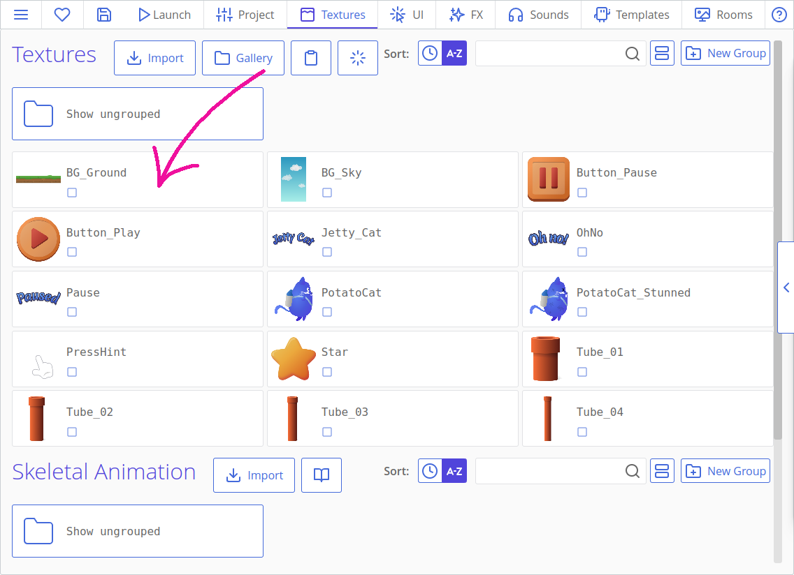

Here, we will need to click the checkbox "Use as a background?" This tells ct.js to pack this texture differently and allows it to repeat in our levels.


Hit "Save" at the bottom left corner. Now, do the same with `BG_Sky` texture.

The backgrounds are ready! Time to set collision shapes of our sprites. We don't need to set them everywhere, but we do need to set them for objects that collide with each other, and for those that we click at while in a game. Headers like `Jetty_Cat`, `OhNo`, and `Pause` won't be interactive and will be just decorations, as well as `PressHint` will have an informing role and won't directly receive clicks as well. But the cat and tubes will collide, and stars need to know when a cat overlaps them.

Let's open the `PotatoCat`! The first thing we should do is move the axis of the texture. It shows as a square axis, which is at the top left corner by default. An axis is a point around which a copy scales and rotates around. Put the axis at the center of the cat's body. Then, let's define its collision shape. The cat doesn't look like a circle or a rectangle, so set its collision shape as a polygon in the left column. A pentagon will appear: you can drag its corners and add new points by clicking on yellow lines to better outline the cat's silhouette. 15 points are enough to outline it.

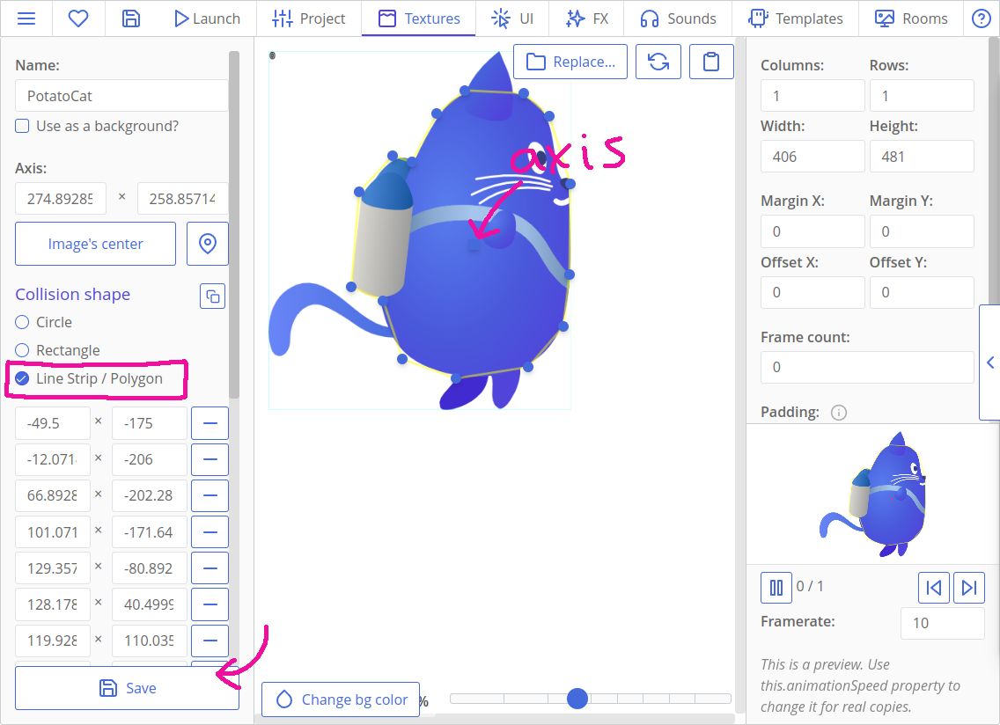

::: tip
It would be a good idea not to outline the tail, as well as ears. When a tail hits a tube and a player loses, they may think that it is unfair. In any way, a tail is too flexible to cause lethal collisions 😺
:::

After defining the shape, click the "Save" button to return to the list of assets. We will need to tune the texture `PotatoCat_Stunned` in the same way, as well as `Star`.

For pipes, we will use something *a bit* different. Open the first one, `Tube_01`, and place its axis nearly at the bottom at the sprite. Remember that axis affects not only rotation but also scaling? We will reuse the same texture for both the pipes that hang from the top of the screen and that grow from the bottom of it. To make the upper ones work, we will scale them negatively around their bottom axis to flip their end down. We can even rotate them later, and they will nicely wave with their base rooted in place.


We will need to do it for all the four tube textures. Then, we can start creating our level and coding movement!

## Creating our main room and moving the cat

Let's create a room where all the fun will be happening! Rooms are often called levels. These are the places where all your resources get combined, and where they can interact with each other. Open the "Rooms" tab at the top of the ct.js window, and create a new one.


A room editor for this exact room will appear. Call the room as `InGame` — we will use this particular name later in code. There are no rules in naming them, though; we just need something we can remember later while coding menus :)

Then we need to set the size of our room. Set it to 1080x1920 pixels.


Now, let's add our backgrounds. Click the tab "Backgrounds", then add two of them: for the sky and for ground. The sky looks good as is, but the ground needs tweaking. Click the cog next to the background's texture in the left column, and find the drop-down "Repeat". Set it to "repeat-x": it will make the background tile horizontally only, as X is the horizontal axis (Y is the vertical one). Then, we will need to shift the ground right to the bottom of the room's frame by changing the Shift Y field.

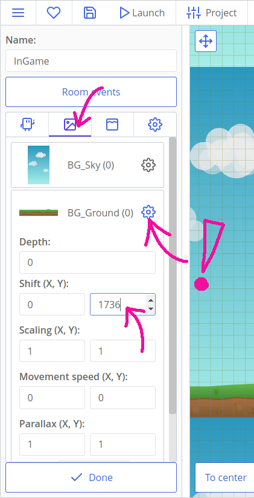

::: tip Hint:
You can navigate the room by dragging it with mouse and zooming with a mouse wheel, or with "zoom" buttons in the left-right corner.
:::

We will also set the depth of both backgrounds so that they are aligned properly. Depth is a 3rd dimension that tells ct.js how to sort our objects, so that sky doesn't accidentally overlap everything else. Positive values bring stuff closer to the camera, and thus objects with positive depth will overlap those with a negative one.

Set sky's depth value to -20, and ground's depth to -10. That's how ct.js will understand these configs:


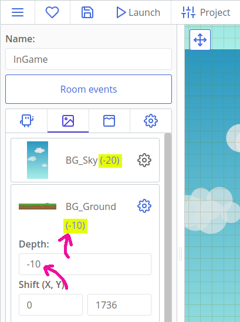

### Cat's type

Textures are essential to most games, but they don't do anything on their own. We used *backgrounds* already, and they are for purely decorative textures. *Types*, on the other hand, can include gameplay logic and are used to create *copies*. Copies are the things we add to our rooms, and these copies are the entities that interact with each other on the screen.

Let's create a type for our cat! Open the "Types" tab at the top of the ct.js window, and press the "Create" button. Name it as `PotatoCat`, and set its texture by clicking the "Change sprite" square and selecting the cat's texture.

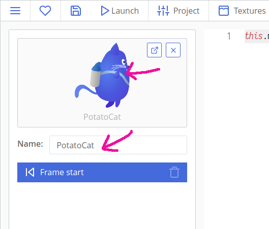

We can now add the cat to our room! Navigate to it by switching back to the "Rooms" tab and opening our only room. Our cat will appear in the left column under the "Copies" tab. Click on it, and then click once again in a place where you want your copy to appear in the level. We will need just one cat for now.

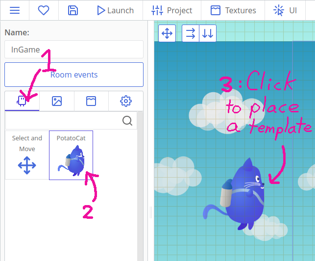

If you click the "Play button" now, it will run the debugger, and we will see a static screen with our backgrounds and our cat. The cat doesn't move yet, and that's what we will change now!


Open the "Types" tab again, and open the cat's type. Here we have four tabs for code:

* "On Create" for code that runs once when a copy is created;
* "On Step" that runs at each frame;
* "Draw" that runs at the end of each frame after other computations and movement updates;
* "On Destroy" that runs once a copy is removed.

That's what we will do:

* We will set our cat flying to the right by defining its speed and direction in the On Create tab;
* We will also check for mouse and touch events at each frame in the On Step event, and will accelerate the cat so that it can fly up.

In the On Create tab, put this code:

``` js
this.speed = 10;
this.direction = 0;
```

`this.speed = 10;` means that we need to move the cat by 10 pixels at each frame. With 60 FPS per second, it will be 600 pixels in a second — about half of our room.

`this.direction = 0;` means that we move the cat in a given direction at 0 degrees. 0 degrees mean that it will move to the right, 90 — to the top, 180 — to the left, and 270 — downwards.

Now, let's move our cat whenever a player presses the screen. We will need to support both mouse and mobile touch events, thus we will need to enable a module that provides support for these. It's easy, though: open the "Catmods" tab at the top of the ct.js window, and find the module `touch` in the left column. Click it, and smash that big button to enable it:

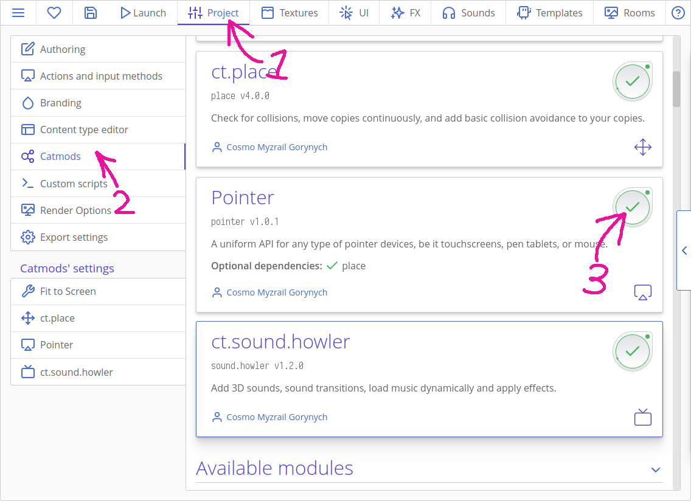

There is an option in the `touch` module that will help our code stay cleaner. Open the settings tab of the module, and tick the option "Detect mouse events as touch events". With this option, we can write code for touch events only, and it will automatically work for a mouse as well.


Now, in ct.js, input methods are grouped into *Actions*. In this project, we will use just one input method — touching the screen. Open the "Settings" tab at the top of the screen, and find the button "Edit actions".


Add our first action, name it `Poof`. Yea. Then, click "Add an input method" on the right, and find the "Any touch" method under the Touch heading. You can use the search to quickly filter out the results.

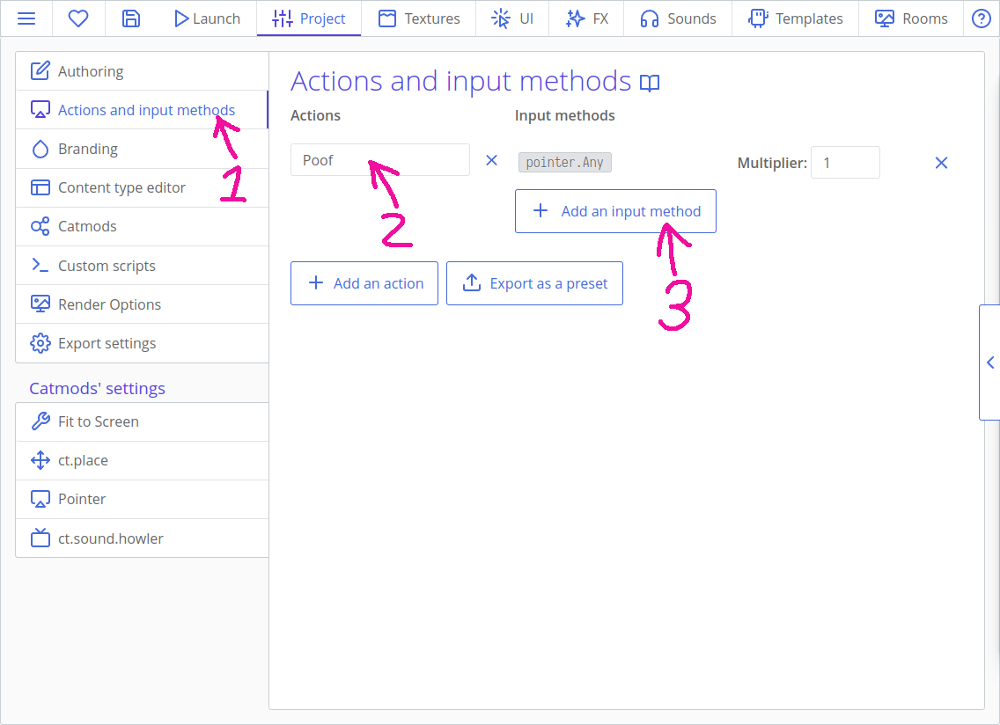

The action is done, we can save it and move back to our cat.

::: tip Actions? Why?
Actions really look as an extraneous step here, but they shine when you need to support a number of different input methods. Say, you create a game that supports both keyboard and gamepad, and the keyboard supports the WASD movement and moving with arrows. One action will support all the three methods, and your code will stay slim, even if you add new input methods later. Besides that, they all can be used with the same code!

You can [read more about actions here](actions.html).
:::

Add this code to cat's On Step event:

```js
if (ct.actions.Poof.down) {
    this.gravity = 2;
    this.addSpeed(ct.delta * 4, 90);
}
```

`if (ct.actions.Poof.down)` work only when a player presses the screen. If it works, we will define a gravity force that pulls the cat down and add speed that pulls the cat upwards. We need to multiply the added speed with `ct.delta` to make it run smoothly on every occasion.

::: tip ct.delta
`ct.delta` will be equal to 1 most of the time, but this multiplier should not be overlooked. If a player's framerate drops or the game lags for some reason, `ct.delta` will become a larger value to compensate these frame drops and lags. For example, if framerate drops from 60 frames per second to 30, then `ct.delta` will temporarily be equal to 2.

Besides that, `ct.delta` supports in-game time stretching and allows for creating slow-mo effects and game pauses. (And we will implement these features!)
:::

::: tip
There are also `ct.actions.Poof.pressed` and `ct.actions.Poof.released` that return `true` when a player starts and stops pressing the screen.
:::

The gravity that is defined in the On Step seems strange, right? It is indeed a constant that would be better placed in the On Create event so that it is set once from the beginning and doesn't change. But placing it inside the clause with an input check adds a little trick: the cat will start falling only after the player interacts with the game! Thus they won't instantly lose as the cat would quickly hit the ground otherwise.

Now, make sure that you have the default line `this.move();` in your On Step tab. This line handles a copy's position. It should be the last line in your On Step code.


If we run the project now, we will see that the cat moves from left to right, and then reacts to clicks and starts flying and falling. It quickly flies out of the viewport though. Set's change it!

### Moving the camera

Ct.js has an entity `ct.camera` which is responsible for showing stuff on your screen. It has lots of features, and one of them is following a copy.

Open the tab "On Create" of our cat, and add this code:

```js
ct.camera.follow = this;
ct.camera.followY = false;
ct.camera.shiftX = 250;
```

`ct.camera.follow` links to a copy it should follow, and we tell it to follow the cat by setting it to `this`. `this` refers to the copy that runs the code. Rooms have their events and `this` keyword, too.

`ct.camera.followY = false;` tells that we don't need to move the camera vertically (by Y-axis). We will only slide it to the right.

`ct.camera.shiftX = 250;` tells that we want the camera to stay 250 pixels to the right relative to the cat. By default, it focuses so that the cat stays in the center of the viewport.

If we run the game now, the camera will nicely follow our cat. Yay!

## Writing code for collisions

It's a good time to implement actual gameplay. We will add a type for tubes, place some of them in the level, and code collisions both for pipes and ground. Then, we will randomize pipe's textures, thus changing their height.

### Adding pipes

Create a new type and call it `Tube`. Select its texture as one of the relatively long pipes in our collection. Then, set its collision shape to "Obstacle".


Then, open our room and add pipes on the ground, so we can check the collisions. Open the room `InGame`, select the tube in the left column, and then add them by clicking in the level view where you want to spawn them. We won't need many for testing.


Then, open the cat's type, and select its On Step tab. We will do the following:

* We will check for a collision between a cat and a potential obstacle.
* If we hit a tube, we will throw the cat to the right, change its texture, and set a flag that we've lost.
* This flag will be checked at the very beginning of the code and will prevent the player's input and other logic if needed.

That's the code that checks for collisions. Place it after the code that checks for player's input, but before `this.move();` line:

```js
// If the cat bumped into something solid and the game is not over
if (!this.gameover && ct.place.occupied(this, 'Obstacle')) {
    // Change the texture
    this.tex = 'PotatoCat_Stunned';
    // Set a flag that we will use to stop other logic
    this.gameover = true;
    // Jump to the left
    this.speed = 25;
    this.direction = 135;
    // Stop camera movement
    ct.camera.follow = false;
}
```

`ct.place.occupied` checks for a collision of a given copy with a specific collision group. This method is provided by `ct.place` module, and you can find its reference for other methods in the "Catmods" tab.

We will also need this block of code right at the beginning of On Step event:

```js
if (this.gameover) {
    this.gravity = 2;
    this.move();
    return;
    // No code below will be executed if "return" was executed.
}
```

`this.gravity = 2;` will make sure that there is a gravity set to the cat even if the player hasn't interacted with a game yet (in the case when they lose by no interaction). `return;` stops further execution, and we place `this.move()` above that, because the same line at the bottom won't run.

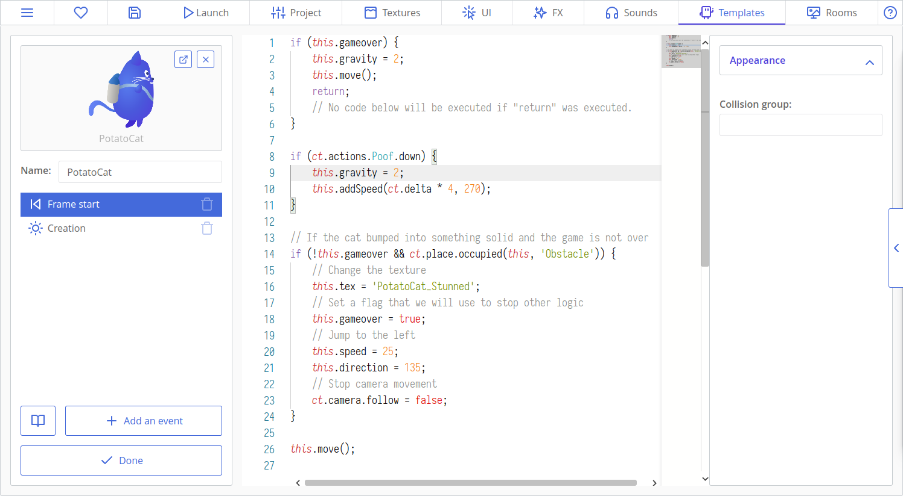

Time for some testing! If the cat jerks sharply during a collision, check that its collision shape and axis are set in the same way as in the starting texture.

### Making the cat lose if it touches ground or screen's top edge

For some reason, the floor — and even the sky — is as deadly as tubes in flappy bird-like games. Now, the ground does not have a type and won't work with `ct.place`, as well as sky, as it is not a game's entity at all. But they are flat, horizontal, and we can augment our collision logic with rules that check the cat's position in space.

If we now open our room and move the mouse over the level, we will see current coordinates in the bottom left corner. The top side of the initial view frame is always at 0 pixels on the Y-axis, and the ground's top edge is somewhere at 1750 pixels. Copies' position is defined by `this.x` and `this.y`, and we can read them and compare to some other values.


Modify the cat's collision logic as following so the cat gets stunned from hitting the ground and sky as well. Note that we added parenthesis around new comparisons and `ct.place.occupied` to divide them:

```js {3,4,5,6}
// If the game is not over, the cat bumped into something solid, or
if (!this.gameover && (ct.place.occupied(this, 'Obstacle') ||
    // the cat is below the ground minus its approximate height, or
    this.y > 1750 - 200) ||
    // the cat flew off the upper boundary,
    this.y < 0
) {
    // Change the texture
    this.tex = 'PotatoCat_Stunned';
    // Set a flag that we will use to stop other logic
    this.gameover = true;
    // Jump to the left
    this.speed = 25;
    this.direction = 135;
    // Stop camera movement
    ct.camera.follow = false;
}
```

### Randomizing pipe's height by changing its texture

We changed the cat's texture before with `this.tex = 'NewTextureName';`. We can do the same with our pipes to randomize their height, as we have four different textures for them.

Ct.js has a built-in module called `ct.random` that helps to generate random values. Find it in the Catmods tab at the top and enable it. Then, open the tube's OnCreate code and add this snippet:

```js
this.tex = ct.random.dice(
    'Tube_01',
    'Tube_02',
    'Tube_03',
    'Tube_04'
);
```

`ct.random.dice` is a function that accepts any number of arguments and returns one of them randomly at each time it is called.

Time for testing! If your pipes spawn misaligned, check that you set up collision shapes for all the four textures and put their axis to the bottom of a pipe.

## Spawning pipes through time

As types, rooms can have their own logic as well — they are hidden under the button "Room events" in a room editor. There are four events as well:

* "On Create" that runs once when you switch to this room or start a game in this room;
* "On Step' that runs at each frame after any other On Step events of copies;
* "On Draw" that runs at the very end of each frame;
* and "On Leave' that is run when you either switch to another room or remove a nested room from the stage.

We will do the following to spawn new pipes through time:

1. We will set up a variable in On Create event that will be our timer — it will count remaining frames before spawning new tubes;
2. At each frame, we will decrement this variable by one frame. More precisely — by `ct.delta`.
3. If the variable is equal or below zero, that means that the time is up, and we will wind it up again and create new tubes relative to the camera position.
    * We will also create tubes at the top of the viewport and use scaling to flip these tubes so that they point downwards.

Open our only room `InGame`. Remove existing tubes by holding Control key and dragging the mouse, or by right-clicking these copies and using the context menu. Then, click the button "Room events" in the left column.

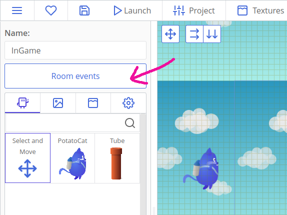

Put this line in the OnCreate code:

```js
this.spawnTimer = ct.speed * 5;
```

Here, `ct.speed` is a number of frames in a second, so we will wait for exactly 5 seconds before spawning our first tube.

In On Step, put this code:

```js
// Substract elapsed time from the timer
this.spawnTimer -= ct.delta;
// If the timer is up…
if (this.spawnTimer <= 0) {
    // Wind it again
    this.spawnTimer += ct.speed * 2;

    // Create two tubes
    var tube1 = ct.types.copy('Tube', ct.camera.right + 250, ct.camera.bottom - 130); // At the bottom of the camera
    var tube2 = ct.types.copy('Tube', ct.camera.right + 250, ct.camera.top - 70); // At the top

    // Change second tube's texture depending on which texture is used in the first tube
    if (tube1.tex === 'Tube_01') { // Shortest tube will result in the longest tube
        tube2.tex = 'Tube_04';
    } else if (tube1.tex === 'Tube_02') {
        tube2.tex = 'Tube_03';
    } else if (tube1.tex === 'Tube_03') {
        tube2.tex = 'Tube_02';
    } else if (tube1.tex === 'Tube_04') { // Longest will result in the shortest one
        tube2.tex = 'Tube_01';
    }
    // Thus we will always get gaps of the same size, but with random tubes.

    // Now, flip the upper (second) tube
    tube2.scale.y = -1;
}
```

There's a lot of code!

`this.spawnTimer` is decremented at each frame and will eventually turn to zero, or to a smaller value. When it happens, we set its value again to a positive number so that it fires again later. Here we add 2 seconds.

We create two copies with `ct.types.copy(typeName, xPosition, yPosition)` and store references to them to variables `tube1` and `tube2`. At the start, their height will be completely normal as their On Create code with `ct.random.dice` will be run instantly after their creation. This will result in a blocked pathway in a good portion of cases when both tubes turned out to be the long ones. To fix this, we read the texture's name of a first tube `tube1` with `tube1.tex` and set the texture of the second tube `tube2` depending on the extracted value.

`ct.camera.right`, `ct.camera.left`, `ct.camera.top`, `ct.camera.bottom` represent coordinates of view boundaries in game coordinates. Here we use them to create tubes off-screen, a bit to the right where the viewport ends, and above the bottom and top edge of the viewport.

Lastly, we flip the second tube by running `tube2.scale.y = -1`. It is exactly the same operation we would make when flipping an image vertically in a graphics editor. For reference, there also exists `tube2.scale.x` that sets its horizontal scale.

If we run the project now, we will see nicely generated tubes that leave a small gap between them to fly through. But wait, the cat is way too big to fly through! Oh no, maybe I should have called this tutorial as "Fatty Cat"…

No worries, there is a solution ✨ We will use the same scaling to make the cat a bit smaller. The scale values can be not just `1` and `-1`, but also anything in between to make an object smaller or larger than 1 to make objects bigger.

There are two methods to scaling the cat:

* we can add a line `this.scale.x = this.scale.y = 0.65;` to the cat's "On Create" event;
* or we can do the same by right-clicking it in the room editor and changing its scale.


### Cleaning useless copies

When we spawn copies through time, their number will constantly rise. If we don't do anything with it, the game will slowly eat so much PC's memory it will eventually crash. To prevent it, we will delete copies that went past the left side of the camera.

Add this code to the tube's On Step event:

```js
if (this.x < ct.camera.left - 150) {
    this.kill = true;
}
```

Here we compare a copy's horizontal coordinate to a camera's left side. We also watch 150 pixels to the left so the tube can fully escape the viewport before being removed.

## Adding stars

Let's add a type for star bonuses that will increment score when collected. We will do the following:

1. Set up a score variable in our room's "On Create" code.
2. Create a new type for star bonuses.
3. Add a bit of logic to the star's "On Step" event that will destroy the star when collided with the cat.
4. Create a new room and a type for it to display a score counter.
5. Put this new room into the main one.

Now, open the `InGame` room's events and add a line `this.score = 0;`. This will create a variable we will be able to edit and read in any other copy.

Create a new type, and call it a `Star`. Set its texture.

In its On Step code, put this script:

```js
if (ct.place.meet(this, 'PotatoCat')) {
    this.kill = true;
    ct.room.score += 1;
}
```

`ct.place.meet` is like `ct.place.occupied`, though it checks not against collision groups but against a specific type. Here we check whether a star collides with our cat. If it does, `this.kill = true` tells that the star should be removed. `ct.room.score += 1;` increments our score variable that was created before in the room's "On Create" code.

::: tip
`ct.room` always points to the current room. If you have nested rooms, the `ct.room` will always point to the main one.
:::

We will also need this code to prevent memory leaks and remove stars that were not collected:

```js
if (this.x < ct.camera.left - 150) {
    this.kill = true;
}
```

### Spawning stars

In the room's On Step code, add a couple of lines (the highlighted ones) that will add a star with a 30% chance somewhere in between the next two tubes. It will use methods from `ct.random` module:

```js {27,28,29,30}
// Substract elapsed time from the timer
this.spawnTimer -= ct.delta;
// If the timer is up…
if (this.spawnTimer <= 0) {
    // Wind it again
    this.spawnTimer += ct.speed * 2;

    // Create two tubes
    var tube1 = ct.types.copy('Tube', ct.camera.right + 250, ct.camera.bottom - 130); // At the bottom of the camera
    var tube2 = ct.types.copy('Tube', ct.camera.right + 250, ct.camera.top - 70); // At the top

    // Change second tube's texture depending on which texture is used in the first tube
    if (tube1.tex === 'Tube_01') { // Shortest tube will result in the longest tube
        tube2.tex = 'Tube_04';
    } else if (tube1.tex === 'Tube_02') {
        tube2.tex = 'Tube_03';
    } else if (tube1.tex === 'Tube_03') {
        tube2.tex = 'Tube_02';
    } else if (tube1.tex === 'Tube_04') { // Longest will result in the shortest one
        tube2.tex = 'Tube_01';
    }
    // Thus we will always get gaps of the same size, but with random tubes.

    // Now, flip the upper (second) tube
    tube2.scale.y = -1;

    // Create a star bonus with 30% chance somewhere in between top and bottom edge, with 300px padding.
    if (ct.random.chance(30)) {
        ct.types.copy('Star', ct.camera.right + 250 + 500, ct.random.range(ct.camera.top + 300, ct.camera.bottom - 300));
    }
}
```

`ct.random.chance(30)` returns `true` 30 times out of 100, and `false` otherwise. You can tweak the number to make stars appear more or less often.

`ct.random.range(a, b)` picks a random value in between the given range. In our case, we calculate two coordinates relatively to our camera so that stars don't spawn near the ground or top edge.

### Creating a UI element with a counter

In ct.js, as of v1.3, UI elements are usually created in a separate room that then gets embedded into other rooms. These nested rooms are also often referred to as "layers".

Go to the UI tab at the top of the ct.js window, and create a new text style. Call it Orange. Here, we will create a text style that we will use to display our score, as well as other text lines.

On the first tab, "Font", set the font size to 80, and its weight to 900. Then align it to center. This will make the text bolder and bigger.


Switch to the "Fill" tab, and activate it. Let's create a vertical gradient fill. We will use a pale yellow and orange colors.


Then, switch to the "Stroke" tab, and activate it. Set stroke's color as dark brown, and its weight to 10.


We can save the style now. After that, we will need a new type that will display a star icon and a score counter.

Create a new type and call it `StarCounter`. As its texture, we will reuse our `Star` texture. In its On Create code, put the following snippet:

```js
this.label = new PIXI.Text('0', ct.styles.get('Orange'));
this.label.x = 130;
this.label.y = -60;
this.addChild(this.label);
```

This code is sorcery made in Pixi.js' API. Pixi.js is the graphics framework ct.js is built upon, and when we need to display something beyond copies and backgrounds, we will use their API. Here, `new PIXI.Text` creates a new text label. Its first argument is a string that will be displayed: we have 0 score points at room start, and thus will write `'0'` as an initial text. The second argument is a text style — we load it from our created style `'Orange'`.

By writing `this.label = new Pixi.Text(…)`, we instantly remember the reference to the created label and save it as a copy's parameter `this.label`. We then position it by writing `this.label.x = 130;` and `this.label.y = -60`, but we are doing it relative to the copy. The copy `StarCounter` itself is more a container we use to display our text, though it still displays an icon. The line `this.addChild(this.label)` finally puts the created text label into the copy.

We need to update the text label at each frame. In the On Draw event, put the line `this.label.text = ct.room.score;`.

Finally, let's create a room for this counter and put this room inside the main one. Create a new room, and call it `UI_InGame`. Then, set its view size to 1080x1920 to match the main room's viewport, and put a counter's copy in the top-left corner:

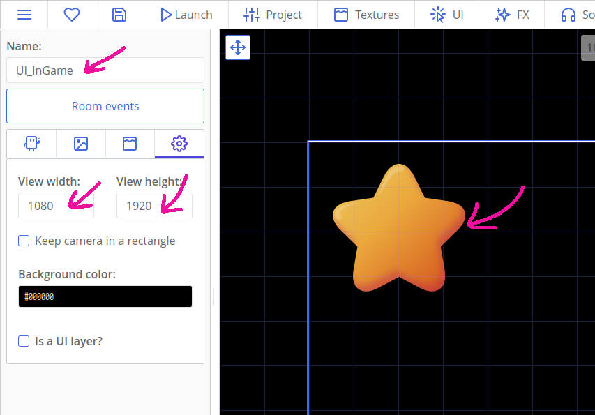

Then open the room `InGame`, and add this code to the bottom of its OnCreate code:

```js
ct.rooms.append('UI_InGame', {
    isUi: true
});
```

After that, you should have stars spawning in the level, that increment score displayed in the top-left corner of the viewport.

## Creating menus

We will now add more rooms with usual menus so that our game feels complete:

* the main menu;
* a pause screen;
* and a score screen that will be shown on failure.

### Main menu

Open the texture `Jetty_Cat` and make sure that its axis is placed in the center of it. Then, create a new type with it. It will be purely decorative, so we won't write any code here.

Then, open the texture "Button_Play" and make sure that its axis is at the center, and its collision shape is **circular**.

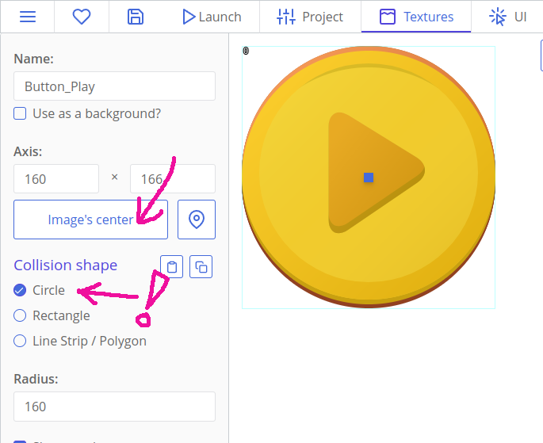

After that, create a new type with this texture. In its On Step code, put the following:

```js
if (ct.touch.collideUi(this)) {
    ct.rooms.switch('InGame');
}
```

There's something new! `ct.touch.collideUi(this)` checks whether a given copy was touched. It works with UI layers; there is also `ct.touch.collide(copy)` if you will need it for gameplay elements in your future projects. With other lines, `ct.touch.collideUi` checks whether a player pressed the button, and if they did, it switches to our main room.

Create a new room and call it `MainMenu`. Add backgrounds to it, and layout recently created copies so that it looks like this:


Hold the Alt button on your keyboard to place copies precisely.

If your copies seem to disappear or not being placed, check that you set the depth of your backgrounds to -20 and -10. They may be overlapping your elements!

If we now run the game, it will still start in our main room. To change that, open the Rooms tab and right-click the `MainMenu` room. In the context menu, select "Set as the starting room".


### Pause menu

For a pause menu, we will need a couple of new buttons and a new room that will overlay over our main room and UI.

Create a type for texture `Button_Pause`. Make sure the texture `Button_Pause` has its axis put to center and has a proper **rectangular** shape that covers the whole texture.

The type `Button_Pause` will have this code in its On Step event:

```js
// If the button was pressed,
if (ct.touch.collideUi(this)) {
    // Check if we don't have any rooms called 'UI_Paused'
    if (ct.rooms.list['UI_Paused'].length === 0) {
        // Create a room UI_Paused, put it above the current one (append it),
        // and specify that it is a UI layer (isUi: true)
        ct.rooms.append('UI_Paused', {
            isUi: true
        });
        // Turns ct.delta into 0, effectively stopping the game
        ct.pixiApp.ticker.speed = 0;
    }
}
```

Remember the name `UI_Paused`. We will need to create a room with this name a bit later.

`ct.pixiApp.ticker.speed` is the multiplayer that affects how ct.delta is calculated. When it is set to 0, it will effectively pause the game as everyone's `ct.delta` will turn to 0. Our cat and timers are dependant on `ct.delta`.

Open the room `UI_InGame` and place the created type at the top right corner.

After that, create two new types similar to those created for `MainMenu`. Use textures `Button_Play` and `Pause`. The button should be called `Button_Continue`, though.

This button will have the following code in its On Step event:
```js
if (ct.touch.collideUi(this)) {
    ct.rooms.remove(this.getRoom());
    ct.pixiApp.ticker.speed = 1;
}
```

`ct.rooms.remove(room);` removes previously added room. It cannot remove the main one, but is created to remove nested ones. `this.getRoom()` looks up for a room that owns the current copy. `ct.pixiApp.ticker.speed = 1;` reverts `ct.delta` back to normal behavior, unpausing the game.

The final step is to create this nested room that will have an unpause button and a decorative header. Create a room called `UI_Paused`, and place a `Button_Continue` copy and a "Paused" header. Make sure you set its viewport size to 1080x1920 as well!

### Score screen

The final step is making a score screen that will be displayed after a player loses. We will need one more header and a type that will display the final score. For a button that will replay the game, we will reuse the type `Button_Play`.

Create a type with a texture `OhNo`. It won't have any logic.

The other one, `EndGame_ScoreCounter`, won't have any texture at all. Instead, it will display a text label through code. It will also remember and display the player's high score. Put this code to its On Create event:

```js
if (!('JettyCat_HighScore' in localStorage)) {
    localStorage['JettyCat_HighScore'] = ct.room.score;
} else if (localStorage['JettyCat_HighScore'] < ct.room.score) {
    localStorage['JettyCat_HighScore'] = ct.room.score;
}

var scoreText = 'Your score: ' + ct.room.score + '\nHighscore: ' + localStorage['JettyCat_HighScore'];

this.label = new PIXI.Text(scoreText, ct.styles.get('Orange'));
this.label.anchor.x = this.label.anchor.y = 0.5;
this.addChild(this.label);
```

`localStorage` is a built-in object that allows you to store textual data in browser. You can find more about it and saving progress [here](localstorage.html).

`if (!('JettyCat_HighScore' in localStorage))` checks whether a property `JettyCat_HighScore` exists inside the object `localStorage`. It is a good way to check whether there is any saved data. By the way, it works with copies, rooms, and other objects as well.

If there is no such record in the browser, the line `localStorage['JettyCat_HighScore'] = ct.room.score;` will write it to the storage. Otherwise, we perform another check: `localStorage['JettyCat_HighScore'] < ct.room.score` checks whether the saved result is smaller than the current one. If it is, hooray! The player has just beaten their record. The record is updated again.

This line:
```js
var scoreText = 'Your score: ' + ct.room.score + '\nHighscore: ' + localStorage['JettyCat_HighScore'];
```
saves a string to a temporary variable. Everything defined with the `var` keyword exists only one frame and in one event. Though it doesn't serve much purpose, it allows to write cleaner code and reuse temporary variables. The combination `\n` tells that there will be a line break there. By using the `+` operator, we join our strings with the current score and the saved one. Lastly, we create a new text label and set its text to the created variable's value (by using it as an argument in `new PIXI.Text(scoreText, ct.styles.get('Orange'));`).

Now, create a room called `UI_OhNo` with the created types.


The last thing we need is creating this room when the cat hits an obstacle. Open the type `PotatoCat` and find the place where we detect collision with surface or obstacles in its On Step event. Add this code right after the line with `ct.camera.follow = false;`:

```js
// Wait for 1000 milliseconds (for one second)
ct.u.wait(1000)
.then(() => {
    // Add a layer with "Lose" UI
    ct.rooms.append('UI_OhNo', {
        isUi: true
    });
});
```

A-a-and… ta-da! You did it! The game is fully-featured and playable!

::: tip
`ct.u.wait(1000)` is an asynchronous method that waits for one second, then executes a given code in the `.then(() => {…})` part. "Asynchronous" means that the code is executed outside the On Step event, and happens later in the game.

You will always find the structure `method().then(() => {…})` while working with asynchronous actions. In JavaScript world, such actions are also called "Promises". When you don't need to use them, though, you can omit the part with `.then(() => {…})`.
:::

## That's it!

For transitions, particle effects and other fancy stuff, visit [the second part of this tutorial](tut-polishing-jettycat.html) where we polish the game.

Try changing this stuff to train yourself in coding:

* Change the cat's movement so that it is more close to what happens in Flappy Bird: make the cat fly upwards abruptly when a player taps the screen, but do nothing if they then press the screen continuously.
* Make rotating tubes to make the game more challenging.
* Add a life counter, and allow a player to take 3 hits before loosing.
* Add sounds! Visit [ct.sound](ct.sound.html) documentation on how to play sounds in your game.