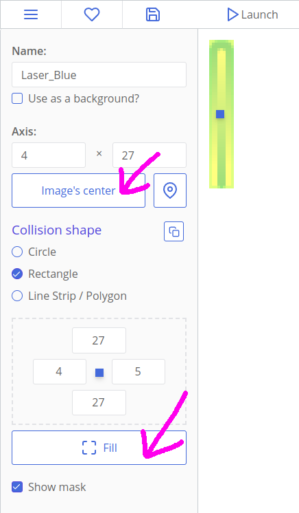
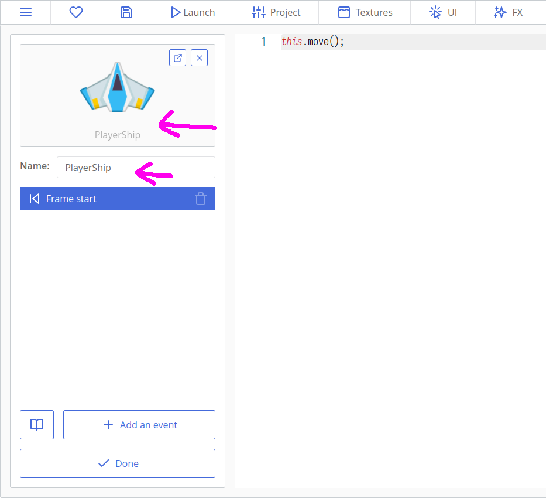
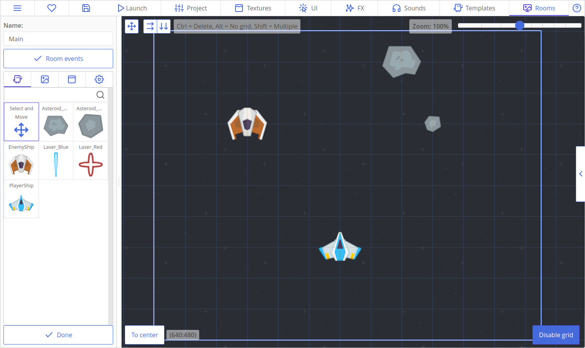

# Making Games: Space Shooter

Let's make a small space shooting game with asteroids, lasers and hostile gunships! This tutorial will teach you how to import assets, handle user input, move things around and respond to collisions.


Here's what we will do:

[[toc]]

## Importing Textures

Open ct.js and create a new project with a name "SpaceShooter".


Next, [download an asset pack](http://www.kenney.nl/assets/space-shooter-redux) from Kenney's site. It is free to use and is great for prototyping, learning or just testing things out.

You can also use assets placed inside a `ct.js/examples/SpaceShooter_assets` folder.

These are all the assets we will need today:


Now open the "Textures" tab on the top of the ct.IDE window, and drag & drop these assets inside the ct.IDE window. You can also press an "Import" button to find them manually.

A card for each of the images will appear. Let's open the `PlayerShip` and configure it. We will see a yellow shape that defines its collision shape. For now, it covers too much empty space, especially above wings. To fix it, we should modify this collision shape in the left column.

Firstly, press a button "Image's center", so its axis is placed at the ship's center.

Next, select the "**Line Strip / Polygon**" option under the label "Collision Shape". Add a couple of additional points and move them with your mouse so that the resulting polygon resembles the ship's shape.


Press "Save" and move to the next texture — "LaserRed". As with the ship, let's set its axis to center by clicking "Image's Center". Then, select a **Circle** collision shape right beneath this button. Now a yellow collision shape is drawn as a circle.

The next texture, `Laser_Blue`, should be centered too, and since the collision shape should cover all the image, we can click the "Fill" button to automate it.



Both asteroids are better defined as polygons by their concave or sharp shapes. Set their collision shape to **Line Strip / Polygon**, and don't forget to set their axis to center.


The `EnemyShip`'s shape can be treated as a **Polygon**.

The background image may be left as is, because it won't collide with other things in the game.

## Making First Templates and Laying Things Out

**Textures** don't do much on their own, and in order to display them in game, we need to create **templates** with these assets. Templates are used to create **Copies**, and the latter are the things that you place inside **Rooms**, that interact with each other and respond to your inputs.

Press the "Templates" tab on top of the screen, and create a new template for the player's ship. After clicking the "Create" button, click on the big ghostly cat in the left column. It will show you all your textures. Press the card with your ship. It should now appear in the left column of the editor.

Now, change the template's name to `PlayerShip` so we won't need to remember these numbers while coding.



Create templates for all the other textures but the background image. Background images don't move or interact with anything, and is often tiled, so it is not a template. We will add it later in a **Room**.


Let's place created templates somewhere on the map. To create this map, or Room, press the "Rooms" tab on top of the ct.IDE windows, and click an "Add new" button. Then, open the newly created room by clicking it.


Here we will stop a bit to explain how to use the Room editor. Firstly, we can set up a Room's name and its viewport size.

In ct.js, Rooms are infinite and can pan in any direction. You can place objects inside and outside the viewport.

Then we have Room events. It is a section that defines game logic specifically for this room. You can define UI or level scenario here.

Under this button we have a panel with Copies and Backgrounds. We pick a Copy from the according tab and place it to the map by clicking on a large area on the right. To disable adding new copies, select a ghostly cat on the left. You can pan the editor's view by dragging your mouse on the left side when nothing is selected. You can change zoom level by using the zoom slider on the top, or by mouse wheel.

If you feel lost, press the "To center" button to return to (0, 0) coordinates.

You can set a grid by clicking on the button in the bottom right corner. Clicking it again will disable the grid.

Lastly, you can move all the copies in the room at once by clicking a button with a "move" icon in the top left corner.

For now, let's place a player's ship, a hostile one and a couple of asteroids.



Then add a background. Click the "Backgrounds" tab and press "Add", then select our `BG`. It will appear as a tiled texture in the main view.


Though backgrounds are always drawn before Copies of the same depth level (`0` by default), it is better to change their Depth level. Click on the cog on the left to the background's icon in the left column and input `-5` in the "Depth" field. By doing this, we tell the engine that this background is placed lower than other Copies and backgrounds. Depth represents a third coordinate axis that goes upwards, when X and Y go to the sides.


After that, save the project and click a 'play' button. At this point, you will have a game project with immovable ships and asteroids.


## Adding Player's Movement

Handling user's input is the most important task. In this section we will make the blue ship move when a player presses arrow keys or WASD.

In order to handle keyboard inputs, we need to enable the Keyboard module. Press the "Project" tab, then a "Catmods" tab on the left, then find a Keyboard module in the section with available modules. Click it to enable it (it may be enabled by default, though — a green checkbox with a little spinning circle indicates that the module is enabled). Then make sure that modules `mouse`, `random` and `place` are enabled, as we will need them later too.


### Adding actions

Actions in ct.js are entities that group different input methods into events, and allow you to listen to player input in code. You can read more about them [here](/actions.html).

For now, let's create a basic input scheme for our shooter. Open the "Project" tab, then the "Actions and input methods" tab on the left side. We will need to define three different actions: for shooting laser bullets, for moving horizontally, and for moving vertically.

First, click the "Make from scratch" button. Then, input the name of the first action. Click the button called "Add an input method" to bind specific buttons to your action. Use its search to quickly filter available input methods. Click the "Add an action" button to continue creating more actions.


Create three actions as in the picture above. Set multiplier value to `-1` for `keyboard.ArrowUp`, `keyboard.KeyW`, `keyboard.ArrowLeft`, and for `keyboard.KeyA`, so that these keys will move the ship in the opposite direction.

### Coding the movement

Open the "Templates" tab on the top, then click on the `PlayerShip` template and move to `Frame start` event.

::: tip
`Frame start` event occurs every frame before drawing, while `Frame end` happens after all the `Frame start` events in the room to draw a new frame. `Creation` happens when you spawn a new Copy, and  `Destruction` occurs before the `Frame end` event if a Copy is killed.
:::

Write the following code:

```js
/**
 * Move the ship
 * See Project > Actions and input methods panel
 * and "Actions" in the docs.
 */

this.x += 8 * ct.delta * ct.actions.MoveX.value; // Move by X axis


/**
 * Check whether the ship fell off the viewport
 */
if (this.x < 0) { // Have the ship crossed the left border?
    this.x = 0; // Go back to the left border
}
if (this.x > ct.camera.width) { // Have the ship crossed the right border?
    this.x = ct.camera.width; // Go back to the right border
}

this.move();
```

Here we are using the created actions. First, we try to move the ship horizontally (by `x`, line 6). `ct.actions.MoveX` will return `1` if we pressed the right keyboard arrow or the "D" key, and will return `-1` if a player presses the left arrow or the "A" key. If nothing is pressed, it will return `0`, disabling the horizontal movement.

`ct.delta` is needed to compensate possible lags and FPS drops. It is usually equal to `1` and doesn't add much, but will speed up the movement if some frames were dropped.

Lastly, we multiply our intermediate speed value with the desired velocity, `8`.

We later check whether its X coordinate fell off the viewport. Here `0` means the left side of the room and `ct.camera.width` means the horizontal size of the viewport, which forms the right side.

::: tip On your own!
Add a vertical movement to the player. Then, try to limit its movement so the ship can't fly above the middle of the viewport.
:::

## Moving Hostiles and Asteroids

Enemies should move, too. For this tutorial, our hostile ship will move from top to bottom, and asteroids will fly in a random direction.

### Enemy ships

Open the "Templates" tab, then click on the `EnemyShip`. Navigate to the `Creation` event and add this code:

```js
this.speed = 3;
this.direction = 270;
```

Here, we use built-in variables for moving. Manually editing coordinates is good for handling player's input, but for most tasks it is better to use these vars as they automate most of the things. For example, you don't need to use `ct.delta` while using `this.speed` and `this.direction`. Here, `this.speed` means the speed of the Copy, and `this.direction` refers to its direction.

::: tip
In ct.js, direction is measured in degrees, moving from the left side counter-clockwise. 0° means right, 90° means up, 180° is for left, and 270° points to the bottom.


:::

If we navigate to the `Frame start` event, we will see this little code:

```js
this.move();
```

This line reads built-in variables and moves the Copy according to them. Without it, `this.speed` and `this.direction` will be meaningless.

There are more built-in variables, which you can find on the [`ct.templates` page](ct.templates.html).

We will modify the `Frame start` code so enemies will destroy themselves if they fall off the screen.

```js
this.move();

if (this.y > ct.viewHeight + 80) {
    this.kill = true;
}
```

::: tip On your own!
What if enemy ships could move diagonally, zig-zagging?
:::

### Asteroids

Asteroids will contain the same `Frame start` code, but their `direction` variable will be defined randomly.

Open the `Asteroid_Medium` in the "Templates" tab, then write the code below in the `Creation` event.

```js On Create event
this.speed = ct.random.range(1, 3);
this.direction = ct.random.range(270 - 30, 270 + 30);
```

The `Frame start` event will be the same as in `EnemyShip`.

```js Frame start event
this.move();

if (this.y > ct.viewHeight + 80) {
    this.kill = true;
}
```

Do the same for another asteroid.

Save the project and click the "Play" button at the top. The hostile ship will slowly move to the bottom, while asteroids will move more chaotically. If you refresh the page, asteroids will move to a new direction.

::: tip
Do you have errors with `ct.random`? Make sure that you've enabled the `random` module at the Project tab -> Catmods panel.
:::


## Projectiles & Collision

Now it is time to bring the guns 😎

Open the `PlayerShip` template, and add the "Action press" event. A window should then pop up to ask you which action you want to use. Select the "Shoot" action and then hit apply. Now inside the "On Shoot press" event add this code:

```js
ct.templates.copy('Laser_Blue', this.x, this.y);
```

This is the first time we add new copies programmatically. Hooray!

::: tip
`ct.templates.copy` is a very important function that spawns a new Copy in the current room. Firstly, we write an enquoted Template's name to copy. Then, we write coordinates at which we should create it, by horizontal and vertical axes accordingly. `this.x` means a horizontal location of current copy, and `this.y` means a vertical one.
:::

With all the data combined, we make a laser bullet right under our ship. Bullets will spawn when the Space key is pressed.

Now let's move to the `Laser_Blue` itself. We will define its movement with default variables.

```js On Create code
this.speed = 18;
this.direction = 90;
```

Next, let's make sure that these laser bullets will disappear after they fly out the view. As they always fly to top, we may write a condition for the upper border only.

```js Step code
if (this.y < -40) {
    this.kill = true;
}

this.move();
```

The next thing is handling collisions. It is better to write all the collision logic in enemy ships' and asteroids' code because they will respond differently, making no clutter in the bullet's code.

Go to the `EnemyShip` template and create a "Collision with a template" event, then select `Laser_Blue`. In the code, add the following:

``` js
other.kill = true;
this.kill = true;
```

::: tip
`other` is a special variable that can be referenced when inside collision event code. `other` refers to the other colliding copy. Look out for other local variables that may be accessible in certain events!
:::

If a ship collides with a laser bullet, then both the bullet and the ship should be destroyed.

Copy exactly the same code to `Asteroid_Medium`. We will need this code in `Asteroid_Big` too, but we will make it so that big asteroids break into two smaller ones:

``` js
other.kill = true;
this.kill = true;
ct.templates.copy('Asteroid_Medium', this.x, this.y);
ct.templates.copy('Asteroid_Medium', this.x, this.y);
```

If you run the game, you will be able to destroy enemy ships and asteroids. Bigger asteroids should break into smaller ones.

### Enemy bullets

Enemy ships should be able to shoot, too. Add the following code to `EnemyShip`'s `Creation` code:

``` js
this.timer1 = 1;
```

With this, we will set up our timer so that the enemy ship will shoot at precise intervals. `timer1` is a special variable that ct.js will automatically countdown for us, 1 per second. The `Timer 1` event will fire once this value reaches 0. This means we will wait for 1 second before shooting the first bullet.

Add this code to the `Timer 1` event:

```js
this.timer1 = 3;
ct.templates.copy('Laser_Red', this.x, this.y + 32);
```

When the `timer1` variable goes down to zero, we wind it back up by setting it to 3 and then create a red laser bullet. Now the next bullet will shoot in 3 seconds automatically. As you can see, by writing `this.y + 32` we spawn it a bit lower than the ship.

Let's write some code to red bullets. Add this code to `Creation` section of Laser_Red:

```js
this.speed = 8;
this.direction = 270;

this.angle = ct.random.deg();
```

`this.angle` rotates a copy's texture. `ct.random.deg()` returns a random value between 0 and 360, which is handy while defining angular values.

::: tip
There is also `this.scale.x` and `this.scale.y`, which sets a copy's horizontal and vertical scale accordingly, and `this.alpha` which manipulates its opacity (0 means fully transparent, 1 — fully opaque).
:::

The code of `Frame start` will look as following:

``` js
if (this.y > ct.viewHeight + 40) {
    this.kill = true;
}

this.move();

this.angle -= 4 * ct.delta;
```

`this.angle -= 4 * ct.delta;` means that we will rotate a Copy by approximately 4 degrees at each step. `ct.delta` will balance out stuff if the game suffers from inconsistent FPS.

We will define logic for destroying player's ship later. For now, it's time to add enemy and asteroid generation during the playtime.

## Generating objects through time

Open the `Main` room in the Rooms section. Remove existing asteroids and enemies by right-clicking on them, or erase them with left mouse button while holding the `Ctrl` key.

Next, Press the `Room events` button on the left.

Rooms have all the same events like Copies have.

* `Room start` is called when you launch the game or move to this room programmatically;
* `Frame start` is called each frame, after Copies' `Frame start`;
* `Frame end` is called after drawing all the level. It is useful for updating UI;
* `Room end` is called before moving to another room.

We will generate enemies in almost the same way as enemy ships generate their bullets. We will have a couple of timers and will place copies above the player's view.

To do this, setup two timers in the `Room start` code:

```js
this.timer1 = 0.3; // asteroid timer
this.timer2 = 3; // enemy timer
```

Then add this code in the `Timer 1` tab to generate asteroids through time:

```js
// asteroid timer
this.timer1 = ct.random.range(0.3, 3);
ct.templates.copy(ct.random.dice('Asteroid_Big', 'Asteroid_Medium'), ct.random(ct.camera.width), -100);
```

Then add this code in the `Timer 2` tab to generate enemies through time:

```js
// enemy timer
this.timer2 = ct.random.range(3, 6);
ct.templates.copy('EnemyShip', ct.random(ct.camera.width), -100);
```

That's all what you need for generating asteroids and enemies!

::: tip
`ct.random.dice` returns one of the provided values. You can put any value here, including Numbers, Strings, complex objects. Here, there is a 50% chance that `'Asteroid_Big'` will be returned and a 50% chance that it will be `'Asteroid_Medium'`.

`ct.random.range(a, b)` returns a random numerical value between `a` and `b`.

`ct.random(b)` is the same as `ct.random.range(0, b)`.
:::

## Lives, score and GUI

Let's add score counting to the game and player ship's reaction to hostiles.

### Adding and drawing score

Score is a numerical variable that is stored globally. In our case it is better to place it inside the room. Open the `Main` room, and then click on 'Room events' button. Add this code to the `Room start` section:

```js
this.score = 0;

this.scoreLabel = new PIXI.Text('Score: ' + this.score);
this.addChild(this.scoreLabel);
this.scoreLabel.x = 30;
this.scoreLabel.y = 30;
this.scoreLabel.depth = 1000;
```

Here, we create a variable called `score`. Then, we construct a text label with `new PIXI.Text('Some text')`, save it `this.scoreLabel` and add it to the room with `this.addChild(this.scoreLabel);`. Later, we position it so that it shows at the top-left corner, with 30px padding on each side. We also set its depth — this is the same parameter we use in templates' settings, and this large positive value will place the `scoreLabel` above other entities in our room.

We also need this code at `Frame end` to keep the label up-to-date:

```js
this.scoreLabel.text = 'Score: ' + this.score;
```

Now, move to `EnemyShip`'s `Collides Laser_Blue template` code, and add `ct.room.score += 100;` to a place where a ship is destroyed after colliding with a bullet, so the whole code looks like this:

```js
other.kill = true;
this.kill = true;
ct.room.score += 100;
```

::: tip
`ct.room` points to the current room object.
:::

Do the same for asteroids, too. Change the number of given score points as you wish.

If you launch the game, you may notice a small black number in the top-left corner which changes as asteroids and enemy ships get destroyed. But this doesn't look nice, so it is a good time to make some styling.

Text can be drawn with pre-defined styles that declare fill color, line style, font settings, shadow. They are created in the `UI` section in the top bar. Create one by clicking on the `Create` button. You will see a style editor, which has a left bar with tabs for setting properties and a preview image on the right.

Let's make the font bigger and bolder. Change its size and set its weight to 800. Then align it to be drawn from a top left corner.


Click the `Fill` tab, activate it, and then select the "Diffuse" fill type. Select an appropriate color; I chose something similar to the player's ship's colors.


Add shadow, or border, or both! Then save the changes by clicking the "Apply" button in the bottom-left corner.

Name the created style as `ScoreText`. You can rename it by right-clicking it in the list view.

Now let's return to the room's events. Open the `Room start` tab, and modify the code to apply the created style:

```js{5}
this.timer1 = 0.3; // asteroid timer
this.timer2 = 3; // enemy timer

this.score = 0;
this.scoreLabel = new PIXI.Text('Score: ' + this.score, ct.styles.get('ScoreText'));
this.addChild(this.scoreLabel);
this.scoreLabel.x = 30;
this.scoreLabel.y = 30;
```

::: tip
`ct.styles.get('Style');` loads the given style. You can use it inside PIXI.Text constructor to style the created label.
:::

If you launch the game, the score will be drawn in your created style. Hooray!

### Drawing and managing lives

Managing lives is similar to managing score points. Add this code to the room's `Room start` code so that it stores and draws the number of lives, too:

```js
this.lives = 3;
this.livesLabel = new PIXI.Text('Lives: ' + this.lives, ct.styles.get('ScoreText'));
this.addChild(this.livesLabel);
this.livesLabel.x = ct.camera.width - 200;
this.livesLabel.y = 30;
this.livesLabel.depth = 1000;
```

::: tip On your own!
Create a new style and apply it to the 'Lives' label.
:::

Then we should add logic so that player's ship removes one life on collision. We could use `ct.place.meet` as we used it in asteroids' and enemies' code to test against a particular template, but let's group them into one _collision group_. It will allow us to write less code and won't require any changes if we add more enemies, missiles or asteroids of different size.

To add copies to a collision group, we should write in the name of the collision group in the right column of the template editor. Let's write in the word `Hostile`. Do it for all the asteroids, for the enemy ship and red lasers.

Go to the player ship and create a new "Collision with a group" event. Specify "Hostile" in the appearing text field. Now add this code to the player ship's `Collides Hostile group` code:

```js
if(ct.templates.isCopy(other)) {
    other.kill = true;    
}

ct.room.lives --;
if (ct.room.lives <= 0) {
    this.kill = true;
    setTimeout(function() {
        ct.rooms.switch('Main');
    }, 1000);
}
```

`ct.rooms.switch` unloads the current room and loads a new one. By pointing to the same room as we were playing, we restart it.

`setTimeout` is a standard browser's function that executes a function after a given number of milliseconds. Here we wait one second (1000 milliseconds) and then restart the room.

::: tip
`setTimeout` may seem like a better way to work with delayed events than writing timers. The difference is that timers exist while its owner does, but `setTimeout` will happen in any circumstances, even if the copy that called it was removed from a room. (Actually, there _is_ a way to cancel a `setTimeout`, but it isn't that handy when working with different copies. Ok, forget what I've said.)

In our case, we want the room to be restarted though there aren't any player ships on the screen, so we use `setTimeout`. We use timers for shooting and spawning enemies because we don't want bullets to randomly appear after enemies were destroyed.
:::

Save your project and test it out. Now you have a small, but fully working space shooter! There is a lot of ways to improve this game further:

* tweak existing values, like enemy speed or score points for a better gameplay;
* add more enemies;
* improve shooting with timers so that you can just hold your spacebar, not smash it;
* add bonuses and different weapons;
* design a main menu and a victory screen;
* add sounds;
* create bosses and companions.

That's my result of improving this project furthermore: [Catsteroids](https://comigo.itch.io/catsteroids).

You can also start a new project if you're not into space shooters :D
