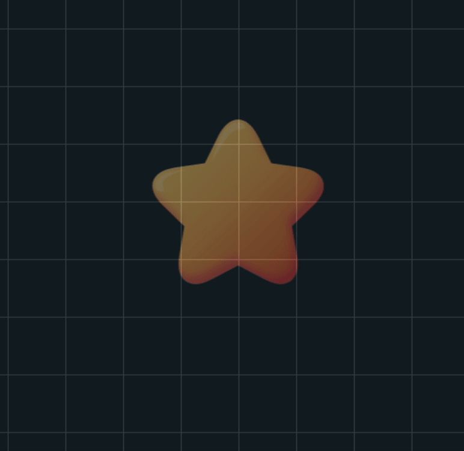
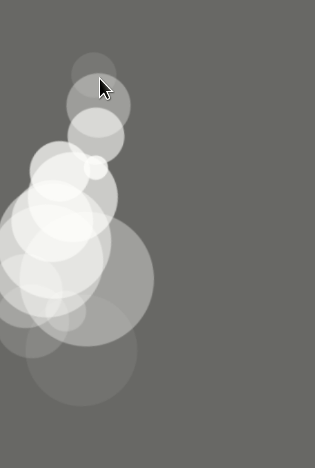
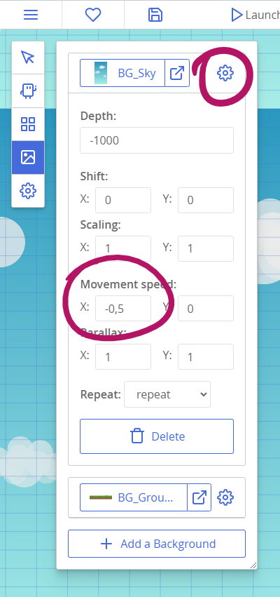
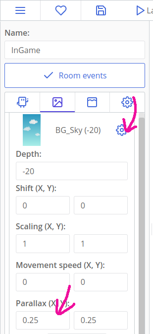

# Polishing the JettyCat

::: tip Hey,
This tutorial assumes that you have finished the tutorial [Making Games: Jetty Cat](tut-making-jettycat.html). You should complete it first.
:::

The game is complete mechanic-wise, but there is a lot of ways to improve it aesthetically and gameplay-wise! This section also highlights some new v1.3 features.

[[toc]]

## Transition between rooms

Ct.js has a module called `ct.transision`. It allows you to easily create nice transitions between levels. The idea is that you start the first half of a transition on button press or some other event, then switch to another room and call the second half of a transition in its On Create code.

Enable the module `transition` in the Catmods tab. It signals that it depends on the `tween` catmod, so enable it as well.

Now, modify the `Button_Play` On Step code so that it shows a blue circled transition when clicked:

```js
if (ct.touch.collideUi(this)) {
    if (!this.pressed) {
        this.pressed = true;
        ct.transition.circleOut(1000, 0x446ADB)
        .then(() => {
            ct.rooms.switch('InGame');
        });
    }
}
```

`this.pressed` is our custom variable that remembers that a button was pressed. It will help us prevent occasional double clicking, that may have negative effects on game's logic.

The first argument in `ct.transition.circleOut(1000, 0x446ADB)` is the duration of the effect (1000 milliseconds = 1 second), and the second one is the color of the transition. It is like the hex color, but with `0x` instead of `#` in the beginning.

::: tip
There are much more methods and examples in the module's "Info" and "Reference" tabs.
:::

The transition itself is an asynchronous action! We use `.then(() => {…})` to switch to the next room right when the transition ends.

That was the first part of the transition. The second one will go to the `InGame` On Create code. Open the room, and put this line:

```
ct.transition.circleIn(500, 0x446ADB);
```

We can also show up our UI layers (the pause menu and the score screen) by making them transparent but slowly turning them opaque. We will use `ct.tween` there — that one catmod that is used by `ct.transition`.

Most entities in ct.js have the same parameters that allow you to tweak their look and feel. We've been using `this.scale.x` and `this.scale.y` to set a copy's scale, but we can also apply it to rooms, text labels, special effects, and so on. Besides scaling, there are parameters `this.rotation`, `this.alpha` and `this.tint` that rotate an object, set its opacity and color correspondingly.

We will change the property `this.alpha` through time. It is a number between 0 and 1. When set to 1 — its initial value —, a copy or a room will be fully opaque. When set to 0, it will be invisible. Any numbers in-between will bake an object partially transparent. The module `ct.tween` will help create a smooth transition of it.

So, to fade in a UI layer, we need to put this code in On Create of rooms `UI_OhNo` and `UI_Paused`:

```js
this.alpha = 0;

ct.tween.add({
    obj: this,
    fields: {
        alpha: 1
    },
    duration: 500
});
```

Firstly, we make a room fully transparent by setting its `alpha` to 0. Then, we call `ct.tween.add` to start a smooth transition. `obj` points to an object that should be animated, and `fields` lists all the properties and values we want to change. Finally, the `duration` key sets the length of the effect, in milliseconds.

We can fade out a UI layer, too. Let's gradually hide the pause menu when the player hits the "continue" button. Open the type `Button_Continue`, and modify its code:

```js
if (ct.touch.collideUi(this)) {
    if (!this.pressed) {
        this.pressed = true;
        ct.tween.add({
            obj: this.getRoom(),
            fields: {
                alpha: 0
            },
            duration: 1000
        })
        .then(() => {
            ct.pixiApp.ticker.speed = 1;
            ct.rooms.remove(this.getRoom());
        });
    }
}
```

We create a flag `this.pressed` to make sure that the code that runs the animation only once. Running it multiple times won't hurt, but keeps the debugger's log clean as `ct.tween` will warn about interrupted animations otherwise.

Then we start animation for `this.getRoom()`, which will return the room `UI_Paused` that owns this button, and change its alpha value back to 0. After that, we can see that `ct.tween.add` creates an asynchronous event, and we remove the room and unpause the game inside the `.then(() => {…});` clause.

## Smoothly resuming the game after it has been paused

Though the "paused" menu fades out slowly, it is still hard for a player to catch up and prevent the cat from bumping into the ground. To prevent that, we can use `ct.tween` to… animate time! `ct.pixiApp.ticker.speed = 1;` can be not just 0 and 1, but also anything in between, and even beyond 1. Large values will make the game run faster, while values close to 0 will slow the game. Thus, we can animate the value `ct.pixiApp.ticker.speed` to make the game transition from paused to fully running state.

Open the type `Button_Continue` again, and modify the script so it fires another `ct.tween.add` after it finishes the first one:

```js {12,13,14,15,16,17,18}
if (ct.touch.collideUi(this)) {
    if (!this.pressed) {
        this.pressed = true;
        ct.tween.add({
            obj: this.getRoom(),
            fields: {
                alpha: 0
            },
            duration: 1000
        })
        .then(() => {
            ct.tween.add({
                obj: ct.pixiApp.ticker,
                fields: {
                    speed: 1
                },
                duration: 1000
            });
            ct.rooms.remove(this.getRoom());
        });
    }
}
```

Now players can catch up with the game and save their cat from falling.

## Cat's jet smoke and star particles

From v1.3, ct.js allows you to visually design particle effects and play them in your game. And it's cool! Let's create two effects: one will be a jet smoke for the cat. The other will show a burst of smaller stars when you collect one.

### Making a starburst

Open the "FX" tab at the top, and create a new particle emitter. Call it `StarBurst`.

Select its texture in the left top corner, and start tweaking values! There are lots of folding categories that manipulate how particles move, change over time and spawn.

Try making it look like this one:



::: tip
You can set a preview texture in the right bottom corner to see how your effect looks compared to a star bonus.
:::

Here are some directions on how to make this effect:

* To make the burst and not an infinite stream, open the "Spawning" section and set emitter's lifetime. This is a fast effect, so you will need small values like 0.1 seconds.
* The "Gravity" section will make stars falling down after they burst out. You will need the vertical, Y-axis, and pretty large values: I used ~1400 for my effect.
* When gravity is enabled, only the first velocity point will affect particles' motion.
* To make the effect uneven and less artificial, make sure particles have a different lifetime at the "Spawning" category, so they become more random. Tweaking minimum velocity and size also helps.
* A relatively large circular area that covers most of the preview texture will make the effect more like it was a big star breaking down into smaller pieces. You can set the spawn shape and its size under the category "Shape and Positioning". Check the box "Show shape visualizer" to see the shape.

When you're ready, hit the "Apply" button at the bottom of the left column.

To create a burst of stars when a big one is collected, open the type `Star`, navigate to the "On Destroy" tab and write a line `ct.emitters.fire('StarBurst', this.x, this.y);`. Ta-da!

::: tip
Here we read the position of the star (`this.x, this.y`) and tell to spawn an effect `StarBurst`.
:::

### Making a jet smoke

Open the "FX" tab at the top, and create a new particle emitter. Call it `Jet`.

As a start, press the button `Import default…` and load the texture called `Circle_08`. In the right bottom corner, find the button "Set preview texture", and select our cat. After that, feel free to tinker around the editor to make the effect you want. I made a jet of white bubbles of different size:



Here are some hints:

* Change the background color in the top-right corner of the window to better see white bubbles;
* Start by changing the Direction tab » Starting direction fields so the particles flow downwards. A good range is between 90 and 110 degrees.
* The default texture's size will be way too big; tweak its scale in the graph under the folding section called "Scaling", so it is somewhere around `0.3`.
* Tweak the value Scaling » Minimum size to spawn particles of different sizes.
* Precisely position the emitter so that it spawns right from the jet by tweaking the emitter's position, in the section called "Shape and Positioning".
* Change the value Spawning » Time between bursts to change the density of a jet. Smaller values spawn larger amounts of particles.

To add the effect to the cat, open its type and put this code to the end of its On Create code:

```js
this.jet = ct.emitters.follow(this, 'Jet');
```

`ct.emitters.follow` tells to create a particle effect and make it follow a copy. It will look attached to the cat. The first argument is the copy we want to attach the effect to (`this` is our cat), the second one — the name of the effect (`'Jet'`).

We also save a reference to this emitter to a parameter `this.jet`. This will allow us to manipulate the emitter later.

::: tip
Read [the docs for `ct.emitters`](ct.emitters.html) to learn more about other methods for creating effects and their options.
:::

The cat should now have a jet of smoke running from its jetpack. You may need to tweak the jet's particle size and its speed on the "FX" tab.

Let's add a bit of dynamic to this jet: we will spawn new particles only when the cat flies up. We have the reference `this.jet`, and we can use it to pause emitter and unpause it when the player presses or releases the screen.

Open the cat's "On Step" tab and place this piece of code after the "game over" condition:

```js
if (ct.actions.Poof.released) {
    this.jet.pause();
}
```

This will pause the effect. To unpause it, add this line to the condition with `if (ct.actions.Poof.down) {…}`:

```js
this.jet.resume();
```

And that is it for particles; time for some testing!

## Adding subtle animations to the cat and stars

Particles help liven up the game, but it still may feel stiff and static. Let's add little animations to the cat and stars. We will rotate the cat depending on its vertical speed, and the star by time.

### Rotating the cat

Every copy has a parameter `this.rotation`, that sets the visual rotation of a texture in degrees. Each copy also has `this.speed` and `this.direction` we've used, and they both define additional parameters `this.vspeed` and `this.hspeed` — the vertical and horizontal speed decomposed from speed and direction. These two can be negative values when a copy moves in the opposite direction from how the axis goes. (E.g. the X-axis points to the right, its values grow from left to right. Moving to the right makes positive `hspeed`, moving to the left makes negative `hspeed`.)

We can tie `this.vspeed` and `this.rotation` of a cat together so that it rotates when falling or flying up. It is done by simply assigning one value to another in the Draw tab.

This line will work:

```js
this.rotation = this.vspeed;
```

Though it will result in a too strong rotation. Adding a multiplier will make it look better:

```js
this.rotation = this.vspeed * 0.3;
```

### Rotating the stars

With stars, we can't simply tie `this.rotation` to some ct.js' value. We can define our own, though, an apply a bit of math to turn numbers into nice wiggles. This all will remind you of spawning timers.

Open the `Star` type, and add this line to its On Create tab:

```js
this.wiggleTime = 0;
```

Then, in the Draw tab, add this tab:

```js
this.wiggleTime += ct.delta * 0.2;
this.rotation = Math.sin(this.wiggleTime) * 5;
```

Here we change `this.wiggleTime` at each frame by the elapsed time, multiplied by 0.2 to slow down the animation. Then we use `Math.sin` to get a sinus of the `wiggleTime` — changing the latter at each frame will result in a smooth oscillation between -1 and 1. By multiplying it by 5, we make the effect five times stronger.


## Adding a hint to start tapping

Let's use the same approach to create a visual hint for a user to start tapping! It will be a pulsating hand icon.

Create a new type called `PressHint` with a texture `PressHint`. Make sure the texture has its axis centered.

In the type's On Create code, add a line `this.pulsePhase = 0;`. In its On Step code, put this snippet:

```js
this.pulsePhase += ct.delta * 0.2;

this.scale.x = this.scale.y = 1 + Math.sin(this.pulsePhase) * 0.1;

if (ct.actions.Poof.pressed) {
    this.kill = true;
}
```

Here we again change the property that is used inside `Math.sin`. We set a copy's horizontal and vertical scale to this sinus wave plus add `1` so that the copy is not shrunk into a point. (Without this `1 +`, the sine wave would oscillate around 0, meaning near 0% of a copy's size.)

When a user presses the screen, `ct.actions.Poof.pressed` becomes `true`, and that's where we remove the copy as the user starts manipulating their cat.

The last step is adding this copy to `UI_InGame`, somewhere in the center of the view.

## Animating background in the main menu + parallax effect

The parallax effect is used in gamedev since ancient times — once console's processors got strong enough to draw backgrounds. The effect is made by moving several background layers at different speeds to create an effect of depth. Though we won't get a strong effect in this tutorial, we will learn how to config backgrounds in ct.js, and liven up our main menu and overall view.

Go to the room `MainMenu`, and open the "Backgrounds" tab in the left column. Then, click the gear icon next to the background `BG_Sky`. We will need to slowly move the background from left to right so that our clouds get moving. Set the Movement speed to `-1`, `0`. These values tell the background to move against the X-axis one pixel at second.



Then, go to the room called `InGame`. Open the same settings of the background `BG_Sky`. Set its parallax values to 0.25: it will tell the background to move four times slower than the rest of the room, creating the effect of depth.



The main menu will now have an animated sky, and the sky at the main game's room will slide noticeably slower than any other object in the room. Neat!

## That's it!

The game is polished and looks juicy, hooray! Time to read other tutorials, or to create a new game from scratch!

Happy coding!