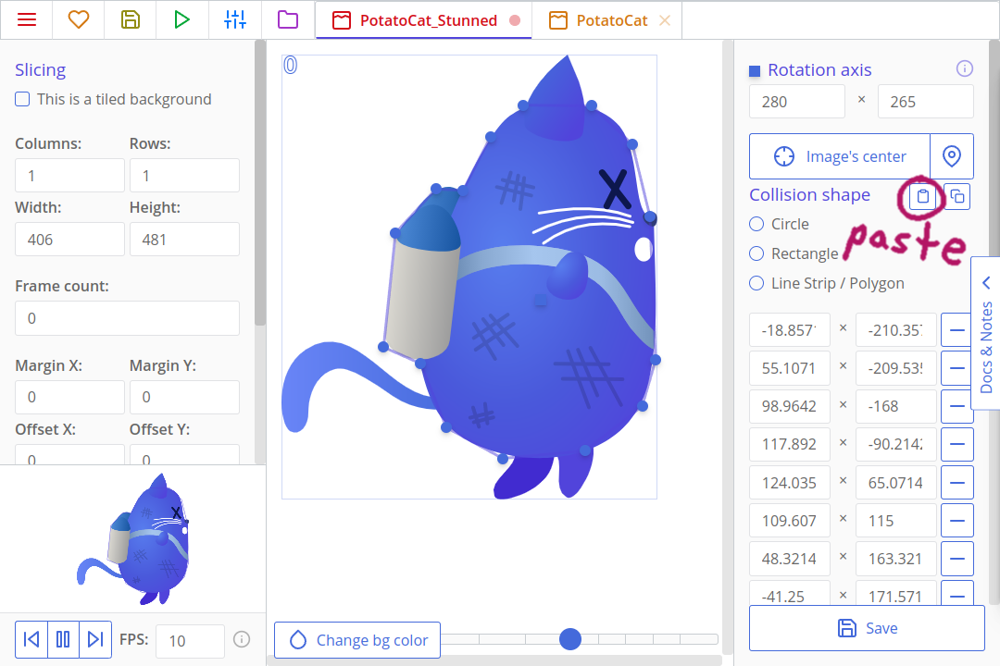
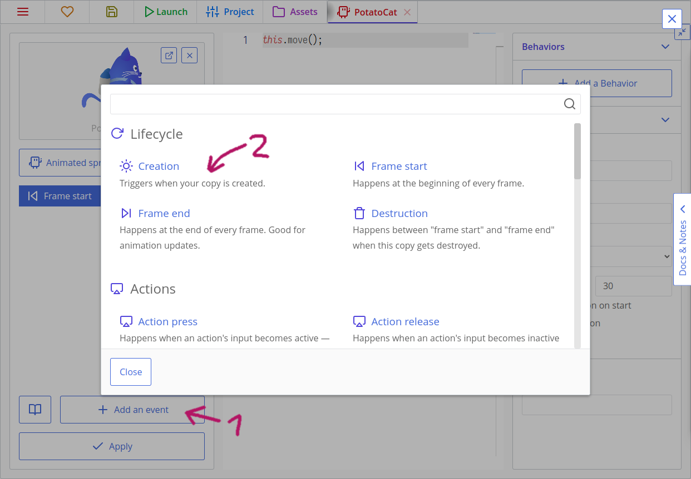

# Making Games: Jetty Cat

Like the Flappy Bird, Jetty Cat will be a game where a cat, manipulated by tapping or clicking, avoids infinite obstacles by using its jetpack. We will firstly implement main game logic, then — UI. After that, we will polish the game by adding nice transitions, particle systems, and subtle effects.


That's what we will do:

[[toc]]

:::warning
As you can see, this is not a "Hello world" example, but rather a guide to create a full game from scratch. Give yourself plenty of time to finish it!
:::

## Creating the project and importing assets

Open ct.js and create a new project by writing the name of your project and clicking the "Create" button. Tell ct.js where to save your project. A folder like "My Documents" would be a good choice.


Click the "Assets" tab at the top of the ct.js' window. Then, open your file explorer, and find the folder `examples/JettyCat_assets` inside ct.js' folder. If you used the itch.io app to install ct.js, you can right click the installed program icon in your library to open the file explorer to its location. Inside, there are the assets we will use. Drag the assets from your file viewer to ct.js, and ct will quickly import them to the project.

We will need to prepare these textures: properly mark backgrounds as such, and set collision shapes so that copies inside your game precisely interact with each other. Firstly, let's open the background for our project. Click the `BG_Ground` card:


Here, we will need to click the checkbox "This is a tiled background" This tells ct.js to pack this texture differently and allows it to repeat in our levels.


Hit "Save" at the bottom left corner. Now, do the same with `BG_Sky` texture.

The backgrounds are ready! Time to set collision shapes of our sprites. We don't need to set them everywhere, but we do need to set them for objects that collide with each other, and for those that we click at while in a game. Headers like `Jetty_Cat`, `OhNo`, and `Pause` won't be interactive and will be just decorations; `PressHint` will have an informing role and won't directly receive clicks as well. But the cat and tubes will collide, and stars need to know when a cat overlaps them.

Let's open the `PotatoCat`! The first thing we should do is move the axis of the texture. It shows as a square axis, which is at the top left corner by default. An axis is a point around which a copy scales and rotates around. Put the axis at the center of the cat's body. Then, let's define its collision shape. The cat doesn't look like a circle or a rectangle, so set its collision shape as a polygon in the left column. A pentagon will appear: you can drag its corners and add new points by clicking on yellow lines to better outline the cat's silhouette. 15 points are enough to outline it.


::: tip
It would be a good idea not to outline the tail, as well as ears. When a tail hits a tube and a player loses, they may think that it is unfair. In any way, a tail is too flexible to cause lethal collisions 😺
:::

After defining the shape, we will want to make the same collision mask for the `PotatoCat_Stunned` texture. But instead of redoing all the work in creating the mask point by point, let's copy this one instead! Click the copy collision mask button and then in the `PotatoCat_Stunned` texture click the paste collision mask button. Don't forget to adjust the axis point!




After defining the shape, click the "Save" button to return to the list of assets. We will need to also tune the texture `Star`.

For pipes, we will use something *a bit* different. Open the first one, `Tube_01`, and place its axis nearly at the bottom at the sprite. Remember that axis affects not only rotation but also scaling? We will reuse the same texture for both the pipes that hang from the top of the screen and that grow from the bottom of it. To make the upper ones work, we will scale them negatively around their bottom axis to flip their end down. We can even rotate them later, and they will nicely wave with their base rooted in place.


We will need to do it for all the four tube textures. Then, we can start creating our level and coding movement!

## Creating our main room and moving the cat

Let's create a room where all the fun will be happening! Rooms are often called levels. These are the places where all your resources get combined, and where they can interact with each other. Open the "Assets" tab at the top of the ct.js window, and click on "New Asset" and select "Room". Call the room as `InGame` — we will use this particular name later in code.


A room editor for this exact room will appear. There are no rules in naming them, though; we just need something we can remember later while coding menus :)

Then, on the Properties panel with a gear icon, we need to set the size of our room. Set it to 1080x1920 pixels.


Now, let's add our backgrounds. Click the "Backgrounds" tool on the left, then add two of them: for the sky and for ground. The sky looks good as is, but the ground needs tweaking. Click the cog next to the background's texture in the left column, and find the drop-down "Repeat". Set it to "repeat-x": it will make the background tile horizontally only, as X is the horizontal axis (Y is the vertical one). Then, we will need to shift the ground right to the bottom of the room's frame by changing the Shift Y field.


::: tip Hint:
You can navigate the room by dragging it while pressing the mouse wheel and zooming with it.
:::

We will also set the depth of both backgrounds so that they are aligned properly. Depth is a 3rd dimension that tells ct.js how to sort our objects, so that sky doesn't accidentally overlap everything else. Positive values bring stuff closer to the camera, and thus objects with positive depth will overlap those with a negative one.

Set sky's depth value to -20, and ground's depth to -10. That's how ct.js will understand these configs:


### Cat's template

Textures are essential to most games, but they don't do anything on their own. We used *backgrounds* already, and they are for purely decorative textures. *Templates*, on the other hand, can include gameplay logic and are used to create *copies*. Copies are the things we add to our rooms, and these copies are the entities that interact with each other on the screen.

Let's create a template for our cat! Open the "Assets" tab at the top of the ct.js window, and press the "New Asset" button and select "Template". Name it as `PotatoCat`, and set its texture by clicking the "Select" square and selecting the cat's texture.


We can now add the cat to our room! Navigate to it by switching back to the "Assets" tab and opening our only room. When we click the "Add copies" tool, our cat will appear in a new panel. Click on the cat, and then click once again in a place where you want your copy to appear in the level. We will need just one cat for now.


If you click the "Launch" button now, it will run the debugger, and we will see a static screen with our backgrounds and our cat. The cat doesn't move yet, and that's what we will change now!


Open the "Assets" tab again, and open the cat's template. You should see the event "Frame start" selected, with some code on the right. ct.js runs blocks of code depending on the event that is happening. Click on the "Add an event" button to see some options. Here are some important events:

* "Creation" for code that runs once when a copy is created;
* "Frame start" that runs at each frame;
* "Frame end" that runs at the end of each frame after other computations and movement updates;
* "Destruction" that runs once a copy is removed.


Here's what we will do:

* We will set our cat flying to the right by defining its speed and direction in the Creation event;
* We will add an action event that, when executed, will accelerate the cat so that it can fly up.

Click on the "Add an event" button, then find the Creation event and select it. In the Creation event that now appears on the left, click it to bring up its code block on the right side, then put this code:

::: code-tabs#tutorial
@tab JavaScript
``` js
this.speed = 500;
this.direction = 0;
this.gravityAcceleration = 7000;
```
@tab CoffeeScript
```coffee
@speed = 500
@direction = 0
@gravityAcceleration = 7000;
```
:::




`this.speed = 500;` means that we need to move the cat by 500 pixels every second — about half of our room. For setting speeds you will want to multiply your base speed by 60.

`this.direction = 0;` means that we move the cat in a given direction at 0 degrees. 0 degrees mean that it will move to the right, 270 — to the top, 180 — to the left, and 90 — downwards.

`this.gravityAcceleration = 7000;` will be used later. It will store how fast our cat will accelerate downwards (it's not as fast as you think it is).

Now, let's move our cat whenever a player presses the screen. We will need to support both mouse and mobile touch events, thus we will use the Pointer catmod. It should already be enabled, but if it isn't, open the "Project" tab at the top of the ct.js window, then "Catmods" on the left. Find the module `Pointer` in the section with available modules. Click it to enable it — it will have a green checkbox with a tiny spinning circle around it:


Now, in ct.js, input methods are grouped into *Actions*. In this project, we will use just one input method — touching the screen. On the "Project" tab at the top of the screen, press the "Actions and input methods" tab on the left.

There are presets that set up actions for us, but for now let's make our own by clicking on the "Make from scratch" button. Add our first action, name it `Poof`. Yea. Then, click "Add an input method" on the right, and find the "Any press" method under the Pointer heading. You can use the search to quickly filter out the results.


The action is done, we can save it and move back to our cat.

::: tip Actions? Why?
For seasoned developers, actions might look as an extraneous step here, but they shine when you need to support a number of different input methods. Say, you create a game that supports both keyboard and gamepad, and the keyboard supports the WASD movement and moving with arrows. One action will support all the three methods, and your code will stay slim, even if you add new input methods later. Besides that, they all can be used with the same code!

You can [read more about actions here](./../actions.md).
:::

Create a new Action down event for the cat. This is a parameterized event, so you can specify which action you want! Select the Poof action from the dropdown list, then add this to the event:

::: code-tabs#tutorial
@tab JavaScript
```js
this.gravity = this.gravityAcceleration;
this.addSpeed(u.time * 2 * this.gravityAcceleration, 270);
```
@tab CoffeeScript
```coffee
@gravity = @gravityAcceleration
@addSpeed u.time * 2 * @gravityAcceleration, 270
```
:::

This code will run only when a player presses the screen. If it works, we will define a gravity force that pulls the cat down and add speed that pulls the cat upwards. We need to multiply the added speed with `u.time` to make it run smoothly on every occasion. Yes, we use the `this.gravityAcceleration` value for both setting gravity and adding speed. Changing speed is an acceleration!

::: tip u.time
`u.time` will be equal to 1/60 most of the time, but this multiplier should not be overlooked. If a player's framerate drops or the game lags for some reason, `u.time` will become a larger value to compensate these frame drops and lags. For example, if framerate drops from 60 frames per second to 30, then `u.time` will temporarily be equal to 2/60.

Besides that, `u.time` supports in-game time stretching and allows for creating slow-mo effects and game pauses. (And we will implement these features!)
:::

::: tip
There are also `Action Poof press` and `Action Poof release` parameterized events that run when a player starts and stops pressing the screen.
:::

The gravity that is defined in the On Poof down event seems strange, right? It is indeed a constant that would be better placed in the Creation event so that it is set once from the beginning and doesn't change. But placing it inside the clause with an input check adds a little trick: the cat will start falling only after the player interacts with the game! Thus they won't instantly lose as the cat would quickly hit the ground otherwise.

If we run the project now, we will see that the cat moves from left to right, and then reacts to clicks and starts flying and falling. It quickly flies out of the viewport though. Let's change it!

### Moving the camera

Ct.js has an entity `camera` which is responsible for showing stuff on your screen. It has lots of features, and one of them is following a copy.

Open the "Creation" event of our cat, and add this code:

::: code-tabs#tutorial
@tab JavaScript
```js
camera.follow = this;
camera.followY = false;
camera.shiftX = 250;
```
@tab CoffeeScript
```coffee
camera.follow = this
camera.followY = false
camera.shiftX = 250
```
:::

`camera.follow` links to a copy it should follow, and we tell it to follow the cat by setting it to `this`. `this` refers to the copy that runs the code. Rooms have their events and `this` keyword, too.

`camera.followY = false;` tells that we don't need to move the camera vertically (by Y-axis). We will only slide it to the right.

`camera.shiftX = 250;` tells that we want the camera to stay 250 pixels to the right relative to the cat. By default, it focuses so that the cat stays in the center of the viewport.

If we run the game now, the camera will nicely follow our cat. Yay!

## Writing code for collisions

It's a good time to implement actual gameplay. We will add a template for tubes, place some of them in the level, and code collisions both for pipes and ground. Then, we will randomize pipe's textures, thus changing their height.

### Adding pipes

Create a new template and call it `Tube`. Select its texture as one of the relatively long pipes in our collection. Then, set its collision group to "Obstacle".


Then, open our room and add pipes on the ground, so we can check the collisions. Open the room `InGame`, select the "Add copies" tool, select the tube in the panel with the templates, and then add them by clicking in the level view where you want to spawn them. We won't need many for testing.


Firstly, make a new template "PotatoCat_Stunned", using the "PotatoCat_Stunned" texture. Then, in its "Creation" event add the following:

::: code-tabs#tutorial
@tab JavaScript
```js
this.gravity = 7000;

// Jump to the left
this.speed = 1500;
this.direction = -135;
```
@tab CoffeeScript
```coffee
@gravity = 7000;

# Jump to the left
@speed = 1500
@direction = -135
```
:::

This is the stunned cat template we will switch to when the cat hits an obstacle. Once it exists, it will be pushed to the left and out of the screen, with gravity.

Now, open the "PotatoCat" template, and create a new event "Collision with a group" with group name "Obstacle". This is the code that will run once the cat hits a pipe. Next, we will add the following code to destroy the copy and trigger the "Destruction" event:

::: code-tabs#tutorial
@tab JavaScript
```js
this.kill = true
```
@tab CoffeeScript
```coffee
@kill = true
```
:::

Finally, create the "Destruction" event in PotatoCat so we can spawn the PotatoCat_Stunned copy before this copy gets deleted, and add the following:

::: code-tabs#tutorial
@tab JavaScript
```js
// Stop camera movement
camera.follow = false;

// Create an animated dummy
var dummy = templates.copy('PotatoCat_Stunned', this.x, this.y);

// Copy scale settings to the new copy
dummy.scale.x = this.scale.x;
dummy.scale.y = this.scale.y;
```
@tab CoffeeScript
```coffee
# Stop camera movement
camera.follow = false

# Create an animated dummy
dummy = templates.copy 'PotatoCat_Stunned', this.x, this.y

# Copy scale settings to the new copy
dummy.scale.x = @scale.x
dummy.scale.y = @scale.y
```
:::

`dummy.scale.x = this.scale.x;` and `dummy.scale.y = this.scale.y;` just makes sure that if we decide to resize PotatoCat later on then the stunned template will resize in the same way.

Time for some testing! If the cat jerks sharply during a collision, check that its collision shape and axis are set in the same way as in the starting texture.

### Making the cat lose if it touches ground or screen's top edge

For some reason, the floor — and even the sky — is as deadly as tubes in flappy bird-like games. Now, the ground does not have a template and won't work with `place`, as well as sky, as it is not a game's entity at all. But they are flat, horizontal, and we can augment our collision logic with rules that check the cat's position in space.

If we now open our room and move the mouse over the level, we will see current coordinates in the bottom left corner. The top side of the initial view frame is always at 0 pixels on the Y-axis, and the ground's top edge is somewhere at 1750 pixels. Copies' positions are defined by `this.x` and `this.y`, and we can read them and compare to some other values.


Modify the cat's "Frame start" logic as following so the cat gets stunned from hitting the ground and sky as well:

::: code-tabs#tutorial
@tab JavaScript
```js
this.move();

if (this.y > 1750 - 200 || // If the cat is below the ground minus its approximate height, or
    this.y < 0) {          // the cat flew off the upper boundary,
    this.kill = true;      // remove the cat.
}
```
@tab CoffeeScript
```coffee
@move

if @y > 1750 - 200 or @y < 0    # If the cat is below the ground minus its approximate height, or the cat flew off the upper boundary,
    @kill = true                # remove the cat.
```
:::

### Randomizing pipe's height by changing its texture

We can change the texture in code with our pipes to randomize their height, as we have four different textures for them.

Ct.js has a built-in module called `random` that helps to generate random values. Find it in the Catmods view from the Project tab at the top and enable it. Then, add the Creation event to the tube template, open the Creation event code and add this snippet:

::: code-tabs#tutorial
@tab JavaScript
```js
this.tex = random.dice(
    'Tube_01',
    'Tube_02',
    'Tube_03',
    'Tube_04'
);
```
@tab CoffeeScript
```coffee
@tex = random.dice 'Tube_01', 'Tube_02', 'Tube_03', 'Tube_04'
```
:::

`random.dice` is a function that accepts any number of arguments and returns one of them randomly each time it is called.

Time for testing! If your pipes spawn misaligned, check that you set up collision shapes for all the four textures and put their axis to the bottom of a pipe.

## Spawning pipes through time

Like templates, rooms can have their own logic as well — they are hidden under the button "Events" in the top bar of a room editor. There are four basic events as well, and additional ones, too:

* "Room start" that runs once when you switch to this room or start a game in this room;
* "Frame start" that runs at each frame after any other Frame start events of copies;
* "Frame end" that runs at the very end of each frame;
* and "Room end" that is run when you either switch to another room or remove a nested room from the stage.

We will do the following to spawn new pipes through time:

1. We will set up a variable in the Room start event that will be our timer — it will count remaining seconds before spawning new tubes;
2. We will create a timer event that waits for the timer variable to hit zero.
3. When the timer event is fired we will wind it up again and create new tubes relative to the camera position.
    * We will also create tubes at the top of the viewport and use scaling to flip these tubes so that they point downwards.

Open our only room `InGame`. Remove existing tubes by holding Control key and dragging the mouse while the copy tool is active, or by selecting them with the Select tool and pressing `Delete` on your keyboard. Then, click the button "Events" in the top bar.


Put this line in the Room start code:

::: code-tabs#tutorial
@tab JavaScript
```js
this.timer1 = 5;
```
@tab CoffeeScript
```coffee
@timer1 = 5
```
:::

Here, `timer1` is a special variable name that will count down to 0 automatically without additional programming. This corresponds to the Timer 1 event.

Add the Timer 1 event, name it something like "TubeSpawn", keep UI event unchecked and in the code put this:

::: code-tabs#tutorial
@tab JavaScript
```js
// Wind it again
this.timer1 = 2

// Create two tubes
var tube1 = templates.copy('Tube', camera.right + 250, camera.bottom - 130); // At the bottom of the camera
var tube2 = templates.copy('Tube', camera.right + 250, camera.top - 70); // At the top

// Change second tube's texture depending on which texture is used in the first tube
if (tube1.tex === 'Tube_01') { // Shortest tube will result in the longest tube
    tube2.tex = 'Tube_04';
} else if (tube1.tex === 'Tube_02') {
    tube2.tex = 'Tube_03';
} else if (tube1.tex === 'Tube_03') {
    tube2.tex = 'Tube_02';
} else if (tube1.tex === 'Tube_04') { // Longest will result in the shortest one
    tube2.tex = 'Tube_01';
}
// Thus we will always get gaps of the same size, but with random tubes.

// Now, flip the upper (second) tube
tube2.scale.y = -1;
```
@tab CoffeeScript
```coffee
# Wind it again
@timer1 = 2

# Create two tubes
# At the bottom of the camera
tube1 = templates.copy 'Tube', camera.right + 250, camera.bottom - 130
# At the top
tube2 = templates.copy 'Tube', camera.right + 250, camera.top - 70

# Change second tube's texture depending on which texture is used in the first tube
if tube1.tex == 'Tube_01'
    # Shortest tube will result in the longest tube
    tube2.tex = 'Tube_04'
else if tube1.tex == 'Tube_02'
    tube2.tex = 'Tube_03'
else if tube1.tex == 'Tube_03'
    tube2.tex = 'Tube_02'
else if tube1.tex == 'Tube_04'
    # Longest will result in the shortest one
    tube2.tex = 'Tube_01'
# Thus we will always get gaps of the same size, but with random tubes.

# Now, flip the upper (second) tube
tube2.scale.y = -1
```
:::

There's a lot of code!

`timer1` will be zero when this event calls. When it happens, we set its value again to a positive number so that it fires again later. Here we add 2 seconds. ct.js will count it down automatically again because it is a special variable.

We create two copies with `templates.copy(templateName, xPosition, yPosition)` and store references to them to variables `tube1` and `tube2`. At the start, their height will be completely normal as their Creation code with `random.dice` will be run instantly after their creation. This will result in a blocked pathway in a good portion of cases when both tubes turned out to be the long ones. To fix this, we read the texture's name of a first tube `tube1` with `tube1.tex` and set the texture of the second tube `tube2` depending on the extracted value.

`camera.right`, `camera.left`, `camera.top`, `camera.bottom` represent coordinates of view boundaries in game coordinates. Here we use them to create tubes off-screen, a bit to the right where the viewport ends, and above the bottom and top edge of the viewport.

Lastly, we flip the second tube by running `tube2.scale.y = -1`. It is exactly the same operation we would make when flipping an image vertically in a graphics editor. For reference, there also exists `tube2.scale.x` that sets its horizontal scale.

If we run the project now, we will see nicely generated tubes that leave a small gap between them to fly through. But wait, the cat is way too big to fly through! Oh no, maybe I should have called this tutorial "Fatty Cat"…

No worries, there is a solution ✨ We will use the same scaling to make the cat a bit smaller. The scale values can be not just `1` and `-1`, but also anything in between to make an object smaller or larger than 1 to make objects bigger.

There are two methods to scaling the cat:

* we can add a line `this.scale.x = this.scale.y = 0.65;` to the cat's "Creation" event;
* or we can do the same by resizing it in the room editor with the "Select" tool.


### Cleaning useless copies

When we spawn copies through time, their number will constantly rise. If we don't do anything with it, the game will slowly eat so much PC's memory it will eventually crash. To prevent it, we will delete copies that went past the left side of the camera.

Add this code to the tube's Frame start event:

::: code-tabs#tutorial
@tab JavaScript
```js
if (this.x < camera.left - 150) {
    this.kill = true;
}
```
@tab CoffeeScript
```coffee
if @x < camera.left - 150
    @kill = true
```
:::

Here we compare a copy's horizontal coordinate to a camera's left side. We also watch 150 pixels to the left so the tube can fully escape the viewport before being removed.

## Adding stars

Let's add a template for star bonuses that will increment score when collected. We will do the following:

1. Set up a score variable in our room's "Creation" code.
2. Create a new template for star bonuses.
3. Add a bit of logic to the star's collision with a template event that will destroy the star when colliding with the cat.
4. Create a new room and a template for it to display a score counter.
5. Put this new room into the main one.

Now, open the `InGame` room's events and add a line `this.score = 0;` to the Room start event. This will create a variable we will be able to edit and read in any other copy.

Create a new template, and call it a `Star`. Set its texture.

Create a Collision with a template event, and select PotatoCat as the template. Then, put this script in:

::: code-tabs#tutorial
@tab JavaScript
```js
this.kill = true;
rooms.current.score += 1;
```
@tab CoffeeScript
```coffee
@kill = true
rooms.current.score += 1
```
:::

::: tip
An alternative to using the collision event is calling `place.meet` in an if statement before executing this code in the Frame start event. `place.meet` is like `place.occupied`, though it checks not against collision groups but against a specific template.
:::

This event checks whether a star collides with our cat. If it does, `this.kill = true` tells that the star should be removed. `rooms.current.score += 1;` increments our score variable that was created before in the room's "Creation" code.

::: tip
`rooms.current` always points to the current room. If you have nested rooms, the `rooms.current` will always point to the main one.
:::

We will also need this code in the Frame start event to prevent memory leaks and remove stars that were not collected:

::: code-tabs#tutorial
@tab JavaScript
```js
if (this.x < camera.left - 150) {
    this.kill = true;
}
```
@tab CoffeeScript
```coffee
if @x < camera.left - 150
    @kill = true
```
:::

### Spawning stars

In the room's Timer 1 event code, add a couple of lines (the highlighted ones) that will add a star with a 30% chance somewhere in between the next two tubes. It will use methods from the `random` module:

::: code-tabs#tutorial
@tab JavaScript
```js {23,24,25,26}
// Wind it again
this.timer1 = 2

// Create two tubes
var tube1 = templates.copy('Tube', camera.right + 250, camera.bottom - 130); // At the bottom of the camera
var tube2 = templates.copy('Tube', camera.right + 250, camera.top - 70); // At the top

// Change second tube's texture depending on which texture is used in the first tube
if (tube1.tex === 'Tube_01') { // Shortest tube will result in the longest tube
    tube2.tex = 'Tube_04';
} else if (tube1.tex === 'Tube_02') {
    tube2.tex = 'Tube_03';
} else if (tube1.tex === 'Tube_03') {
    tube2.tex = 'Tube_02';
} else if (tube1.tex === 'Tube_04') { // Longest will result in the shortest one
    tube2.tex = 'Tube_01';
}
// Thus we will always get gaps of the same size, but with random tubes.

// Now, flip the upper (second) tube
tube2.scale.y = -1;

// Create a star bonus with 30% chance somewhere in between top and bottom edge, with 300px padding.
if (random.chance(30)) {
    templates.copy('Star', camera.right + 250 + 500, random.range(camera.top + 300, camera.bottom - 300));
}
```
@tab CoffeeScript
```coffee{26,27,28}
# Wind it again
@timer1 = 2

# Create two tubes
# At the bottom of the camera
tube1 = templates.copy 'Tube', camera.right + 250, camera.bottom - 130
# At the top
tube2 = templates.copy 'Tube', camera.right + 250, camera.top - 70

# Change second tube's texture depending on which texture is used in the first tube
if tube1.tex == 'Tube_01'
    # Shortest tube will result in the longest tube
    tube2.tex = 'Tube_04'
else if tube1.tex == 'Tube_02'
    tube2.tex = 'Tube_03'
else if tube1.tex == 'Tube_03'
    tube2.tex = 'Tube_02'
else if tube1.tex == 'Tube_04'
    # Longest will result in the shortest one
    tube2.tex = 'Tube_01'
# Thus we will always get gaps of the same size, but with random tubes.

# Now, flip the upper (second) tube
tube2.scale.y = -1

# Create a star bonus with 30% chance somewhere in between top and bottom edge, with 300px padding.
if random.chance(30)
    templates.copy 'Star', camera.right + 250 + 500, random.range(camera.top + 300, camera.bottom - 300)
```
:::

`random.chance(30)` returns `true` 30 times out of 100, and `false` otherwise. You can tweak the number to make stars appear more or less often.

`random.range(a, b)` picks a random value in between the given range. In our case, we calculate two coordinates relatively to our camera so that stars don't spawn near the ground or top edge.

### Creating a UI element with a counter

In ct.js, as of v1.3, UI elements are usually created in a separate room that then gets embedded into other rooms. These nested rooms are also often referred to as "layers".

Go to the Assets tab at the top of the ct.js window, and create a new Style under "New Asset". Call it Orange. Here, we will create a text style that we will use to display our score, as well as other text lines.

On the first tab, "Font", set the font size to 80, and its weight to 900. Make its line height 0, then align it to center. This will make the text bolder and bigger.


Switch to the "Fill" tab, and activate it. Let's create a vertical gradient fill. We will use a pale yellow and orange colors.


Then, switch to the "Stroke" tab, and activate it. Set stroke's color as dark brown, and its weight to 10.


We can save the style now. After that, we will need two new templates that will display a star icon and a score counter.

Create a new template and call it `StarCounter`. As its texture, we will reuse our `Star` texture. 

Now make another template called `StarCounterLabel`. This will show the score value next to the StarCounter copy. Now switch it from being an animated sprite to a text.


Once you switch it to a text you can click on the ghostly cat icon and now you can choose between your styles. Select the Orange style you made.

We need to update the text label at each frame. In the Frame end event, put the line `this.text = rooms.current.score;`. `this.text` is a property that lets us edit the label of a text copy easily, now that we switched it to a Text. You can also set the default text of this template in the right sidebar so it doesn't say `<Empty>` when we put it in the room.

Finally, let's create a room for this counter and label and put this room inside the main one. Create a new room, and call it `UI_InGame`. Then, set its view size to 1080x1920 to match the main room's viewport, mark it as a UI layer, and put a counter's copy and label in the top-left corner:


Then open the room `InGame`, and add this code to the bottom of its Room start code:

::: code-tabs#tutorial
@tab JavaScript
```js
this.mainUi = rooms.append("UI_InGame");
```
@tab CoffeeScript
```coffee
@mainUi = rooms.append 'UI_InGame'
```
:::

We will reference this room for later. After that, you should have stars spawning in the level, and the increment score displayed in the top-left corner of the viewport.

## Creating menus

We will now add more rooms with usual menus so that our game feels complete:

* the main menu;
* a pause screen;
* and a score screen that will be shown on failure.

### Main menu

Open the texture `Jetty_Cat` and make sure that its axis is placed in the center of it. Then, create a new template with it. It will be purely decorative, so we won't write any code here.

Then, open the texture "Button_Play" and make sure that its axis is at the center, and its collision shape is **circular**.


After that, create a new template with this texture. Create a Pointer click event and put the following:

::: code-tabs#tutorial
@tab JavaScript
```js
rooms.switch('InGame');
```
@tab CoffeeScript
```coffee
rooms.switch 'InGame'
```
:::

This checks whether a player pressed the button, and if they did, it switches to our main room.

::: tip
If you want to use pointer instead for checking clicks, because the play button is on the UI layer you will need to use `pointer.collidesUi(this)` instead of `pointer.collides(copy)`.
:::

Create a new room and call it `MainMenu`. Add backgrounds to it, and layout recently created copies so that it looks like this:


Hold the Alt button on your keyboard to place copies precisely.

If your copies seem to disappear or not being placed, check that you set the depth of your backgrounds to -20 and -10. They may be overlapping your elements!

If we now run the game, it will still start in our main room. To change that, right-click the `MainMenu` room. In the context menu, select "Set as the starting room".


### Pause menu

For a pause menu, we will need a couple of new buttons and a new room that will overlay over our main room and UI.

Create a template for texture `Button_Pause`. Make sure the texture `Button_Pause` has its axis put to center and has a proper **rectangular** shape that covers the whole texture.

The template `Button_Pause` will have this code in its Pointer click event:

::: code-tabs#tutorial
@tab JavaScript
```js
// Check if we don't have any rooms called 'UI_Paused'
if (rooms.list['UI_Paused'].length === 0) {
    // Create a room UI_Paused, put it above the current one (append it),
    // and specify that it is a UI layer (isUi: true)
    rooms.append('UI_Paused', {
        isUi: true
    });
    // Turns u.delta into 0, effectively stopping the game
    pixiApp.ticker.speed = 0;
}
```
@tab CoffeeScript
```coffee
# Check if we don't have any rooms called 'UI_Paused'
if rooms.list['UI_Paused'].length == 0
    # Create a room UI_Paused, put it above the current one (append it),
    # and specify that it is a UI layer (isUi: true)
    settings =
        isUi: true
    rooms.append 'UI_Paused', settings
    # Turns u.delta into 0, effectively stopping the game
    pixiApp.ticker.speed = 0
```
:::

Remember the name `UI_Paused`. We will need to create a room with this name a bit later.

`pixiApp.ticker.speed` is the multiplier that affects how `delta` is calculated. When it is set to 0, it will effectively pause the game as everyone's `delta` will turn to 0. Our cat and timers are dependant on `delta`.

Open the room `UI_InGame` and place the created template at the top right corner.

After that, create two new templates similar to those created for `MainMenu`. Use textures `Button_Play` and `Pause`. The button should be called `Button_Continue`, though.

The button will have the following code in its Pointer click event:

::: code-tabs#tutorial
@tab JavaScript
```js
rooms.remove(this.getRoom());
pixiApp.ticker.speed = 1;
```
@tab CoffeeScript
```coffee
room = @getRoom()
rooms.remove room
pixiApp.ticker.speed = 1
```
:::

`rooms.remove(room);` removes the previously added room. It cannot remove the main one, but it is created to remove nested ones. `this.getRoom()` looks up for a room that owns the current copy. `pixiApp.ticker.speed = 1;` reverts `delta` back to normal behavior, unpausing the game.

The final step is to create this nested room that will have an unpause button and a decorative header. Create a room called `UI_Paused`, and place a `Button_Continue` copy and a "Paused" header. Make sure you set its viewport size to 1080x1920 as well!

### Score screen

The final step is making a score screen that will be displayed after a player loses. We will need one more header and a template that will display the final score. For a button that will replay the game, we will reuse the template `Button_Play`.

Create a template with a texture `OhNo`. It won't have any logic.

The other one, `EndGame_ScoreCounter`, will be a text instead of a sprite, just like our other score label. Change it to a Text and select the Orange style. It will also remember and display the player's high score. Put this code to its Creation event:

::: code-tabs#tutorial
@tab JavaScript
```js
if (!('JettyCat_HighScore' in localStorage)) {
    localStorage['JettyCat_HighScore'] = rooms.current.score;
} else if (localStorage['JettyCat_HighScore'] < rooms.current.score) {
    localStorage['JettyCat_HighScore'] = rooms.current.score;
}

var scoreText = 'Your score: ' + rooms.current.score + '\nHighscore: ' + localStorage['JettyCat_HighScore'];

this.text = scoreText;
```
@tab CoffeeScript
```coffee
if !('JettyCat_HighScore' of localStorage)
    localStorage['JettyCat_HighScore'] = rooms.current.score
else if localStorage['JettyCat_HighScore'] < rooms.current.score
    localStorage['JettyCat_HighScore'] = rooms.current.score

scoreText = 'Your score: ' + rooms.current.score + '\nHighscore: ' + localStorage['JettyCat_HighScore']
style = styles.get 'Orange'

@text = scoreText
```
:::

`localStorage` is a built-in object that allows you to store textual data in browser. You can find more about it and saving progress [here](./../tips-n-tricks/localstorage.md).

`if (!('JettyCat_HighScore' in localStorage))` checks whether a property `JettyCat_HighScore` exists inside the object `localStorage`. It is a good way to check whether there is any saved data. By the way, it works with copies, rooms, and other objects as well.

If there is no such record in the browser, the line `localStorage['JettyCat_HighScore'] = rooms.current.score;` will write it to the storage. Otherwise, we perform another check: `localStorage['JettyCat_HighScore'] < rooms.current.score` checks whether the saved result is smaller than the current one. If it is, hooray! The player has just beaten their record. The record is updated again.

This line:

::: code-tabs#tutorial
@tab JavaScript
```js
var scoreText = 'Your score: ' + rooms.current.score + '\nHighscore: ' + localStorage['JettyCat_HighScore'];
```
@tab CoffeeScript
```coffee
scoreText = 'Your score: ' + rooms.current.score + '\nHighscore: ' + localStorage['JettyCat_HighScore']
```
:::
saves a string to a temporary variable. Everything defined with the `var` keyword exists for only one frame and in one event. Though it doesn't serve much purpose, it allows to write cleaner code and reuse temporary variables. The combination `\n` tells that there will be a line break there. By using the `+` operator, we join our strings with the current score and the saved one. Lastly, we set the display text to the created variable's value.

Now, create a room called `UI_OhNo` with the created templates.


Place the EndGame_ScoreCounter template where the x is. Now we can align the text to be centered in the preview by switching to the UI Tools and selecting our `EndGame_ScoreCounter` copy. Here we can select the center box under "Align by:" to center the text and also add some default text to test how it would look.


The last thing we need is creating this room when the cat hits an obstacle and removing the UI layer with the pause button so the user cannot pause while on the game over screen. Open the template `PotatoCat` and go to the Destruction event. Add this code right after the line with `camera.follow = false;`:

::: code-tabs#tutorial
@tab JavaScript
```js
// Remove the layer with score and a pause button
rooms.remove(rooms.current.mainUi);

// Wait for 1000 milliseconds (for one second)
u.wait(1000)
.then(() => {
    // Add a layer with "Lose" UI
    rooms.append('UI_OhNo', {
        isUi: true
    });
});
```
@tab CoffeeScript
```coffee
# Remove the layer with score and a pause button
rooms.remove rooms.current.mainUi

# Wait for 1000 milliseconds (for one second)
u.wait 1000
.then =>
    # Add a layer with "Lose" UI
    settings =
        isUi: true
    rooms.append 'UI_OhNo', settings
```
:::

A-a-and… ta-da! You did it! The game is fully-featured and playable!

::: tip
`u.wait(1000)` is an asynchronous method that waits for one second, then executes a given code in the `.then(() => {…})` part. "Asynchronous" means that the code is executed outside the Frame start event, and happens later in the game.

You will always find the structure `method().then(() => {…})` while working with asynchronous actions. In the JavaScript world, such actions are also called "Promises". When you don't need to use them, though, you can omit the part with `.then(() => {…})`.
:::

::: tip
`u.wait` is just another way to wait for a second before running code. You can also use a Timer 1 event and `this.timer1` to do the same thing!
:::


## That's it!

For transitions, particle effects and other fancy stuff, visit [the second part of this tutorial](./making-games-polishing-jettycat.md) where we polish the game.

Try changing this stuff to train yourself in coding:

* Change the cat's movement so that it is more close to what happens in Flappy Bird: make the cat fly upwards abruptly when a player taps the screen, but do nothing if they then press the screen continuously.
* Make rotating tubes to make the game more challenging.
* Add a life counter, and allow a player to take 3 hits before losing.
* Add sounds! [Visit sound documentation on how to play sounds in your game](./../sounds.md).