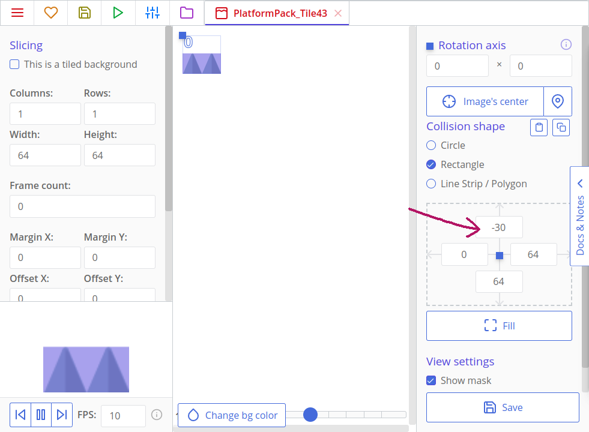

# Making Games: Platformer

In this tutorial, we will create a small platformer with diamonds, checkpoints, moving platforms, and traps! You will learn how to detect collisions, use them to create a side-view movement, and how to manipulate sprites and move the player between levels.


Here's what we will do:

[[toc]]

## Creating a Project

Open ct.js and input your project's name into the lower field of the starting window. Let's call it "Platformer". Then, click the "Create" button and select the folder where ct.js will store it, e.g. inside your "Documents" folder.


## Importing Textures

We will need some assets from the [simplified platformer pack by Kenney](https://www.kenney.nl/assets/simplified-platformer-pack). The assets are already bundled with ct.js and are named properly; you can find them in the built-in gallery.

Click on "Assets" tab, click on "New Asset", press the "Built-in asset gallery" button, find the "Simplified Platformer" pack by Kenney and import the needed textures. Then close the gallery — the textures will appear in the textures list.

Once you're ready, click on the `PlatformChar_Walk1` asset.


The image is a small horizontal stripe. It has one row and two columns. We can tell ct.js to divide the image in this way by setting `Columns` and `Rows` fields and then calibrating the `Width` field, which should already be set up for us.

The whole image is 172 pixels wide so one frame will be 172 : 2 = 86 pixels wide. The robot's frames should now be outlined with two rectangles.


Now let's edit its collision mask. It determines which areas of an image are counted as solid and which are not, and is displayed as a yellow rectangle over the sprite.

Firstly, shift its axis so it is placed at the bottom middle point.

::: tip Explanation
As we have a 86x80 pixels image, we need 43 pixels on the horizontal axis and 80 at a vertical one. Pixels are measured from the top-left corner, and the first value of a point is usually its horizontal component, or its X value, and the second is referred to as an Y component.
:::

The robot has a nice rectangular shape so it will be wiser to mark it up as a rectangle. Make sure you have a rectangular shape selected, click the 'Fill' button and calibrate the offsets so the robot's body is covered with a yellow rectangle.


You can cover both the body and hands, or select the body only.

Click the "Save" button in the bottom-right corner.

We now need to set collision masks for `PlatformChar_Jump` and `PlatformChar_Idle` too. We can do this quickly by copying our collision mask for `PlatformChar_Walk1` and pasting it to `PlatformChar_Jump` and `PlatformChar_Idle`! Make sure that you also shift the axis to 43x80 for each of them.


::: tip
It is also good to make collision offsets same for each of the three sprites, so the robot doesn't clip into the surface when switching its animations while suddenly getting bigger as a collision shape.
:::

Now let's set the collision shapes of our crystals and heart bonuses. These can be defined as circles. Open the `PlatformPack_Item09` (Green Crystal), set its collision shape as a "Circle", then click a button called "Image's center" so the axis automatically snaps to needed values, and calibrate the collision shape's radius.

Do the same for the `PlatformPack_Item17` (Heart) asset.


The last asset we need to modify is the `PlatformPack_Tile43` (Spikes). We don't need to shift its axis, because it will appear misaligned on the map in this way, but we still need to set its collision shape. Set its top offset to a negative value so the top part of the image is not filled with yellow.



Save your asset. If you look into other textures, you will see that they all have a rectangular shape that fills the whole image. That fits for all other images so we will leave them as is.

## Creating a Robot Character and Ground

Open the "Assets" tab and click on the "New Asset" button. From the menu, selecte "Template". Call the template "Robot", set its sprite to `PlatformChar_Idle`, and save it.


::: tip
Templates are used to create specific identical copies. We fill our levels (a.k.a. rooms) with copies, and they are the things that interact with each other on the screen, but each copy was created from a certain template.
:::

Create additional templates in the same way (all the rock textures):

* `PlatformPack_Tile16`, named `Rocks`
* `PlatformPack_Tile13`, named `Rocks_Platform`
* `PlatformPack_Tile31`, named `Rocks_Top`

### Adding a Room

Click on "New Asset" again and select "Room" in the menu. Set its name to "Level_01" and in the "Room properties" panel with a cog icon set the view's size to 1024x576.


Then draw a level! Select the "Add copies" tool, click on a template on the left and draw with them with your mouse in the big area on the right. Don't forget about the robot!

You can expand your level to any side, and copies don't need to be inside the blue frame. This frame, which is manipulated by view's size, just sets the initially visible part of your level.

I drew this. It is hard to get stuck here as a player, but it teaches how to jump. We can also add crystals on the rock platform later, and some secret in a window under the final hill.


Now let's change the background color. Click the "Room properties" tool again and set the Background color to `#D0F4F7`.


If we save the project now and click the "Launch" button at the top, we will be able to see a small portion of our level drawn in a debugger window. Nothing is movable yet, but it's still a good beginning!


### Adding Modules for Keyboard and Collisions

We will need to listen to keyboard events and to detect collisions between the Robot and ground. For such superpowers, we will need Catmods! Click on the "Project" tab, then on the "Catmods" tab on the left. Click the Keyboard module in the section of available modules so it has a green checkbox and a little spinning circle around it. (It may be already enabled, though!) Do the same with the `place` module.


Each module has its own documentation on the "Reference" tab. We will highlight some of its parts later.

### Adding Actions for Keyboard Events

Actions allow to listen to events from keyboard, mouse, gamepad, etc. You can read more about them [here](./../actions.md). With them, we will create listeners to WASD keys and arrows.

Go to the Project panel, then press the "Actions and input methods" tab on the left.

Then, create an input scheme as in the picture below. To do that, firstly press the button "Make from scratch" to not use a preset. Next, click "Add an action", name it, and then add input methods in the right column. You can use search to quickly add the needed keys.


::: tip
Though this scheme may be simplified down to just two actions (see [examples in the Actions page](./../actions.md#examples)), we will have two separate actions for moving left or right to not overcomplicate the tutorial.
:::

### Coding Collision Detection and Movement

Now, move to the "Templates" tab at the top of the screen and open the `Rocks` template. In the right column, fill the field called "Collision group" with `Solid`:


This will tell the `place` catmod that this particular template belongs to a special collision group called "Solid". The name of this group can be of any value, and the number of such groups is unlimited. For now, one group will be enough.

Add the same line to `Rocks_Top` and `Rocks_Platform`.

Now open the `Robot` template. If you completed the "Space Shooter" tutorial before, you may recall that movement is made using either direct manipulation of a copy's parameters or by using built-in variables like `this.speed` or `this.direction`. The truth is that the latter never worked with platformers, even outside ct.js! We will need to write something more complicated. Be prepared! 😃

The idea of a side-view movement is that we will have a value by which we would like to move to, and then we will check whether we are colliding with something or not, pixel-by-pixel.

Let's set up some variables on the "Creation" event. Click on "Add an event" to bring up the events menu and find the "Creation" event, then add:

::: code-tabs#tutorial
@tab JavaScript
```js
this.jumpSpeed = -600;
this.gravity = 1800;

this.hspeed = 0; // Horizontal speed
this.vspeed = 0; // Vertical speed
```
@tab CoffeeScript
```coffee
@jumpSpeed = -600
@gravity = 1800
@hspeed = 0 # Horizontal speed
@vspeed = 0 # Vertical speed
```
:::

::: tip
`this` is a copy that is executing the written code. In this case, it is a `Robot` copy.
:::

Now move to the "Frame start" tab. Remove default `this.move();` line and add this code:

::: code-tabs#tutorial
@tab JavaScript
```js
this.movespeed = 240; // Max horizontal speed

if (actions.MoveLeft.down) {
    // If the A key or left arrow on a keyboard is down, then move to left
    this.hspeed = -this.movespeed;
} else if (actions.MoveRight.down) {
    // If the D key or right arrow on a keyboard is down, then move to right
    this.hspeed = this.movespeed;
} else {
    // Don't move horizontally if no input
    this.hspeed = 0;
}

// If there is ground underneath the Robot…
if (place.occupied(this, this.x, this.y + 1, 'Solid')) {
    // …and the W key or the spacebar is down…
    if (actions.Jump.down) {
        // …then jump!
        this.vspeed = this.jumpSpeed;
    } else {
        // Reset our vspeed. We don't want to be buried underground!
        this.vspeed = 0;
    }
}
```
@tab CoffeeScript
```coffee
@movespeed = 240 # Max horizontal speed

if actions.MoveLeft.down
    # If the A key or left arrow on a keyboard is down, then move to left
    @hspeed = -@movespeed
else if actions.MoveRight.down
    # If the D key or right arrow on a keyboard is down, then move to right
    @hspeed = @movespeed
else
    # Don't move horizontally if no input
    @hspeed = 0

# If there is ground underneath the Robot…
if place.occupied(this, @x, @y + 1, 'Solid')
    # …and the W key or the spacebar is down…
    if actions.Jump.down
        # …then jump!
        @vspeed = @jumpSpeed
    else
        # Reset our vspeed. We don't want to be buried underground!
        @vspeed = 0
```
:::

::: tip
"Frame start" event code is executed each frame for each copy. Movement and other game logic usually go here.
:::

::: tip
`actions.YourAction.down` checks whether any key you listed in this action is currently held down. There are also `actions.YourAction.pressed` and `actions.YourAction.released`.

`place.occupied(copy, x, y, group)` checks whether a given copy has any collisions in given coordinates with a specific group. You can omit the group if you don't need it. This method returns either `false` (no collision) or a copy which was the first to collide with.
:::

This will set variables `hspeed` and `vspeed`, but they won't do anything as is. And we don't want to clip into a wall or move when we are next to a 'Solid'. Gladly, we can add this magical line to the end to make the character properly collide with solid objects:

::: code-tabs#tutorial
@tab JavaScript
```js
this.moveSmart('Solid');
```
@tab CoffeeScript
```coffee
@moveSmart 'Solid'
```
:::

::: tip
`moveSmart` is a method from `place` module that gradually moves a copy pixel by pixel, stopping near the obstacles. It is great for platformers and when you need precise sliding movements.
:::

We can now move our Robot around!

::: warning
Your character may ignore holes which are one grid cell wide. Test it. If it occurs, you need to make the Robot's collision shapes a bit slimmer.
:::

### Making Camera Follow the Robot

If we launch the game now, we will be able to move the Robot around. There is an issue, though: the camera isn't moving!

It is not a hard issue, though. If we dig into the ct.js docs, we will find a `camera` entity with `camera.follow`, `camera.borderX` and `camera.borderY` exactly for following a copy.

Open the `Robot` template and its "Creation" Code. Add this code to the end:

::: code-tabs#tutorial
@tab JavaScript
```js
camera.follow = this;
camera.borderX = 450;
camera.borderY = 200;
```
@tab CoffeeScript
```coffee
camera.follow = this
camera.borderX = 450
camera.borderY = 200
```
:::

The camera will now follow the Robot.

## Adding Traps and Checkpoints

We will now add deadly traps and water moats, and checkpoints so the player restarts at them and not at the beginning of the level.

Create new templates for the following assets:
* `PlatformPack_Tile17`, named `Water`
* `PlatformPack_Tile05`, named `Water_Top`
* `PlatformPack_Tile43`, named `Spikes`
* `PlatformPack_Tile21`, named `Checkpoint`

Create a new room and call it `Level_02`. Set its size to 1024x576 and make the background color `#D0F4F7` again. Create a dangerous level with spikes and lakes.

Place checkpoint boxes before and/or after hazardous places. Don't be afraid to put a lot of them, as punishing a player for mistakes is never a good idea! 😉


Here the supposed level's end is placed on the top middle platform. I also placed some platforms outside the screenshot for gathering future crystals.

Now let's move to the `Checkpoint`'s template.

We will check for collision with the Robot, and when it happens, we will store a rescue point inside the Robot's copy. Make a new Collision with a template event and select the Robot. Then add this code in the event:

::: code-tabs#tutorial
@tab JavaScript
```js
other.savedX = this.x + 32;
other.savedY = this.y + 32;
```
@tab CoffeeScript
```coffee
other.savedX = @x + 32
other.savedY = @y + 32
```
:::

::: tip
The Collision with a template event has a special variable you can access in the event code called `other`. This variable stores the reference to the collided copy, which in this case is our Robot. Watch out for these special local variables when you're writing event code!
:::

Here we also shift the stored point by 32x32 pixels, because the checkpoint's axis is placed in its top-left corner, but the Robot's axis is placed at the middle bottom point. Because of that, the Robot would respawn a bit left and above the desired central point.

We want to make checkpoints invisible during the gameplay. Open the appearance section on the right side and uncheck the "Visible" checkbox.


Now go to the `Spikes` template and set their collision as "Deadly" in the right column, under "Collision group".

Do the same with `Water` and `Water_Top`.

Now open the `Robot` template again, and add a new "Collision with a group" event. In the group name, use "Deadly". Then in the event code, add this code:

::: code-tabs#tutorial
@tab JavaScript
```js
this.x = this.savedX;
this.y = this.savedY;
this.hspeed = 0;
this.vspeed = 0;
```
@tab CoffeeScript
```coffee
@x = @savedX
@y = @savedY
@hspeed = 0
@vspeed = 0
```
:::

We should also write this code to the "Creation" event so that the respawn point will be at the creation location by default, in case something ever goes wrong:

::: code-tabs#tutorial
@tab JavaScript
```js
this.savedX = this.x;
this.savedY = this.y;
```
@tab CoffeeScript
```coffee
@savedX = @x
@savedY = @y
```
:::

To test a specific room, open the "Assets" tab at the top, then right-click the desired room and press "Set as starting room".

## Transforming and Animating the Robot

At this point, it will be wise to add little animations to our robot. As you remember, we have three different assets called `PlatformChar_Idle`, `PlatformChar_Jump`, and `PlatformChar_Walk1`.

Add this line to `Robot`'s "Creation" code:

::: code-tabs#tutorial
@tab JavaScript
```js
this.animationSpeed = 0.2;
```
@tab CoffeeScript
```coffee
@animationSpeed = 0.2
```
:::

`0.2` means that we want to play 0.2×60 (which is 12) frames per second. For more readability, we could also write it as `12/60`.

Open the `Robot`'s "Frame start" code and modify the moving section so it changes the drawn texture depending on user inputs and the robot's position in space:

::: code-tabs#tutorial
@tab JavaScript
```js {6,7,8,9,10,11,15,16,17,18,19,20,24,38,39,40}
this.movespeed = 240; // Max horizontal speed

if (actions.MoveLeft.down) {
    // If the A key or left arrow on a keyboard is down, then move to left
    this.hspeed = -this.movespeed;
    // Set the walking animation and transform the robot to the left
    if (this.tex !== 'PlatformChar_Walk1') {
        this.tex = 'PlatformChar_Walk1';
        this.play();
    }
    this.scale.x = -1;
} else if (actions.MoveRight.down) {
    // If the D key or right arrow on a keyboard is down, then move to right
    this.hspeed = this.movespeed;
    // Set the walking animation and transform the robot to the right
    if (this.tex !== 'PlatformChar_Walk1') {
        this.tex = 'PlatformChar_Walk1';
        this.play();
    }
    this.scale.x = 1;
} else {
    // Don't move horizontally if no input
    this.hspeed = 0;
    this.tex = 'PlatformChar_Idle';
}

// If there is ground underneath the Robot…
if (place.occupied(this, this.x, this.y + 1, 'Solid')) {
    // …and the W key or the spacebar is down…
    if (actions.Jump.down) {
        // …then jump!
        this.vspeed = this.jumpSpeed;
    } else {
        // Reset our vspeed. We don't want to be buried underground!
        this.vspeed = 0;
    }
} else {
    // If there is no ground
    // Set jumping animation!
    this.tex = 'PlatformChar_Jump';
}

this.moveSmart('Solid');
```
@tab CoffeeScript
```coffee {7,8,9,15,16,17,22,34,35,36}
@movespeed = 240 # Max horizontal speed

if actions.MoveLeft.down
    # If the A key or left arrow on a keyboard is down, then move to left
    @hspeed = -@movespeed
    # Set the walking animation and transform the robot to the left
    if @tex isnt 'PlatformChar_Walk1'
        @tex = 'PlatformChar_Walk1'
        @play()
    @scale.x = -1
else if actions.MoveRight.down
    # If the D key or right arrow on a keyboard is down, then move to right
    @hspeed = @movespeed
    # Set the walking animation and transform the robot to the right
    if @tex isnt 'PlatformChar_Walk1'
        @tex = 'PlatformChar_Walk1'
        @play()
    @scale.x = 1
else
    # Don't move horizontally if no input
    @hspeed = 0
    @tex = 'PlatformChar_Idle'

# If there is ground underneath the Robot…
if place.occupied(this, @x, @y + 1, 'Solid')
    # …and the W key or the spacebar is down…
    if actions.Jump.down
        # …then jump!
        @vspeed = @jumpSpeed
    else
        # Reset our vspeed. We don't want to be buried underground!
        @vspeed = 0
else
    # If there is no ground
    # Set jumping animation!
    @tex = 'PlatformChar_Jump'

@moveSmart 'Solid'
```
:::

As our vertical movement isn't dependent on the horizontal movement, the animation is overridden to the jumping state if there is no ground under the robot.

The robot will now flip to the current direction and change its texture depending on movement. Look at that boy!


## Adding level transitions

Here's the idea:

* Each room will store a name of the next room as a variable.
* There will be level exits that will collide with the Robot.
* When they collide, the exit will read the room's variable and switch to the next room.

Create a new template and call it an `Exit`. Set its texture. Then make a Collides Robot event and write this code:

::: code-tabs#tutorial
@tab JavaScript
```js
// Is the next room defined?
if (rooms.current.nextRoom) {
    // Switch to the next room
    rooms.switch(rooms.current.nextRoom);
}
```
@tab CoffeeScript
```coffee
# Is the next room defined?
if rooms.current.nextRoom
    # Switch to the next room
    rooms.switch rooms.current.nextRoom
```
:::

::: tip
Here `rooms.current` points to the current room. `rooms.switch` exits the current room and opens another room with a given name.
:::

Now go to the "Assets" tab at the top, open the `Level_01`, click the button called "Events" and write the following to its "Room start" code:

::: code-tabs#tutorial
@tab JavaScript
```js
this.nextRoom = 'Level_02';
```
@tab CoffeeScript
```coffee
@nextRoom = 'Level_02'
```
:::

Place an exit to the room.

Now save the room, mark the `Level_01` as a starting room by right-clicking it and test whether there is a transition.

::: tip On your own!
Create additional exits leading to secret sublevels and back. Get [more assets from here](https://www.kenney.nl/assets/simplified-platformer-pack), if you need such.
:::

## Collectibles: Counting and Drawing

### Adding Crystals

Create a new template called `GreenCrystal` and set its sprite. Create a Collides Robot event and write this code to it:

::: code-tabs#tutorial
@tab JavaScript
```js
rooms.current.crystals ++;
this.kill = true;
```
@tab CoffeeScript
```coffee
rooms.current.crystals++
@kill = true
```
:::

::: tip
`this.kill = true;` tells that the current copy should be removed from the current room. It will happen after all "Frame start" events but before the "Frame end" event.
:::

As you may already guess, the number of gathered crystals will be stored in the room.

But if we continue to add more features to room-specific codes, we will soon fail into buggy traps of forgetting to copy-paste some snippets. Anyway, it will be a tedious job to do that to the third room. (And we *will* have a third room!)

So we need to create reusable functions now. This may look strange, but it is actually not that hard.

Go to the "Project" tab on the top of the screen, then click the "Custom scripts" tab on the left. Press the "Add a New Script" button:


Call a new script as `inGameRoomStart`. Write this code:

::: code-tabs#tutorial
@tab JavaScript
```js
var inGameRoomStart = function (room) {
    room.crystals = 0;
    room.crystalsTotal = templates.list['GreenCrystal'].length;
};
```
@tab CoffeeScript
```coffee
inGameRoomStart = (room) ->
  room.crystals = 0
  room.crystalsTotal = templates.list['GreenCrystal'].length
  return
```
:::

::: tip
`templates.list['TemplateName']` returns an array of all the copies of the given template in the room. `length` returns the size of an array.
:::


Now go to each room, click the "Events" button in the top toolbar, add an event "Room start", and add this line there:

::: code-tabs#tutorial
@tab JavaScript
```js
inGameRoomStart(this);
```
@tab CoffeeScript
```coffee
inGameRoomStart this
```
:::

Hmmm… it looks familiar! Like `place.free(this, this.x, this.y)`! That's actually how most of the ct.js methods work: you have a method, and you tell this method to do something with that copy or that room.

When `inGameRoomStart(this);` is called it will set `crystals` and `crystalsTotal` parameters by itself, without the need to write such code directly to a room.

So that's how we gather and count the crystals, but we also need to create a simple interface to draw their count and do it with *style*. ✨

Gladly, there is a tool for designing nifty text styles inside the ct.js. Open the "Assets" tab at the top of the screen and create a new style. Call it `CrystalCounter`.

Then activate the "Font" section, set the font size to 24 and its weight to 600. Align it to the left and set line height to 32.


Then open the "Fill" tab, activate it and set its fill color to green. I chose `#00A847`. Other good choices include the main colors of the crystal, like `#2ECC71` and `#28B463`.


We can also add a thick white line to our text. Open the "Stroke" tab, then set the color to white and line's width to 5. If you can't see the result on the right, try switching to a dark UI theme for a while by clicking the hamburger menu at the top.


We should now create two new templates, `CrystalsWidget` and `CrystalsWidgetText`. The first will display a crystal icon and the second one a counter. Set `CrystalsWidget`'s sprite to the green crystal, and in `CrystalsWidgetText` set it to be a Text instead of a sprite. Now set its style to `CrystalCounter` with the ghostly cat icon.

To finish it off, add this to CrystalsWidget's Frame end code:

::: code-tabs#tutorial
@tab JavaScript
```js
this.text = `${rooms.current.crystals} / ${rooms.current.crystalsTotal}`;
```
@tab CoffeeScript
```coffee
# Note the double quotes!
@text = "#{rooms.current.crystals} / #{rooms.current.crystalsTotal}"
```
:::

We should now create a special room for our UI elements. Create a new room, and call it `LayerUI`. Set its size identical to other rooms', 1024x576. Then, add the newly created `CrystalsWidget` and `CrystalsWidgetText` to the top-left corner of the room:


You can center the text by going to the UI tools and setting the alignment there after selecting the text. You can also set a default text to see how it would look if the number got really high, to make sure it's aligned how it should be!


Adding UI elements to a separate room allows you to design UI visually, and then import them into other rooms through code. Ct.js also has a special flag that locks UI layers in place, so you can freely move, scale and even rotate the camera, and UI elements will remain properly positioned. Go to the room settings, and check the "Is a UI layer?" checkbox so that `LayerUI` will be fixated to the game view.


 Now, to import a UI room into another, go to our script `inGameRoomStart` created at the Project -> Custom scripts tab before, and add this code before the closing brace of the function:

::: code-tabs#tutorial
@tab JavaScript
```js
rooms.append('LayerUI');
```
@tab CoffeeScript
```coffee
rooms.append 'LayerUI'
```
:::

It should look like this:


::: tip
The method `rooms.append` (as well as `rooms.prepend`) may be also used for reusing other stuff than UI layers. For example, we can place all the backgrounds to a separate room, and then call `rooms.prepend("YourBackgroundRoom");` to import them. This is especially useful while making complex layered backgrounds with a parallax effect.
:::

If you now run your game, you should see the crystal counter in the top-left corner:


### Adding Lives and Heart Bonuses

This is mostly similar to gathering crystals, though there are some changes:

* We start with 3 lives.
* We will have no more than 3 lives at once.
* If we lost the last life, the level restarts.

::: tip On your own!
Try making it all by yourself! If you get lost, just look for instructions below. Now, stop scrolling! 😃
:::

Create a new template called `Heart` and set a corresponding sprite. Add this code to its Collides Robot event:

::: code-tabs#tutorial
@tab JavaScript
```js
if (rooms.current.lives < 3) {
    rooms.current.lives++;
    this.kill = true;
}
```
@tab CoffeeScript
```coffee
if rooms.current.lives < 3
    rooms.current.lives++
    @kill = true
```
:::

Don't forget to place actual heart bonuses on your levels!

We will also need a style for a counter. The process is the same, and a suitable color is `#E85017`. We can even duplicate the existing style! Let's call this style a `HeartCounter`.

We will need another two templates for health, too. Create a new template called `HeartsWidget`, and set its sprite to the heart. Now make a `HeartsWidgetText` and set it as a Text instead of a sprite. Now select the `HeartCounter` style for it.

Now add this to `HeartsWidgetText`'s Frame end code:

::: code-tabs#tutorial
@tab JavaScript
```js
this.text = rooms.current.lives;
```
@tab CoffeeScript
```coffee
@text = rooms.current.lives
```
:::

Then add a copy of both of these new templates to the room `LayerUI`. Don't forget to set the heart style text's alignment using the UI tools! 

Now modify the respawn code of the `Robot` so it loses one heart at each respawn (in the event with collides with Deadly group):

::: code-tabs#tutorial
@tab JavaScript
```js
this.x = this.savedX;
this.y = this.savedY;
this.hspeed = 0;
this.vspeed = 0;
// remove one life
rooms.current.lives --;
if (rooms.current.lives <= 0) {
    // Restart a room: switch to the room of its own name
    rooms.switch(rooms.current.name);
}
```
@tab CoffeeScript
```coffee
@x = @savedX
@y = @savedY
@hspeed = 0
@vspeed = 0

# remove one life
rooms.current.lives--

if rooms.current.lives <= 0
    # Restart a room: switch to the room of its own name
    rooms.switch rooms.current.name
```
:::

And make sure to edit the `inGameRoomStart` function to initialize the room lives:

::: code-tabs#tutorial
@tab JavaScript
```js {3}
var inGameRoomStart = function (room) {
    room.crystals = 0;
    room.lives = 3;
    room.crystalsTotal = templates.list['GreenCrystal'].length;
    rooms.append('LayerUI');
};

```
@tab CoffeeScript
```coffee {3}
inGameRoomStart = (room) ->
    room.crystals = 0
    room.lives = 3
    room.crystalsTotal = templates.list['GreenCrystal'].length
    rooms.append 'LayerUI'
```
:::

That's it! Time for a little testing.

## Adding moving platforms

Create a new template called `Platform` and select its corresponding sprite. Create a new level called `Level_03` that features wide moats or long traps with platforms that move you around.


The moving platforms will act in this way:

* They move horizontally, starting moving, say, to the right.
* If a platform detects that it will touch a `Solid` object in the next frame, it flips their direction.
* Platforms move the player if it appears to be right above the platform.

Let's open a `Platform`'s template and initialize its speed:

::: code-tabs#tutorial
@tab JavaScript
```js
this.speed = 120;
```
@tab CoffeeScript
```coffee
@speed = 120
```
:::

Also, set its collision group as Solid in the right column.

Then, add some code to the "Frame start" tab to move our Robot:

::: code-tabs#tutorial
@tab JavaScript
```js
var robot = place.meet(this, this.x, this.y - 1, 'Robot');
if (robot) {
    robot.x += this.hspeed * u.time;
}
```
@tab CoffeeScript
```coffee
robot = place.meet this, @x, @y - 1, 'Robot'
if robot
    robot.x += @speed * u.time
```
:::

And the movement logic:

::: code-tabs#tutorial
@tab JavaScript
```js
if (place.occupied(this, this.x + this.hspeed * u.time, this.y, 'Solid')) {
    // Flip direction
    this.direction += 180;
}
this.move();
```
@tab CoffeeScript
```coffee
if place.occupied this, @x + @speed, @y, 'Solid'
    # Flip direction
    @direction += 180

@move()
```
:::

Looks simple! Maybe even too simple. And here is the issue: if the Robot touches the left or right side of a platform, it gets stuck forever! We need to make platforms solid only when they don't overlap.


Here is a better code:

::: code-tabs#tutorial
@tab JavaScript
```js
var robot = place.meet(this, this.x, this.y, 'Robot');
if (robot) {
    this.cgroup = undefined;
} else {
    this.cgroup = 'Solid';
    robot = place.meet(this, this.x, this.y - 1, 'Robot');
    if (robot) {
        robot.x += this.hspeed * u.time;
    }
}

if (place.occupied(this, this.x + this.hspeed * u.time, this.y, 'Solid')) {
    // Flip direction
    this.direction += 180;
}
this.move();
```
@tab CoffeeScript
```coffee
robot = place.meet this, @x, @y, 'Robot'
if robot
    @cgroup = undefined
else
    @cgroup = 'Solid'
    robot = place.meet this, @x, @y - 1, 'Robot'
    if robot
        robot.x += @hspeed * u.time

if place.occupied this, @x + @hspeed * u.time, @y, 'Solid'
    # Flip direction
    @direction += 180

@move()
```
:::

What happens here? First of all, we check whether a robot is already overlapping with a platform. If it does, we tell that the platform should stop being solid by `cgroup = undefined`, so that the robot can fall through the platform instead of getting stuck in it. `cgroup` is that collision group field we were editing in the left column of the template editor! If there is no collision between the platform and the robot, the platform becomes solid (`cgroup = 'Solid'`), and we look for the robot once again, but now one pixel above the platform. As we have pixel-perfect collisions, one pixel will be enough.

::: tip On your own!
Add vertically moving platforms! And make sure they don't squash the Robot. 😉
:::

## That's it!

Whew! That was quite a long tutorial. Still, there is much room for improvement.

Here is how you can make this game better:

* Add enemies and deadly moving chainsaws! You can get sprites of them and much more [here](https://www.kenney.nl/assets/platformer-art-deluxe).
* Create a story and tell it through NPCs, notes on wooden plates, or just through subtitles!
* Make the respawn process better. Make sure the Robot doesn't fall into traps after respawning. This can be done by blocking a player's input for a half of a second, or just by making checkpoint areas safer.
* Add sounds! Nothing makes a game more alive than some good-quality SFX.
* Make sure that the Robot is respawned if it occasionally falls out of a level.
* Just add more levels. 😉 Decorate them with plants, create worlds of different colors.

::: tip A side note
Look how new features in your code gradually appear in your levels! This is a good way to introduce new things to a player, too. Afford them one new concept at a time, but preserve previous ones with escalating difficulty. *That was a pro-tip on level design by Comigo* 😎
:::

**Happy coding!**
Comigo
