# Making Games: Space Shooter

Let's make a small space shooting game with asteroids, lasers and hostile gunships! This tutorial will teach you how to import assets, handle user input, move things around and respond to collisions.


Here's what we will do:

[[toc]]

## Importing Textures

Open ct.js and click the "Create new" tab. Create a new project by specifying its name (for example, "SpaceShooter"), selecting a coding language, and clicking "Create" button.


We will need some game sprites for this project. In the top-right corner, find a button "New Asset", click it and select "Built-in asset gallery" in the menu.

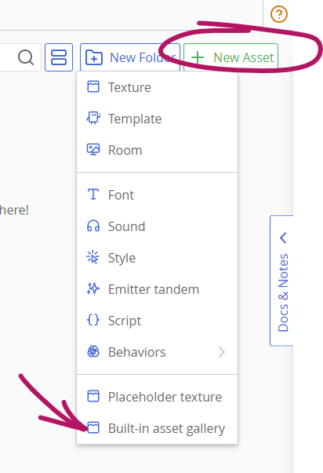

In the gallery, find **"Kenney's Space Shooter"** asset pack, and add these (or similar) textures by hovering your mouse over the needed textures and clicking the small import button in the top-right corner:

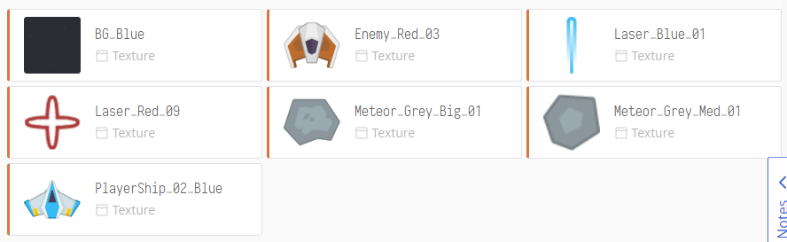

When you're done, close the gallery with an X button in the top-right corner.

You will now see cards for each imported texture. Let's open the `PlayerShip` one and configure it by clicking its asset card. We will see a blue transparent shape that defines its collision shape. This shape defines which areas are counted as part of the ship, and which are not. For now, it covers too much empty space, especially above the wings. To fix it, we should modify this collision shape in the right column.

Firstly, press a button **"Image's center"**, so its axis is placed at the ship's center.

Next, select the "**Line Strip / Polygon**" option under the label "Collision Shape". Add a couple of additional points and move them with your mouse so that the resulting polygon resembles the ship's shape.

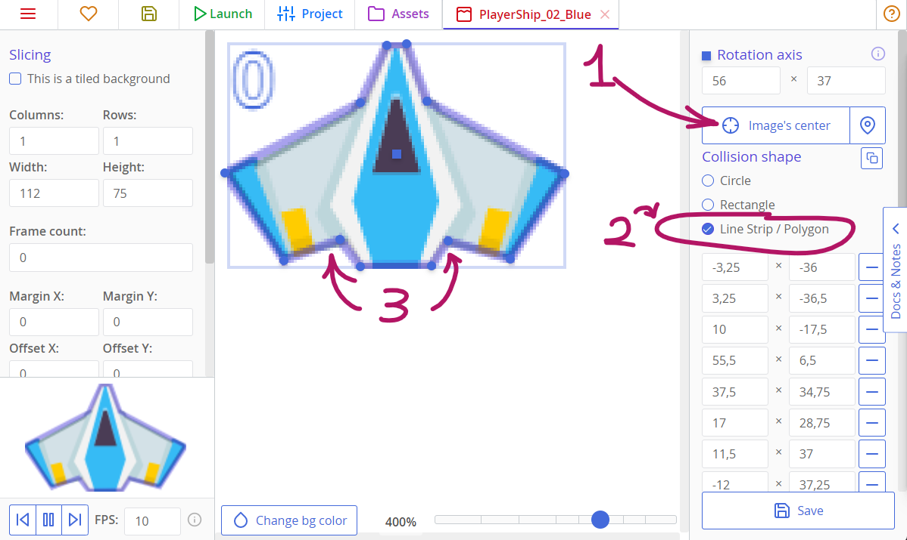

Press "Save" and move to the next texture — `Laser_Red`. As with the ship, let's set its axis to center by clicking "Image's Center". Then, select a **Circle** collision shape right beneath this button. Now a blue collision shape is drawn as a circle.

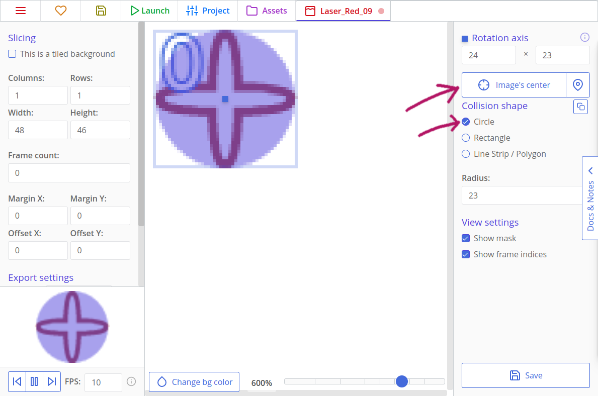

The next texture, `Laser_Blue`, should be centered too, and since the collision shape should cover all the image, we can click the "Fill" button to automate it.

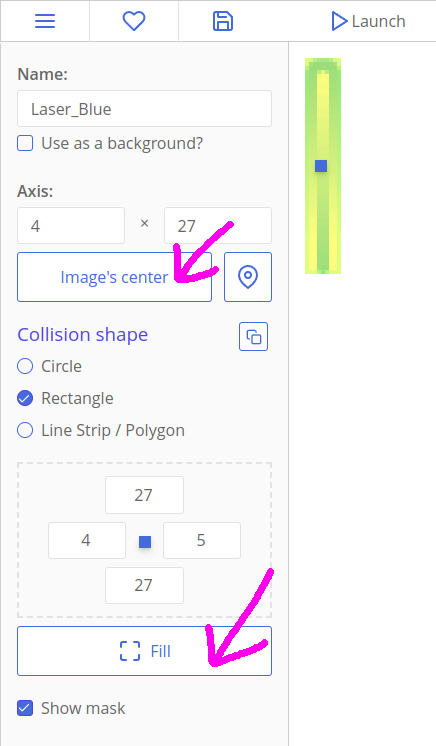

Both asteroids are better defined as polygons by their concave or sharp shapes. Set their collision shape to **Line Strip / Polygon**, and don't forget to set their axis to center.

The `Enemy_Red`'s shape can be treated as a **Polygon**.

The background image may be left as is, because it won't collide with other things in the game. But, you should go to edit it and check the "This is a tiled background" checkbox so that there will be no seams in the tiling when you launch the game.

## Making First Templates and Laying Things Out

**Textures** don't do much on their own, and in order to display them in game, we need to create **templates** with these assets. Templates are used to create **Copies**, and the latter are the things that you place inside **Rooms**, that interact with each other and respond to your inputs.

Go to the "Assets" tab on top of the screen, click the "New Asset" button, and create a new template for the player's ship. Call the template "PlayerShip" so we won't have to remember any numbers when we start coding. If you forgot to change the name while creating the template, you can go to the "Assets" tab again and right-click the template, and there will be an option to change the name.

Click on the big ghostly cat in the left column to select a texture for it. Press the card with your ship — after that, it will appear in the left column of the editor.

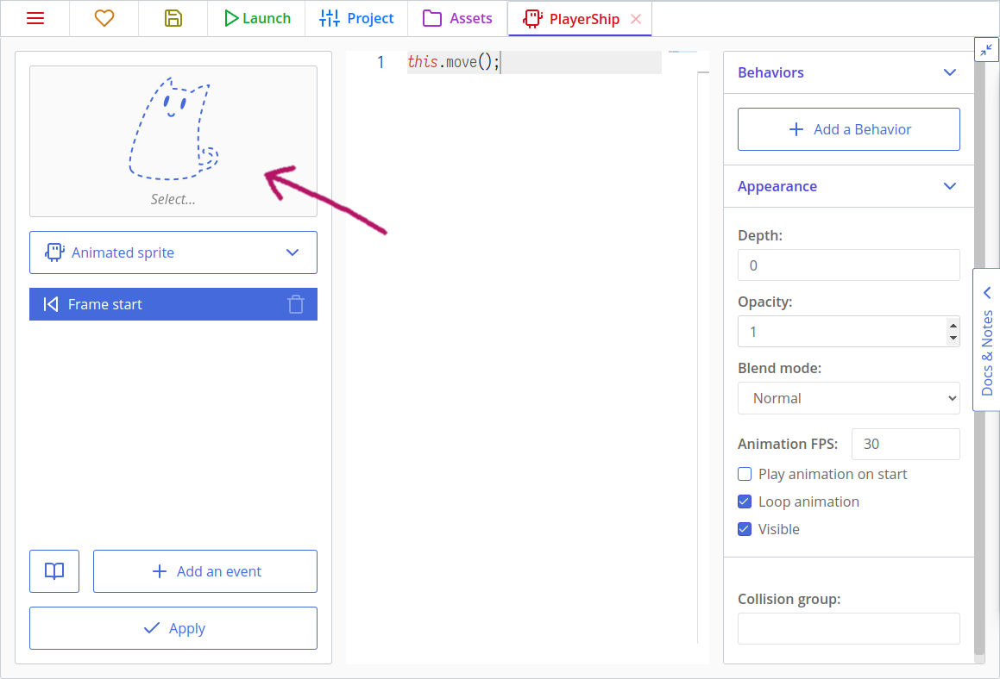

Create templates for all the other textures but the background image. Background images don't move or interact with anything, and is often tiled, so it is not a template. We will add it later in a **Room**.

Your asset list should look like this:

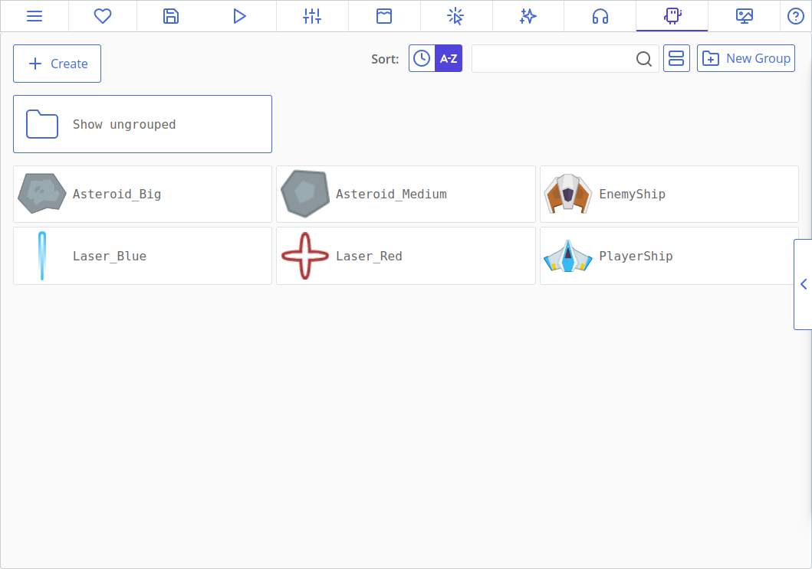

Let's place created templates somewhere on the map. To create this map, or Room, press the "New Asset" button again and click on "Room". Give it the title "Main" and create the room.

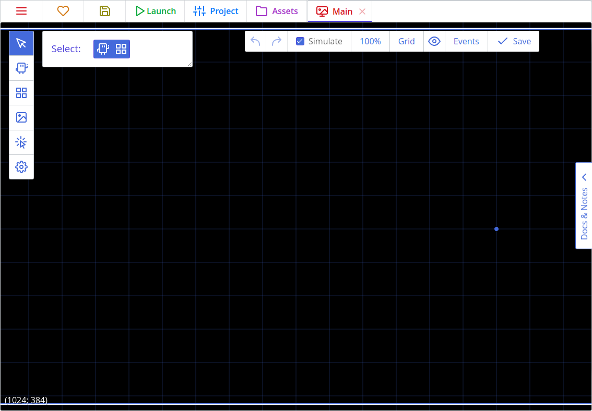

Here we will stop a bit to explain how to use the Room editor. The extended explanation can be found [here](./../room-editor.md), but right now we will use just a few tools of it. Firstly, we should set up a Room's viewport size in room's properties, by clicking the cog button in the left toolbar.

In ct.js, Rooms are infinite and can pan in any direction. You can place objects inside and outside the viewport.

You can navigate the room by holding the mouse wheel and dragging your mouse. You can change zoom level by mouse wheel, or by changing zoom in the dropdown in the top toolbar. If you feel lost, press the "Reset viewport" menu item in the zoom dropdown to return to (0, 0) coordinates — or just press the `H` key.

For now, let's place a player's ship, a hostile one and a couple of asteroids. Select the "Add copies" tool in the left toolbar, pick a template, and position a copy of it onto a level with a mouse click.


Then add a background. Click the "Backgrounds" tool on the left and press the "Add a background" button, then select our `BG`. It will appear as a tiled texture in the main view.

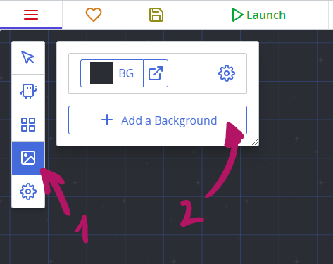

Though backgrounds are always drawn before Copies of the same depth level (`0` by default), it is better to change their Depth level. Click on the cog on the right to the background's thumbnail and input `-5` in the "Depth" field. By doing this, we tell the engine that this background is placed lower than other Copies and backgrounds. Depth represents a third coordinate axis that goes upwards, when X and Y go to the sides.


After that, save the project and click a 'Launch' button. At this point, you will have a game project with immovable ships and asteroids.


## Adding Player's Movement

Handling user's input is the most important task. In this section we will make the blue ship move when a player presses arrow keys or WASD.

In order to handle keyboard inputs, we need to enable the Keyboard module. Press the "Project" tab, then a "Catmods" tab on the left, then find a Keyboard module in the section with available modules. Click it to enable it (it may be enabled by default, though — a green checkbox with a little spinning circle indicates that the module is enabled). Then make sure that modules `pointer`, `random` and `place` are enabled, as we will need them later too.

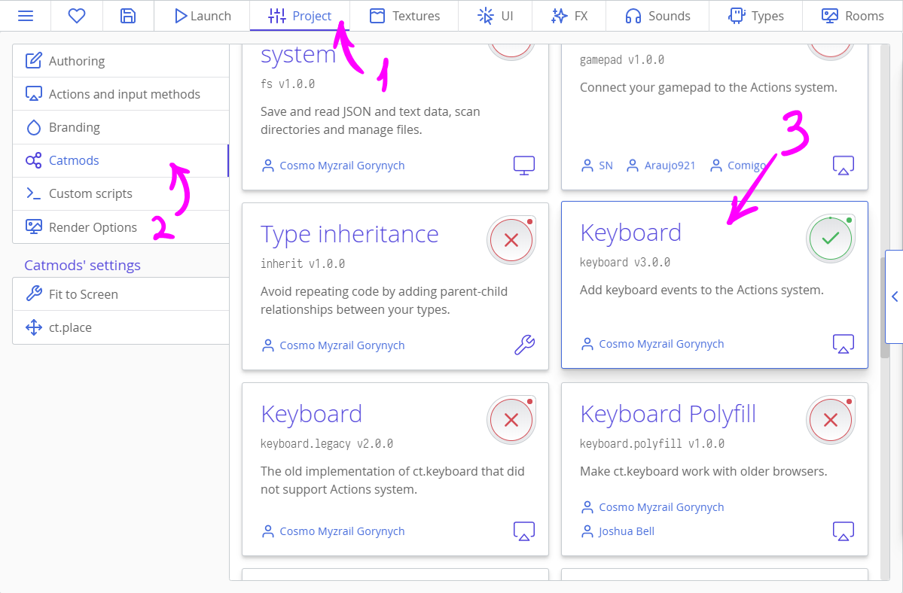

### Adding actions

Actions in ct.js are entities that group different input methods into events, and allow you to listen to player input in code. You can read more about them [here](./../actions.md).

For now, let's create a basic input scheme for our shooter. Open the "Project" tab, then the "Actions and input methods" tab on the left side. We will need to define three different actions: for shooting laser bullets, for moving horizontally, and for moving vertically.

First, click the "Make from scratch" button. Then, input the name of the first action. Click the button called "Add an input method" to bind specific buttons to your action. Use its search to quickly filter available input methods. Click the "Add an action" button to continue creating more actions.

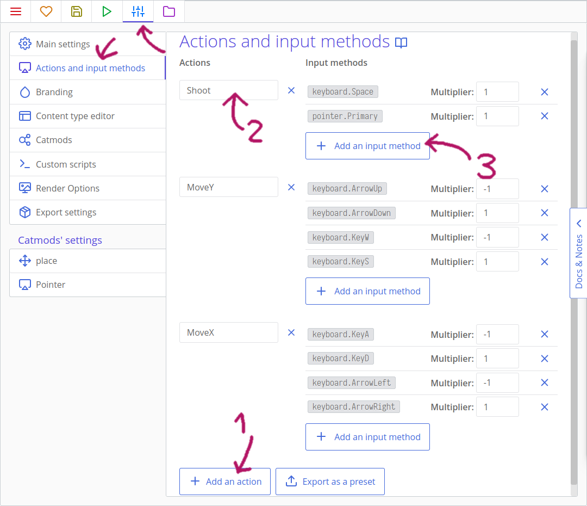

Create three actions as in the picture above. Set multiplier value to `-1` for `keyboard.ArrowUp`, `keyboard.KeyW`, `keyboard.ArrowLeft`, and for `keyboard.KeyA`, so that these keys will move the ship in the opposite direction.

### Coding the movement

Go back to the "Assets" tab, then click on the `PlayerShip` template and move to `Frame start` event.

::: tip
`Frame start` event occurs every frame before drawing, while `Frame end` happens after all the `Frame start` events in the room to draw a new frame. `Creation` happens when you spawn a new Copy, and  `Destruction` occurs before the `Frame end` event if a Copy is killed.
:::

Write the following code:

::: code-tabs#tutorial
@tab JavaScript
```js
/**
 * Move the ship
 * See Project > Actions and input methods panel
 * and "Actions" in the docs.
 */
this.x += 480 * u.time * actions.MoveX.value; // Move by X axis


/**
 * Check whether the ship fell off the viewport
 */
if (this.x < 0) { // Have the ship crossed the left border?
    this.x = 0; // Go back to the left border
}
if (this.x > camera.width) { // Have the ship crossed the right border?
    this.x = camera.width; // Go back to the right border
}

this.move();
```
@tab CoffeeScript
```coffee
# Move the ship
# See Project > Actions and input methods panel
# and "Actions" in the docs.

@x += 480 * u.time * actions.MoveX.value # Move by X axis

# Check whether the ship fell off the viewport
if @x < 0 # Have the ship crossed the left border?
    @x = 0 # Go back to the left border

if @x > camera.width # Have the ship crossed the right border?
    @x = camera.width # Go back to the right border

@move()
```
:::

Here we are using the created actions. First, we try to move the ship horizontally (by `x`, line 5 or 6). `actions.MoveX` will return `1` if we pressed the right keyboard arrow or the "D" key, and will return `-1` if a player presses the left arrow or the "A" key. If nothing is pressed, it will return `0`, disabling the horizontal movement.

`u.time` is needed to compensate possible lags, and FPS changes. It measures the amount of time in seconds between the last frame and the current one. It is usually equal to `1/60` if your project runs at 60 FPS, but will speed up the movement if some frames were dropped. This means the copy will move at 1 pixel per second under `u.time`.

Lastly, we multiply our intermediate speed value with the desired velocity, `480`.

We later check whether its X coordinate fell off the viewport. Here `0` means the left side of the room and `camera.width` means the horizontal size of the viewport, which forms the right side.

::: tip On your own!
Add a vertical movement to the player. Then, try to limit its movement so the ship can't fly above the middle of the viewport.
:::

## Moving Hostiles and Asteroids

Enemies should move, too. For this tutorial, our hostile ship will move from top to bottom, and asteroids will fly in a random direction.

### Enemy ships

Open the "Assets" tab, then click on the `EnemyShip`. Navigate to the `Creation` event and add this code:

::: code-tabs#tutorial
@tab JavaScript
```js
this.speed = 180;
this.direction = 90;
```
@tab CoffeeScript
```coffee
@speed = 180
@direction = 90
```
:::

Here, we use built-in variables for moving. Manually editing coordinates is good for handling player's input, but for most tasks it is better to use these vars as they automate most of the things. For example, you don't need to use `u.time` while using `this.speed` and `this.direction`. Here, `this.speed` means the speed of the Copy, and `this.direction` refers to its direction.

::: tip
If you use CoffeeScript, `this.speed` is `@speed`, `this.direction` is `@direction`, and so on. You can actually write it either way!
:::

::: tip
In ct.js, direction is measured in degrees, moving clockwise. 0° means right, 90° means bottom, 180° is for left, and 270° points to the up.


:::

If we navigate to the `Frame start` event, we will see this little code:

::: code-tabs#tutorial
@tab JavaScript
```js
this.move();
```
@tab CoffeeScript
```coffee
@move()
```
:::

This line reads built-in variables and moves the Copy according to them. Without it, `this.speed` and `this.direction` will be meaningless.

There are more built-in variables, which you can find on the [`templates` page](./../templates.md).

We will modify the `Frame start` code so enemies will destroy themselves if they fall off the screen.

::: code-tabs#tutorial
@tab JavaScript
```js
this.move();

if (this.y > camera.height + 80) {
    this.kill = true;
}
```
@tab CoffeeScript
```coffee
@move()

if @y > camera.height + 80
    @kill = yes
```
:::

::: tip On your own!
What if enemy ships could move diagonally, zig-zagging?
:::

### Asteroids

Asteroids will contain the same `Frame start` code, but their `direction` variable will be defined randomly.

Open the `Asteroid_Medium` in the "Assets" tab, then write the code below in the `Creation` event.

::: code-tabs#tutorial
@tab JavaScript
```js On Create event
this.speed = random.range(60, 180);
this.direction = random.range(90 - 30, 90 + 30);
```
@tab CoffeeScript
```coffee On Create event
@speed = random.range(60, 180)
@direction = random.range(90 - 30, 90 + 30)
```
:::

The `Frame start` event will be the same as in `EnemyShip`.

::: code-tabs#tutorial
@tab JavaScript
```js Frame start event
this.move();

if (this.y > camera.height + 80) {
    this.kill = true;
}
```
@tab CoffeeScript
```coffee
@move()

if @y > camera.height + 80
  @kill = true
```
:::

Do the same for another asteroid.

Save the project and click the "Launch" button at the top. The hostile ship will slowly move to the bottom, while asteroids will move more chaotically. If you refresh the page, asteroids will move to a new direction.

::: tip
Do you have errors with `random`? Make sure that you've enabled the `random` module at the Project tab -> Catmods panel.
:::


## Projectiles & Collision

Now it is time to bring the guns 😎

Open the `PlayerShip` template, and add the "Action press" event. A window should then pop up to ask you which action you want to use. Select the "Shoot" action and then hit apply. Now inside the "On Shoot press" event add this code:

::: code-tabs#tutorial
@tab JavaScript
```js
templates.copy('Laser_Blue', this.x, this.y);
```
@tab CoffeeScript
```coffee
templates.copy 'Laser_Blue', @x, @y
```
:::

This is the first time we add new copies programmatically. Hooray!

::: tip
`templates.copy` is a very important function that spawns a new Copy in the current room. Firstly, we write an enquoted Template's name to copy. Then, we write coordinates at which we should create it, by horizontal and vertical axes accordingly. `this.x` means a horizontal location of current copy, and `this.y` means a vertical one.
:::

With all the data combined, we make a laser bullet right under our ship. Bullets will spawn when the Space key is pressed.

Now let's move to the `Laser_Blue` itself. We will define its movement with default variables in the Creation event.

::: code-tabs#tutorial
@tab JavaScript
```js On Create code
this.speed = 1080;
this.direction = 270;
```
@tab CoffeeScript
```coffee
@speed = 1080
@direction = 270
```
:::

Next, let's make sure that these laser bullets will disappear after they fly out the view. As they always fly to top, we may write a condition for the upper border only in the Frame start event.

::: code-tabs#tutorial
@tab JavaScript
```js Step code
if (this.y < -40) {
    this.kill = true;
}

this.move();
```
@tab CoffeeScript
```coffee
if @y < -40
  @kill = true

@move()
```
:::

The next thing is handling collisions. It is better to write all the collision logic in enemy ships' and asteroids' code because they will respond differently, making no clutter in the bullet's code.

Go to the `EnemyShip` template and create a "Collision with a template" event, then select `Laser_Blue`. In the code, add the following:

::: code-tabs#tutorial
@tab JavaScript
``` js
other.kill = true;
this.kill = true;
```
@tab CoffeeScript
```coffee
other.kill = true
@kill = true
```
:::

::: tip
`other` is a special variable that can be referenced when inside collision event code. `other` refers to the other colliding copy. Look out for other local variables that may be accessible in certain events!
:::

If a ship collides with a laser bullet, then both the bullet and the ship should be destroyed.

Copy exactly the same code to `Asteroid_Medium`. We will need this code in `Asteroid_Big` too, but we will make it so that big asteroids break into two smaller ones:

::: code-tabs#tutorial
@tab JavaScript
``` js
other.kill = true;
this.kill = true;
templates.copy('Asteroid_Medium', this.x, this.y);
templates.copy('Asteroid_Medium', this.x, this.y);
```
@tab CoffeeScript
```coffee
other.kill = true
@kill = true
templates.copy 'Asteroid_Medium', @x, @y
templates.copy 'Asteroid_Medium', @x, @y
```
:::

If you run the game, you will be able to destroy enemy ships and asteroids. Bigger asteroids should break into smaller ones.

### Enemy bullets

Enemy ships should be able to shoot, too. Add the following code to `EnemyShip`'s `Creation` code:

::: code-tabs#tutorial
@tab JavaScript
``` js
this.timer1 = 1;
```
@tab CoffeeScript
```coffee
@timer1 = 1
```
:::

With this, we will set up our timer so that the enemy ship will shoot at precise intervals. `timer1` is a special variable that ct.js will automatically countdown for us, 1 per second. The `Timer 1` event will fire once this value reaches 0. This means we will wait for 1 second before shooting the first bullet.

Give the event a name like "Shoot", keep the UI event checkbox unchecked, then add this code to the `Timer 1` event:

::: code-tabs#tutorial
@tab JavaScript
```js
this.timer1 = 3;
templates.copy('Laser_Red', this.x, this.y + 32);
```
@tab CoffeeScript
```coffee
@timer1 = 3
templates.copy 'Laser_Red', @x, @y + 32
```
:::

When the `timer1` variable goes down to zero, we wind it back up by setting it to 3 and then create a red laser bullet. Now the next bullet will shoot in 3 seconds automatically. As you can see, by writing `this.y + 32` we spawn it a bit lower than the ship.

Let's write some code to red bullets. Add this code to `Creation` section of Laser_Red:

::: code-tabs#tutorial
@tab JavaScript
```js
this.speed = 480;
this.direction = 90;

this.angle = random.deg();
```
@tab CoffeeScript
```coffee
@speed = 480
@direction = 90
@angle = random.deg()
```
:::

`this.angle` rotates a copy's texture. `random.deg()` returns a random value between 0 and 360, which is handy while defining angular values.

::: tip
There is also `this.scale.x` and `this.scale.y`, which sets a copy's horizontal and vertical scale accordingly, and `this.alpha` which manipulates its opacity (0 means fully transparent, 1 — fully opaque).
:::

The code of `Frame start` will look as following:

::: code-tabs#tutorial
@tab JavaScript
``` js
if (this.y > camera.height + 40) {
    this.kill = true;
}

this.move();

this.angle -= 240 * u.time;
```
@tab CoffeeScript
```coffee
if @y > camera.height + 40
  @kill = true

@move()

@angle -= 240 * u.time
```
:::

`this.angle -= 240 * u.time` means that we will rotate a Copy by approximately 240 degrees every second. `u.time` will balance out stuff if the game suffers from inconsistent FPS.

We will define logic for destroying player's ship later. For now, it's time to add enemy and asteroid generation during the playtime.

## Generating objects through time

Open the `Main` room in the Rooms section. Remove existing asteroids and enemies by right-clicking on them, or erase them with left mouse button while holding the `Ctrl` key.

::: tip
Make sure you are on the `Add copies` tool when deleting with the `Ctrl` key, and make sure you are on the `Select` tool and left-clicked a copy in the room before right-clicking to have the option to delete it.
:::

Next, Press the `Events` button on the top bar.

Rooms have all the same events like Copies have.

* `Room start` is called when you launch the game or move to this room programmatically;
* `Frame start` is called each frame, after Copies' `Frame start`;
* `Frame end` is called after drawing all the level. It is useful for updating UI;
* `Room end` is called before moving to another room.

We will generate enemies in almost the same way as enemy ships generate their bullets. We will have a couple of timers and will place copies above the player's view.

To do this, setup two timers in the `Room start` code:

::: code-tabs#tutorial
@tab JavaScript
```js
this.timer1 = 0.3; // asteroid timer
this.timer2 = 3; // enemy timer
```
@tab CoffeeScript
```coffee
# asteroid timer
@timer1 = 0.3
# enemy timer
@timer2 = 3
```
:::

Then add this code in the `Timer 1` tab to generate asteroids through time:

::: code-tabs#tutorial
@tab JavaScript
```js
// asteroid timer
this.timer1 = random.range(0.3, 3);
templates.copy(random.dice('Asteroid_Big', 'Asteroid_Medium'), random(camera.width), -100);
```
@tab CoffeeScript
```coffee
# asteroid timer
@timer1 = random.range 0.3, 3

randomAsteroid = random.dice 'Asteroid_Big', 'Asteroid_Medium'
randomX = random camera.width
templates.copy randomAsteroid, randomX, -100
```
:::

Then add this code in the `Timer 2` tab to generate enemies through time:

::: code-tabs#tutorial
@tab JavaScript
```js
// enemy timer
this.timer2 = random.range(3, 6);
templates.copy('EnemyShip', random(camera.width), -100);
```
@tab CoffeeScript
```coffee
# enemy timer
@timer2 = random.range 3, 6

randomX =  random camera.width
templates.copy 'EnemyShip', randomX, -100
```
:::

That's all what you need for generating asteroids and enemies!

::: tip
`random.dice` returns one of the provided values. You can put any value here, including Numbers, Strings, complex objects. Here, there is a 50% chance that `'Asteroid_Big'` will be returned and a 50% chance that it will be `'Asteroid_Medium'`.

`random.range(a, b)` returns a random numerical value between `a` and `b`.

`random(b)` is the same as `random.range(0, b)`.
:::

## Lives, score and GUI

Let's add score counting to the game and player ship's reaction to hostiles.

### Adding and drawing score

Score is a numerical variable that is stored globally. In our case it is better to place it inside the room. Open the `Main` room, and then click on 'Events' button. Add this code to the `Room start` section:

::: code-tabs#tutorial
@tab JavaScript
```js
this.score = 0;
```
@tab CoffeeScript
```coffee
@score = 0
```
:::

Now we will make a template that displays the score for us. Make a new template named `ScoreText`, and instead of making it an animated sprite make it a text. Also set its depth, and this large positive value will place the text above other entities in our room. Adding a default text will make it show up in the room we place the copy in, so we can see how it would look in the game without running it!

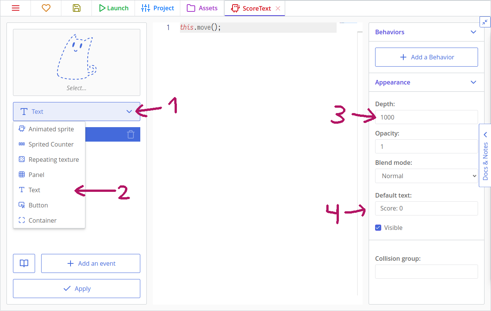

We also need this code at `Frame end` to keep the label up-to-date:

::: code-tabs#tutorial
@tab JavaScript
```js
this.text = 'Score: ' + rooms.current.score;
```
@tab CoffeeScript
```coffee
@text = 'Score: ' + rooms.current.score
```
:::

Now, move to `EnemyShip`'s `Collides Laser_Blue template` code, and add `rooms.current.score += 100;` to a place where a ship is destroyed after colliding with a bullet, so the whole code looks like this:

::: code-tabs#tutorial
@tab JavaScript
```js
other.kill = true;
this.kill = true;
rooms.current.score += 100;
```
@tab CoffeeScript
```coffee
other.kill = true
@kill = true
rooms.current.score += 100
```
:::

::: tip
`rooms.current` points to the current room object.
:::

Do the same for asteroids, too. Change the number of given score points as you wish.

When you place ScoreText in the top-left corner and run the game, you may notice a small black number which will change as asteroids and enemy ships get destroyed. But this doesn't look nice, so it is a good time to make some styling.

Text can be drawn with pre-defined styles that declare fill color, line style, font settings, shadow. They are created with the `New Asset` button and selecting `Style`. You will see a style editor, which has a left bar with tabs for setting properties and a preview image on the right.

Let's make the font bigger and bolder. Change its size and set its weight to 800. Then align it to be drawn from a top left corner.

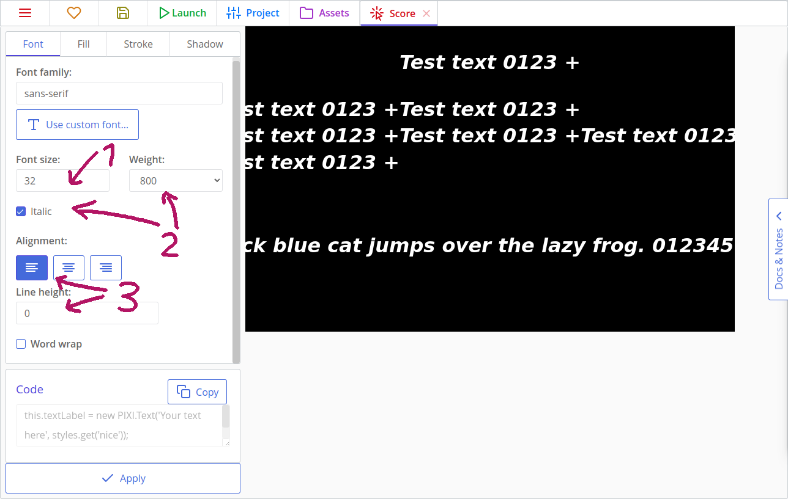

Click the `Fill` tab, activate it, and then select the "Diffuse" fill type. Select an appropriate color; I chose something similar to the player's ship's colors.


Add shadow, or border, or both! Then save the changes by clicking the "Apply" button in the bottom-left corner.

Name the created style as `ScoreText`. You can rename it by right-clicking it in the list view.

Now let's return to the template `ScoreText`. Instead of selecting a sprite with the ghostly cat icon, you can now select a style because we set it to Text. So set it to the ScoreText style we just created.

If you go back to the main room, the score will be drawn in your created style. Hooray!

### Drawing and managing lives

Managing lives is similar to managing score points. Add this code to the room's `Room start` code so that it stores the number of lives, too.

::: code-tabs#tutorial
@tab JavaScript
```js
this.lives = 3;
```
@tab CoffeeScript
```coffee
@lives = 3
```
:::

Now make a new template named `LivesText`, set it as a Text, and select the `ScoreText` style again. Set its depth to 1000, and add this to `Frame end`:

::: code-tabs#tutorial
@tab JavaScript
```js
this.text = 'Lives: ' + rooms.current.lives
```
@tab CoffeeScript
```coffee
@text = 'Lives: ' + rooms.current.lives
```
:::

::: tip On your own!
Create a new style and apply it to the 'Lives' label.
:::

Finally, add the copy to the room in the top right corner and it will display your current lives in game!

Then we should add logic so that player's ship removes one life on collision. Let's group asteroids and enemies into one _collision group_. It will allow us to write less code and won't require any changes if we add more enemies, missiles or asteroids of different size.

To add copies to a collision group, we should write in the name of the collision group in the right column of the template editor. Let's write in the word `Hostile`. Do it for all the asteroids, for the enemy ship and red lasers.

Go to the player ship and create a new "Collision with a group" event. Specify "Hostile" in the appearing text field. Now add this code to the player ship's `Collides Hostile group` code:

::: code-tabs#tutorial
@tab JavaScript
```js
if(templates.isCopy(other)) {
    other.kill = true;
}

rooms.current.lives --;
if (rooms.current.lives <= 0) {
    this.kill = true;
    u.wait(1000)
    .then(() => {
        rooms.switch('Main');
    });
}
```
@tab CoffeeScript
```coffee
if templates.isCopy(other)
    other.kill = true

rooms.current.lives--

if room.lives <= 0
    @kill = true
    u.wait 1000
    .then =>
        rooms.switch 'Main'
```
:::

`rooms.switch` unloads the current room and loads a new one. By pointing to the same room as we were playing, we restart it.

`u.wait` is a Promise that resolves after a given number of milliseconds. Here we wait one second (1000 milliseconds) and then restart the room in the first argument of `then()`.

::: tip
`u.wait` may seem like a better way to work with delayed events than writing timers. The difference is that timers exist while its owner does, but `u.wait` will happen in any circumstances, even if the copy that called it was removed from a room.

In our case, we want the room to be restarted though there aren't any player ships on the screen, so we use `u.wait`. We use timers for shooting and spawning enemies because we don't want bullets to randomly appear after enemies were destroyed.
:::

Save your project and test it out. Now you have a small, but fully working space shooter! There is a lot of ways to improve this game further:

* tweak existing values, like enemy speed or score points for a better gameplay;
* add more enemies;
* improve shooting with timers so that you can just hold your spacebar, not smash it;
* add bonuses and different weapons;
* design a main menu and a victory screen;
* add sounds;
* create bosses and companions.

That's my result of improving this project furthermore: [Catsteroids](https://comigo.itch.io/catsteroids).

You can also start a new project if you're not into space shooters :D

## Extra: Reusing logic using behaviors
If you create a lot of different types of asteroids, you may get annoyed having to write the same logic for setting starting speed and direction, and for when to destroy the asteroids. Fortunately there is a way to quickly set up multiple templates with the same logic, and that is with using behaviors!

In the Assets tab, click on `New Asset` and go to `Behaviors` and click on `Behavior with templates`. Name it "Asteroid Setup".

There is a place for adding custom fields that will then be available for copies that add this behavior, but for now we will just add some events. Add a `Creation` event and a `Frame Start` event.

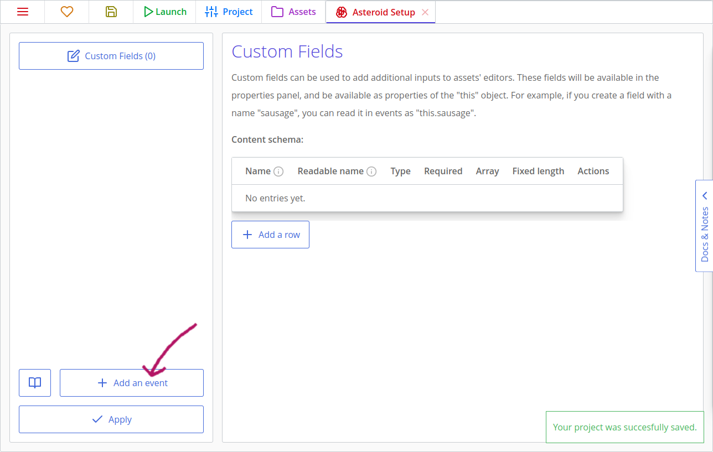

Go to one of the asteroid templates and copy the code from the `Creation` and `Frame Start` events and paste them into the events of the newly created behavior. Now, go to `Asteroid_Big` and `Asteroid_Medium` and delete those two events. Finally, for each of the asteroids, go to the right sidebar and click on "Add a Behavior" and select the behavior created.

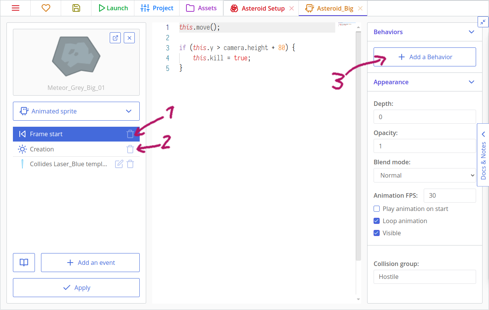

And just like that, the two asteroids behave just like before, but with their shared logic now in the behavior! Now if you add any more asteroids you can simply add the "Asteroid Setup" behavior to it and it will act the same as the other asteroids! This also lets you edit the behavior of all asteroids in one location and reduces the need to find all the copy pasted code across multiple templates when you want to make changes.